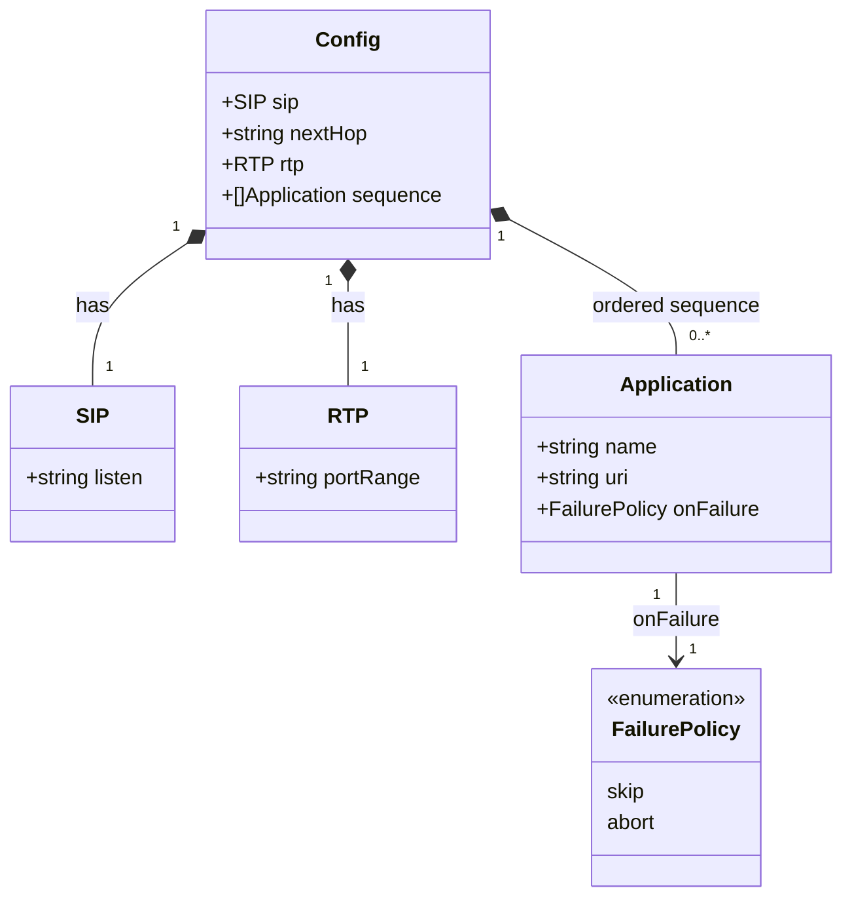

# Central YAML configuration loading for voipstack-sip-sequencer

> REASONS-Canvas structured prompt for `[STORY-001-001]`. Stack: **Go** (greenfield),
> functional style per `AGENTS.md` (pure core, side-effects at edges; errors as values).
> Go-native — no exception-handler classes; the template's Java idioms are mapped to Go
> error returns.

## Requirements

Implement a startup-time loader that turns a single operator-supplied YAML file into one
validated, in-memory configuration value for a sequencer instance — or aborts startup with
a clear, operator-actionable error. The YAML file (named only by a `--config` flag) is the
**sole** configuration source: no environment variables, no remote source, no implicit
defaults file. The loader's core is a **pure** function (bytes → config or error);
filesystem read, flag parsing, and process exit live only at the program edge. Validation
is shallow: presence of required keys and membership of the small `on_failure` enum —
value-level checks (URI syntax, port-range bounds, duplicate names) are deferred to the
stories that consume those values.

Boundaries: load + parse + presence-validate + default only. No SIP listener, no call
processing, no live reload — all out of scope.

## Entities

Notes (conservative design — smallest types that satisfy the ACs):
- `Config` is a plain value struct; it is the loader's single output, consumed by every
  later story.
- `RTP.portRange` is carried as the raw configured string (e.g. `"10000-20000"`). It is
  **not** split into min/max here — the media story owns range semantics (analysis
  decision; YAGNI).
- `FailurePolicy` is a string-backed enum with exactly two members; the zero/omitted case
  resolves to `skip`.
- No request/response DTOs — this is a library + CLI edge, not an API.

## Approach

1. **Package layout & boundary (functional core / imperative shell):**
   - Pure core in package `config`: a `Parse(data []byte, source string) (Config, error)`
     function that unmarshals YAML, applies defaults, and runs presence/enum validation —
     **no I/O**. `source` is a label (the file path) used only to make error messages
     name the offending file; it is not read.
   - Thin edge `config.Load(path string) (Config, error)`: reads the file with
     `os.ReadFile`, then delegates to `Parse`. This is the only I/O in the package and
     stays a few lines.
   - `main` (`cmd/sip-sequencer`): parse the single `--config` flag, call
     `config.Load`, and on error write to `stderr` and exit non-zero. Success path hands
     the `Config` onward (onward use is out of scope for this story).

2. **Technical implementation:**
   - Greenfield bootstrap: `go mod init github.com/voipstack/voipstack-sip-sequencer`
     (module path chosen to match repo owner; later packages import under it).
   - YAML via `gopkg.in/yaml.v3` (sipgo-ecosystem standard; supports strict decoding).
   - **Strict decoding** (`yaml.Decoder` with `KnownFields(true)`): unknown keys are
     rejected so operator typos (e.g. `next_hopp:`) fail fast with a clear message —
     resolves the analysis "unknown keys" ambiguity in favour of fail-clear (NFR).
   - Errors are values, wrapped with `%w` and contextual prefixes that name the file and
     the offending key/field. No panics on operator input.

3. **Business logic (resolved decisions from analysis open questions):**
   - **Required top-level keys:** `sip.listen`, `next_hop`, `rtp.port_range`, `sequence`
     must be present and (for scalars) non-empty. A present-but-empty required scalar is
     treated as **missing** (AC3 spirit).
   - **`sequence` may be empty** (`sequence: []` or present with no items) — valid; an
     empty chain is meaningful (story 003 AC4). Distinguish "key absent" (error) from
     "present but empty list" (ok). To do this cleanly, decode `sequence` as a pointer/
     presence-tracked field so absence is detectable.
   - **Each Application entry requires `name` and `uri`** (non-empty); absence ⇒ fail
     fast, naming the entry index. (Entry-level presence is the same class as top-level
     presence, just nested.)
   - **`on_failure` per entry:** omitted ⇒ default `skip` (AC2). Present value must be
     `skip` or `abort`; any other value (e.g. `pause`) ⇒ fail fast naming the entry and
     the bad value. (Enum membership is trivial presence-class validation, not deferred
     deep validation.)
   - **No env reads anywhere** in the package or `main` (AC6) — the only inputs are the
     flag value and the file bytes.
   - **Missing `--config` flag** ⇒ same fail-fast class as a missing file: clear message,
     non-zero exit.

## Structure

### Type / function relationships
1. `config.Config`, `config.SIP`, `config.RTP`, `config.Application` are plain value
   structs with YAML tags.
2. `config.FailurePolicy` is a defined string type with constants
   `FailureSkip = "skip"` and `FailureAbort = "abort"`.
3. `config.Parse([]byte, string) (Config, error)` — pure; the testable core.
4. `config.Load(string) (Config, error)` — edge wrapper: `os.ReadFile` → `Parse`.
5. Validation is internal unexported helpers called by `Parse`
   (e.g. `validate(Config) error`, `applyDefaults(*Config)`), not separate types.

### Dependencies
1. `main` depends on `config` and stdlib `flag`, `fmt`, `os`.
2. `config` depends on `gopkg.in/yaml.v3` and stdlib `os` (in `Load` only), `fmt`.
3. `Load` calls `os.ReadFile` then `Parse`; `Parse` calls `applyDefaults` then `validate`.
4. No other internal packages exist yet (greenfield).

### Layered architecture (functional core / imperative shell)
1. Edge / shell layer (`cmd/sip-sequencer/main.go`): flag parsing, process
   exit, stderr output. Impure; kept minimal.
2. I/O boundary (`config.Load`): the single filesystem read.
3. Pure core (`config.Parse` + helpers): unmarshal, default, validate. Deterministic,
   depends only on its arguments. This is where ~all tests target.

> No Controller/Service/Repository/GlobalExceptionHandler layers — those are web-app
> constructs; this is a Go library + CLI. Error handling is idiomatic Go (returned,
> wrapped `error` values), not a centralized handler.

## Operations

### Bootstrap module - go.mod
1. Responsibility: establish the Go module so packages can be imported.
2. Action: `go mod init github.com/voipstack/voipstack-sip-sequencer`; `go get
   gopkg.in/yaml.v3`. Target a current Go toolchain (`go 1.22`+).
3. Completion criteria: `go.mod`/`go.sum` exist; `go build ./...` runs (no packages yet
   is fine until files added).

### Create types - package config (`internal/config/config.go`)
1. Responsibility: define the configuration value model.
2. Types & fields (with yaml tags):
   - `type Config struct { SIP SIP \`yaml:"sip"\`; NextHop string \`yaml:"next_hop"\`;
     RTP RTP \`yaml:"rtp"\`; Sequence []Application \`yaml:"sequence"\` }`
     — plus a presence flag for `sequence` (see Parse) to tell absent from empty.
   - `type SIP struct { Listen string \`yaml:"listen"\` }`
   - `type RTP struct { PortRange string \`yaml:"port_range"\` }`
   - `type Application struct { Name string \`yaml:"name"\`; URI string \`yaml:"uri"\`;
     OnFailure FailurePolicy \`yaml:"on_failure"\` }`
   - `type FailurePolicy string` with `const ( FailureSkip FailurePolicy = "skip";
     FailureAbort FailurePolicy = "abort" )`.
3. Constraints: value structs only; no methods beyond what Parse/validate need.

### Implement pure parser - config.Parse
1. Signature: `func Parse(data []byte, source string) (Config, error)`.
2. Logic:
   - Build a `yaml.NewDecoder(bytes.NewReader(data))`; call `dec.KnownFields(true)` for
     strict decoding.
   - To detect an **absent** `sequence`, decode into an intermediate struct whose
     `Sequence` field is `*[]Application` (nil pointer ⇒ key absent; non-nil ⇒ present,
     possibly empty). Map into the public `Config` after.
   - On decode error (malformed YAML or unknown key): return
     `fmt.Errorf("parse config %q: %w", source, err)` (AC5 / unknown-key).
   - `applyDefaults(&cfg)`: for each Application with empty `OnFailure`, set `FailureSkip`.
   - `validate(cfg, sequencePresent)`: see below. Return wrapped error or the Config.
3. Purity: no I/O, no env, no globals. Deterministic on `(data, source)`.
4. Completion criteria: covered by behavior tests (see Norms/test plan).

### Implement presence validation - config.validate (unexported)
1. Signature: `func validate(c Config, sequencePresent bool) error`.
2. Rules (each returns an error naming the offending key; first failure wins):
   - `c.SIP.Listen == ""` ⇒ `missing required key "sip.listen"`.
   - `c.NextHop == ""` ⇒ `missing required key "next_hop"`.
   - `c.RTP.PortRange == ""` ⇒ `missing required key "rtp.port_range"`.
   - `!sequencePresent` ⇒ `missing required key "sequence"` (empty list is OK).
   - For each `i, app := range c.Sequence`:
     - `app.Name == ""` ⇒ `sequence[i]: missing required key "name"`.
     - `app.URI == ""` ⇒ `sequence[%d] %q: missing required key "uri"` (use name if set).
     - `app.OnFailure != FailureSkip && app.OnFailure != FailureAbort` ⇒
       `sequence[%d] %q: invalid on_failure %q (want "skip" or "abort")`.
3. Note: URI syntax, port-range bounds, duplicate names are NOT checked here (deferred).

### Implement edge loader - config.Load
1. Signature: `func Load(path string) (Config, error)`.
2. Logic:
   - `data, err := os.ReadFile(path)`; on error return
     `fmt.Errorf("read config %q: %w", path, err)` (AC4 — names the path).
   - `return Parse(data, path)`.
3. Constraint: only the file read; no other logic (keep the impure surface tiny).

### Wire CLI edge - cmd/sip-sequencer/main.go
1. Responsibility: turn the `--config` flag into a loaded Config; fail fast on error.
2. Logic:
   - `configPath := flag.String("config", "", "path to the YAML configuration file")`;
     `flag.Parse()`.
   - If `*configPath == ""` ⇒ `fmt.Fprintln(os.Stderr, "error: --config is required")`;
     `os.Exit(2)`.
   - `cfg, err := config.Load(*configPath)`; if `err != nil` ⇒
     `fmt.Fprintf(os.Stderr, "error: %v\n", err)`; `os.Exit(1)`.
   - On success: hand `cfg` onward (placeholder for later stories — e.g. log a one-line
     "configuration loaded" and return; do NOT open any listener).
3. Constraint: no env var reads (AC6). The only inputs are the flag and the file.

## Norms

1. **Style:** functional core / imperative shell. `Parse` and validation are pure; all I/O
   (`os.ReadFile`), flag parsing, and `os.Exit` live in `Load`/`main` only. No global
   mutable state, no package-level vars for behavior.
2. **Errors as values:** every failure path returns an `error`; wrap with `%w` and a
   context prefix that names the file and the offending key/field. No `panic` on operator
   input. Never call `os.Exit` outside `main`.
3. **Naming / intent:** exported identifiers documented with a leading-name comment.
   Behavior is self-evident from names (`Parse`, `Load`, `validate`, `applyDefaults`).
4. **YAML mapping:** explicit `yaml:"..."` tags on every field; strict decoding
   (`KnownFields(true)`). snake_case in YAML ↔ Go field names via tags.
5. **Tests (BDD, Given/When/Then, named by behavior):**
   - `TestParseLoadsCompleteConfigPreservingOrder` (AC1)
   - `TestParseDefaultsOmittedOnFailureToSkip` (AC2)
   - `TestParseFailsWhenRequiredKeyMissing` (AC3 — table over each required key)
   - `TestLoadFailsWhenFileMissingNamingPath` (AC4)
   - `TestParseFailsOnUnparseableYAML` (AC5)
   - `TestParseIgnoresEnvironment` (AC6 — set a `NEXT_HOP` env var, assert no effect)
   - `TestParseFailsOnUnknownKey`, `TestParseFailsOnInvalidOnFailure`,
     `TestParseAllowsEmptySequence`, `TestParseFailsOnEntryMissingNameOrURI` (resolved
     ambiguities).
   Tests feed inline YAML byte strings to `Parse` (pure → no temp files); only the
   `Load` file-missing test touches the filesystem (a path known not to exist).
   Mock nothing — filesystem is owned, not an external service (`AGENTS.md`).
6. **Toolchain gate:** `gofmt`, `go vet ./...`, `go build ./...`, `go test -race ./...`
   all clean before done.
7. **Error message contract (satisfies NFR):** messages are lowercase, prefixed with the
   operation, and name the file path and the offending key — e.g.
   `parse config "x.yaml": missing required key "next_hop"`. An operator can fix the file
   from the message alone.

## Safeguards

1. **Functional constraints:** loader produces a `Config` for every well-formed file and a
   non-nil `error` for every ill-formed one; exactly one outcome. No partial Config is
   returned alongside an error. All 6 ACs + NFR met.
2. **Single-source constraint (AC6):** the package reads no environment variables and
   accepts no config input other than the `--config` file. CI/test asserts env has no
   effect. No second CLI flag carries configuration.
3. **Fail-fast / no-side-effect constraint:** on any load error the process exits non-zero
   before any listener, port allocation, or network action (none exist yet, but the edge
   ordering guarantees it). `Parse` has zero side effects.
4. **Validation boundary (scope):** only presence of required keys/entry fields and
   `on_failure` enum membership are validated. URI syntax, port-range numeric bounds, and
   duplicate `name` are explicitly NOT validated here (deferred — surface at use).
5. **Order constraint (AC1):** `Sequence` preserves YAML list order exactly (slice decode
   is order-preserving; assert in test).
6. **Default constraint (AC2):** an omitted `on_failure` becomes `skip`; an explicitly set
   value is never overridden.
7. **Error-handling constraints (Go-idiomatic):** errors are wrapped with `%w` and name
   the file + offending key; no sensitive system internals leaked (paths and keys only);
   no `panic` reaches the operator; no centralized handler needed (returned values).
8. **Technical constraints:** Go ≥ 1.22; single dependency `gopkg.in/yaml.v3`; pure core
   has no imports beyond `bytes`, `fmt`, `yaml`; `-race` clean (single-threaded path).
9. **Build-artifact hygiene:** do not commit built binaries; respect existing
   `.gitignore`. Dual VCS (git + fossil) present — add source files only.
