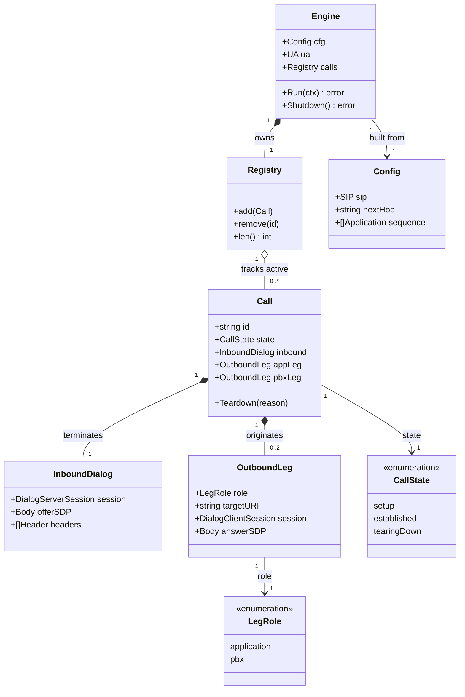

# B2BUA single-application call bridge for voipstack-sip-sequencer

> REASONS-Canvas structured prompt for `[STORY-001-002]`. Stack: **Go**, built on
> `emiago/sipgo`. Functional core / imperative shell per `AGENTS.md` (pure call/leg state +
> SDP mapping; sipgo sockets/dialogs/goroutines at the edge; errors as values; no
> exception-handler classes — the template's Java idioms map to Go error returns).
>
> Resolved design decisions (user-accepted):
> - **SDP:** relay bodies opaque, leg-to-leg, unchanged. Assert signaling only; anchoring
>   is story 005.
> - **Answer timing:** hold the inbound INVITE; send endpoint 200 OK only after the PBX
>   leg answers; relay the PBX answer SDP back. Relay 18x ringback upstream. "App completes
>   its leg" = app returned 2xx (app stays in the path).
> - **Failure:** pass an app reject status (non-2xx final) straight through to the
>   endpoint; on app timeout/unreachable send `503`. Always fail the whole call on app
>   failure (per-app skip/abort policy is story 004).
> - **Transport:** UDP only. TCP/TLS out of scope.
> - **Header transparency (both directions):** the B2BUA relays **every** header it does not
>   own across the bridge verbatim — not just identity. On the **request** path each outbound
>   leg (app + PBX) copies all inbound-INVITE headers (`From`/`To`, `Authorization`,
>   `P-Asserted-Identity`, any custom `X-*`) except the per-leg B2BUA-owned set
>   (`Via`/`Call-ID`/`CSeq`/`Max-Forwards`/`Contact`/`Route`/`Record-Route`/`Content-*`) plus
>   the SDP media (host/port, anchored in story 005). On the **response** path each relayed
>   response (18x, non-2xx final, **and the PBX 200 OK**) carries the upstream response's
>   headers (`WWW-Authenticate`/`Proxy-Authenticate`/`Authentication-Info`, `Retry-After`,
>   `Warning`, custom `X-*`) back to the endpoint, except the inbound-dialog-owned set
>   (`Via`/`From`/`To`/`Call-ID`/`CSeq`/`Contact`/`Record-Route`/`Timestamp`/`Content-*`).
>   Rationale: PBXs route/authorize on `From`/`To` (DID, caller-id) and on auth, and an
>   endpoint can only answer a challenge it actually receives — a synthesized identity or a
>   dropped challenge breaks routing/auth. `X-Sequencer-*` correlation headers are
>   sequencer-minted and are **stripped** in both directions (never copied from a peer —
>   anti-spoof / no internal-id leak). The call stays a true B2BUA for dialog
>   lifecycle/teardown (independent `Call-ID`/tags — AC5 still holds).
>
> **Media-model note (added after the PRD §5 fork decision).** This story is **signaling
> only**; the opaque SDP relay below (endpoint offer → app, app answer → PBX, PBX answer →
> endpoint) is **provisional scaffolding** to complete negotiation, NOT the media design.
> The real model is **anchor + per-app fork** (`[STORY-001-005]` + `[STORY-001-010]`):
> the call is anchored `endpoint ↔ seq ↔ PBX`; `media: tap` apps get a recvonly
> two-`m=audio` fork; apps are not serial audio hops. Anchoring replaces this SDP handling
> in story 005. The **signaling sequence and all ACs here are unaffected** — implement as
> written; just treat the relayed SDP as throwaway.

## Requirements

Implement a back-to-back user agent (B2BUA) that completes one inbound call through exactly
one external SIP application and then to the terminating PBX, behaving as two correlated
but independent dialogs (not a proxy). Terminate the inbound endpoint dialog, originate an
outbound leg to the configured application, and — once the application answers 2xx —
originate a second outbound leg to the PBX next-hop, then answer the endpoint with the
PBX's SDP so endpoint↔PBX form one established call. Maintain the inbound↔outbound mapping
for the call lifetime and tear down every leg when any side ends or fails, leaking no
state. SDP is relayed opaquely (no media anchoring yet); the listener is UDP-only.

The bridge must be **header-transparent** in both directions: every header the B2BUA does
not own is relayed verbatim across the bridge. Each outbound leg copies all inbound-INVITE
headers (`From`/`To`, `Authorization`, `P-Asserted-Identity`, any custom `X-*`) so the PBX
and the application see what is effectively the original request; each relayed response
(provisional, non-2xx final, and the PBX 200 OK) carries the upstream response's headers
(auth challenges `WWW-Authenticate`/`Proxy-Authenticate`, `Retry-After`, `Warning`, custom
`X-*`) back to the endpoint. The sequencer rewrites only the headers a B2BUA must own — per
leg `Via`/`Call-ID`/`CSeq`/`Max-Forwards`/`Contact`/`Route`/`Record-Route`/`Content-*`, and
on responses the inbound dialog's `Via`/`From`/`To`/`Call-ID`/`CSeq`/`Contact`/`Record-Route`
— plus the SDP media (anchored in story 005). A leg that synthesizes its own `From`/`To`, or
a response that drops an auth challenge, is rejected or unanswerable by PBXs that route or
authorize on caller identity and auth. This is still a B2BUA, not a stateless proxy: the
legs remain independent dialogs with their own `Call-ID`/tags for lifecycle and teardown.

Boundaries: exactly one application (no chain), no per-app failure policy, no RTP
anchoring, no mid-call re-INVITE/hold/REFER — all owned by later stories. (Relaying every
non-owned inbound/response header verbatim is **in scope**; sequencer-minted `X-Sequencer-*`
correlation headers are owned by story 006 and are stripped from peer traffic in both
directions.)

## Entities

Conservative-design notes:
- **Reuse `config.Config` / `config.Application` unchanged** — they already carry
  `sip.listen`, `next_hop`, and the single `sequence[0]` (`name`, `uri`). No config change.
  (`RTP.PortRange` stays unused until story 005.)
- `Body`/`DialogServerSession`/`DialogClientSession`/`UA`/`Header` are sipgo types (or thin
  aliases over them) — not new domain types. Keep wrappers minimal.
- `InboundDialog` snapshots the inbound INVITE's relayable headers at accept time —
  `headers` is the clone of every inbound header **not** in the B2BUA-owned set (so `From`/
  `To`, `Authorization`, `P-Asserted-Identity`, custom `X-*` are all carried onto outbound
  legs verbatim). The sequencer never copies the inbound
  `Via`/`Call-ID`/`CSeq`/`Max-Forwards`/`Contact`/`Route`/`Record-Route`/`Content-*` — a
  B2BUA owns those per leg. The header-relay denylists + cloning live in `headers.go`.
- A `Call` holds **at most two** outbound legs this story (`appLeg`, then `pbxLeg`); model
  them as named fields, not a slice, until the chain story (003) generalizes to a slice.
- `CallState` + `LegRole` are small string enums for clarity in logs/teardown logic.
- No request/response DTOs — this is a network service, not an API.

## Approach

1. **SIP stack & B2BUA primitives:**
   - Add `github.com/emiago/sipgo` (pin a released version) and `go get` it.
   - Build one `sipgo.UA` + a `sipgo.Server` (inbound UAS) and `sipgo.Client` (outbound
     UAC) over **UDP** bound to `cfg.SIP.Listen`. Use sipgo's **dialog** layer:
     `DialogUA`/`DialogServer` for the inbound session, `DialogClient` for each outbound
     leg. Let sipgo own CSeq/tags/routing — do not hand-roll transactions.
   - Register an INVITE handler that drives the bridge; register BYE handling via the
     dialog sessions.

2. **Architecture (functional core / imperative shell):**
   - New package `internal/b2bua`: `Engine` (owns UA, server/client, `Registry`), the
     per-call bridge orchestration (impure — talks to sipgo), and a **pure core** for
     state transitions and any leg-routing decisions.
   - `Registry`: a small mutex-guarded map `id → *Call`, owned solely by the `Engine`,
     accessed through a narrow interface (`add`/`remove`/`len`). No global state.
   - Per-call lifecycle is `context.Context`-scoped: the engine's run-context is the parent;
     each call derives a child context cancelled on teardown so its goroutines exit cleanly.
   - Error handling is idiomatic Go: functions return wrapped (`%w`) errors; the bridge
     orchestrator maps failures to SIP responses (pass-through status or 503) and to
     teardown. **No centralized exception handler** (that's a web-app construct).

3. **Bridge business logic (single app; decisions baked in):**
   - On inbound INVITE: create `Call` (id = new UUID-ish/local id), register it, capture the
     endpoint **offer SDP** **and a snapshot of all relayable inbound headers** (every header
     not B2BUA-owned, cloned), but **do not answer yet** (send 100 Trying).
   - **Header relay (both directions):** when originating any outbound leg, append the
     snapshotted inbound headers verbatim (`From`/`To`, `Authorization`, `P-Asserted-Identity`,
     custom `X-*`), so the target sees the original request; when relaying any response back
     to the endpoint, copy the upstream response's non-owned headers (`WWW-Authenticate`/
     `Proxy-Authenticate`/`Authentication-Info`, `Retry-After`, `Warning`, custom `X-*`). Let
     sipgo own the leg's `Via`/`Call-ID`/`CSeq`/`Max-Forwards`/`Contact` (a UAC synthesizes
     these only when absent — supplying `From`/`To` suppresses the synthesized identity) and
     the inbound dialog's response `Via`/`From`/`To`/`Call-ID`/`CSeq`/`Contact`. `Contact`
     stays the **sequencer's** so in-dialog requests (BYE/re-INVITE) traverse the B2BUA;
     `X-Sequencer-*` is stripped from peer traffic both ways. Only the SDP media address/port
     changes, and only once anchoring lands (story 005).
   - Originate the **app leg** UAC INVITE to `sequence[0].uri` with the endpoint's offer SDP
     verbatim and the relayed inbound headers. Relay any 18x from the app upstream as endpoint
     18x (ringback), carrying the provisional response's non-owned headers.
     - App returns **2xx** ⇒ capture app answer SDP; proceed.
     - App returns **non-2xx final** ⇒ send that **same status** to the endpoint **with the
       upstream response's non-owned headers** (e.g. an auth challenge), tear down, remove
       from registry. (AC4)
     - App **times out / unreachable** (no final response, transport error) ⇒ send **503**
       to the endpoint, tear down. (AC4 + timeout decision)
   - Originate the **PBX leg** UAC INVITE to `cfg.NextHop` using the **app's answer SDP** as
     the offer **and the relayed inbound headers** so the terminating PBX receives what is
     effectively the original request. Relay 18x upstream (with their headers).
     - PBX **2xx** ⇒ capture PBX answer SDP, **answer the endpoint 200 OK with the PBX
       answer SDP and the PBX 200's non-owned headers**, mark `established`. Now
       endpoint↔app↔PBX is one call. (AC1)
     - PBX non-2xx/timeout ⇒ fail the call: respond to endpoint (pass-through / 503), tear
       down the **app leg** too (edge: PBX rejects after app answered). 
   - **Teardown (symmetric):** a BYE on any dialog, a call failure, or engine shutdown
     cancels the call context and sends BYE/appropriate termination on every other live leg,
     then removes the call from the registry. Teardown is **idempotent** (glare-safe). (AC2/
     AC3 + no-leak NFR)
   - SDP is treated as an **opaque body** — copied between legs, never parsed/modified.

4. **Process wiring:**
   - Replace `main`'s placeholder success path: build `Engine` from `cfg`, install a signal
     handler (SIGINT/SIGTERM), `Engine.Run(ctx)` to serve, and `Engine.Shutdown()` for a
     clean stop (tear down active calls, close the listener). Startup must not open the
     listener until config loads OK (already guaranteed by story 001 ordering).

## Structure

### Type / function relationships
1. `b2bua.Engine` — owns `sipgo.UA`, the dialog server/client, and `*Registry`. Methods:
   `New(cfg config.Config) (*Engine, error)`, `Run(ctx) error`, `Shutdown() error`.
2. `b2bua.Registry` — `add(*Call)`, `remove(id string)`, `len() int`; guards a
   `map[string]*Call` with a `sync.Mutex`. Consumer-defined narrow interface.
3. `b2bua.Call` — holds `id`, `state`, `inbound`, `appLeg`, `pbxLeg`, a cancel func; method
   `teardown(reason)`.
4. Pure helpers (no I/O), unit-tested directly:
   - `nextLeg(state, cfg)`/route decision, `mapFailureStatus(appResult) int` (pass-through
     vs 503), state-transition validator. Keep these dependency-free.
5. The bridge orchestrator (impure) is a method/function on `Engine` that sequences the
   sipgo calls and calls the pure helpers.

### Dependencies
1. `cmd/sip-sequencer/main.go` depends on `internal/config` (existing) and
   `internal/b2bua` (new); stdlib `context`, `os`, `os/signal`, `syscall`.
2. `internal/b2bua` depends on `github.com/emiago/sipgo` (+ its `sip` subpackage) and
   `internal/config`; stdlib `context`, `sync`, `fmt`, `strings` (header-name matching).
3. `Engine` calls into the dialog server/client; the bridge orchestrator calls `Registry`
   and the pure helpers. `internal/config` depends on nothing new.

### Layered architecture (functional core / imperative shell)
1. Edge / shell (`cmd/sip-sequencer/main.go`): flag/config (existing), signal handling,
   `Engine.Run`/`Shutdown`, process exit. Impure; minimal.
2. SIP boundary (`b2bua.Engine` + bridge orchestrator): sipgo UA/server/client, dialog
   sessions, per-call goroutines, timers. Impure; the only place sipgo is touched.
3. Pure core (`b2bua` state/route/status helpers): deterministic functions over values
   (`Call`/`Leg`/state enums) — routing decision, failure-status mapping, state
   transitions. Where ~all unit tests live; behavior tests exercise the SIP boundary via
   real in-memory fakes.

> No Controller/Service/Repository/GlobalExceptionHandler layers — web-app constructs.
> SIP responses (status pass-through / 503 / BYE) are the "error surface"; produced inline
> by the bridge orchestrator from wrapped Go errors.

## Operations

### Add dependency - emiago/sipgo
1. Responsibility: bring in the PRD-mandated SIP stack.
2. Action: `go get github.com/emiago/sipgo@<pinned-release>`; ensure `go.mod`/`go.sum`
   updated; `go build ./...` clean.
3. Completion: sipgo importable; version pinned (not a pseudo-version off main if avoidable).

### Create package - internal/b2bua (engine.go)
1. Responsibility: own the SIP listener, the active-call registry, and engine lifecycle.
2. Types:
   - `Engine struct { cfg config.Config; ua *sipgo.UA; srv *sipgo.Server;
     cli *sipgo.Client; dialogSrv *sipgo.DialogServer (or DialogUA); calls *Registry }`
   - `New(cfg config.Config) (*Engine, error)`: construct UA, server, client bound to
     `cfg.SIP.Listen` over UDP; build the dialog layer; init `Registry`. Wrap errors `%w`.
3. Methods:
   - `Run(ctx context.Context) error`:
     - Register INVITE handler → `handleInvite`.
     - Register BYE/dialog termination handling so an inbound or leg BYE triggers teardown.
     - Start listening on UDP `cfg.SIP.Listen`; block until `ctx` is cancelled.
   - `Shutdown() error`: cancel run context; tear down all active calls; close
     server/client/UA; assert registry drains to 0.
4. Constraints: no global state; UA/registry owned here; UDP only.

### Create type - Registry (registry.go)
1. Responsibility: track active calls; the single owner of call state.
2. Attributes: `mu sync.Mutex`; `m map[string]*Call`.
3. Methods: `add(c *Call)`, `remove(id string)`, `get(id string) (*Call, bool)`,
   `len() int` — all mutex-guarded. Keep the surface this small.
4. Constraints: `-race` clean; never leak entries (teardown always calls `remove`).

### Create type - Call + legs (call.go)
1. Responsibility: hold one call's dialogs/legs + lifecycle.
2. Attributes: `id string`; `state CallState`; `inbound InboundDialog`;
   `appLeg, pbxLeg *OutboundLeg`; `cancel context.CancelFunc`.
   `InboundDialog` also holds the cloned inbound identity (`fromHDR`, `toHDR`, `passThrough`
   headers) captured at accept time, used to make every outbound leg identity-transparent.
3. Enums: `CallState{ setup, established, tearingDown }`; `LegRole{ application, pbx }`.
4. Methods:
   - `teardown(reason string)`: idempotent — if already `tearingDown`/gone, return; set
     state; cancel context; send BYE/terminate on every live dialog (inbound, appLeg,
     pbxLeg); ensure caller removes it from the registry. Glare-safe (guard by state).
5. Constraints: teardown must release every dialog session — no leak (NFR).

### Implement bridge orchestrator - Engine.handleInvite (bridge.go)
1. Signature: `func (e *Engine) handleInvite(req *sip.Request, tx sip.ServerTransaction)`.
2. Logic (decisions baked in):
   - Accept the inbound dialog (UAS), create `Call` with a fresh id, store endpoint offer
     SDP **and clone the inbound `From`/`To` + pass-through headers into `InboundDialog`**,
     `add` to registry, derive a per-call child context. Send 100 Trying. Do **not** 200 yet.
   - **Identity propagation (both legs):** pass the cloned `From`/`To` and pass-through
     headers when originating the UAC INVITE; do not let the UAC synthesize them. Leave
     `Contact`/`Via`/`Call-ID`/`CSeq`/`Max-Forwards` to sipgo (sequencer-owned).
   - **App leg:** originate UAC INVITE to `cfg.Sequence[0].URI` with the endpoint offer SDP
     (opaque) and the propagated identity. Relay app 18x → endpoint 18x.
     - 2xx → store app answer SDP.
     - non-2xx final → respond to endpoint with the **same status code**; `teardown`; return.
     - timeout/transport error → respond `503` to endpoint; `teardown`; return.
   - **PBX leg:** originate UAC INVITE to `cfg.NextHop` with app answer SDP (opaque) and the
     propagated inbound identity (`From`/`To` + pass-through headers). Relay 18x → endpoint.
     - 2xx → store PBX answer SDP; **answer endpoint 200 OK with PBX answer SDP**; set
       `established`. ACK handling per sipgo dialog.
     - non-2xx/timeout → respond to endpoint (pass-through / 503); `teardown` (incl. app
       leg); return.
   - Register the inbound + leg BYE callbacks → `call.teardown` + `registry.remove`.
3. Error handling: every sipgo error wrapped `%w`; mapped to a SIP response via pure
   `mapFailureStatus`; always followed by teardown so no partial call survives.
4. Completion: AC1–AC5 pass against fakes; no goroutine/dialog leak after the call ends.

### Implement pure helpers (state.go)
1. `mapFailureStatus(kind failureKind, appStatus int) int` — reject ⇒ `appStatus`;
   timeout/transport ⇒ `503`. Pure, table-tested.
2. `canTransition(from, to CallState) bool` and `next(...)` — guard legal lifecycle moves;
   make teardown idempotent. Pure.
3. Constraints: no sipgo imports; deterministic; unit tests target these directly.

### Update edge - cmd/sip-sequencer/main.go
1. Responsibility: run the engine instead of printing the placeholder line.
2. Logic: after `config.Load` success → `eng, err := b2bua.New(cfg)` (exit 1 on err);
   set up `ctx, stop := signal.NotifyContext(ctx, SIGINT, SIGTERM)`; `eng.Run(ctx)`;
   on return `eng.Shutdown()`. Replace the existing `fmt.Printf("configuration loaded…")`
   success branch.
3. Constraints: clean shutdown on signal; non-zero exit on engine start failure.

### Create test harness + behavior tests (b2bua_test.go, testsupport)
1. Responsibility: real in-memory SIP fakes (no internal mocks).
2. Provide sipgo-based loopback helpers: `fakeCaller` (UAC that INVITEs the engine with a
   known `From`/`To`), `fakeApp` (UAS: answers 2xx with SDP, or rejects with a configurable
   status, or never answers), `fakePBX` (UAS: answers/rejects). The `fakeApp`/`fakePBX`
   capture the `From`/`To` (and chosen pass-through headers) of the INVITE they receive so
   tests can assert identity transparency. Bind on `127.0.0.1:0` (ephemeral) over UDP.
3. Behavior tests (Given/When/Then, named by behavior):
   - `TestSingleAppCallConnectsEndToEnd` (AC1)
   - `TestCallerHangupTearsDownAllLegs` (AC2)
   - `TestCalleeHangupTearsDownAllLegs` (AC3)
   - `TestAppRejectPropagatesStatusAndNoPBX` (AC4 — assert endpoint sees app's status; PBX
     never invited)
   - `TestAppTimeoutReturns503` (AC4 timeout branch)
   - `TestInboundAndOutboundAreDistinctDialogs` (AC5 — assert different Call-IDs/tags)
   - `TestPbxLegPreservesInboundFromTo` (identity transparency — `fakePBX` sees the caller's
     `From`/`To`, not synthesized values; `Contact`/`Call-ID` are the sequencer's)
   - `TestAppLegPreservesInboundFromTo` (identity transparency — `fakeApp` sees the caller's
     `From`/`To`)
   - `TestManyRejectedCallsLeaveNoActiveCalls` (no-leak NFR — registry.len()==0 after)
4. Completion: all pass under `go test -race ./...`.

## Norms

1. **Style:** functional core / imperative shell. State/route/status logic is pure and
   sipgo-free; all sockets, dialogs, timers, goroutines live in `Engine`/bridge. No global
   mutable state; the registry is the single owner of call state, behind a narrow interface.
2. **Concurrency:** each call runs under a `context`-derived child; goroutines have one
   clear owner and exit on cancel. Shared maps mutex-guarded. Must pass `go test -race`.
   No goroutine outlives its call; no dialog session left open after teardown.
3. **Errors as values:** wrap with `%w` + context (`"originate app leg %q: %w"`). The
   bridge maps errors to SIP responses (pass-through status / 503) and triggers teardown.
   No `panic` on network input; never `os.Exit` outside `main`.
4. **SIP specifics:** use sipgo dialog sessions for CSeq/tag/route bookkeeping; UDP
   transport; relay SDP bodies opaquely (never parse). Inbound 200 OK only after PBX 2xx.
   **Identity transparency:** outbound legs carry the inbound `From`/`To` + caller
   pass-through headers verbatim; only `Contact`/`Via`/`Call-ID`/`CSeq`/`Max-Forwards` (and,
   from story 005, SDP media) are sequencer-owned. Supply `From`/`To` explicitly so the UAC
   does not synthesize them.
5. **Tests (BDD, named by behavior):** real in-memory SIP fakes only — mock nothing
   internal (`AGENTS.md`). Pure helpers get table tests; full flow gets fake-driven
   behavior tests. Each test fails for one real reason.
6. **Toolchain gate:** `gofmt`, `go vet ./...`, `go build ./...`, `go test -race ./...`
   all clean before done.
7. **Naming/intent:** `handleInvite`, `originateLeg`, `teardown`, `mapFailureStatus` — names
   carry the behavior; exported identifiers documented.

## Safeguards

1. **Functional constraints:** a reachable app+PBX ⇒ endpoint↔PBX established as one call
   through the app (AC1); inbound and every outbound leg are **distinct dialogs** with
   independent Call-ID/tags (AC5); exactly one application is bridged (single-entry
   sequence) — no chaining behavior.
1a. **Identity-transparency constraints:** the PBX leg and the app leg carry the inbound
   `From`/`To` and caller pass-through headers verbatim — the PBX receives what is
   effectively the original request and does not reject on mismatched/synthesized identity.
   The sequencer owns only `Contact`/`Via`/`Call-ID`/`CSeq`/`Max-Forwards` per leg (so AC5's
   distinct-dialog property still holds) and the SDP media (story 005). `Contact` is always
   the sequencer's, so in-dialog requests traverse the B2BUA.
2. **Teardown constraints:** a BYE/failure on any leg tears down all others, idempotently,
   leaving zero registry entries and zero open dialog sessions (AC2/AC3 + no-leak NFR).
   Glare (simultaneous BYE) must not double-free or panic.
3. **Failure constraints (decisions):** app non-2xx final ⇒ endpoint receives the **same
   status**, PBX never invited (AC4); app timeout/unreachable ⇒ endpoint receives **503**;
   PBX failure after app answered ⇒ app leg also torn down. Always a definite caller
   response — no silent hang.
4. **Media boundary:** SDP relayed **opaque/unchanged**; the sequencer owns **no RTP ports**
   this story; audio correctness is **not** asserted (story 005). No SDP parsing/rewriting.
5. **Answer-timing constraint:** the endpoint 200 OK is sent **only after** the PBX leg
   returns 2xx, carrying the PBX answer SDP; 18x is relayed upstream before then.
6. **Transport constraint:** listener and outbound legs use **UDP** only; no TCP/TLS.
7. **Concurrency/perf constraints:** `-race` clean; ≥ tens of concurrent calls without data
   races (toward the PRD 100-call target, fully verified in story 008/perf); per-call setup
   adds at most the app+PBX round trips — imperceptible for one app (NFR, sanity-check not a
   hard gate).
8. **Scope constraints (do NOT implement here):** multi-app chain (003), per-app
   skip/abort (004), RTP anchoring (005), `X-Sequencer-*` headers (006), mid-call
   re-INVITE/hold/REFER (007). `config.Config`/`Application` unchanged.
9. **Error-surface constraints (Go-idiomatic):** errors wrapped `%w`, mapped to SIP status;
   no sensitive internals leaked to peers (status codes/reason phrases only); no centralized
   handler; no `panic` reaches a peer.
10. **Build hygiene:** pin sipgo; don't commit binaries; source files only (dual git+fossil
    repo).
