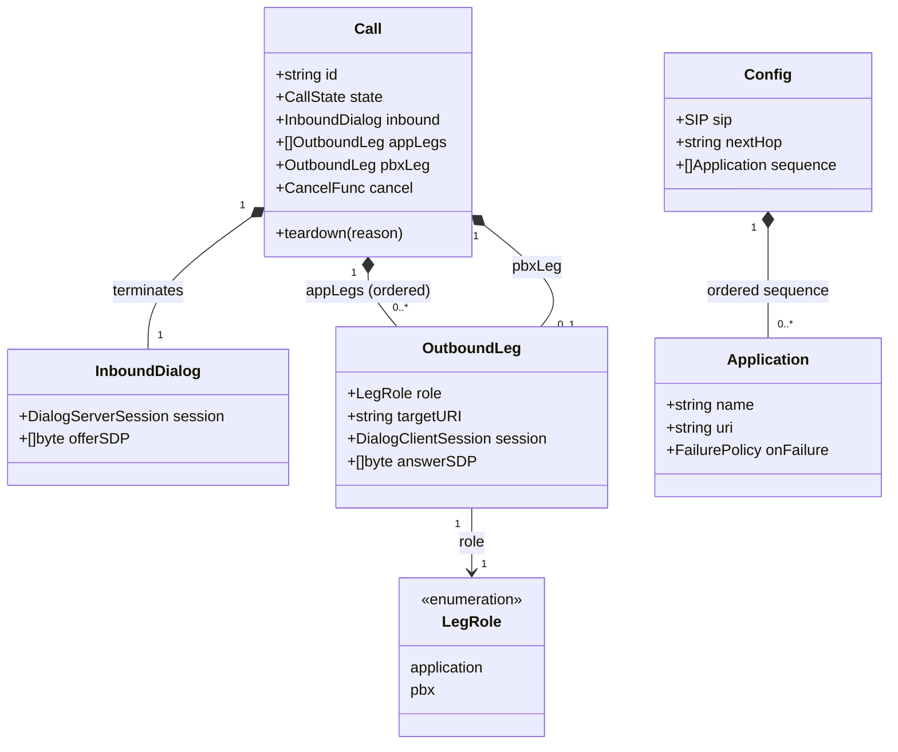

# Ordered multi-application chain for voipstack-sip-sequencer

> REASONS-Canvas structured prompt for `[STORY-001-003]`. Stack: **Go** + `emiago/sipgo`.
> Builds on the implemented `internal/b2bua` (stories 001/002). Functional core / imperative
> shell per `AGENTS.md`. Go-native — errors as values, no exception-handler classes.
>
> **This is a generalization, not a rewrite.** Story 002 bridges `cfg.Sequence[0]` then PBX;
> this story walks the **whole** `cfg.Sequence` in order then PBX. Reuse the proven
> answer-timing, 18x relay, failure mapping, synchronous-handler race fix, and teardown.
>
> Accepted decisions:
> - **Leg model:** replace `Call.appLeg *OutboundLeg` with `appLegs []*OutboundLeg`; keep
>   `pbxLeg` separate.
> - **Empty sequence:** dedicated branch — originate the PBX leg with the **inbound offer
>   SDP**, no app legs.
> - **Order assertion (tests):** fake apps append their name to a shared mutex-guarded slice
>   on INVITE; assert the recorded order.
> - **Failure:** unchanged — any app/PBX leg failure fails the whole call (pass-through
>   status / 503). Per-app skip/abort is `[STORY-001-004]`.
> - **Media:** still signaling-only; serial SDP relay is provisional scaffolding
>   (anchoring=005, fork=010).

## Requirements

Generalize the single-application bridge into an **ordered N-application chain**: for each
application in the configured `sequence`, in list order, originate an outbound leg, wait
for it to answer, and carry its answer SDP to the next hop; after the last application,
originate the PBX leg and answer the endpoint with the PBX SDP. List order is chain order;
reordering config reorders traversal. An empty sequence routes straight to the PBX. Every
application receives an ordinary inbound INVITE and is never asked to forward. A BYE or
failure on any leg tears down the inbound dialog and every application leg and the PBX leg,
leaking nothing.

Boundaries: linear chain only (no branching/looping/re-run); failure fails the whole call
(skip/abort deferred); no RTP anchoring; signaling only. SDP relay remains provisional.

## Entities

Conservative-design notes (the ONLY structural change is the leg slice):
- **Change `call.go`:** `appLeg *OutboundLeg` → **`appLegs []*OutboundLeg`** (ordered, one
  per traversed application). `pbxLeg *OutboundLeg` stays. Everything else on `Call`
  (`id`, `mu`, `state`, `inbound`, `cancel`, `reg`) unchanged.
- **`OutboundLeg`, `InboundDialog`, `LegRole`, `CallState`, `Registry`, `state.go`
  (`mapFailureStatus`, `canTransition`), `engine.go`** — **unchanged**.
- **`config.Config`/`Application`** — unchanged; story 002 used `Sequence[0]`, this uses all.
- No new types. The "chain" is a loop over an existing slice, not a new abstraction (YAGNI).

## Approach

1. **Generalize the bridge loop (bridge.go):**
   - Keep `handleInvite` exactly as is through `Call` creation, 100 Trying, the inbound
     `OnState→teardown` wiring, and the **synchronous** `e.bridge(callCtx, call)` call
     (preserves the documented `TerminateGracefully` race fix).
   - In `bridge`, replace the hardcoded `Sequence[0]` app-leg block with a **loop over
     `e.cfg.Sequence`**. Track `offer := call.inbound.offerSDP`. For each `app`:
     - parse URI; originate via `e.dialogCliCache.Invite(ctx, uri, offer)`;
     - append the new `OutboundLeg{role: roleApplication, targetURI, session}` to
       `call.appLegs` (under `call.mu`);
     - `WaitAnswer` with the existing 18x-relay `OnResponse`; on error map + respond +
       `teardown` + return (same as today);
     - `Ack`; store `answerSDP` (under lock); wire the leg's `OnState→teardown`;
     - set `offer = thatAnswerSDP` for the next hop.
   - After the loop, originate the **PBX leg** with `offer` (= last app answer, or the
     inbound offer if the chain was empty), reusing the existing PBX block verbatim
     (WaitAnswer/relay/map/Ack/store), then answer the endpoint 200 with the PBX SDP, set
     `established`, block on `<-ctx.Done()`.

2. **Empty-sequence branch:** if `len(e.cfg.Sequence) == 0`, skip the loop entirely; `offer`
   stays the inbound offer SDP; proceed straight to the PBX block. No `Sequence[0]` access.

3. **Teardown generalization (call.go):** under the mutex, snapshot the inbound session, the
   `pbxLeg` session, **and a copy of the `appLegs` slice**; after unlocking, BYE the inbound,
   BYE each app-leg session in the snapshot, BYE the PBX session; `reg.remove(id)`. Keep the
   `canTransition(state, stateTearingDown)` idempotency guard and the 5s shutdown context.

4. **Failure/teardown across a partial chain:** if hop K fails, `teardown` BYEs apps 1..K-1
   already in `appLegs` plus inbound — generalization of story 002, no new logic needed.

5. **Error handling:** unchanged Go-idiomatic pattern — wrap `%w`, map to SIP status via the
   pure `mapFailureStatus`, then `teardown`. No centralized handler.

## Structure

### Type / function relationships
1. `Call.appLegs []*OutboundLeg` (changed) + `Call.pbxLeg *OutboundLeg` (same). `OutboundLeg`
   unchanged.
2. `Engine.bridge(ctx, *Call)` (changed): inbound-offer var + loop over `cfg.Sequence` +
   reused PBX block + endpoint answer.
3. `Engine.handleInvite` (unchanged except it already calls `bridge`).
4. `Call.teardown` (changed): iterate `appLegs` snapshot.
5. Pure helpers `mapFailureStatus`, `canTransition` (unchanged) — still the unit-tested core.

### Dependencies
1. `bridge.go` depends on `internal/config` (full `Sequence`), `emiago/sipgo`, `call.go`,
   `state.go` — same set as today.
2. `call.go` depends on `emiago/sipgo`, stdlib `context`/`sync`/`time` — unchanged.
3. No new packages, no new external deps.

### Layered architecture (functional core / imperative shell)
1. Edge/shell (`cmd/sip-sequencer/main.go`) — unchanged.
2. SIP boundary (`Engine.bridge`/`handleInvite`, `Call.teardown`) — the chain loop and
   per-leg sipgo I/O live here; impure.
3. Pure core (`state.go`) — `mapFailureStatus`, `canTransition`; unchanged, still where the
   deterministic logic is unit-tested.

> No Controller/Service/Repository/GlobalExceptionHandler — SIP responses are the error
> surface, produced inline from wrapped Go errors (as in story 002).

## Operations

### Update type - Call leg slice (internal/b2bua/call.go)
1. Responsibility: hold an ordered set of application legs instead of one.
2. Change: `appLeg *OutboundLeg` → `appLegs []*OutboundLeg`. Keep `pbxLeg *OutboundLeg`.
3. Update `teardown`:
   - Under `c.mu`: snapshot `inbound := c.inbound.session`; `pbxSess` from `c.pbxLeg`; and
     `appSessions := make([]*sipgo.DialogClientSession, 0, len(c.appLegs))` copying each
     non-nil `c.appLegs[i].session`.
   - After unlock + `c.cancel()` + 5s ctx: BYE inbound; `for _, s := range appSessions { BYE s }`;
     BYE pbxSess; `c.reg.remove(c.id)`.
   - Keep the `canTransition(c.state, stateTearingDown)` guard (glare-safe).
4. Constraints: every app leg BYE'd; no leak; `-race` clean.

### Update orchestrator - Engine.bridge (internal/b2bua/bridge.go)
1. Responsibility: traverse the whole `cfg.Sequence` in order, then PBX, then answer endpoint.
2. Logic:
   - `offer := call.inbound.offerSDP`.
   - `for i := range e.cfg.Sequence {` app := `e.cfg.Sequence[i]`:
     - `var uri sip.Uri; ParseUri(app.URI,&uri)` → on err: respond 500, teardown, return.
     - `sess, err := e.dialogCliCache.Invite(ctx, uri, offer)` → on err: respond 503,
       teardown, return.
     - under `call.mu`: `call.appLegs = append(call.appLegs, &OutboundLeg{role:
       roleApplication, targetURI: app.URI, session: sess})`.
     - `legCtx,legCancel := WithTimeout(ctx,e.legTimeout)`; `err = sess.WaitAnswer(legCtx,
       AnswerOptions{OnResponse: relay18x})`; `legCancel()`.
     - on err: `errors.As(&dialErr)` → respond `mapFailureStatus(failureReject,
       dialErr.Res.StatusCode)` (pass-through body/reason) else respond
       `mapFailureStatus(failureTimeout,0)` "Service Unavailable"; `teardown`; return.
     - `resp := sess.InviteResponse`; `sess.Ack(ctx)`; under lock store
       `call.appLegs[last].answerSDP = copyBody(resp.Body())`; `sess.OnState(ended→teardown)`.
     - `offer = call.appLegs[last].answerSDP`.
   - `}` — after the loop, PBX block (verbatim from story 002) using `offer` as the INVITE
     body; on success answer endpoint 200 with PBX SDP; set `established`; `<-ctx.Done()`.
3. Empty-sequence: when the loop runs zero times, `offer` is still the inbound offer →
   PBX block proceeds directly (AC4). No special-casing needed beyond not indexing
   `Sequence[0]`.
4. Constraints: exactly one inbound final response; synchronous within `handleInvite`;
   reuse `relay18x`/`mapFailureStatus`; keep single-app behavior identical (AC3 regression).

### Update tests - chain behavior (internal/b2bua/b2bua_test.go + harness)
1. Responsibility: verify ordered traversal, reorder, single, empty, unawareness, teardown.
2. Harness: extend the fake-app helper to accept a `name` and a shared
   `*orderRecorder{ mu sync.Mutex; seen []string }`; on receiving an INVITE the fake appends
   its name before answering 2xx. Allow spinning up N fake apps on `127.0.0.1:0`.
3. Behavior tests (Given/When/Then, named by behavior):
   - `TestChainTraversesApplicationsInConfiguredOrder` (AC1 — `[A,B,C]` ⇒ seen `[A,B,C]`,
     then PBX).
   - `TestChainOrderFollowsConfigReorder` (AC2 — `[C,A,B]` ⇒ seen `[C,A,B]`).
   - `TestSingleApplicationChainUnchanged` (AC3 — regression vs story 002).
   - `TestEmptySequenceRoutesStraightToPBX` (AC4 — zero apps invited; PBX invited; call up).
   - `TestApplicationsReceiveOrdinaryInvite` (AC5 — each fake sees a normal INVITE; not asked
     to forward).
   - `TestFullChainTearsDownOnHangup` (AC6 — after caller (and separately PBX) BYE, all app
     legs + PBX torn down; `registry.len()==0`).
   - `TestMidChainFailureTearsDownPriorLegs` (partial-chain failure: app2 rejects ⇒ app1 +
     inbound torn down; PBX never invited; no leak).
4. Completion: all pass under `go test -race ./...`; existing story-002 tests still green.

## Norms

1. **Style:** generalize in place; keep functional core (`state.go`) pure and untouched; all
   chain/sipgo I/O in `bridge`/`teardown`. No new global state. `Call` remains the single
   owner of its legs behind its mutex.
2. **Concurrency:** mutate `call.appLegs` only under `call.mu`; snapshot before BYE in
   teardown; per-call `context` lifecycle unchanged; `go test -race` clean. No goroutine
   added — the chain is a serial loop inside the existing synchronous handler.
3. **Errors as values:** wrap `%w` with hop context (e.g. `"originate app leg %q: %w"`); map
   to SIP status via `mapFailureStatus`; always `teardown` after a failure. No `panic`; no
   `os.Exit` outside `main`.
4. **SIP specifics:** reuse dialog sessions; relay 18x upstream per hop; SDP carried opaque
   between hops; inbound 200 only after PBX 2xx; one inbound final response per call.
5. **Tests (BDD, named by behavior):** real in-memory sipgo fakes only (no internal mocks);
   order asserted by fake-app recording; keep single-app and prior tests green as regression.
6. **Toolchain gate:** `gofmt`, `go vet ./...`, `go build ./...`, `go test -race ./...` clean.
7. **Minimal churn:** touch only `call.go`, `bridge.go`, and tests. Do not alter `engine.go`,
   `registry.go`, `state.go`, or `internal/config`.

## Safeguards

1. **Functional constraints:** applications are traversed in **exact configured order**
   (AC1); reordering config reorders traversal (AC2); a single-app chain behaves identically
   to story 002 (AC3); an empty sequence routes straight to PBX with zero app legs (AC4);
   each app receives an ordinary INVITE and is never asked to forward (AC5).
2. **Linearity constraint:** each application is originated exactly once, in order; no
   branching, looping, parallel origination, or mid-call re-sequencing (PRD §3/§5/§7).
3. **Teardown constraints:** a BYE/failure on any leg tears down the inbound dialog and
   **every** application leg plus the PBX leg, idempotently/glare-safe, leaving
   `registry.len()==0` and no open dialog sessions (AC6 + no-leak). Partial-chain failure
   tears down the legs created so far.
4. **Answer-timing constraint:** inherited — endpoint 200 only after the PBX leg answers
   2xx; 18x relayed upstream during setup.
5. **Failure constraint:** any app/PBX leg failure fails the whole call (pass-through status
   for a reject, 503 for timeout/unreachable). **No skip/abort** here — that is
   `[STORY-001-004]`.
6. **Media boundary:** SDP relayed opaque/unchanged across hops; no RTP anchoring, no fork,
   no transcoding; audio not asserted (stories 005/010).
7. **Concurrency/perf:** `-race` clean; chain setup is serial (≈ Σ per-hop round trips) —
   acceptable for typical small chains; sanity-check latency, not a hard gate (NFR).
8. **Scope constraints (do NOT implement here):** per-app skip/abort (004), RTP anchoring
   (005), `media` fork/field (010), correlation headers (006), mid-call (007). `config` and
   `state.go` unchanged.
9. **Regression constraint:** all existing story-001/002 tests remain green; the single-app
   path is explicitly retested (AC3).
10. **Error-surface constraints:** errors wrapped `%w`, mapped to SIP status; no internals
    leaked to peers; no centralized handler; no `panic` reaches a peer.
