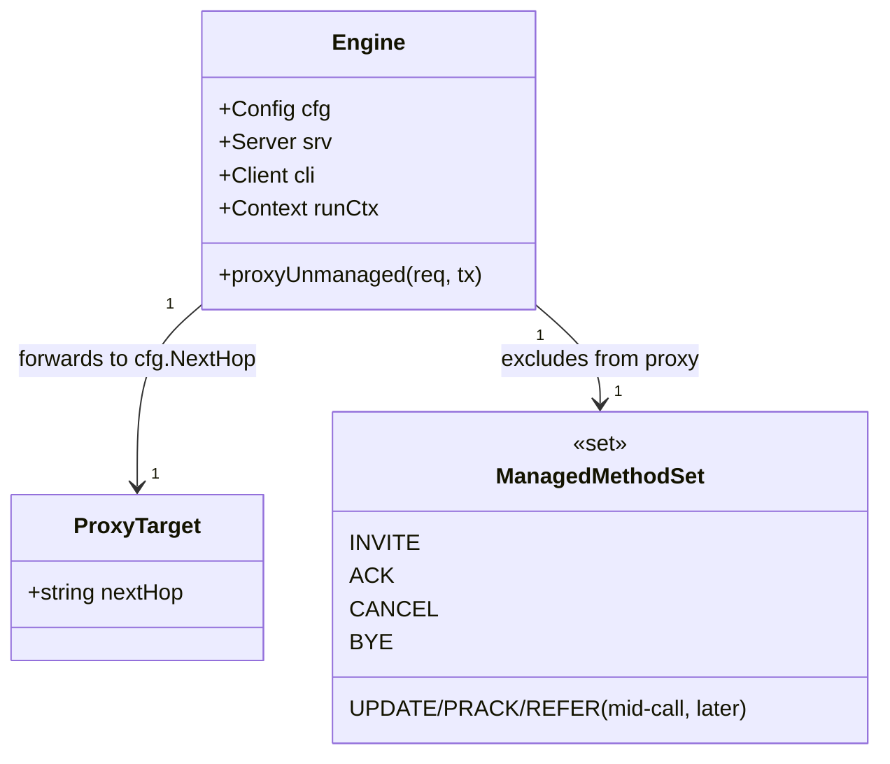

# Transparent pass-through of unmanaged SIP methods to PBX

> REASONS-Canvas structured prompt for `[STORY-001-011]`. Stack: **Go** + `emiago/sipgo`.
> Builds on the implemented `internal/b2bua` engine. Functional core / imperative shell per
> `AGENTS.md`. Go-native — errors as values, no exception-handler classes.
>
> Accepted decisions: **stateless** proxy; managed set = `INVITE/ACK/CANCEL/BYE` (+ mid-call
> methods, owned by the B2BUA); **all other methods forwarded to `cfg.NextHop`**; OPTIONS
> **forwarded, not answered locally**; **no Record-Route / no Contact rewriting (v1)**;
> Max-Forwards decremented (483 at 0). Unmanaged traffic never enters the application chain.

## Requirements

Implement transparent, stateless pass-through of every SIP method the B2BUA does not manage
to the terminating next-hop (PBX), so the sequencer can sit inline in front of an existing
PBX without breaking registration, presence, messaging, or keepalives. Classify each inbound
request as managed (call methods) or unmanaged; forward unmanaged requests to `cfg.NextHop`
with proxy Via/Max-Forwards handling and route the PBX's responses back to the originator.
Unmanaged methods bypass the application chain entirely; call methods remain B2BUA-handled.

Boundaries: stateless proxy only (no forking, no transaction-state absorption); no
Record-Route, no Contact/registration rewriting, no registrar emulation; UDP; plain SIP.

## Entities

Conservative-design notes:
- **No new types of substance.** The capability is a handler method on the existing
  `Engine` plus a small predicate. `ProxyTarget`/`ManagedMethodSet` above are conceptual —
  in code they are `e.cfg.NextHop` and a method check, not structs (YAGNI).
- **`Engine` unchanged** except: a new `proxyUnmanaged` handler (in `proxy.go`) and its
  registration in `Run`. `handleInvite`/`OnAck`/`OnBye`, `Call`, `Registry`, `state.go`,
  `internal/config` — all untouched.
- No DTOs — network service.

## Approach

1. **Method classification:**
   - Managed (handled by the B2BUA, NOT proxied): `INVITE`, `ACK`, `CANCEL`, `BYE`, and the
     mid-call methods the B2BUA will own (`UPDATE`, `PRACK`, `REFER` — story 007). Keep the
     existing `OnInvite/OnAck/OnBye` registrations as the source of truth for "managed".
   - Unmanaged (proxied): everything else — `REGISTER`, `OPTIONS`, `MESSAGE`, `SUBSCRIBE`,
     `NOTIFY`, `PUBLISH`, `INFO`, etc.

2. **Stateless proxy (proxy.go):**
   - One handler `proxyUnmanaged(req *sip.Request, tx sip.ServerTransaction)`:
     - **Max-Forwards:** read; if present and 0 → respond `483 Too Many Hops`, return; else
       decrement (default to 70 if absent).
     - **Build the forward:** clone the request; set destination/Request-URI toward
       `cfg.NextHop` (set `req.SetDestination(nextHop)` / recipient as sipgo requires);
       push a new top `Via` with a fresh branch (sipgo's client adds Via when sending a
       client transaction — use that path rather than hand-crafting where possible).
     - **Send + pump responses:** issue the forward via the existing client
       (`e.cli` / a client transaction, e.g. `e.cli.TransactionRequest(ctx, fwd)`); for
       every response received (provisional and final), strip the top Via and relay it to
       the inbound `tx` via `tx.Respond(res)`. Finish on the final response.
     - **Errors:** transport failure / unroutable next-hop → respond `5xx` (e.g. `502`/`503`)
       to the originator; wrap `%w`, log via `slog`. Never panic; calls unaffected.
   - Stateless: hold no per-request state beyond the in-flight forward; no maps.

3. **Registration (engine.go `Run`):**
   - Keep `OnInvite/OnAck/OnBye` exactly as today.
   - Register `proxyUnmanaged` for the unmanaged methods. **Prefer a catch-all** if sipgo
     exposes one (e.g. a no-route / default request hook) so any future method is covered;
     otherwise register explicitly for `OnRegister`, `OnOptions`, `OnSubscribe`, `OnNotify`,
     `OnMessage`, `OnInfo`, `OnPublish` (and `OnRefer`/`OnUpdate` ONLY once story 007 owns
     them — until then they are unmanaged and may proxy or be left for 007; default: proxy).
   - **Confirm the sipgo API** for: setting a request's next-hop destination, issuing a
     client transaction for an arbitrary method, and relaying responses to a server
     transaction. Use those primitives; do not hand-roll UDP.

4. **Chain isolation:** `proxyUnmanaged` never calls `bridge`/`handleInvite`; the application
   chain only ever runs from `OnInvite`. Unmanaged traffic provably bypasses apps.

## Structure

### Type / function relationships
1. `Engine.proxyUnmanaged(req, tx)` — new method in `internal/b2bua/proxy.go`; the only new
   code of substance.
2. A small pure helper if useful: `decrementMaxForwards(req) (ok bool)` or inline; keep
   classification in `Run`'s registration (managed handlers vs proxy handler).
3. Reuses `Engine.cli`, `Engine.cfg.NextHop`, `Engine.runCtx`.

### Dependencies
1. `proxy.go` depends on `emiago/sipgo` (+ `sip`), `Engine` fields, stdlib `context`,
   `fmt`, `log/slog`.
2. No new external dependency; no change to `internal/config`.

### Layered architecture (functional core / imperative shell)
1. Edge/shell (`main.go`) — unchanged.
2. SIP boundary (`Engine.Run` registration + `proxyUnmanaged`) — impure; the proxy I/O.
3. Pure core (`state.go`) — unchanged; optional tiny pure helper for Max-Forwards.

> No Controller/Service/GlobalExceptionHandler — proxy responses (relayed PBX status, or
> 483/5xx) are produced inline from wrapped Go errors.

## Operations

### Create handler - Engine.proxyUnmanaged (internal/b2bua/proxy.go)
1. Responsibility: stateless-forward one unmanaged request to `cfg.NextHop` and relay
   responses back.
2. Signature: `func (e *Engine) proxyUnmanaged(req *sip.Request, tx sip.ServerTransaction)`.
3. Logic:
   - Max-Forwards: if header present and value `0` → `tx.Respond(NewResponseFromRequest(req,
     483, "Too Many Hops", nil))`; return. Else decrement (or set 70 if absent).
   - Determine next-hop `sip.Uri`/addr from `e.cfg.NextHop` (parse once; on parse error →
     `500`, return).
   - Set the request destination to the next-hop (sipgo: `req.SetDestination(addr)` or the
     equivalent recipient setter).
   - `ctx := e.runCtx`; issue client transaction: `clientTx, err := e.cli.TransactionRequest(
     ctx, req)` (sipgo adds the proxy Via). On err → `502/503` to `tx`, log, return.
   - Loop over `clientTx.Responses()` (channel) / `clientTx.Result()`: for each response,
     relay to inbound: `tx.Respond(res)`. Break after the first final (>=200). Handle
     `ctx.Done()`/timeout → `408`/`5xx`.
   - Always terminate the client transaction (defer).
4. Constraints: stateless; no maps; never touches `Call`/`Registry`/`bridge`; wrap errors
   `%w`; `slog` on failures.
5. NOTE: verify exact sipgo response-pumping API (`TransactionRequest` + reading responses,
   or a higher-level forward helper if present). Use the idiomatic sipgo path.

### Update registration - Engine.Run (internal/b2bua/engine.go)
1. Responsibility: route unmanaged methods to `proxyUnmanaged`; leave call methods managed.
2. Change: after the existing `OnInvite/OnAck/OnBye`, register the proxy for unmanaged
   methods. Prefer a catch-all/no-route hook if sipgo provides one; else explicit:
   `e.srv.OnRegister(e.proxyUnmanaged)`, `OnOptions`, `OnSubscribe`, `OnNotify`, `OnMessage`,
   `OnInfo`, `OnPublish`.
3. Constraints: do NOT register the proxy for INVITE/ACK/BYE/CANCEL. Keep call handling
   intact (AC5 regression).

### Create tests - pass-through behavior (internal/b2bua/proxy_test.go + harness)
1. Responsibility: verify forwarding, response routing, chain isolation, call regression.
2. Harness: real in-memory sipgo fakes — a fake endpoint (UAC) that can send REGISTER /
   OPTIONS / MESSAGE / SUBSCRIBE; a fake PBX (UAS) bound at `cfg.NextHop` that records the
   methods it receives and replies with a set status; (for AC4) a fake app UAS that records
   anything it receives.
3. Behavior tests (Given/When/Then, named by behavior):
   - `TestRegisterForwardedToPBX` (AC1 — PBX received REGISTER; endpoint got PBX status).
   - `TestOptionsForwardedNotAnsweredLocally` (AC2 — PBX received OPTIONS; not a local 200).
   - `TestPresenceAndMessagingForwarded` (AC3 — SUBSCRIBE/NOTIFY/MESSAGE/PUBLISH reach PBX).
   - `TestUnmanagedMethodsBypassApplicationChain` (AC4 — app fake received nothing).
   - `TestInviteStillB2BUAHandled` (AC5 — INVITE still goes through the call path/app chain).
   - `TestForwardedResponseRoutedToSender` (AC6 — originator gets the PBX response, no hang).
   - `TestMaxForwardsZeroRejected` (483) and `TestUnroutableNextHopFailsCleanly` (5xx;
     calls unaffected).
4. Completion: pass under `go test -race ./...`; existing 001/002/003 tests stay green.

## Norms

1. **Style:** one impure handler at the SIP boundary; no global state; reuse `Engine.cli`/
   `cfg.NextHop`. Optional Max-Forwards helper kept pure.
2. **Errors as values:** wrap `%w` with context (`"proxy %s to %q: %w"`); map to SIP status
   (483/5xx); `slog` on failure; never `panic`; never `os.Exit` outside `main`.
3. **SIP specifics:** stateless proxy — add Via (via the client send path), decrement
   Max-Forwards, strip top Via on responses; UDP; do not Record-Route; do not rewrite
   Contact. Forward the request otherwise unmodified.
4. **Isolation:** the proxy path must never invoke `bridge`/chain logic; classification lives
   only in `Run`'s handler registration.
5. **Tests (BDD, named by behavior):** real in-memory sipgo fakes only (no internal mocks);
   assert at the fake PBX (received method) and the fake originator (received response);
   keep call tests green as regression.
6. **Toolchain gate:** `gofmt`, `go vet ./...`, `go build ./...`, `go test -race ./...` clean.
7. **Minimal churn:** add `proxy.go` + a few lines in `engine.go` `Run` + tests. Do not touch
   `bridge.go`, `call.go`, `registry.go`, `state.go`, `internal/config`.

## Safeguards

1. **Functional constraints:** REGISTER (AC1), OPTIONS (AC2), SUBSCRIBE/NOTIFY/MESSAGE/
   PUBLISH (AC3) are forwarded to `cfg.NextHop` and the PBX's response returned to the
   originator; unmanaged methods never reach an application (AC4); INVITE and the call
   methods remain B2BUA-handled (AC5); responses route back by Via with no hang/duplicate
   (AC6).
2. **Transparency constraint:** forwarded requests are unmodified except the proxy minimum
   (new Via, decremented Max-Forwards). No Record-Route, no Contact/registration rewriting,
   no local answering of OPTIONS.
3. **Statelessness constraint:** no per-request state beyond the in-flight client
   transaction; no maps/registry entries; stateless proxy only (no forking, no transaction
   absorption).
4. **Loop/abuse safety:** Max-Forwards decremented; `0` ⇒ `483`. Unroutable/unparseable
   next-hop or transport failure ⇒ clean `5xx` to the sender; **calls unaffected**.
5. **Isolation constraint:** the application chain runs only from `OnInvite`; the proxy path
   provably bypasses it.
6. **Known v1 limitation (documented):** without Record-Route/Contact rewriting, the
   sequencer may not stay in the path for subscribe-dialog follow-ups or for PBX-originated
   requests behind NAT. Out of scope v1 (PRD §5/§8).
7. **Transport constraint:** UDP; plain SIP; no TLS.
8. **Concurrency/perf:** `-race` clean; forwarding is cheap and stateless — negligible added
   latency (NFR).
9. **Scope constraints (do NOT implement here):** stateful proxy, registrar emulation, NAT
   handling, Record-Route, mid-call method ownership (story 007). `config` unchanged.
10. **Error-surface constraints:** errors wrapped `%w`, mapped to SIP status; no internals
    leaked to peers; no centralized handler; no `panic` reaches a peer.
