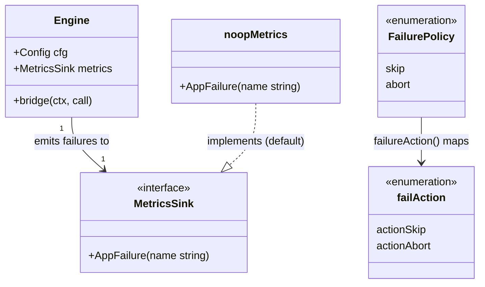

# Per-application failure handling (skip / abort)

> REASONS-Canvas structured prompt for `[STORY-001-004]`. Stack: **Go** + `emiago/sipgo`.
> Builds on the implemented `internal/b2bua` chain (stories 001/002/003). Functional core /
> imperative shell per `AGENTS.md`. Go-native — errors as values, no exception-handler
> classes.
>
> **Localized change.** Only the two app-failure branches in `bridge`'s loop change, plus a
> tiny metrics seam and a pure helper. Success path and the PBX leg are untouched.
>
> Accepted decisions:
> - **append app leg AFTER it answers 2xx** (so `call.appLegs` holds only live legs — clean
>   teardown; no dead/half-open session ever lingers).
> - **tiny consumer-side `MetricsSink` interface** (`AppFailure(name string)`) on `Engine`,
>   default **no-op**; story 008 plugs Prometheus.
> - **emit the failure signal on BOTH skip and abort.**
> - **tiny pure helper `failureAction(policy)`** for the branch.
> - policy applies to **both** originate-failure and answer-failure; **skip preserves the
>   carried `offer` SDP**; PBX-leg failure unchanged (not an app); signaling-only.

## Requirements

Make the application chain resilient by honoring each application's `on_failure` policy when
its leg fails (unreachable or rejects): `skip` logs, emits a failure signal, and advances to
the next hop without dropping the call; `abort` fails the whole call (endpoint gets the
pass-through reject status, or 503 on timeout) and contacts no further hop. The omitted
default is `skip` (already applied at config load). A skipped application contributes no SDP,
so the carried offer is preserved for the next hop; with every application skipped the call
still reaches the PBX. Emit a per-application failure signal (skip and abort) through a
minimal sink that observability (story 008) can implement.

Boundaries: single attempt (no retry/backoff/reorder); no branching/sub-chains; PBX-leg
failure still fails the call (not an application); no Prometheus here (just the seam);
signaling only.

## Entities

Conservative-design notes:
- **No change to `Call`/`OutboundLeg`/`config`.** `config.Application.OnFailure`
  (`FailurePolicy`) is reused as-is (already validated + defaulted to `skip`).
- **`MetricsSink`** is a tiny consumer-side interface defined in `b2bua` (one method).
  `noopMetrics{}` is the default so `Engine` always has a non-nil sink. Story 008 supplies a
  Prometheus implementation later — no change needed here for that.
- **`failAction`** is an internal enum returned by the pure `failureAction(FailurePolicy)`;
  keeps the branch testable and intent-revealing. Could be a bool, but the enum reads better
  and extends cleanly.
- No DTOs.

## Approach

1. **Failure-policy decision (pure):**
   - Add `failureAction(p config.FailurePolicy) failAction` in `state.go`: returns
     `actionAbort` for `FailureAbort`, else `actionSkip`. Pure, table-tested.

2. **Metrics seam:**
   - Define `MetricsSink interface { AppFailure(name string) }` and `type noopMetrics
     struct{}` with a no-op method, in `b2bua` (e.g. `metrics.go`).
   - Add `metrics MetricsSink` to `Engine`; default it to `noopMetrics{}` in `New`. (Optional
     functional option `WithMetrics(sink)` for story 008/tests — minimal.)

3. **Apply policy in the bridge loop (bridge.go) — both failure branches:**
   - **Append-after-answer:** move the `call.appLegs = append(...)` to AFTER `WaitAnswer`
     succeeds and ACK, so a leg that never answers is never in the slice. (The session var
     stays local until then.)
   - **Originate-failure branch** (`Invite` err): instead of always 503+teardown:
     - `e.metrics.AppFailure(app.Name)`; `slog.Warn("application failed", "name", app.Name,
       "uri", app.URI, "policy", app.OnFailure, "err", err)`.
     - `if failureAction(app.OnFailure) == actionAbort` → `Respond(503,"Service
       Unavailable")` + `teardown` + `return` (today's behavior). `else` → `continue`
       (offer unchanged; leg never appended).
   - **Answer-failure branch** (`WaitAnswer` err): same shape — emit signal + log; on
     `actionAbort` map status via `mapFailureStatus` (reject pass-through / timeout 503),
     respond, teardown, return; on `actionSkip` → `continue` (offer unchanged; leg never
     appended; nothing to BYE since no dialog established).
   - **Success path unchanged:** append the leg, ACK, store answer SDP, set `offer`, wire
     `OnState→teardown` — exactly as today, just after the append move.

4. **PBX leg & endpoint answer:** unchanged. PBX failure still fails the call (it is not an
   application; do NOT call `AppFailure` for it — terminating-hop metric is story 008).

5. **Error handling:** Go-idiomatic — wrap `%w`, `slog` the failure, map to SIP status on
   abort. No centralized handler; no panic.

## Structure

### Type / function relationships
1. `failureAction(config.FailurePolicy) failAction` — new pure helper in `state.go`
   (alongside `mapFailureStatus`/`canTransition`).
2. `MetricsSink` interface + `noopMetrics` — new `metrics.go`.
3. `Engine.metrics MetricsSink` — new field; set in `New` (default `noopMetrics{}`); optional
   `WithMetrics` option.
4. `Engine.bridge` — the two failure branches gain the policy decision + signal; the leg
   append moves after answer.

### Dependencies
1. `bridge.go` → `internal/config` (FailurePolicy), `state.go` (`failureAction`,
   `mapFailureStatus`), `Engine.metrics`, sipgo — same set + the sink.
2. `metrics.go` → nothing (stdlib only).
3. `state.go` → `internal/config` for `FailurePolicy` (already imported in the package).
4. No new external deps; `internal/config`/`call.go`/`registry.go` unchanged.

### Layered architecture (functional core / imperative shell)
1. Edge/shell (`main.go`) — unchanged (008 may later pass a real sink).
2. SIP boundary (`Engine.bridge`) — the policy branch + signal emission live here (impure).
3. Pure core (`state.go`) — `failureAction` joins `mapFailureStatus`/`canTransition`;
   unit-tested directly. `noopMetrics` is trivially pure.

> No Controller/Service/GlobalExceptionHandler — failure is handled inline as Go values →
> SIP status (abort) or continue (skip); the `MetricsSink` is the only "handler", and it is
> a one-method observability seam, not an exception framework.

## Operations

### Create pure helper - failureAction (internal/b2bua/state.go)
1. Responsibility: map a `FailurePolicy` to a bridge action.
2. Add: `type failAction int; const ( actionSkip failAction = iota; actionAbort )`.
3. `func failureAction(p config.FailurePolicy) failAction { if p == config.FailureAbort {
   return actionAbort }; return actionSkip }`.
4. Constraints: pure; no I/O; table-tested.

### Create metrics seam - MetricsSink (internal/b2bua/metrics.go)
1. Responsibility: a minimal observability hook for per-application failures.
2. `type MetricsSink interface { AppFailure(name string) }`.
3. `type noopMetrics struct{}; func (noopMetrics) AppFailure(string) {}`.
4. Constraints: one method; no dependency; default implementation does nothing.

### Update Engine - metrics field (internal/b2bua/engine.go)
1. Add `metrics MetricsSink` to the `Engine` struct.
2. In `New`, set `metrics: noopMetrics{}`.
3. (Optional, minimal) `func WithMetrics(s MetricsSink) Option` if an option pattern exists;
   otherwise add a settable field/constructor param used by tests/story 008. Keep minimal.
4. Constraints: `Engine.metrics` is never nil; no behavior change when noop.

### Update orchestrator - Engine.bridge failure branches (internal/b2bua/bridge.go)
1. Responsibility: honor `on_failure` at both app-failure branches; append leg after answer.
2. Logic changes (inside the `for i := range e.cfg.Sequence` loop):
   - Keep URI parse (bad URI is a config/server error → 500 + teardown + return, unchanged).
   - `appSess, err := e.dialogCliCache.Invite(ctx, appURI, offer)`:
     - on err: `e.metrics.AppFailure(app.Name)`; `slog.Warn("application failed", "name",
       app.Name, "uri", app.URI, "policy", app.OnFailure, "stage", "originate", "err", err)`;
       `if failureAction(app.OnFailure)==actionAbort { Respond(503,"Service Unavailable");
       teardown; return } ; continue`.
   - else `WaitAnswer(...)` (18x relay unchanged):
     - on `appErr`: `e.metrics.AppFailure(app.Name)`; `slog.Warn(... "stage","answer" ...)`;
       `if actionAbort { errors.As(&dialErr) ? Respond(mapFailureStatus(failureReject,
       dialErr.Res.StatusCode), pass-through) : Respond(mapFailureStatus(failureTimeout,0),
       "Service Unavailable"); teardown; return } ; continue`.
     - on success: NOW `call.mu.Lock(); call.appLegs = append(call.appLegs,
       &OutboundLeg{role:roleApplication, targetURI:app.URI, session:appSess,
       answerSDP:copyBody(appResp.Body())}); offer = last.answerSDP; call.mu.Unlock()`;
       `appSess.Ack(ctx)`; `appSess.OnState(ended→teardown)`.
3. Constraints: `skip` leaves `offer` unchanged and appends no leg; `abort` keeps today's
   responses/teardown; emit `AppFailure` on BOTH actions; do not emit for the PBX leg.
4. Completion: AC1–AC6 pass; 002/003 success-path tests stay green.

### Update tests - failure policy behavior (internal/b2bua/*_test.go + harness)
1. Harness: fake app that **rejects** (configurable 4xx) and "unreachable" app (no listener /
   bad port); a test `MetricsSink` recording `AppFailure` names.
2. Behavior tests (Given/When/Then):
   - `TestSkipAdvancesPastFailedApplication` (AC1 — `[A(skip,down), B(skip,up)]` ⇒ call up via
     B+PBX).
   - `TestAbortFailsCallOnRequiredApplication` (AC2 — `[A(abort,reject), B(skip)]` ⇒ call
     fails; B + PBX never invited).
   - `TestOmittedPolicyDefaultsToSkip` (AC3 — config omits `on_failure`; app down ⇒ skipped,
     PBX reached). (Relies on story-001 default.)
   - `TestSkipFailureIsLoggedAndSignalled` (AC4 — test sink received `AppFailure("appA")`).
   - `TestAllSkipChainAllDownStillReachesPBX` (AC5 — every app skip+down ⇒ PBX gets inbound
     offer; call up).
   - `TestAbortFirstAppPreventsLaterContact` (AC6 — B fake never receives an INVITE).
   - `TestSkipFailedLegNotInTeardown` (leg bookkeeping — after a skip, teardown BYEs only live
     legs; `registry.len()==0`, no BYE to the failed app).
3. Completion: pass under `go test -race ./...`.

## Norms

1. **Style:** keep `failureAction` pure in `state.go`; the policy branch + signal live in the
   `bridge` boundary. `MetricsSink` is a small consumer-side interface with a no-op default —
   no global state.
2. **Errors as values:** wrap `%w`; `slog.Warn` each app failure with `name`/`uri`/`policy`/
   `stage`; map to SIP status only on abort. No panic; no `os.Exit` outside `main`.
3. **Concurrency:** mutate `call.appLegs`/`offer` only under `call.mu`; append only after
   answer; `go test -race` clean. No new goroutine.
4. **Leg bookkeeping:** `call.appLegs` contains only legs that answered 2xx — so `teardown`
   never BYEs a dead/half-open session.
5. **Observability:** emit `AppFailure(name)` on both skip and abort; do NOT emit it for the
   PBX leg (terminating-hop is a separate metric, story 008).
6. **Tests (BDD, named by behavior):** real in-memory sipgo fakes (no internal mocks); a
   recording `MetricsSink` is a test double of an *external* observability surface, allowed.
   Keep 002/003 success tests green.
7. **Toolchain gate:** `gofmt`, `go vet ./...`, `go build ./...`, `go test -race ./...` clean.
8. **Minimal churn:** touch `state.go`, `engine.go`, `bridge.go`, new `metrics.go`, tests.
   Do not change `call.go`, `registry.go`, `internal/config`.

## Safeguards

1. **Functional constraints:** a `skip` app failure (originate or reject) logs, signals, and
   advances; the call still completes via later hops + PBX (AC1/AC3/AC5). An `abort` app
   failure fails the whole call with the pass-through reject status (or 503 on timeout) and
   contacts no further hop (AC2/AC6).
2. **Default constraint:** omitted `on_failure` behaves as `skip` (consumed from config;
   no defaulting code here) (AC3).
3. **Observability constraint:** every app failure (skip and abort) emits exactly one
   `AppFailure(name)` to the sink and one `slog` line naming the app; the PBX leg does not
   (AC4). The default sink is a no-op (no behavior change).
4. **SDP/continuation constraint:** a skipped app contributes no SDP — the carried `offer`
   is unchanged for the next hop; all-skip ⇒ PBX offered the inbound offer (AC5).
5. **Leg-state constraint:** `call.appLegs` holds only answered (live) legs; a failed/skipped
   app is never appended; teardown BYEs only live legs; `registry.len()==0` after teardown,
   no leak.
6. **No-side-effect-past-abort constraint:** after an abort fails, no later app or the PBX is
   invited (AC6).
7. **Single-attempt constraint:** one attempt per app; no retry/backoff/reorder.
8. **Scope constraints (do NOT implement here):** Prometheus counters (008 — only the seam
   here), RTP anchoring (005), media fork (010), correlation headers (006), mid-call (007),
   PBX-leg failure policy (always fails the call). `config`/`call.go` unchanged.
9. **Regression constraint:** stories 002 (single app) and 003 (chain happy path) tests stay
   green; the success path is behaviorally unchanged apart from the append-after-answer move.
10. **Error-surface constraints:** errors wrapped `%w`, mapped to SIP status on abort; no
    internals leaked to peers; no centralized handler; no `panic` reaches a peer.
