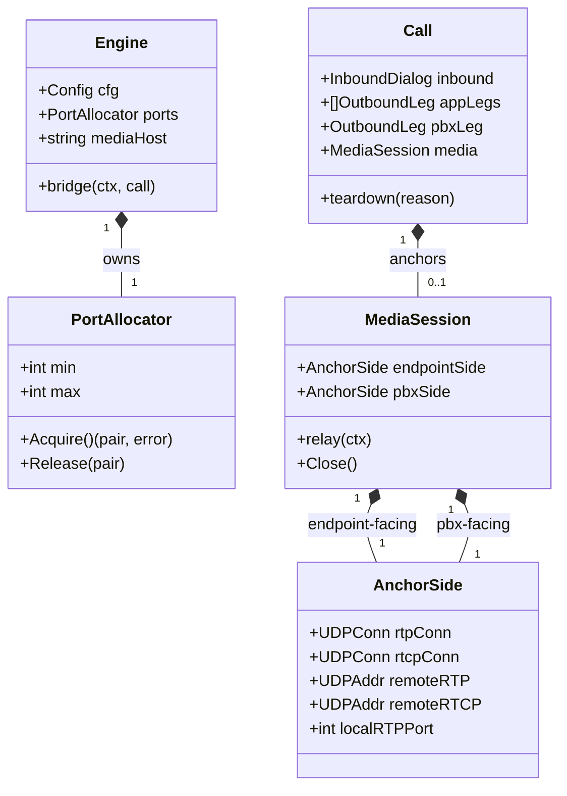

# RTP media anchoring & relay (the call) for voipstack-sip-sequencer

> REASONS-Canvas structured prompt for `[STORY-001-005]`. Stack: **Go** + `emiago/sipgo`
> (signaling) + **stdlib `net` UDP** (media — new). Builds on the implemented
> `internal/b2bua` (stories 001–004). Functional core / imperative shell per `AGENTS.md`:
> SDP rewrite + port-range/allocator math are **pure**; UDP sockets + relay goroutines are
> the **edge**. Go-native — errors as values, no exception-handler classes.
>
> **Scope: the call only** — anchor `endpoint ↔ sequencer ↔ PBX`. Per-app fork is
> `[STORY-001-010]`.
>
> Confirmed decisions:
> - **D1** hand-parse only `c=`/`m=` (read remote addr/port, rewrite to anchor); pass all
>   other SDP lines (codecs, attrs) through unchanged. No `pion/sdp` dependency.
> - **D2** hand-rolled `net.UDPConn` relay — copy packets only, reuse buffers; no pion media
>   stack.
> - **D3** remote RTP address from **SDP-signaled** `c=`/`m=`; NAT symmetric-latching is a
>   documented later limitation.
> - **D4 (deferred to 010)** **do NOT touch app-leg SDP.** The existing serial app-SDP
>   scaffolding stays. The call anchor is built from the **inbound endpoint offer** (→
>   PBX-facing anchored offer, endpoint codecs, `c=`/`m=` = sequencer's PBX-facing port) and
>   the **PBX answer** (→ endpoint-facing anchored answer, `c=`/`m=` = sequencer's
>   endpoint-facing port). App answers are NOT used for the call's media.
> - **D5** allocate RTP/RTCP as an even/odd pair and relay both.
> - `rtp.port_range` value validation (parse + bounds) moves here — fail fast at `New`.

## Requirements

Add the media plane: anchor RTP for the call so all audio flows through the sequencer
instead of directly between the endpoint and the PBX. Parse and validate `rtp.port_range`
at startup; allocate an RTP/RTCP port pair per anchored side from that range; rewrite the
`c=`/`m=` lines of the SDP offered to the PBX (from the inbound endpoint offer) and of the
answer returned to the endpoint (from the PBX answer) so both peers send RTP to the
sequencer; relay packets byte-for-byte in both directions (RTP and RTCP); release ports and
stop relaying on teardown; fail a new call cleanly when the range is exhausted without
disrupting established calls.

Boundaries: endpoint↔PBX call only (no per-app fork — story 010); no transcoding / mixing /
resampling (copy only); SDP-signaled addressing (no NAT latching); one audio stream; UDP;
app-leg SDP untouched (story 010).

## Entities

Conservative-design notes:
- **`Call` gains one field `media *MediaSession`** (nil until anchored). `inbound`,
  `appLegs`, `pbxLeg`, `state`, etc. unchanged. `teardown` additionally calls
  `media.Close()` + `ports.Release(...)`.
- **`config.RTP.PortRange` stays a string** in config (story 001 owns that struct);
  parsing/validation happens in `b2bua` at `New` (deferred value-validation now lands here).
- New media types live in a new file/package `internal/b2bua/media` (or `media.go` +
  `sdp.go` in-package) — **pure** `sdp.go` (rewrite, parse range) and **edge** `media.go`
  (sockets, relay).
- **No app-leg media types** — fork is story 010. `OutboundLeg` unchanged.
- No DTOs.

## Approach

1. **Port range + allocator:**
   - **Pure** `parsePortRange("10000-20000") (min, max int, err)` — validate numeric,
     `min < max`, even `min`, positive span; fail with a clear error.
   - `Engine.New` calls it and builds a `PortAllocator{min,max}` (mutex-guarded free list /
     next-cursor). **Fail fast at `New`** on a bad range (this is story 001's deferred
     `rtp.port_range` validation).
   - `Acquire()` returns an even RTP port + odd RTCP port pair (RTP even, RTCP = RTP+1);
     `Release()` returns them. Exhaustion → typed error.

2. **SDP rewrite (pure, `sdp.go`):**
   - `parseMedia(sdp []byte) (addr string, rtpPort int, err error)` — read the session `c=`
     and the first audio `m=`/`c=` to learn the remote RTP address/port (D3).
   - `rewriteToAnchor(sdp []byte, host string, rtpPort int) ([]byte, error)` — replace the
     connection address (`c=IN IP4 <host>`) and the audio `m=` port with the sequencer's;
     **leave every other line untouched** (codecs/attrs preserved → no transcoding). Operate
     line-by-line; pass unknown lines through verbatim.

3. **Media session + relay (edge, `media.go`):**
   - `AnchorSide` = one RTP `*net.UDPConn` + one RTCP `*net.UDPConn` bound to the allocated
     local ports on `mediaHost`, plus the learned `remoteRTP`/`remoteRTCP` `*net.UDPAddr`.
   - `MediaSession{ endpointSide, pbxSide }`; `relay(ctx)` starts copy loops: read on one
     side's RTP conn → write to the other side's `remoteRTP` (and symmetrically), same for
     RTCP. **Reuse a fixed read buffer per goroutine** (no per-packet alloc). Loops exit on
     `ctx.Done()` / conn close.
   - `Close()` closes all sockets (unblocks the loops) and is idempotent.

4. **Rework `bridge` for the call anchor (D4 deferred — app SDP untouched):**
   - Keep the app-chain loop **exactly as today** (serial app-SDP scaffolding; `offer`
     still flows through apps; app answers still stored). Do not change app legs.
   - **Before originating the PBX leg:** `parseMedia(call.inbound.offerSDP)` → endpoint RTP
     addr; `ports.Acquire()` twice (endpoint-facing + PBX-facing) — on exhaustion respond a
     clean failure (e.g. `503`/`486`), teardown, return; bind both `AnchorSide`s.
   - **PBX offer** = `rewriteToAnchor(call.inbound.offerSDP, mediaHost, pbxSide.localRTPPort)`
     — NOT the app `offer`. Send that to the PBX.
   - On PBX 2xx: `parseMedia(pbxAnswer)` → PBX RTP addr (store on `pbxSide`); set the
     endpoint-side remote to the endpoint's addr (from the inbound offer).
   - **Endpoint answer** = `rewriteToAnchor(pbxAnswer, mediaHost, endpointSide.localRTPPort)`
     — carries the PBX's chosen codec back, with the sequencer's address. Respond 200 to the
     endpoint with it.
   - Store `call.media`; start `media.relay(callCtx)`. `state = established`.

5. **Teardown:** `media.Close()` + `ports.Release(...)` for both pairs, in addition to the
   existing dialog BYEs. Idempotent; release even if the call failed mid-setup (defer the
   release right after `Acquire`).

6. **Error handling:** Go-idiomatic — wrap `%w`, `slog` media failures, map allocation/relay
   setup failures to a SIP failure response + teardown. No centralized handler; no panic on
   network input.

## Structure

### Type / function relationships
1. Pure (`internal/b2bua/sdp.go`): `parsePortRange`, `parseMedia`, `rewriteToAnchor` — no
   I/O, table-tested.
2. Edge (`internal/b2bua/media.go`): `PortAllocator` (`Acquire`/`Release`), `AnchorSide`,
   `MediaSession` (`relay`/`Close`).
3. `Engine` gains `ports *PortAllocator` and `mediaHost string` (from `cfg.SIP.Listen`
   host); built in `New`.
4. `Call` gains `media *MediaSession`; `teardown` closes it + releases ports.
5. `bridge` constructs/starts the session around the PBX leg; app loop unchanged.

### Dependencies
1. `media.go` → stdlib `net`, `context`, `sync`, `fmt`, `log/slog`.
2. `sdp.go` → stdlib `bytes`/`strconv`/`strings` only (pure).
3. `engine.go` → `parsePortRange` (fail-fast in `New`), holds `PortAllocator`.
4. `bridge.go` → `sdp.go` (parse/rewrite), `media.go` (allocate/anchor/relay), `Engine.ports`.
5. No new external dependency. `internal/config`, `registry.go`, `state.go`, `metrics.go`
   unchanged.

### Layered architecture (functional core / imperative shell)
1. Edge/shell (`main.go`) — unchanged.
2. SIP + media boundary (`Engine`/`bridge`/`media.go`) — sipgo dialogs + UDP sockets +
   relay goroutines; impure.
3. Pure core (`sdp.go`, `state.go`) — SDP rewrite, range parse, port math; deterministic,
   where ~all unit tests live. Full media flow tested via real UDP fakes.

> No Controller/Service/GlobalExceptionHandler — media setup failures become SIP responses +
> teardown, produced inline from wrapped Go errors.

## Operations

### Create pure SDP helpers (internal/b2bua/sdp.go)
1. Responsibility: parse and rewrite the minimum SDP needed to anchor.
2. Functions:
   - `parsePortRange(s string) (min, max int, err error)` — split on `-`; `strconv`; require
     `0 < min < max`, `min` even; wrap errors naming the bad value.
   - `parseMedia(sdp []byte) (host string, rtpPort int, err error)` — scan lines; take
     session/media `c=IN IP4 <host>` and first `m=audio <port> ...`; error if no audio media.
   - `rewriteToAnchor(sdp []byte, host string, rtpPort int) ([]byte, error)` — line-by-line:
     replace the `c=` host and the audio `m=` port with `host`/`rtpPort`; **emit all other
     lines verbatim**. Preserve trailing CRLFs.
3. Constraints: pure; no `net`; table-tested with real fake SDP bodies.

### Create media plane (internal/b2bua/media.go)
1. `PortAllocator{ mu, min, max, cursor/free }`:
   - `Acquire() (Pair{RTP,RTCP int}, error)` — next free even/odd pair; `ErrPortsExhausted`
     when none. `Release(Pair)`.
2. `AnchorSide{ rtpConn, rtcpConn *net.UDPConn; remoteRTP, remoteRTCP *net.UDPAddr;
   localRTPPort int }` + a constructor that binds the two UDP sockets on `mediaHost:port`.
3. `MediaSession{ endpointSide, pbxSide *AnchorSide }`:
   - `relay(ctx context.Context)` — 4 copy goroutines (endpoint↔pbx RTP both ways, RTCP both
     ways), each with a reused buffer, writing to the other side's learned remote addr; exit
     on `ctx.Done()`/conn close.
   - `Close()` — idempotent; close all conns.
4. Constraints: one owner per goroutine; no per-packet allocation; `-race` clean; bind
   failure → return error so caller can release + fail the call.

### Update Engine (internal/b2bua/engine.go)
1. In `New`: `min,max,err := parsePortRange(cfg.RTP.PortRange)` → on err return wrapped
   error (fail fast). Build `ports := &PortAllocator{min:min,max:max,...}`; set
   `mediaHost` from the listen host. Store on `Engine`.
2. Constraints: no listener opened on bad range; `Engine.ports`/`mediaHost` always set.

### Update Call + teardown (internal/b2bua/call.go)
1. Add `media *MediaSession` to `Call`.
2. In `teardown`: after BYEing dialogs (or alongside), if `media != nil` → `media.Close()`
   and release its port pairs via the engine allocator (pass a release hook or store the
   pairs on the session). Idempotent; runs even on mid-setup failure.
3. Constraints: no port leak; safe if `media == nil`.

### Rework bridge media flow (internal/b2bua/bridge.go)
1. Keep the app-chain loop unchanged (serial app SDP; do not touch app legs).
2. After the loop, before the PBX INVITE:
   - `epHost, epPort, err := parseMedia(call.inbound.offerSDP)` → on err: `488`/`500`,
     teardown, return.
   - `epPair, err := e.ports.Acquire()`; `pbxPair, err := e.ports.Acquire()` → on
     `ErrPortsExhausted`: respond `503` (or `486`), teardown (releases any acquired), return.
     `defer release-on-failure` until ownership passes to `call.media`.
   - bind `endpointSide` (epPair) and `pbxSide` (pbxPair) on `mediaHost`; set
     `endpointSide.remoteRTP/RTCP` from `epHost:epPort` (+1).
   - PBX INVITE body = `rewriteToAnchor(call.inbound.offerSDP, mediaHost, pbxPair.RTP)`.
3. On PBX 2xx:
   - `pbxHost, pbxRTP, err := parseMedia(pbxAnswer)`; set `pbxSide.remoteRTP/RTCP`.
   - endpoint 200 body = `rewriteToAnchor(pbxAnswer, mediaHost, epPair.RTP)`; respond.
   - `call.media = &MediaSession{endpointSide, pbxSide}`; `go call.media.relay(callCtx)`;
     `state = established`; `<-ctx.Done()`.
4. Constraints: PBX offer derives from the **inbound** offer; endpoint answer from the **PBX**
   answer; app answers never feed call media; codecs preserved; ports released on every exit
   path.

### Tests - media behavior (internal/b2bua/*_test.go + harness)
1. Harness: fake endpoint + fake PBX that, after SIP answer, actually **send RTP/RTCP UDP
   packets** to the negotiated (rewritten) addresses and capture what they receive.
2. Behavior tests (Given/When/Then):
   - `TestCallMediaFlowsThroughSequencer` (AC1 — packets traverse seq ports, not direct).
   - `TestMediaPayloadRelayedUnchanged` (AC2 — received payload == sent, byte-for-byte).
   - `TestMediaPortsWithinConfiguredRange` (AC3 — chosen ports ∈ range).
   - `TestMediaPortsReleasedOnTeardown` (AC4 — after BYE, ports free; soak many calls).
   - `TestBidirectionalAudioRelayed` (AC5 — both directions delivered).
   - `TestPortExhaustionFailsCleanly` (AC6 — tiny range; new call fails; existing call's
     media keeps flowing).
   - `TestBadPortRangeFailsAtNew` (parsePortRange / New fail-fast).
   - Pure unit tests: `parsePortRange`, `parseMedia`, `rewriteToAnchor` (table-driven).
3. Completion: pass under `go test -race ./...`; stories 002–004 signaling tests stay green.

## Norms

1. **Style:** SDP rewrite + range/port math are **pure** (`sdp.go`); sockets/goroutines are
   the edge (`media.go`). `PortAllocator` is the single owner of the range behind a mutex.
   No global state.
2. **Concurrency:** relay goroutines owned by the `MediaSession`, exit on `ctx`/close; reuse
   read buffers (no per-packet alloc); allocator mutex-guarded; `go test -race` clean; no
   goroutine or port leak after teardown.
3. **Errors as values:** wrap `%w` (`"acquire media ports: %w"`, `"rewrite sdp: %w"`); map
   media-setup failures to a SIP failure response + teardown; `slog` on failure; no panic on
   packets/SDP; never `os.Exit` outside `main`.
4. **Media correctness:** copy RTP/RTCP byte-for-byte; never parse/modify payloads; rewrite
   only `c=`/`m=`; preserve codecs/attrs; PBX offer from inbound offer, endpoint answer from
   PBX answer.
5. **Resource hygiene:** acquire→defer-release until ownership transfers to `call.media`;
   teardown closes sockets + releases ports; idempotent.
6. **Tests (BDD, named by behavior):** real UDP fakes that send/receive actual packets (no
   internal mocks); pure helpers table-tested; keep 002–004 green.
7. **Toolchain gate:** `gofmt`, `go vet ./...`, `go build ./...`, `go test -race ./...` clean.
8. **Minimal churn:** add `sdp.go`, `media.go`; edit `engine.go` (`New`), `call.go`
   (`media` field + teardown), `bridge.go` (call-anchor flow). Do NOT touch `internal/config`,
   `registry.go`, `state.go`, `metrics.go`, or the app-chain loop’s SDP handling.

## Safeguards

1. **Functional constraints:** call audio flows endpoint→seq→PBX through the sequencer's own
   ports, not directly (AC1); RTP payload is relayed byte-for-byte with no codec change/mix/
   resample (AC2); ports come from `rtp.port_range` (AC3) and are released on teardown with
   no leak (AC4); both directions are relayed (AC5).
2. **Exhaustion constraint:** when the range is full, a new call fails cleanly (definite SIP
   failure to the caller) and **established calls keep flowing** (AC6); no half-allocated
   leak.
3. **Anchor-construction constraint (D4 deferred):** the PBX offer is derived from the
   **inbound endpoint offer**; the endpoint answer from the **PBX answer**; **app-leg SDP is
   untouched** and app answers never feed the call's media (story 010 owns app media).
4. **No-transcoding constraint:** rewrite only `c=`/`m=`; all codecs/attributes pass through
   unchanged; the relay copies packets only — no processing of any kind (PRD §5/§8).
5. **Addressing constraint:** remote RTP/RTCP addresses are taken from signaled SDP (D3); no
   NAT symmetric latching (documented limitation).
6. **Config-validation constraint:** `rtp.port_range` is parsed + bounds-checked at `New`;
   a bad range fails startup fast (no listener opened) — the deferred story-001 validation.
7. **Concurrency/perf constraints:** `-race` clean; buffers reused; toward 100 concurrent
   calls without leaks (per-call ≈ 4 sockets/4 goroutines incl. RTCP); latency sanity-checked,
   not a hard gate (NFR).
8. **Scope constraints (do NOT implement here):** per-app media fork / `media` field (010);
   mid-call re-INVITE/hold media (007); SRTP/TLS (§8); video/extra m-lines (first audio
   stream only); correlation headers (006). App-chain SDP unchanged.
9. **Regression constraint:** stories 002–004 signaling tests stay green; only SDP **bodies**
   on the PBX/endpoint legs change (now anchored) plus the added media plane.
10. **Error-surface constraints:** errors wrapped `%w`, mapped to SIP status on media-setup
    failure; no internals leaked to peers; no centralized handler; no `panic` reaches a peer.
