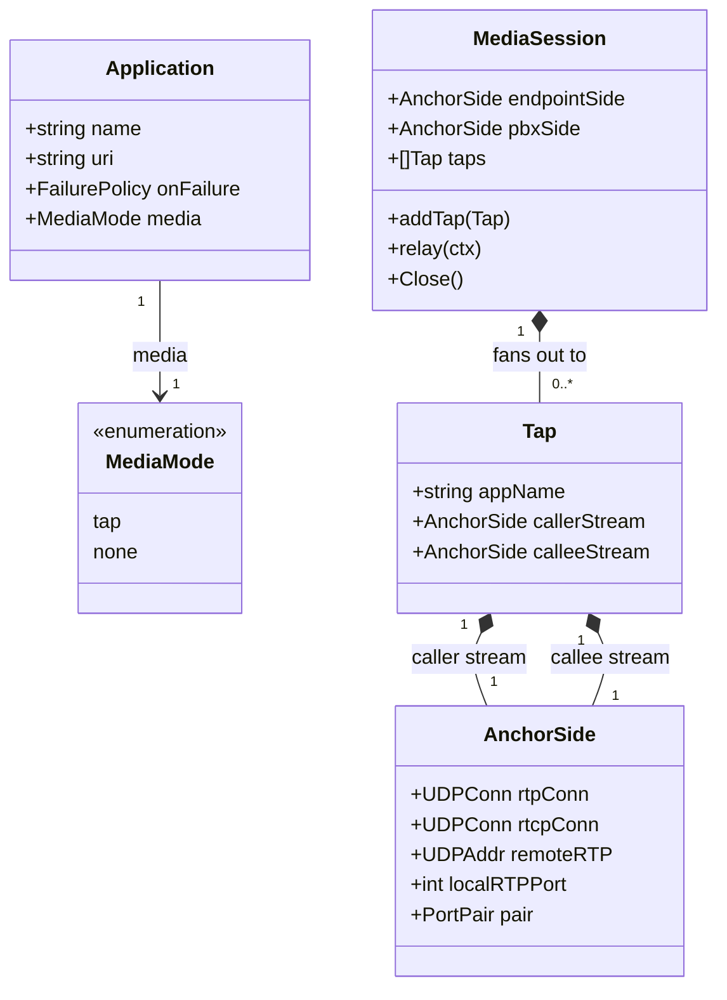

# Media fork to applications (stereo tap) for voipstack-sip-sequencer

> REASONS-Canvas structured prompt for `[STORY-001-010]`. Stack: **Go** + `emiago/sipgo` +
> stdlib `net` UDP. Builds on the story-005 media plane (`media.go`/`sdp.go`). Functional
> core / imperative shell per `AGENTS.md`: SDP synthesis = pure; sockets/relay = edge.
> Go-native — errors as values, no exception-handler classes.
>
> **Resolves story 005's deferred D4** — app-leg media is reworked here: `none` ⇒ inactive,
> `tap` ⇒ dual-`m=` recvonly fork. The serial app-SDP scaffolding is removed.
>
> Confirmed decisions:
> - **D1** stereo = **two recvonly `m=audio` streams** (stream 1 = caller, endpoint→PBX;
>   stream 2 = callee, PBX→endpoint). Not mixed.
> - **D2** two RTP/RTCP **port pairs per tap app** (one per stream) from `PortAllocator`.
> - **D3** `media: none` ⇒ offer the app **`a=inactive`** audio (no RTP, no fork ports).
> - **D4** **relay fan-out**: each call direction writes to the primary far side **plus**
>   zero-or-more tap sinks (N-destination writes).
> - **D5** **RTP-only to taps** (no RTCP to taps); the call's own RTCP still relayed (005).
> - **D6** **multiple tap apps** — independent fan-out; a failing/absent tap never affects
>   the call or other taps.
> - **D7** tap offer **copies the endpoint offer's full audio codec list** (`rtpmap`/`fmtp`)
>   onto both `m=` lines; the app demuxes the live codec **per-packet via RTP payload type**.
>   Seq copies packets opaquely — never parses/transcodes.
> - Add `config.Application.Media` (`tap|none`, default `none`, enum-validated, mirroring
>   `OnFailure`). Tap setup failure (port exhaustion / app rejects) is governed by the app's
>   `on_failure` (skip ⇒ no fork, call continues; abort ⇒ fail call). **Call media is never
>   disrupted by a failing/absent tap.**

## Requirements

Let media-consuming applications hear the call. Add a per-application `media` mode
(`tap`|`none`, default `none`). For a `tap` app, fork the call's audio to it as a
**recvonly two-`m=audio` (stereo) session** — stream 1 = caller audio, stream 2 = callee
audio — by **copying** each anchored call direction byte-for-byte to the app's two streams
(no mixing, no transcoding). For a `none` app, offer `a=inactive` audio and send no RTP.
Allocate fork ports from `rtp.port_range`, release them on teardown, and ensure a failing,
absent, or unallocatable tap never disrupts the endpoint↔PBX call media (the tap's failure
is handled by the app's `on_failure`). Keep every application in the signaling chain
regardless of `media` (signaling and media are orthogonal).

Boundaries: copy-only (no mix/transcode/resample); RTP-only to taps (no tap RTCP); apps are
recvonly observers (no audio injection); SDP-signaled addressing; one audio stream per
direction; UDP. Mid-call tap renegotiation is story 007.

## Entities

Conservative-design notes:
- **Reuse `AnchorSide` as-is** for each tap stream (it already wraps an RTP/RTCP socket pair
  + remote addr). A tap holds two `AnchorSide`s (caller, callee); only its RTP socket is
  used (D5 — RTCP socket may be bound for the allocated pair but is not relayed to the tap).
- **`MediaSession` gains `taps []*Tap`** and an `addTap`; `relay` fans out. `endpointSide`/
  `pbxSide` unchanged. Backward-compatible: zero taps ⇒ identical to story 005 behavior.
- **`config.Application` gains `Media MediaMode`** (default `none`) — mirrors the existing
  `OnFailure` enum+default+validation pattern. No other config change.
- New pure SDP builders in `sdp.go`; no new external dep.
- No DTOs.

## Approach

1. **Config (`internal/config`):**
   - Add `type MediaMode string` with `MediaTap = "tap"`, `MediaNone = "none"`; add
     `Media MediaMode \`yaml:"media"\`` to `Application`.
   - In `applyDefaults`: empty `Media` ⇒ `MediaNone`. In `validate`: `Media` must be `tap`
     or `none`, else error naming the entry + bad value (mirror `OnFailure`).

2. **Pure SDP synthesis (`sdp.go`):**
   - `extractAudioCodecs(callOffer []byte) (mLineFormats string, rtpmaps, fmtps []string,
     err error)` — pull the `m=audio` format list + associated `a=rtpmap:`/`a=fmtp:` lines.
   - `buildTapOffer(callOffer []byte, host string, rtpPort1, rtpPort2 int) ([]byte, error)`
     — synthesize a minimal session SDP: `v=/o=/s=/t=`, then **two** `m=audio <portN>
     RTP/AVP <formats>` blocks, each followed by the copied `rtpmap`/`fmtp` lines and
     `a=recvonly`, `c=IN IP4 <host>`. Stream 1 → rtpPort1 (caller), stream 2 → rtpPort2
     (callee).
   - `buildInactiveOffer(callOffer []byte, host string) ([]byte, error)` — a single
     `m=audio <0-or-port> ... a=inactive` (use `a=inactive`, D3) so the app negotiates no
     RTP.
   - `parseTapAnswer(answer []byte) (s1Host string, s1Port int, s2Host string, s2Port int,
     err error)` — read the app's two `m=audio` remote addrs/ports (in offered order);
     tolerate the app declining a stream (port 0 / missing ⇒ that sink unset).

3. **Relay fan-out (`media.go`):**
   - Add `taps []*Tap` to `MediaSession` + `addTap(*Tap)` (guarded; taps added before
     `relay` starts).
   - Restructure the copy loop to **N destinations**: a `copyUDPFanout(ctx, src *net.UDPConn,
     dsts func() []dest)` that reads once and writes the same buffer to the primary far-side
     remote **and** each tap's stream remote for that direction. Caller direction
     (`endpointSide.rtpConn` read) → `pbxSide.remoteRTP` + each tap's **caller** stream
     remote; callee direction (`pbxSide.rtpConn` read) → `endpointSide.remoteRTP` + each
     tap's **callee** stream remote. RTCP loops unchanged (no tap RTCP — D5).
   - Writes to taps use the tap's own fork socket as source (so the app sees RTP from the
     port seq advertised). **A tap write error/absent remote is logged and skipped — it
     never aborts the primary relay** (D6 + call-sovereign NFR).
   - `Close()` also closes every tap's sockets.

4. **Bridge app-leg rework (`bridge.go`) — replaces the serial scaffolding:**
   - In the app loop, build the app-leg INVITE body by `media`:
     - `none` ⇒ `buildInactiveOffer(call.inbound.offerSDP, mediaHost)`; no ports; no tap.
     - `tap` ⇒ `Acquire()` two pairs (caller, callee); bind two fork `AnchorSide`s on
       `mediaHost`; `buildTapOffer(call.inbound.offerSDP, mediaHost, p1.RTP, p2.RTP)`.
   - **Tap-setup failure** (port exhaustion, bind error, or the app rejecting/timing out) is
     routed through the existing `on_failure` path (skip ⇒ release any acquired ports, no
     tap, continue; abort ⇒ release + fail the call). Never disrupts the call.
   - On the tap app's 2xx: `parseTapAnswer` → set each tap stream's `remoteRTP`; build a
     `Tap{appName, callerStream, calleeStream}`; **stash it on the call** to register once
     `call.media` exists.
   - App answers no longer feed the call's SDP (the call anchor stays inbound-offer→PBX,
     story 005). The serial `offer = appAnswerSDP` chaining is removed.
   - After PBX 2xx and `call.media` creation: `call.media.addTap(tap)` for each stashed tap,
     then `relay` (which now fans out). Packets reach taps once the call media flows.

5. **Teardown (`call.go`):** `MediaSession.Close()` already closing taps; release each tap's
   two port pairs via the allocator (track pairs on the `Tap`/session). Idempotent; releases
   even if the call failed mid-setup.

6. **Errors:** wrap `%w`; `slog` tap failures; tap problems degrade to "no fork" per
   `on_failure`, never panic, never touch the call relay.

## Structure

### Type / function relationships
1. `config.MediaMode` + `Application.Media` (+ default + validate) — `internal/config`.
2. Pure `sdp.go`: `extractAudioCodecs`, `buildTapOffer`, `buildInactiveOffer`,
   `parseTapAnswer` — no I/O, table-tested.
3. `media.go`: `Tap` struct; `MediaSession.taps` + `addTap`; `copyUDPFanout`;
   `Close` extended.
4. `bridge.go`: per-app media-mode branch building the app-leg body + tap setup; tap
   registration after the anchor relay starts.
5. `call.go`: teardown releases tap ports (reuses `MediaSession.Close`).

### Dependencies
1. `bridge.go` → `internal/config` (`Media`), `sdp.go` (build/parse), `media.go`
   (`Acquire`/`AnchorSide`/`Tap`/`addTap`), `Engine.ports`/`mediaHost`.
2. `media.go` → stdlib `net`/`context`/`sync`/`log/slog`.
3. `sdp.go` → stdlib `bytes`/`strings`/`strconv` (pure).
4. `internal/config` → unchanged deps.
5. No new external dependency. `registry.go`, `state.go`, `metrics.go`, `engine.go`
   unchanged (allocator/mediaHost already present).

### Layered architecture (functional core / imperative shell)
1. Edge/shell (`main.go`) — unchanged.
2. SIP + media boundary (`bridge.go`, `media.go`) — app-leg signaling, fork sockets,
   fan-out relay; impure.
3. Pure core (`sdp.go`, `internal/config`) — SDP synthesis/parse, enum default/validate;
   deterministic, table-tested. Full fork verified via real UDP fakes.

> No Controller/Service/GlobalExceptionHandler — tap failures map to `on_failure`
> (skip/abort) inline from wrapped Go errors; the `MetricsSink` (story 004) already records
> app failures.

## Operations

### Update config - Application.Media (internal/config/config.go + test)
1. Add `type MediaMode string`; `const ( MediaTap MediaMode = "tap"; MediaNone = "none" )`.
2. Add `Media MediaMode \`yaml:"media"\`` to `Application` (and the raw decode struct).
3. `applyDefaults`: `if app.Media == "" { app.Media = MediaNone }`.
4. `validate`: `if app.Media != MediaTap && app.Media != MediaNone { error naming entry +
   value }` (mirror the `on_failure` check).
5. Tests: default-none; tap accepted; invalid value rejected; backward-compat (existing
   configs without `media` still load).

### Create pure SDP builders (internal/b2bua/sdp.go + test)
1. `extractAudioCodecs(callOffer) (formats string, rtpmaps, fmtps []string, err)` — first
   `m=audio` format list + its `a=rtpmap:`/`a=fmtp:` lines.
2. `buildTapOffer(callOffer, host, p1, p2) ([]byte, error)` — session preamble + two
   `m=audio` blocks (`recvonly`, copied codec lines), `c=IN IP4 host`. Stream order
   caller(p1)/callee(p2).
3. `buildInactiveOffer(callOffer, host) ([]byte, error)` — single `m=audio` with
   `a=inactive`.
4. `parseTapAnswer(answer) (h1,p1,h2,p2, err)` — two media addrs in order; missing/port-0 ⇒
   that stream unset.
5. Constraints: pure; preserve codec/rtpmap/fmtp verbatim (no transcoding); table-tested.

### Update media plane - fan-out + Tap (internal/b2bua/media.go + test)
1. `type Tap struct { appName string; callerStream, calleeStream *AnchorSide }`.
2. `MediaSession`: add `taps []*Tap`; `addTap(t *Tap)`.
3. Replace `copyUDP` with `copyUDPFanout(ctx, src *net.UDPConn, primary *net.UDPAddr,
   taps func() []*net.UDPAddr, tapSrc func() []*net.UDPConn)` (or equivalent): read once;
   write to primary; write to each present tap remote via its tap socket; skip nil/absent
   sinks; a tap write error is logged, not fatal.
4. Wire caller-direction reads (`endpointSide.rtpConn`) to fan out to each tap's
   `callerStream`; callee-direction reads (`pbxSide.rtpConn`) to each tap's `calleeStream`.
   RTCP loops unchanged (no tap RTCP).
5. `Close()`: also close each tap's two `AnchorSide`s.
6. Constraints: zero taps ⇒ behavior identical to story 005; buffer reuse; `-race`; a tap
   never blocks/aborts the primary relay.

### Rework bridge app-leg media (internal/b2bua/bridge.go)
1. In the app loop, after accepting the app into the chain (signaling unchanged), build the
   INVITE body by `app.Media`:
   - `MediaNone` ⇒ `buildInactiveOffer(call.inbound.offerSDP, e.mediaHost)`.
   - `MediaTap` ⇒ `p1,err := e.ports.Acquire(); p2,err := e.ports.Acquire()` → on exhaustion
     treat as app failure (existing `on_failure` branch: skip ⇒ release + continue; abort ⇒
     release + fail). Bind two fork `AnchorSide`s; `buildTapOffer(...)`.
2. Originate the app leg with that body; existing failure handling (story 004) applies
   verbatim, incl. releasing any acquired tap ports on skip/abort.
3. On app 2xx (tap): `parseTapAnswer(appAnswer)` → set tap stream remotes; build `Tap`;
   stash on the call (e.g. `call.pendingTaps`).
4. Remove the serial `offer = appAnswerSDP` assignment — app answers no longer feed the call
   SDP (the call anchor remains inbound-offer→PBX, endpoint←PBX-answer, story 005).
5. After `call.media` is created (post PBX 2xx): for each stashed tap `call.media.addTap(t)`;
   start `relay` (fan-out). 
6. Constraints: signaling order unchanged; call anchor unchanged; tap failure never disrupts
   the call; ports released on every exit path.

### Update teardown - release tap ports (internal/b2bua/call.go)
1. Ensure `MediaSession.Close()` closes tap sockets (done in media.go) and the allocator
   `Release` is called for each tap pair (track pairs on `Tap`).
2. Release stashed-but-unregistered taps if the call fails before `call.media` exists.
3. Constraints: no port/goroutine leak; idempotent.

### Tests - fork behavior (internal/b2bua/*_test.go + harness)
1. Harness: a fake **tap app** UAS that accepts the dual-`m=` recvonly offer, answers with
   two receive ports, and records RTP received per stream; a fake endpoint + PBX that send
   distinguishable RTP each direction.
2. Behavior tests (Given/When/Then):
   - `TestTapAppReceivesBothCallDirections` (AC1 — caller bytes on stream 1, callee on 2).
   - `TestForkIsByteForByteAndSeparate` (AC2 — received == sent per stream; not mixed).
   - `TestTapIsRecvonlyCallUnaffected` (AC3 — app-sent audio not injected; endpoint↔PBX
     audio intact).
   - `TestMediaNoneAppGetsNoMedia` (AC4 — inactive offer; app receives no RTP; call up).
   - `TestMediaDefaultsToNone` (AC5 — config omits `media`).
   - `TestForkPortsReleasedOnTeardown` (AC6 — soak; ports free after).
   - `TestFailingTapDoesNotDisruptCall` (NFR — tap app down/abruptly gone; call media keeps
     flowing; with `on_failure: skip` the call still completes).
   - `TestPortExhaustionDuringTapHonorsOnFailure` (skip ⇒ no fork+call up; abort ⇒ call
     fails).
   - `TestMultipleTapAppsEachReceiveBothDirections` (D6).
   - Pure: `buildTapOffer`/`buildInactiveOffer`/`parseTapAnswer`/`extractAudioCodecs`
     table tests (codec lines preserved verbatim).
3. Completion: pass under `go test -race ./...`; stories 002–005 tests stay green (zero-tap
   relay unchanged; call anchor unchanged).

## Norms

1. **Style:** SDP synthesis/parse pure in `sdp.go` + config enum in `internal/config`; fork
   sockets + fan-out relay at the `media.go`/`bridge.go` edge. No global state.
2. **Concurrency:** taps added before `relay` starts; fan-out reads once, writes to a
   snapshot of destinations; reuse buffers; per-call goroutines exit on ctx/close; `-race`
   clean; no tap goroutine/port leak.
3. **Call sovereignty:** a tap write error or absent/declined tap sink is logged and
   skipped — it MUST NOT block, slow, or abort the endpoint↔PBX relay (D6/NFR).
4. **Copy-only:** never parse, mix, resample, or transcode packets; copy bytes (PT included)
   opaquely; the app demuxes codec by RTP payload type via the copied rtpmap (D7).
5. **Errors as values:** wrap `%w`; tap-setup failures flow through the existing `on_failure`
   path (story 004) and emit the `MetricsSink.AppFailure` already wired; no panic.
6. **Resource hygiene:** acquire tap pairs → release on every failure/teardown path; close
   tap sockets in `MediaSession.Close`.
7. **Tests (BDD, named by behavior):** real UDP fakes (no internal mocks); pure builders
   table-tested; keep 002–005 green (zero-tap path identical).
8. **Toolchain gate:** `gofmt`, `go vet ./...`, `go build ./...`, `go test -race ./...` clean.
9. **Minimal churn:** edit `internal/config/config.go`, `sdp.go`, `media.go`, `bridge.go`,
   `call.go` + tests. Do NOT change `engine.go`, `registry.go`, `state.go`, `metrics.go`, or
   the call anchor flow (story 005).

## Safeguards

1. **Functional constraints:** a `tap` app receives **both** call directions as **two
   separate recvonly streams** (caller→1, callee→2) over one leg (AC1); each stream is
   **byte-for-byte** identical to the corresponding call direction and **not mixed** (AC2);
   the tap is **recvonly** and anything it sends is **not** injected into the call (AC3); a
   `none`/omitted app is offered `a=inactive` and receives no RTP while the call completes
   (AC4/AC5); fork ports are released on teardown with no leak (AC6).
2. **Call-sovereignty constraint (NFR):** a failing, unreachable, slow, or unallocatable tap
   **never** disrupts the endpoint↔PBX call media; fan-out tolerates missing/declined tap
   sinks; tap-setup failure is handled by the app's `on_failure` (skip ⇒ no fork, call
   continues; abort ⇒ call fails) — exactly as story 004.
3. **Copy-only / no-transcoding constraint:** seq never parses, mixes, resamples, or
   transcodes; it copies opaque RTP (PT included); the tap offer carries the endpoint's full
   codec list so the app resolves the live codec per-packet by payload type. **Tap apps must
   accept the offered codec list; seq never transcodes** — a tap app that declines the
   call's codec is its own responsibility.
4. **Stream-order constraint:** stream 1 = caller (endpoint→PBX), stream 2 = callee
   (PBX→endpoint); fixed and documented so apps can rely on it.
5. **Orthogonality constraint:** every app stays in the signaling chain regardless of
   `media`; `media` controls audio only (PRD §4). Signaling order/behavior unchanged.
6. **RTCP constraint:** no RTCP forwarded to taps (D5); the call's own RTCP relay (story 005)
   is unchanged.
7. **Resource constraints:** two RTP/RTCP pairs per tap from `rtp.port_range`; released on
   every failure/teardown path; `-race` clean toward 100 concurrent calls.
8. **Backward-compat constraint:** zero-tap calls behave identically to story 005; configs
   without `media` load and default to `none`.
9. **Scope constraints (do NOT implement here):** mid-call tap renegotiation / re-INVITE
   (007); RTCP to taps; audio injection/mixing (PRD §8); transcoding; per-codec stream
   splitting (rejected — single 2-stream model with PT demux). Call anchor (005) unchanged.
10. **Error-surface constraints:** errors wrapped `%w`; tap failures degrade per `on_failure`
    and emit the existing failure metric; no internals leaked to peers; no `panic`.
