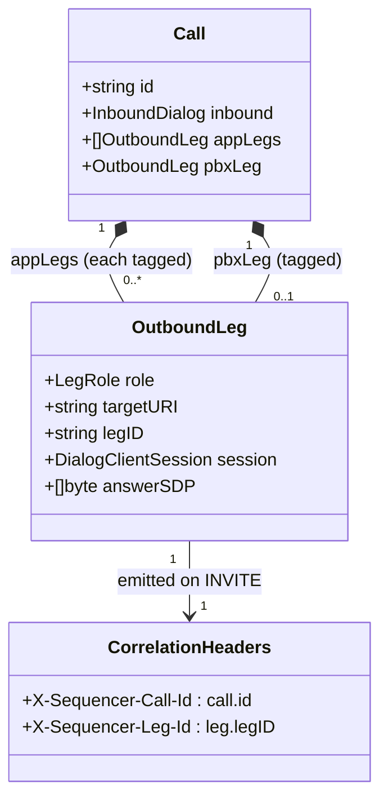

# Correlation ids & X-Sequencer headers for voipstack-sip-sequencer

> REASONS-Canvas structured prompt for `[STORY-001-006]`. Stack: **Go** + `emiago/sipgo`.
> Builds on the implemented `internal/b2bua` (stories 001–005, 010, 011). Functional core /
> imperative shell per `AGENTS.md`. Go-native — errors as values, no exception-handler
> classes. **Small, localized story.**
>
> Confirmed decisions:
> - **D1** use `github.com/google/uuid` (`uuid.NewString()`) for both `newCallID` and
>   `newLegID` (PRD §5 says "UUID"; already an indirect dep; `Call.id` stays an opaque
>   string registry key).
> - **D2** store `legID string` on `OutboundLeg`.
> - **D3** header names exactly `X-Sequencer-Call-Id` / `X-Sequencer-Leg-Id`, informational.
> - Attach both headers at **every outbound INVITE**: each app leg (incl. tap legs, story
>   010) and the PBX leg, via the variadic `headers ...sip.Header` of
>   `dialogCliCache.Invite`.
> - **Exclusions:** inbound dialog gets no header (outbound only); `proxy.go` unmanaged
>   methods (011) get none (not calls); mid-call re-INVITE headers are story 007. Internal
>   SIP `Call-ID`/tags untouched.

## Requirements

Give operators and downstream applications a stable handle to correlate everything
belonging to one call across its many legs. Mint one `call_id` per call (stable across the
whole chain) and a distinct `leg_id` per outbound leg, and carry them as the informational
headers `X-Sequencer-Call-Id` / `X-Sequencer-Leg-Id` on every outbound leg INVITE (each
application — including media-tap legs — and the PBX). The headers are informational: the
sequencer keys nothing on them and the SIP `Call-ID`/tags remain the internal correlation
mapping.

Boundaries: outbound INVITEs only (no inbound-dialog header, no headers on unmanaged
pass-through methods, no mid-call re-INVITE headers — story 007); informational only;
internal SIP identity untouched.

## Entities

Conservative-design notes:
- **`Call.id` unchanged in role** — it is the `call_id`; only its *generator* changes to
  UUID (D1). It stays an opaque string used as the registry key.
- **`OutboundLeg` gains one field `legID string`** (D2). All other fields unchanged.
- **`CorrelationHeaders`** is conceptual — in code it's two `sip.NewHeader(...)` values
  passed to `Invite`, not a struct.
- No config change, no new media/anchor change, no DTOs.

## Approach

1. **UUID ids (`engine.go`):**
   - Change `newCallID()` to `return uuid.NewString()`. Add `newLegID()
     { return uuid.NewString() }`. Import `github.com/google/uuid` (promote from indirect to
     direct in `go.mod`).
2. **Tag each outbound leg (`bridge.go`):**
   - When constructing each `OutboundLeg` (app legs in the chain loop, incl. tap legs; and
     the PBX leg), set `legID: newLegID()`.
   - At each `dialogCliCache.Invite(...)` call site, append the two headers via the variadic
     param:
     `sip.NewHeader("X-Sequencer-Call-Id", call.id)`,
     `sip.NewHeader("X-Sequencer-Leg-Id", leg.legID)`.
   - Mint the `legID` *before* the `Invite` so the same value goes on the wire and onto the
     stored `OutboundLeg`.
3. **Leave everything else alone:** no header on the inbound dialog; `proxy.go` untouched;
   internal SIP `Call-ID`/tags untouched; anchor/media untouched.
4. **Tests:** fake app + fake PBX capture received INVITE headers; assert call_id identical
   across all legs, leg_id distinct per leg + present on every hop (incl. PBX and a tap leg),
   and two separate calls carry different call_ids.

## Structure

### Type / function relationships
1. `newCallID()`, `newLegID()` (`engine.go`) — UUID string generators (pure-ish; wrap
   `uuid.NewString`).
2. `OutboundLeg.legID` (`call.go`) — new field set at leg creation.
3. `bridge.go` — sets `legID` and passes the two `sip.Header`s at each outbound `Invite`.

### Dependencies
1. `engine.go` → `github.com/google/uuid` (now direct).
2. `bridge.go` → `sip.NewHeader`, `newLegID`, `call.id`, `OutboundLeg.legID`.
3. No other package touched (`internal/config`, `proxy.go`, `media.go`, `sdp.go`,
   `registry.go`, `state.go`, `metrics.go` unchanged).

### Layered architecture (functional core / imperative shell)
1. Edge/shell (`main.go`) — unchanged.
2. SIP boundary (`bridge.go`) — header attach at the outbound INVITE edge.
3. Pure-ish core — id minting (`newCallID`/`newLegID`); deterministic uniqueness via UUID.

> No Controller/Service/GlobalExceptionHandler — headers are appended inline; nothing new
> to handle.

## Operations

### Update id generators (internal/b2bua/engine.go)
1. `newCallID() string` → `return uuid.NewString()`.
2. Add `newLegID() string { return uuid.NewString() }`.
3. Add the `github.com/google/uuid` import; `go mod tidy` to promote it to a direct
   require.
4. Constraints: `Call.id` remains an opaque unique string (registry key/teardown unaffected).

### Add leg id field (internal/b2bua/call.go)
1. Add `legID string` to `OutboundLeg`.
2. Constraints: purely additive; existing construction sites set it (next task); zero value
   is harmless if ever unset.

### Tag legs + attach headers (internal/b2bua/bridge.go)
1. Responsibility: emit correlation headers on every outbound INVITE and record `legID`.
2. For each **app leg** (chain loop, both `media: none` and `media: tap` paths):
   - `legID := newLegID()` before originating.
   - `e.dialogCliCache.Invite(ctx, appURI, inviteBody,
     sip.NewHeader("X-Sequencer-Call-Id", call.id),
     sip.NewHeader("X-Sequencer-Leg-Id", legID))`.
   - set `legID` on the `OutboundLeg` when appended.
3. For the **PBX leg**: same — `legID := newLegID()`; pass both headers to the PBX `Invite`;
   store on `call.pbxLeg`.
4. Constraints: same `call.id` on all legs of a call; distinct `legID` per leg; do not add
   headers anywhere else; do not alter SDP/anchor/teardown logic.

### Tests - correlation headers (internal/b2bua/*_test.go)
1. Harness: extend fake app + fake PBX to capture the headers of the INVITE they receive.
2. Behavior tests (Given/When/Then):
   - `TestSameCallIDOnEveryLeg` (AC1 — multi-app chain: all legs share one
     `X-Sequencer-Call-Id`).
   - `TestDistinctLegIDPerLeg` (AC2 — each leg's `X-Sequencer-Leg-Id` differs).
   - `TestDifferentCallsDifferentCallID` (AC3 — two calls ⇒ two call_ids).
   - `TestHeadersOnEveryOutboundHopInclPBX` (AC4 — app legs incl. a tap leg + PBX all carry
     both headers).
   - `TestInternalSIPMappingUnaffected` (AC5 — call still bridges/correlates; SIP `Call-ID`
     per leg still distinct/sipgo-managed).
3. Completion: pass under `go test -race ./...`; stories 002–005/010/011 tests stay green.

## Norms

1. **Style:** id minting tiny/pure-ish (`uuid.NewString`); header attach at the bridge edge;
   no global state.
2. **Naming:** header names exactly `X-Sequencer-Call-Id` / `X-Sequencer-Leg-Id` (verify
   sipgo emits them verbatim).
3. **Informational-only:** the sequencer keys no behavior on these headers; SIP `Call-ID`/
   tags remain the correlation input.
4. **Errors as values:** unchanged; header construction does not introduce error paths
   (`sip.NewHeader` is total). No panic.
5. **Tests (BDD, named by behavior):** real in-memory sipgo fakes capture received headers
   (no internal mocks); keep prior tests green.
6. **Toolchain gate:** `gofmt`, `go vet ./...`, `go build ./...`, `go test -race ./...`
   clean; `go mod tidy`.
7. **Minimal churn:** edit `engine.go`, `call.go`, `bridge.go` + tests; touch nothing else.

## Safeguards

1. **Functional constraints:** every outbound leg of one call carries the **same**
   `X-Sequencer-Call-Id` (AC1); each leg carries a **distinct** `X-Sequencer-Leg-Id` (AC2);
   different calls carry different call_ids (AC3); both headers appear on **every** outbound
   INVITE incl. tap legs and the PBX leg (AC4).
2. **Non-interference constraint:** headers are **informational**; the sequencer keys no
   behavior on them; the internal SIP `Call-ID`/tags mapping is untouched and still
   correlates legs (AC5).
3. **Uniqueness constraint (NFR):** ids are UUIDs (`google/uuid`) — collision-free at the
   target volume.
4. **Scope constraints (do NOT touch):** no header on the inbound dialog (outbound only); no
   `X-Sequencer-*` on `proxy.go` unmanaged methods (011); no mid-call re-INVITE headers
   (007); no SDP/anchor/media/teardown change.
5. **Backward-compat constraint:** `Call.id` stays an opaque unique string — registry key
   and teardown behavior unchanged by the UUID switch; all prior tests stay green.
6. **Technical constraints:** `google/uuid` promoted to a direct dep via `go mod tidy`; two
   header allocations per outbound INVITE (negligible).
7. **Error-surface constraints:** no new error paths; no panic; nothing leaked beyond the
   intended ids.
