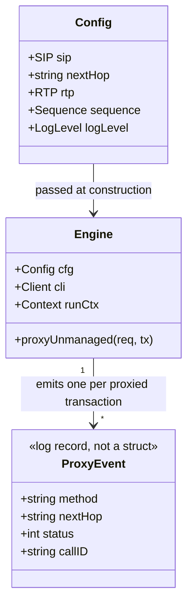

# Minimal success-path logging for the unmanaged-method proxy

> REASONS-Canvas structured prompt for proxy observability. Stack: **Go** + `emiago/sipgo`.
> Builds on the implemented `proxyUnmanaged` handler (`internal/b2bua/proxy.go`,
> story 001-011). Functional core / imperative shell per `AGENTS.md`. Go-native — errors as
> values, structured logging via `log/slog`.
>
> Accepted decisions: **one INFO line per proxied transaction** (on the final outcome),
> not per packet; structured K/V matching existing `slog` calls (`method`, `nextHop`,
> `status`, `callID`); existing **error logs unchanged**; **no new dependency**, no metrics
> sink change. Log level is operator-configurable via the YAML config file (optional field
> `log_level`, default `info`); level is applied once at startup in `main.go` via
> `slog.SetDefault`. Goal: prove the proxy is forwarding and relaying correctly at a glance,
> with the fewest lines that still answer "what came in, where it went, what came back".

## Requirements

Make correct proxy operation observable. Today `proxyUnmanaged` logs only on failure
(`slog.Error`), so a working proxy is silent — an operator cannot confirm forwarding from
the logs. Emit minimal structured logs on the success path: enough to see, per unmanaged
request, that it was received, forwarded to the configured next-hop, and which final status
the next-hop returned. Keep volume low (one line per completed transaction, not per
provisional response) and reuse the existing `slog` conventions so the new lines read like
the rest of the engine.

Allow the operator to tune log verbosity without recompiling. Add an optional `log_level`
field to the YAML configuration file. Valid values are `debug`, `info`, `warn`, `error`;
omitting the field defaults to `info`. The level is applied globally at process startup
in `main.go` using `slog.SetDefault` with a `slog.LevelVar`, before the engine is created.

Boundaries: logging only — no change to forwarding behavior, response routing, status codes,
Max-Forwards handling, or the proxy's statelessness. No new log framework, no metrics.
Does not touch the B2BUA call path (`bridge.go`, `call.go`). Config change is limited to
one optional string field and its default/validation; no other config keys are modified.

## Entities

Conservative-design notes:
- **`LogLevel` is a plain `string` field on `Config`** (type alias `LogLevel string`, same
  pattern as `FailurePolicy` and `MediaMode`). Constants: `LogLevelDebug`, `LogLevelInfo`,
  `LogLevelWarn`, `LogLevelError`. Default applied in `applyDefaults`; validated in
  `validate`. YAML key: `log_level`.
- **`Engine` unchanged.** `Config` carries the level only so `main.go` can read it; the
  engine itself never inspects `LogLevel` — logging behaviour inside handlers is unchanged.
- **No new types beyond `LogLevel string`.** `ProxyEvent` remains a conceptual label — in
  code it is the K/V argument list of one `slog.Info` call, not a struct (YAGNI).
- No DTOs — observability only.

## Approach

1. **Log placement — outcome-oriented, one line per transaction:**
   - Emit a single `slog.Info` when the proxy reaches a **final** outcome for the request,
     carrying the full picture: `method`, `nextHop`, `status`, `callID`. This is the line
     that proves the round trip worked.
   - Do **not** log per provisional (1xx) response — that is the main source of noise and
     adds nothing to "is it working". Provisionals are still relayed exactly as today, just
     not logged.

2. **Cover the meaningful outcomes (still minimal):**
   - **Forwarded + final relayed** (the happy path, includes relayed non-2xx like 403/404
     from the PBX): `slog.Info("proxy forwarded", "method", …, "nextHop", host, "status",
     res.StatusCode, "callID", …)`. One line, on the final response (`res.StatusCode >= 200`).
   - **Max-Forwards loop rejected (483):** `slog.Info("proxy rejected: max-forwards exhausted",
     "method", …, "callID", …)` — visible proof loop protection fired, not an error.
   - **Failure paths stay `slog.Error`/as-is:** the existing parse-next-hop `Error`, the
     `TransactionRequest` send `Error`, and the synthesized `503`/`408` on
     `clientTx.Done()` / `ctx.Done()`. Add a short `slog.Warn`/`Error` on the
     done/timeout branches if they are currently silent, so a failing proxy is never silent
     either — but keep these at one line too.

3. **Field discipline (so logs are greppable and minimal):**
   - Reuse the **exact key names** already in the file/package: `method`, `nextHop`, `err`,
     plus `status` and `callID`. No free-form `fmt.Sprintf` messages for the new success
     lines (the existing line 46 `fmt.Sprintf` is a failure path — leave or optionally
     normalize to K/V, but do not expand scope).
   - `nextHop` value: prefer the parsed `nextHop.HostPort()` already computed, so the logged
     destination is the real address, consistent across lines.
   - `callID`: from `req.CallID()` for correlation with the rest of a SIP trace; if the
     header is absent, omit rather than log an empty string.

4. **Level choice:** success + 483 at **INFO** (operator wants to *see* it working);
   transport/timeout failures at **WARN/ERROR**. No DEBUG-gating for the success line — the
   requirement is that it shows by default. Per-packet relay logging (if ever wanted) belongs
   at DEBUG, but is **out of scope** here.

5. **Log-level wiring — startup only, one place:**
   - `main.go` reads `cfg.LogLevel` after `config.Load`, converts to `slog.Level` via
     `slog.LevelVar.UnmarshalText`, then calls `slog.SetDefault` with a new `TextHandler`
     targeting `os.Stderr`. This happens before `b2bua.New(cfg)` so every log call in the
     engine sees the configured level.
   - The level is static for the process lifetime (no hot-reload). A `slog.LevelVar` is used
     so the handler is properly dynamic if needed later, but mutation after startup is out of
     scope here.

## Structure

### Type / function relationships
1. `Engine.proxyUnmanaged(req, tx)` in `internal/b2bua/proxy.go` — adds `slog.Info`/`Warn`
   calls at the 483 rejection branch, the final-response relay branch, and the
   `clientTx.Done()` / `ctx.Done()` failure branches.
2. `LogLevel` type + constants + `applyDefaults` + `validate` in `internal/config/config.go`
   — adds the optional `log_level` YAML field following the exact same pattern as
   `FailurePolicy` and `MediaMode`.
3. `main` in `cmd/sip-sequencer/main.go` — installs the global slog handler from
   `cfg.LogLevel` before creating the engine.
4. No new functions beyond the type. If the final-status log is needed in more than one
   return point in `proxyUnmanaged`, a tiny local closure may be used (DRY) — only if it
   genuinely removes duplication.

### Dependencies
1. `proxy.go` already imports `log/slog` and `github.com/emiago/sipgo/sip`. No new imports.
2. `config.go` requires no new imports (`log/slog` is NOT imported there — `LogLevel` stays
   a plain string; conversion to `slog.Level` happens in `main.go` only).
3. `main.go` adds `log/slog` and `os` (already present) to its imports. No new external
   dependency.
4. No change to `engine.go`, `bridge.go`, `metrics.go`.

### Layered architecture (functional core / imperative shell)
1. **Edge/shell (`main.go`)** — installs the slog handler; this is an I/O side effect and
   belongs at the outermost shell.
2. **Config boundary (`internal/config/config.go`)** — parses and validates `log_level` as a
   plain string; does not import `slog` (keeps config pure of runtime concerns).
3. **SIP boundary (`proxyUnmanaged`)** — impure; `slog` calls live here, at the I/O edge.
4. **Pure core (`state.go`, SDP)** — unchanged; logging never moves into pure code.

> No Controller/Service/GlobalExceptionHandler — this is structured stdlib logging inside one
> existing handler, plus one optional config field and startup wiring.

## Operations

### Operation 1 — Add LogLevel to config (internal/config/config.go)
1. Responsibility: parse and validate an optional `log_level` field from the YAML config,
   defaulting to `info`, so `main.go` can read a typed value without pulling `slog` into
   the config package.
2. Changes (additions only, no existing logic modified):
   - Declare `type LogLevel string` and constants `LogLevelDebug = "debug"`,
     `LogLevelInfo = "info"`, `LogLevelWarn = "warn"`, `LogLevelError = "error"` — same
     pattern as `FailurePolicy`.
   - Add field `LogLevel LogLevel` with YAML tag `log_level` to the `Config` struct and
     mirror it in `rawConfig`.
   - In `applyDefaults`: if `cfg.LogLevel == ""`, set it to `LogLevelInfo`.
   - In `validate`: reject any `LogLevel` value that is not one of the four constants;
     error message format: `invalid log_level %q (want "debug", "info", "warn", or "error")`.
3. Constraints: no import of `log/slog`; `LogLevel` stays a plain string type; the field is
   optional (omitting it is valid and defaults to `info`); unknown YAML keys still fail
   (strict decoder unchanged).
4. Completion criteria: `config.Parse` accepts YAML with `log_level: debug` and returns
   `cfg.LogLevel == LogLevelDebug`; omitting `log_level` returns `cfg.LogLevel == LogLevelInfo`;
   an invalid value like `log_level: verbose` returns an error naming the bad value.

### Operation 2 — Wire slog in main (cmd/sip-sequencer/main.go)
1. Responsibility: install the global slog handler with the operator-configured level before
   the engine starts, so all engine log calls (INFO proxy lines, WARN/ERROR failures) respect
   the configured threshold.
2. Changes (additions only, after `cfg` is loaded and before `b2bua.New`):
   - Declare a `slog.LevelVar` and call its `UnmarshalText` method with
     `[]byte(cfg.LogLevel)` to set the level.
   - Call `slog.SetDefault` with a new `slog.Logger` wrapping a `slog.NewTextHandler`
     targeting `os.Stderr` with `slog.HandlerOptions{Level: &lvl}`.
   - If `UnmarshalText` returns an error (should not happen given config validation, but
     treat it defensively), write the error to `os.Stderr` and `os.Exit(1)`.
3. Constraints: this block is inserted between `config.Load` and `b2bua.New`; no other
   changes to `main.go`; no new flags or env vars; text handler format (not JSON) consistent
   with current default output.
4. Completion criteria: running with `log_level: warn` in the YAML suppresses INFO proxy
   lines; running with `log_level: debug` shows them; the default (`log_level` omitted)
   behaves identically to the previous default (INFO shown, DEBUG hidden).

### Operation 3 — Update handler (internal/b2bua/proxy.go)
1. Responsibility: emit minimal structured logs proving correct proxy operation, without
   altering forwarding behavior.
2. Signature: unchanged — `func (e *Engine) proxyUnmanaged(req *sip.Request, tx sip.ServerTransaction)`.
3. Logic (additions only):
   - **483 branch** (Max-Forwards present and `0`, before responding 483):
     `slog.Info("proxy rejected: max-forwards exhausted", "method", req.Method, "callID", req.CallID())`.
   - **Final-response relay** — inside the `for`/`select` response loop, where
     `res.StatusCode >= 200` triggers `return`, log once before responding:
     `slog.Info("proxy forwarded", "method", req.Method, "nextHop", nextHop.HostPort(), "status", res.StatusCode, "callID", req.CallID())`.
   - **Provisional responses (`< 200`)**: relayed as today, **not logged**.
   - **`clientTx.Done()` branch** (currently synthesizes `503`): if silent, add
     `slog.Warn("proxy: next-hop gave no final response", "method", req.Method, "nextHop", nextHop.HostPort(), "callID", req.CallID())`.
   - **`ctx.Done()` branch** (currently synthesizes `408`): optional one-line `slog.Warn`
     for shutdown/timeout, same key style. Keep it minimal; do not double-log.
   - Leave the existing parse-error `slog.Error` (line 36) and send-error log (line 46) as-is
     (optionally normalize line 46 to K/V `slog.Error("proxy: forward failed", "method",
     req.Method, "nextHop", e.cfg.NextHop, "err", err)` — only if it does not widen scope).
4. Constraints: exactly one log line per terminal outcome; reuse key names
   `method`/`nextHop`/`status`/`callID`/`err`; no behavior change; no new state; `callID`
   omitted when the header is absent.
5. Completion criteria: a successful REGISTER/OPTIONS forward produces exactly one
   `level=INFO msg="proxy forwarded"` line with non-empty `method`, `nextHop`, and a `status`
   matching the PBX response; a Max-Forwards:0 request produces one INFO rejection line and
   no "forwarded" line; provisional-only traffic produces no extra lines until a final
   arrives.

### Operation 4 — Tests: config log_level field (internal/config/config_test.go)
1. Responsibility: assert the `log_level` field is parsed, defaulted, and validated correctly,
   driven by behavior.
2. Behavior tests (Given/When/Then, named by behavior):
   - `TestParseAcceptsExplicitLogLevel` — Given YAML with `log_level: warn`; Then
     `cfg.LogLevel == LogLevelWarn` and no error.
   - `TestParseDefaultsOmittedLogLevelToInfo` — Given YAML without `log_level`; Then
     `cfg.LogLevel == LogLevelInfo`.
   - `TestParseFailsOnInvalidLogLevel` — Given `log_level: verbose`; Then error containing
     `"verbose"`.
3. Completion: pass under `go test -race ./...`; all existing config tests stay green.

### Operation 5 — Tests: proxy logging behavior (internal/b2bua/proxy_test.go)
1. Responsibility: assert the proxy emits the right minimal lines on the right outcomes,
   driven by behavior (not by counting bytes).
2. Harness: reuse the existing `fakePBXSimple` / `fakeUACSimple`. Capture log output by
   installing a test `slog.Handler` writing to a `bytes.Buffer` (or a small record-collecting
   handler) for the duration of the test; restore the default after.
3. Behavior tests (Given/When/Then, named by behavior):
   - `TestProxyLogsForwardedOutcome` — Given engine in front of PBX returning 200; When UAC
     sends OPTIONS; Then exactly one INFO record `msg="proxy forwarded"` with
     `method=OPTIONS`, `status=200`, and `nextHop` = PBX addr is emitted.
   - `TestProxyLogsRelayedNon2xx` — Given PBX returns 403; Then the single forwarded line
     carries `status=403` (proves non-2xx is still "working", logged once).
   - `TestProxyLogsMaxForwardsRejection` — Given Max-Forwards:0; Then one INFO
     `msg="proxy rejected: max-forwards exhausted"` and **no** `proxy forwarded` line.
   - `TestProxyDoesNotLogProvisionals` — Given PBX sends 100 then 200; Then only one
     forwarded line (status=200), proving provisionals are not logged.
4. Completion: pass under `go test -race ./...`; all existing 001-011 proxy tests stay green
   (logging is additive — no behavioral assertion changes).

## Norms

1. **Style:** logging at the SIP boundary only; reuse the package's `slog` K/V idiom; no
   global state, no new struct, no metrics seam.
2. **Key names (consistency):** `method`, `nextHop`, `status`, `callID`, `err` — the same
   keys already used in `proxy.go`/`bridge.go`. New success messages are short, lowercase,
   space-separated, action-first: `"proxy forwarded"`, `"proxy rejected: …"`.
3. **Levels:** INFO for success and intentional rejections (483) the operator wants to see;
   WARN/ERROR for transport failure, no-final-response, unparseable next-hop; never INFO for
   a failure, never ERROR for a normal rejection.
4. **Minimal volume:** exactly one line per terminal outcome; no per-provisional, no
   per-packet, no entry+exit pair. Any verbose relay logging is DEBUG and out of scope.
5. **No leakage:** log `method`/`nextHop`/`status`/`callID` only — do not log full message
   bodies, SDP, credentials, or `Authorization` headers.
6. **Errors as values:** unchanged; logging does not replace returning/handling — failure
   branches still produce the correct SIP status to the peer.
7. **Tests (BDD):** assert behavior via a captured `slog.Handler` for proxy tests; standard
   table-driven tests for config parsing; real in-memory sipgo fakes only (no internal
   mocks); keep existing proxy and config tests as regression.
8. **Toolchain gate:** `gofmt`, `go vet ./...`, `go build ./...`, `go test -race ./...` clean.
9. **Minimal churn:** proxy logging edits confined to `proxy.go` + additive tests in
   `proxy_test.go`; log-level config edits confined to `config.go` + additive tests in
   `config_test.go`; startup wiring confined to `main.go`. Do not touch `engine.go`,
   `bridge.go`, `metrics.go`.

## Safeguards

1. **Observability constraint:** a successful unmanaged-method forward MUST produce exactly
   one INFO line containing `method`, `nextHop`, and the relayed `status`; a working proxy is
   no longer silent.
2. **Minimalism constraint:** no more than one log line per completed transaction on the
   success path; provisional (1xx) responses produce zero log lines; no entry/exit double
   logging.
3. **Behavior-invariance constraint:** forwarding, Via stripping, Max-Forwards decrement,
   response routing, statelessness, and all SIP status codes returned to peers are byte-for-
   byte unchanged; only `slog` calls are added.
4. **Level-correctness constraint:** INFO is used only for success and the 483 rejection;
   transport/timeout/parse failures remain WARN/ERROR; no normal flow logs at ERROR.
5. **Silence-on-failure constraint:** the `clientTx.Done()` / `ctx.Done()` branches are not
   left silent — each terminal failure outcome emits exactly one WARN/ERROR line so a broken
   next-hop is diagnosable from logs alone.
6. **Privacy/security constraint:** logged fields are limited to method, next-hop address,
   status, and Call-ID; no message bodies, SDP, or auth material is logged.
7. **Field-integrity constraint:** `callID` is omitted (not logged as empty) when the header
   is absent; `nextHop` uses the parsed host:port actually targeted.
8. **Concurrency/perf:** `-race` clean; `slog` calls are cheap and add negligible latency to
   the stateless forward (NFR).
9. **Log-level config constraint:** `log_level` is optional; omitting it MUST produce the
   same default behaviour as before this change (INFO threshold). Valid values are exactly
   `debug`, `info`, `warn`, `error`; any other value MUST be rejected at config parse time
   with an error naming the bad value. The config package MUST NOT import `log/slog`.
10. **Startup-only wiring constraint:** the slog default handler is installed exactly once, in
    `main.go`, between `config.Load` and `b2bua.New`. No other file calls `slog.SetDefault`.
    No hot-reload, no per-request level switching, no env-var override.
11. **Scope constraints (do NOT implement here):** per-packet/DEBUG relay tracing,
    metrics/Prometheus counters, log sampling/rotation, JSON log format toggle, changes to
    the B2BUA call-path logging. `engine.go`, `bridge.go`, `metrics.go` unchanged.
12. **Regression constraint:** all existing 001-011 proxy behavior tests and all existing
    config tests remain green; changes are purely additive.
