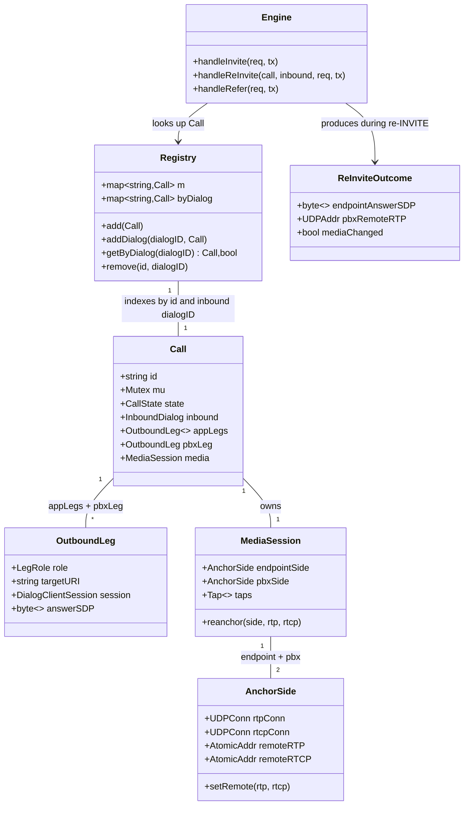

# Mid-call signaling (re-INVITE / hold / REFER) for the B2BUA sequencer

> REASONS-Canvas implementation prompt for `[STORY-001-007]` of `voipstack-sip-sequencer`
> module-001. Source analysis: `spdd/analysis/GGQPA-XXX-202606071200-[Analysis]-mid-call-signaling.md`.
> Stack: Go 1.23, `github.com/emiago/sipgo@v1.4.0`. Follow `AGENTS.md` — functional core,
> side-effects at the edges, errors as values, mock only external services, `-race` clean.

## Requirements

Make established calls behave correctly under common mid-call SIP events **without
re-sequencing the application chain**:

- Propagate an endpoint **re-INVITE** (changed SDP, including hold/resume direction
  attributes) through the **existing PBX leg** and re-anchor the media relay, reusing the
  legs already built at setup.
- Pause media on **hold** (`a=sendonly`/`a=inactive`/`c=0.0.0.0`) and restore it on
  **resume** (`a=sendrecv` + real address) over the same anchored sockets.
- Handle **REFER** at the edge: re-point the endpoint leg to the transfer target while the
  application and PBX chain legs stay in place; do not reissue the correlation `call_id`.
- Guarantee that **no mid-call event re-runs the chain** (`cfg.Sequence` is never re-entered
  and `appLegs` membership/order never changes).

Boundary: endpoint-initiated events; UDP; audio only; no transcoding; no UPDATE/PRACK; no
attended-transfer / transfer-progress beyond what the dialog layer requires; no `call_id`
reissue across the transfer's new SIP `Call-ID` (PRD §8).

## Entities

Conservative note: **no new heavy types beyond `ReInviteOutcome` (a small value returned by
the pure re-anchor planner).** `AnchorSide.remoteRTP/remoteRTCP` change from bare
`*net.UDPAddr` to an atomically-swappable holder (`atomic.Pointer[net.UDPAddr]`) so the
relay can read a live value race-free; everything else extends existing structs.

## Approach

1. **In-dialog vs initial INVITE routing (AC5 guard):**
   - In `handleInvite`, first call `e.dialogSrvCache.MatchDialogRequest(req)`. On
     `nil` error a dialog already exists → it is an in-dialog **re-INVITE**; dispatch to
     `handleReInvite` with the matched `*DialogServerSession` and the `Call` found via
     `Registry.getByDialog(session.ID)`. On `ErrDialogDoesNotExists` → fall through to the
     existing initial-INVITE path (`ReadInvite` → new `Call` → `bridge`).
   - The mid-call path **never** touches `e.cfg.Sequence`; `appLegs` is read-only there.

2. **Re-INVITE propagation (AC1/AC2/AC3):**
   - Pure planning in `sdp.go`/a new pure helper: from the endpoint's new offer, derive the
     new endpoint media address (`parseMedia`) and the PBX-facing re-offer
     (`rewriteToAnchor` onto the existing PBX anchor port — preserves `a=` direction lines
     verbatim, so hold/resume and codec changes ride through unchanged).
   - Edge: drive an in-dialog re-INVITE on the PBX leg with
     `pbxLeg.session.Do(ctx, reInvite)` (a `sip.INVITE` request carrying the anchored
     re-offer body), then `Ack`. The in-dialog Request-URI is the PBX 200's `Contact`; if a
     non-compliant PBX answered the original INVITE without one, respond `500` to the re-INVITE
     and leave the established call/media untouched rather than dereference a nil Contact and
     panic. Parse the PBX answer (`parseMedia`) for its possibly-new remote address.
   - Re-anchor the media relay in place: `MediaSession.reanchor(endpointSide, newEpAddr…)`
     and `reanchor(pbxSide, newPbxAddr…)` swap the atomic remote addresses; hold/resume is
     a natural consequence (on hold the holding side stops sending RTP; the relay simply has
     nothing to copy — no special "pause" flag needed in v1).
   - Answer the endpoint on the matched inbound session with the PBX answer rewritten onto
     the endpoint anchor port (`rewriteToAnchor`), via `inbound.RespondSDP`/`Respond(200,…)`.
   - No-SDP / unchanged re-INVITE (session refresh): skip re-anchor, re-answer with the
     current anchored endpoint SDP.

3. **Live media re-anchor (non-functional: no audible gap):**
   - Replace the snapshot-at-start address read in `copyUDPFanout`/`copyUDP` with a
     per-iteration `AtomicAddr.Load()`; `setRemote` does `Store`. Sockets and goroutines stay
     up across a re-INVITE — only the destination changes — so there is no port churn and no
     relay teardown. `go test -race` must stay clean.

4. **REFER edge handler (AC4):**
   - Register `e.srv.OnRefer(e.handleRefer)` in `Run`. Match the dialog → `Call`; require
     `stateEstablished`. Respond `202 Accepted`, parse `Refer-To`, originate a new
     endpoint-side leg toward the transfer target, and on its 2xx re-anchor `endpointSide`
     to the new target's media address. The **app legs and PBX leg are untouched**; the old
     endpoint leg is BYE'd. Emit the minimal `NOTIFY` (`message/sipfrag` `200 OK`) the
     referrer expects, then leave the transferred call running. The correlation `call_id`
     stays the same `Call` (no reissue).

5. **Concurrency / lifecycle:**
   - All `Call` field reads/writes stay under `call.mu`. A mid-call event arriving in
     `stateTearingDown` is rejected with `481 Call/Transaction Does Not Exist` (matching the
     existing unknown-BYE behaviour). Glare (simultaneous re-INVITE) is serialized by the
     mutex; the loser gets a clean `491 Request Pending` or is sequenced after the winner.

## Structure

### Inheritance / interfaces
1. No new interfaces. Reuse sipgo `*DialogServerSession` (embeds `Dialog`, exposes `.ID`,
   `RespondSDP`, `Respond`, `Do`, `TransactionRequest`) and `*DialogClientSession`
   (`Do`, `Ack`, `Bye`).
2. `AnchorSide` gains `atomic.Pointer[net.UDPAddr]` remote holders — an internal change, no
   new interface.

### Dependencies
1. `Engine.handleInvite` depends on `dialogSrvCache.MatchDialogRequest` and `Registry`.
2. `Engine.handleReInvite` depends on `Call` (read appLegs, mutate media), the PBX
   `OutboundLeg.session`, the pure SDP helpers, and `MediaSession.reanchor`.
3. `Engine.handleRefer` depends on `Registry`, `dialogCliCache.Invite`, `MediaSession`, and
   `OutboundLeg`/`teardown` discipline for the swapped endpoint leg.
4. `MediaSession.reanchor` depends only on `AnchorSide.setRemote` (no SIP knowledge).

### Layered placement (Go packages, not MVC layers)
1. Edge / I/O — `engine.go` (handler registration + routing), new `midcall.go`
   (`handleReInvite`), new `refer.go` (`handleRefer`): all sipgo + socket side-effects.
2. Pure core — `sdp.go` (existing `parseMedia`/`rewriteToAnchor`, plus a pure
   `planReInvite` helper if extracted), `state.go` (state guards). No I/O, fully unit-testable.
3. Media — `media.go` (`AnchorSide.setRemote`, `MediaSession.reanchor`, atomic remote read in
   copy loops).
4. Registry — `registry.go` (secondary dialog-ID index).
5. Error handling — Go idiom: functions return `error`; handlers log via `slog` and respond
   with the mapped SIP status. No exception layer.

## Operations

### Update — `internal/b2bua/registry.go`
1. Responsibility: also index calls by their inbound SIP dialog ID so mid-call requests can
   find the owning `Call`.
2. Attributes: add `byDialog map[string]*Call` (init in `Engine.New` alongside `m`).
3. Methods:
   - `addDialog(dialogID string, c *Call)`: store under lock.
   - `getByDialog(dialogID string) (*Call, bool)`: read under lock.
   - `remove(id, dialogID string)`: delete from both maps under lock (update `teardown` /
     callers to pass the inbound dialog ID; tolerate empty `dialogID`).
4. Constraints: all access under `r.mu`; never hold `r.mu` while calling into a `Call`.

### Update — `internal/b2bua/engine.go`
1. Responsibility: route initial vs in-dialog INVITE and register the REFER handler.
2. In `Run`, add `e.srv.OnRefer(e.handleRefer)` (before `OnNoRoute`).
3. In `handleInvite`, before `ReadInvite`:
   - `dss, err := e.dialogSrvCache.MatchDialogRequest(req)`
   - if `err == nil`: look up `call, ok := e.calls.getByDialog(dss.ID)`; if `ok` →
     `e.handleReInvite(call, dss, req, tx); return`. If `!ok` respond `481` and return.
   - else (dialog does not exist) → existing initial path; after `ReadInvite` succeeds,
     also `e.calls.addDialog(dss.ID, call)`.
4. Logic notes: keep `handleInvite` synchronous for the initial path (the existing
   `TerminateGracefully` race comment still holds); the re-INVITE branch returns promptly
   after answering.

### Create — `internal/b2bua/midcall.go` — `handleReInvite`
1. Responsibility: propagate an in-dialog re-INVITE to the PBX leg and re-anchor media,
   never re-running the chain.
2. Method: `handleReInvite(call *Call, inbound *sipgo.DialogServerSession, req *sip.Request, tx sip.ServerTransaction)`
   - Input validation / guards:
     - `call.mu.Lock()`; if `call.state != stateEstablished` → respond `481`, unlock, return.
     - Snapshot `pbxLeg.session`, `media`, current endpoint anchor port, PBX anchor port;
       unlock before SIP/socket I/O.
   - Body handling:
     - If `req.Body()` is empty → re-answer with the current anchored endpoint SDP
       (`inbound.RespondSDP(currentEpSDP)`); return (no re-anchor).
     - Else parse new endpoint media (`parseMedia`) and build the PBX re-offer
       (`rewriteToAnchor(newOffer, mediaHost, pbxAnchorPort)`).
   - PBX re-INVITE (edge):
     - Build `reInvite := sip.NewRequest(sip.INVITE, …)` with the anchored re-offer body and
       relayable headers; `res, err := pbxLeg.session.Do(ctx, reInvite)`.
     - On non-2xx / error → respond the mapped status to the endpoint (reuse
       `mapFailureStatus`); do **not** teardown the call for a transient re-INVITE failure —
       leave the existing media running. Log via `slog`.
     - On 2xx → `pbxLeg.session.Ack(ctx)`; `parseMedia(res.Body())` for the new PBX address.
   - Re-anchor: `media.reanchor(media.endpointSide, newEpRTP, newEpRTCP)` and
     `media.reanchor(media.pbxSide, newPbxRTP, newPbxRTCP)` under `call.mu`. Store updated
     `pbxLeg.answerSDP`.
   - Answer endpoint: `inbound.Respond(200, "OK", rewriteToAnchor(pbxAnswer, mediaHost, epAnchorPort), relayableResponseHeaders(res, epAnswer)...)`.
3. Constraints: tap (app) legs are not re-INVITE'd; `appLegs` untouched; no `cfg.Sequence`
   access. Returns promptly; does not block on `ctx.Done()`.

### Create — `internal/b2bua/refer.go` — `handleRefer`
1. Responsibility: edge transfer — re-point the endpoint leg, keep chain legs.
2. Method: `handleRefer(req *sip.Request, tx sip.ServerTransaction)`
   - Match dialog → `Call` via `dialogSrvCache.MatchDialogRequest` + `getByDialog`; if not
     found or not `established` → `481`/`403` as appropriate, return.
   - Respond `202 Accepted` on the referrer transaction.
   - Parse `Refer-To` target URI; originate a new endpoint-facing leg
     (`dialogCliCache.Invite`) carrying an anchored offer on the existing endpoint anchor
     port (reuse setup SDP-build helpers).
   - On 2xx: `parseMedia` the answer; `media.reanchor(media.endpointSide, newTargetRTP…)`;
     swap `call.inbound`'s effective remote to the new leg; BYE the old endpoint leg; send
     the minimal `NOTIFY` `message/sipfrag` `SIP/2.0 200 OK` to the referrer.
   - On failure: `NOTIFY` a failure sipfrag; leave the original call intact (best-effort,
     must not drop the established call).
3. Constraints: app legs and PBX leg untouched; same `Call.id` (no `call_id` reissue);
   release any ports/dialogs on a failed re-point (reuse `teardown`/release discipline).

### Update — `internal/b2bua/media.go` — live re-anchor
1. `AnchorSide`: change `remoteRTP`/`remoteRTCP` to `atomic.Pointer[net.UDPAddr]` (or keep
   fields but guard with a small `sync.Mutex`); add `setRemote(rtp, rtcp *net.UDPAddr)` and a
   `loadRemoteRTP()/loadRemoteRTCP()` accessor.
2. `copyUDPFanout` / `copyUDP`: load the destination via the accessor **each iteration**
   instead of capturing it once at relay start; tolerate a `nil` destination (drop until set,
   e.g. hold with `0.0.0.0`).
3. `MediaSession.reanchor(side *AnchorSide, rtp, rtcp *net.UDPAddr)`: call `side.setRemote`.
   No socket rebind, no goroutine restart.
4. Constraints: `go test -race` clean; existing setup-time wiring (`epSide.remoteRTP = …`)
   migrates to `setRemote`.

### Update — `internal/b2bua/call.go` — teardown
1. `teardown` removes from `Registry` by both `id` and inbound dialog ID; tolerate a call
   that was never dialog-indexed (initial setup failure).

## Norms
1. **Package layout:** edge handlers in `engine.go`/`midcall.go`/`refer.go`; pure SDP/state
   helpers stay in `sdp.go`/`state.go`. Side effects live only at the edge per `AGENTS.md`.
2. **Errors are values:** every fallible function returns `error`; wrap with
   `fmt.Errorf("...: %w", err)`. Handlers log with `slog` (structured key/values, include
   `callID`) and translate to a SIP status — there is no exception/`GlobalExceptionHandler`
   analogue in Go.
3. **SIP status mapping:** reuse `mapFailureStatus`; in-dialog "not found / wrong state" →
   `481`; transient PBX re-INVITE failure → relay the PBX status to the endpoint without
   tearing the call down; glare → `491 Request Pending`.
4. **Concurrency:** all `Call` state under `call.mu`; never hold `call.mu` or `Registry.mu`
   during blocking SIP/socket I/O — snapshot, unlock, act, re-lock to commit. Media remote
   addresses are swapped atomically.
5. **SDP purity:** reuse `parseMedia`/`rewriteToAnchor`; do not re-parse codecs or strip
   `a=` lines — direction attributes must pass through verbatim.
6. **Naming / BDD tests:** behavior-named tests (`TestReInvitePropagatesToPBXLeg`,
   `TestHoldPausesMedia`, `TestResumeRestoresMedia`, `TestReInviteDoesNotRerunChain`,
   `TestReferRepointsEndpointLegKeepsChain`), Given/When/Then bodies, one behavior each.
7. **Mocking:** only external peers are faked (in-memory sipgo UAS/UAC + UDP echo for RTP);
   no internal mocks; `MediaSession`/`Registry`/SDP helpers tested through real code.
8. **gofmt / go vet clean; `go test -race ./...` green.**

## Safeguards
1. **No chain re-run (AC5):** `cfg.Sequence` is referenced only by `bridge`; `handleReInvite`
   and `handleRefer` must not import or iterate it, and must not append/reorder `appLegs`.
   Assert in a test that the app-leg count and order are unchanged after a re-INVITE/REFER.
2. **Reuse legs (AC1–AC3):** propagation uses the existing `pbxLeg.session`; no new PBX leg
   is originated on re-INVITE.
3. **Hold/resume correctness:** `a=sendonly`/`a=inactive`/`c=0.0.0.0` propagate to the PBX
   leg and the relay stops copying that direction; resume restores `a=sendrecv` + real
   address and copying resumes — verified by asserting RTP flow pauses then resumes.
4. **REFER edge-only (AC4):** after transfer, `appLegs` and `pbxLeg` are the same objects;
   only the endpoint-facing leg/media remote changed; `Call.id` unchanged.
5. **No `call_id` reissue (PRD §8):** `X-Sequencer-Call-Id` is not regenerated on any
   mid-call event.
6. **Concurrency safety:** `go test -race ./...` passes with concurrent re-INVITE + relay;
   mid-call events during `tearingDown` are rejected, not crashed.
7. **Non-functional timing:** re-anchor is an atomic address swap (no socket rebind / relay
   restart) so there is no audible gap beyond the hold pause itself.
8. **No transcoding:** renegotiated codecs propagate byte-for-byte; the relay stays
   codec-agnostic.
9. **Scope fence:** UPDATE/PRACK, attended transfer, PBX-initiated re-INVITE symmetry, and
   transfer-progress beyond minimal `NOTIFY` are out of scope for this story.
