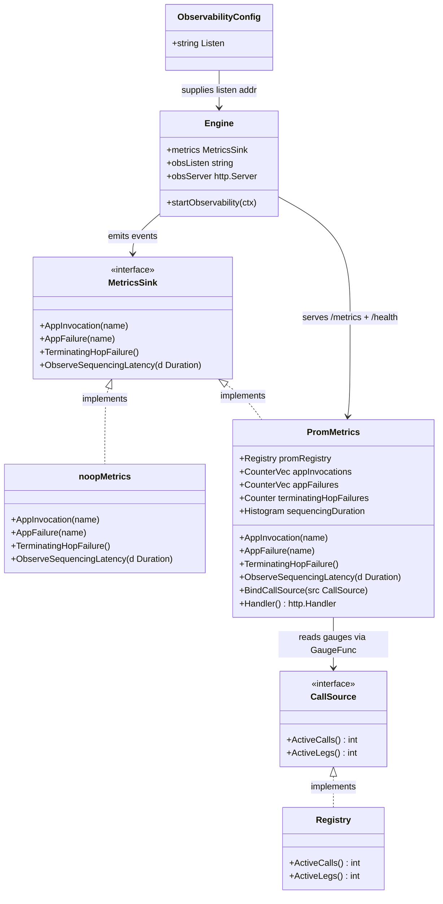

# Observability — Prometheus metrics & health endpoint for the B2BUA sequencer

> REASONS-Canvas implementation prompt for `[STORY-001-008]` of `voipstack-sip-sequencer`
> module-001. Source analysis: `spdd/analysis/GGQPA-XXX-202606071230-[Analysis]-observability.md`.
> Stack: Go 1.23, `github.com/emiago/sipgo@v1.4.0`, **add** `github.com/prometheus/client_golang`
> (≈v1.23.x — verified fetchable). Follow `AGENTS.md` — functional core, side-effects at the
> edges, errors as values, mock only external services, `-race` clean, YAGNI.

## Requirements

Expose the sequencer's runtime behaviour so operators can monitor and alert in production:

- Publish a Prometheus `/metrics` endpoint with the PRD §9 metric set: active calls, active
  legs, per-application invocation count (labelled by app `name`), per-application failure
  count (labelled), terminating-hop failure count, and sequencing latency.
- Publish a `/health` endpoint reporting process liveness.
- Drive the counters/histogram from the existing call-handling flow via the established
  `MetricsSink` seam, and drive the gauges live from the call `Registry`.

Boundary: single instance, per-instance metrics (no aggregation); liveness only (no
readiness); no dashboards/alerting rules/tracing/persistence; the metrics server must not
measurably degrade call handling at 100 concurrent calls (PRD §9). Observability is **opt-in
by config**: with no `observability.listen` configured the engine runs exactly as today
(`noopMetrics`, no HTTP server).

## Entities

Conservative note: the only widened existing type is the `MetricsSink` **interface** (one
method → four) and its `noopMetrics` default; `Registry` gains two read methods
(`ActiveCalls`, `ActiveLegs`) — `ActiveCalls` is the current `len()` renamed/wrapped. New
code (`PromMetrics`, `CallSource`, the HTTP server, the config key) is additive and isolated.

## Approach

1. **Metrics seam (events) — widen `MetricsSink`, keep the pattern:**
   - Expand `MetricsSink` to `AppInvocation(name)`, `AppFailure(name)` (existing),
     `TerminatingHopFailure()`, `ObserveSequencingLatency(time.Duration)`. `noopMetrics`
     implements all as no-ops and stays the engine default, so existing tests need no backend.
   - Add the three missing emit points in `bridge` (invocation on successful app-leg ACK,
     terminating-hop failure on PBX-leg failure, latency observation at endpoint answer);
     the six existing `AppFailure` sites are unchanged.

2. **Gauges (state) — collect-on-scrape from the Registry, not push:**
   - `Registry` exposes `ActiveCalls()` (= `len()`) and `ActiveLegs()` (sum of
     inbound + `appLegs` + `pbxLeg` across live calls). `PromMetrics.BindCallSource` registers
     Prometheus `GaugeFunc`s that read these on each scrape. This makes the active-calls gauge
     **impossible to leak** (it always reflects the live map), satisfying AC1 across teardown
     without manual inc/dec.

3. **Prometheus backend + HTTP surface:**
   - `PromMetrics` owns a private `*prometheus.Registry` and registers the counters/histogram
     against it; `Handler()` returns `promhttp.HandlerFor(reg, …)`. Using a private registry
     (not the global default) keeps tests isolated and parallel-safe.
   - The HTTP server lives **inside the engine lifecycle**: `Engine.startObservability` (called
     from `Run` when `obsListen != ""`) serves `/metrics` (→ `PromMetrics.Handler()`) and
     `/health` (→ `200 ok`) on its own goroutine, off the SIP/relay path. It is bound to the
     engine context and stopped in `Shutdown` (graceful `http.Server.Shutdown`).

4. **Injection / wiring:**
   - Add a functional option `WithMetrics(MetricsSink) Option` to `b2bua.New(cfg, opts…)` so
     `main.go` installs a real sink while existing `New(cfg)` callers/tests are unaffected.
   - `Engine` reads `cfg.Observability.Listen` into `obsListen`. `main.go`: if the listen addr
     is set, build a `PromMetrics`, pass it via `WithMetrics`, and the engine binds it to its
     `Registry` and serves; otherwise the engine uses `noopMetrics` and starts no HTTP server.

5. **Config:**
   - Add an optional `observability:` block with a `listen` key (host:port), validated like
     `sip.listen` when present; absent ⇒ observability disabled. Fixed paths `/metrics`,
     `/health` (YAGNI — no per-path config).

6. **Error handling (Go idiom):** functions return `error`; startup bind failure fails fast
   like the SIP listener; per-event methods never error (fire-and-forget). No exception layer.

## Structure

### Interfaces / implementations
1. `MetricsSink` interface (consumer-side, in `metrics.go`) defines the four event methods.
2. `noopMetrics` implements `MetricsSink` as no-ops (default).
3. `PromMetrics` (new `prommetrics.go`) implements `MetricsSink` and additionally exposes
   `BindCallSource(CallSource)` and `Handler() http.Handler`.
4. `CallSource` interface (consumer-side, defined where `PromMetrics` needs it) is satisfied by
   `*Registry`.
5. `Option` functional-option type for `New` (new or existing `options.go`).

### Dependencies
1. `bridge` calls `Engine.metrics` (`AppInvocation`/`AppFailure`/`TerminatingHopFailure`/
   `ObserveSequencingLatency`).
2. `Engine.startObservability` depends on `PromMetrics.Handler()` and binds
   `PromMetrics` ← `Registry` via `BindCallSource`.
3. `PromMetrics` depends on `prometheus`/`promhttp` and a `CallSource`.
4. `main.go` depends on `config` and `b2bua.New`/`WithMetrics`/`NewPromMetrics`.

### Layered placement (Go packages)
1. Edge / I/O — `engine.go` (lifecycle + `startObservability`), `obs.go` (HTTP handlers),
   `cmd/sip-sequencer/main.go` (wiring). All side-effects.
2. Metrics adapter — `prommetrics.go` (`PromMetrics`), `metrics.go` (`MetricsSink`,
   `noopMetrics`).
3. State source — `registry.go` (`ActiveCalls`, `ActiveLegs`).
4. Config — `internal/config/config.go` (`Observability` key + validation).
5. Error handling — Go `error` returns + `slog`; no `GlobalExceptionHandler` analogue.

## Operations

### Update — `internal/b2bua/metrics.go` — widen `MetricsSink`
1. Responsibility: the observability event seam.
2. Interface `MetricsSink`:
   - `AppInvocation(name string)` — successful app-leg completion.
   - `AppFailure(name string)` — existing; per-app failure.
   - `TerminatingHopFailure()` — PBX-leg failure.
   - `ObserveSequencingLatency(d time.Duration)` — per-call setup span.
3. `noopMetrics`: implement all four as empty methods.
4. Constraints: methods must be safe for concurrent fire-and-forget calls; never return errors.

### Create — `internal/b2bua/prommetrics.go` — `PromMetrics`
1. Responsibility: Prometheus-backed `MetricsSink` + exposition handler.
2. Constructor: `NewPromMetrics() *PromMetrics`
   - Create a private `reg := prometheus.NewRegistry()`.
   - Register:
     - `appInvocations` `*prometheus.CounterVec` name `sequencer_app_invocations_total`,
       label `app`.
     - `appFailures` `*prometheus.CounterVec` name `sequencer_app_failures_total`, label `app`.
     - `terminatingHopFailures` `prometheus.Counter` name
       `sequencer_terminating_hop_failures_total`.
     - `sequencingDuration` `prometheus.Histogram` name
       `sequencer_sequencing_duration_seconds` (default buckets).
3. Methods:
   - `AppInvocation(name)`: `appInvocations.WithLabelValues(name).Inc()`.
   - `AppFailure(name)`: `appFailures.WithLabelValues(name).Inc()`.
   - `TerminatingHopFailure()`: `terminatingHopFailures.Inc()`.
   - `ObserveSequencingLatency(d)`: `sequencingDuration.Observe(d.Seconds())`.
   - `BindCallSource(src CallSource)`: register two `prometheus.GaugeFunc`s on `reg` —
     `sequencer_active_calls` → `float64(src.ActiveCalls())`, `sequencer_active_legs` →
     `float64(src.ActiveLegs())`. Idempotency: bind once at startup.
   - `Handler() http.Handler`: `promhttp.HandlerFor(reg, promhttp.HandlerOpts{})`.
4. Constraints: private registry (not `prometheus.DefaultRegisterer`); counters/histogram are
   atomic — no extra locking; gauge funcs must hold the `Registry` lock only briefly.

### Define — `CallSource` + Update `internal/b2bua/registry.go`
1. `CallSource` interface: `ActiveCalls() int`, `ActiveLegs() int` (define near `PromMetrics`).
2. `Registry.ActiveCalls() int`: return `len(r.m)` under `r.mu` (wrap existing `len()` or
   rename; keep `len()` if still used internally).
3. `Registry.ActiveLegs() int`: under `r.mu`, sum over live calls
   `1 (inbound) + len(c.appLegs) + (1 if c.pbxLeg != nil else 0)`; read each `c` field under
   `c.mu` or snapshot pointers — keep the lock hold minimal (do not call into blocking code).
4. Constraints: lock-correct, fast; `go test -race` clean; no allocation per scrape beyond the
   sum.

### Update — `internal/b2bua/engine.go` — lifecycle + option + obs server
1. Add fields: `obsListen string`, `obsServer *http.Server`.
2. `New`: accept `opts ...Option`; set `metrics` default `noopMetrics{}`, set
   `obsListen = cfg.Observability.Listen`, then apply opts (so `WithMetrics` overrides).
3. Add `Option` + `WithMetrics(s MetricsSink) Option` (assigns `e.metrics = s`).
4. `Run`: after handlers are registered, call `e.startObservability(ctx)` when
   `e.obsListen != ""`.
5. `startObservability(ctx)`:
   - If `e.metrics` implements an exposer (type-assert to `interface{ BindCallSource(CallSource); Handler() http.Handler }`),
     call `BindCallSource(e.calls)` and build a `*http.ServeMux` with `/metrics` → its
     `Handler()` and `/health` → `healthHandler`.
   - If `e.metrics` is not an exposer (e.g. noop) serve only `/health`.
   - Start `e.obsServer = &http.Server{Addr: e.obsListen, Handler: mux}` on a goroutine via
     `ListenAndServe`; log a clear error and (optionally) fail the engine if the bind fails at
     startup.
6. `Shutdown`: if `e.obsServer != nil`, `e.obsServer.Shutdown(ctx-with-timeout)` before/after
   tearing down calls.
7. Constraints: HTTP runs off the SIP/relay goroutines; server tied to engine lifecycle; no
   leak on shutdown.

### Create — `internal/b2bua/obs.go` — health handler
1. `healthHandler(w http.ResponseWriter, r *http.Request)`: write `200 OK` body `ok`
   (liveness). No engine state inspection (pure liveness per AC6).
2. Constraints: trivial, allocation-light; safe under concurrent polling.

### Update — `internal/b2bua/bridge.go` — three emit points
1. After a successful app leg (post-`appSess.Ack`, where the `OutboundLeg` is appended):
   `e.metrics.AppInvocation(app.Name)` (AC2). Count once per successful app leg only.
2. In the PBX-leg failure paths (originate error, `pbxErr != nil`, bad PBX answer SDP):
   `e.metrics.TerminatingHopFailure()` once per failed call (AC4). Ensure exactly one increment
   per failed PBX attempt (no double count across branches).
3. Sequencing latency (AC5): capture `start := time.Now()` at handler/bridge entry; on
   successful endpoint answer (`bridge.go:449` success), `e.metrics.ObserveSequencingLatency(time.Since(start))`.
4. Constraints: existing six `AppFailure` sites unchanged; no new allocations on the hot path
   beyond the metric calls; do not move/alter call-flow logic.

### Update — `internal/config/config.go` — observability key
1. Add `type Observability struct { Listen string `yaml:"listen"` }` and
   `Observability Observability `yaml:"observability"`` on `Config` and `rawConfig`.
2. Validation: if `Observability.Listen != ""`, validate it parses as `host:port` (reuse the
   `net.SplitHostPort` style used for `sip.listen`); empty ⇒ observability disabled (valid).
3. Constraints: optional key; absent leaves current behaviour; `KnownFields(true)` still passes.

### Update — `cmd/sip-sequencer/main.go` — wire the real sink
1. After `config.Load`: if `cfg.Observability.Listen != ""`, build
   `sink := b2bua.NewPromMetrics()` and pass `b2bua.WithMetrics(sink)` to `b2bua.New`.
2. Otherwise call `b2bua.New(cfg)` as today.
3. Constraints: no behaviour change when observability is unset.

### Update — `go.mod` / `go.sum`
1. Add `github.com/prometheus/client_golang` (latest stable, ≈v1.23.x) via `go get`; run
   `go mod tidy`. Vendor only if the repo already vendors (it does not).

## Norms
1. **Metric naming:** snake_case with `sequencer_` prefix and `_total` suffix on counters,
   `_seconds` on the duration histogram; single `app` label on per-app series.
2. **Private Prometheus registry:** never register on `prometheus.DefaultRegisterer`; keeps
   tests hermetic and avoids global-state collisions under `-race`/parallel tests.
3. **Seam discipline:** the bridge/engine call only the narrow `MetricsSink`; backend specifics
   (Prometheus types, HTTP) live in `prommetrics.go`/`obs.go`. Interfaces defined at the
   consumer (`AGENTS.md`).
4. **Gauges are pull, counters/histograms are push:** lifecycle state (calls/legs) read live
   via `GaugeFunc`; events incremented at emit points. Never maintain a hand-counted active
   gauge.
5. **Concurrency:** event methods are atomic and lock-free (Prometheus client); `Registry`
   reads hold `r.mu` briefly; HTTP server runs on its own goroutine; engine context owns its
   lifetime. `go test -race ./...` green.
6. **Errors as values:** startup bind errors returned/logged and fail fast; per-event methods
   never error. `slog` for logs (include addr on startup). No `GlobalExceptionHandler`.
7. **BDD tests:** behavior-named (`TestActiveCallsGaugeReflectsLiveCalls`,
   `TestAppInvocationCountedPerSuccessfulLeg`, `TestAppFailureCountedPerFailure`,
   `TestTerminatingHopFailureCounted`, `TestSequencingLatencyObserved`,
   `TestHealthEndpointReportsLiveness`), Given/When/Then, one behavior each. Drive metrics
   through real call flows where the existing harness allows; scrape the real in-process
   `/metrics`/`/health` HTTP server.
8. **Mocking:** only the external scraper/prober is "faked" by issuing real HTTP GETs against
   the in-process server; no internal mocks. `noopMetrics` is the default, not a mock.
9. **gofmt / go vet clean; `go test -race ./...` green.**

## Safeguards
1. **AC1 active calls:** `sequencer_active_calls` equals live call count and drops on teardown
   — guaranteed by reading `Registry` live (no manual inc/dec); verified by a test that
   establishes N calls, scrapes, ends them, re-scrapes.
2. **AC2 invocation count (labelled):** `sequencer_app_invocations_total{app="appA"}` increments
   once per successful app-leg completion; labelled by `name`.
3. **AC3 failure count (labelled):** `sequencer_app_failures_total{app="appA"}` increments once
   per app failure across all six existing emit sites — no double counting.
4. **AC4 terminating-hop failure:** `sequencer_terminating_hop_failures_total` increments once
   per failed PBX attempt; not conflated with per-app failures.
5. **AC5 sequencing latency:** `sequencer_sequencing_duration_seconds` records one observation
   per established call.
6. **AC6 liveness:** `/health` returns `200` while the process serves; the negative case is an
   inherent connect failure when the process is down (no code needed).
7. **Non-functional (100 concurrent calls):** the HTTP server runs off the call goroutines;
   counters/histograms are atomic; gauge collection holds `Registry`/`Call` locks only briefly
   — scraping must not measurably degrade call handling.
8. **Opt-in / backward compatible:** with `observability.listen` unset, the engine behaves
   exactly as before (`noopMetrics`, no HTTP server); existing tests and `New(cfg)` callers
   are unaffected.
9. **Cardinality bound:** the only label is the config-bounded app `name`; no unbounded/dynamic
   labels. Startup HTTP bind failure fails fast and is logged, never silently ignored.
10. **Scope fence:** no dashboards, alerting rules, tracing, metric persistence, or readiness
    semantics — out of scope for this story.
