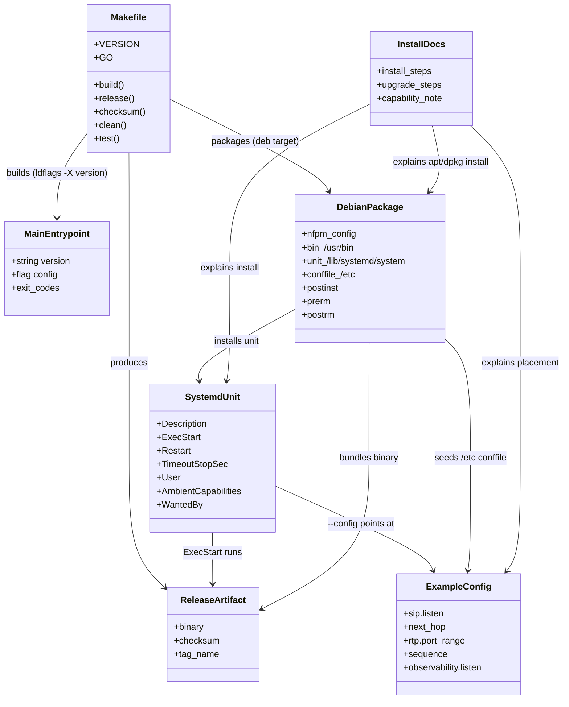

# Deployment — single static binary, systemd unit, repeatable tagged release

> REASONS-Canvas implementation prompt for `[STORY-001-009]` of `voipstack-sip-sequencer`
> module-001. Source analysis: `spdd/analysis/GGQPA-XXX-202606071300-[Analysis]-deployment-release.md`.
> Stack: Go 1.23.6, module `github.com/voipstack/voipstack-sip-sequencer`, deployable
> `cmd/sip-sequencer`. This story is almost entirely **packaging artifacts** (Makefile,
> systemd unit, example config, Debian `.deb` package, docs) plus one optional version-stamp
> line — not call logic.
> Follow `AGENTS.md`: simple design, YAGNI (no containers/rpm), errors as values.

## Requirements

Make the sequencer shippable and operable on a single systemd host:

- Build a **single static binary** (`CGO_ENABLED=0`, no external runtime deps) for the
  deployable `cmd/sip-sequencer`.
- Provide a **systemd unit** that runs it with `--config`, manages start/stop/restart, enables
  on boot, stops cleanly (honouring the existing graceful SIGTERM shutdown), and surfaces a bad
  config as a *failed* unit visible in `systemctl status`/journal.
- Provide a **repeatable, tag-driven release mechanism** (a Makefile `release` target) that
  turns a given tag into the deployable artifact deterministically (`-trimpath`, pinned
  toolchain, stable ldflags → same tag yields the same contents).
- Ship an **example config** and **install/upgrade docs** so operators install, run, and
  upgrade (replace binary + restart, no migration) without a build toolchain on the host.
- Build a **Debian `.deb` package** that installs the binary, the systemd unit, and an
  **initial configuration under `/etc`**, registers the service (enable on install), and
  preserves operator config edits across upgrades.

Boundary: single host / single instance; `linux/amd64` primary (cross-compile available);
Debian `.deb` is the only OS-package format in scope — no containers, rpm, auto-update,
clustering, or CI infrastructure (Makefile is the mechanism, trivially CI-able later).

## Entities

> "Entities" here are the deliverable build/deploy artifacts and the one code touchpoint
> (a version variable), not domain classes. No existing Go types change.

Conservative note: the **only** source change is an optional `var version = "dev"` in
`cmd/sip-sequencer/main.go`, stamped via ldflags and logged once at startup. Exit-code,
flag, and shutdown behaviour are unchanged. Everything else is new files under `packaging/`
and `Makefile`. The Debian package reuses the same binary, unit, and example config — it adds
only an `nfpm.yaml` manifest and three maintainer scripts.

## Approach

1. **Build (AC1) — deterministic static compile:**
   - A `Makefile` `build` target runs
     `CGO_ENABLED=0 go build -trimpath -ldflags "-s -w -X main.version=$(VERSION)" -o dist/sip-sequencer ./cmd/sip-sequencer`.
   - `-trimpath` strips local/VCS paths; `CGO_ENABLED=0` guarantees a static, dependency-free
     binary; `-s -w` shrinks it. Target only `cmd/sip-sequencer` (never `applications/recording`).

2. **Release (AC3) — tag → repeatable artifact:**
   - A `release` target takes a `VERSION` (VCS-agnostic: `make release VERSION=v1.2.3`;
     default tries `git describe --tags --always`, tolerating absence → `dev`), builds with the
     same deterministic flags, names the artifact by tag
     (`dist/sip-sequencer-$(VERSION)-linux-amd64`), and emits a `sha256` checksum file.
   - Repeatability bar: `-trimpath` + `CGO_ENABLED=0` + pinned Go toolchain (the `go` directive
     in `go.mod` / documented version) + no volatile ldflags (no build timestamp). Document that
     bit-identical output also requires the same toolchain version.

3. **systemd (AC2/AC4) — lifecycle + fail-loud:**
   - Ship `packaging/systemd/voipstack-sip-sequencer.service`: `Type=simple`,
     `ExecStart=/usr/bin/sip-sequencer --config /etc/voipstack-sip-sequencer/config.yaml`
     (`/usr/bin` so the same unit works for both manual install and the `.deb`; Debian policy
     forbids packages writing `/usr/local`),
     `Restart=on-failure` with `StartLimitIntervalSec`/`StartLimitBurst` so a bad config halts as
     a **failed** unit (not an endless loop), `TimeoutStopSec` ≥ the engine's 5 s graceful-
     shutdown window, a non-root `DynamicUser=yes` (or dedicated user) with
     `AmbientCapabilities=CAP_NET_BIND_SERVICE` (SIP `:5060` is privileged), and
     `WantedBy=multi-user.target` for boot-enable.
   - AC4 is met by the existing non-zero exit + stderr→journal behaviour; the unit must not mask
     it (no `Restart=always`, no output suppression).

4. **Operability (docs + example):**
   - Ship `packaging/config.example.yaml` derived from the README config block (SIP
     `0.0.0.0:5060`, `next_hop`, `rtp.port_range 10000-20000`, a `sequence`,
     `observability.listen 0.0.0.0:9090`).
   - Add `packaging/README.md` (or extend the repo README) with install (copy binary → place
     config → install unit → `daemon-reload` → `enable --now`), the `CAP_NET_BIND_SERVICE`
     note, and upgrade (replace binary → `systemctl restart`, no migration).

5. **Debian package (`.deb`) with initial `/etc` config:**
   - Build the `.deb` with **nfpm** (a single self-contained binary; a declarative
     `packaging/nfpm.yaml` produces the package with no `dpkg-dev`/debhelper toolchain), driven
     by a Makefile `deb` target. The package version derives from `$(VERSION)`.
   - Payload (FHS-correct paths): the binary → `/usr/bin/sip-sequencer`; the systemd unit →
     `/lib/systemd/system/voipstack-sip-sequencer.service`; the initial config →
     `/etc/voipstack-sip-sequencer/config.yaml` declared as a **dpkg conffile** so operator
     edits are preserved across upgrades (dpkg prompts/keeps on change, never silently clobbers).
   - Maintainer scripts: `postinst` runs `systemctl daemon-reload` and enables the unit (via
     `deb-systemd-helper`/`systemctl enable`); `prerm` stops the service on remove; `postrm`
     disables + `daemon-reload` on remove and cleans the conffile only on `purge`.
   - On a fresh install `/etc` is seeded with a valid-schema config (placeholder `next_hop`
     etc.); the operator edits it and `systemctl restart`. A still-placeholder config fails
     loudly and visibly per AC4 — acceptable and intended.

6. **Version stamp (optional, minimal):**
   - Add `var version = "dev"` in `main.go`, stamped by the Makefile ldflags, logged once at
     startup (`slog.Info("starting", "version", version)`). No `--version` flag, no behavioural
     dependency.

7. **Hygiene:**
   - Add `dist/` to `.gitignore` and `.fossil-settings/ignore-glob`.
   - Verification is a documented **manual smoke procedure** (build → run good/bad config →
     `systemctl start/stop/restart`), since packaging artifacts are outside `go test`.

## Structure

### Artifact relationships (no inheritance — file/tooling layout)
1. `Makefile` is the single entry point; `release` depends on `build`; `build` compiles
   `cmd/sip-sequencer` with version ldflags.
2. `packaging/systemd/*.service` `ExecStart`s the installed binary and points `--config` at the
   operator config; it depends on nothing at build time.
3. `packaging/config.example.yaml` is the template the unit's `--config` path is filled from,
   and the source for the `.deb`'s seeded `/etc` conffile.
4. `packaging/README.md` references the unit, the example config, the Makefile targets, and the
   `.deb` install path.
5. `packaging/nfpm.yaml` (the `deb` target) bundles the binary, the unit, and the example
   config (as a conffile); its maintainer scripts register the service.

### Dependencies
1. `Makefile` → Go toolchain (`go build`), the module source, optional `git`/`fossil` for the
   default `VERSION`; the `deb` target additionally → `nfpm`.
2. `systemd unit` → the deployed binary + the config file path + `CAP_NET_BIND_SERVICE`.
3. `main.go` version var → Makefile ldflags (`-X main.version`).
4. `nfpm.yaml` → the built binary (`build`), the systemd unit, the example config, and the
   maintainer scripts; maintainer scripts → `systemctl`/`deb-systemd-helper` on the target.

### Layout (new files)
1. `/Makefile` — build/release/checksum/deb/clean/test targets.
2. `/packaging/systemd/voipstack-sip-sequencer.service` — the unit.
3. `/packaging/config.example.yaml` — example operator config (also the `.deb` `/etc` conffile).
4. `/packaging/README.md` — install/upgrade/operate notes (manual + `.deb`).
5. `/packaging/nfpm.yaml` — Debian package manifest.
6. `/packaging/debian/postinst`, `/packaging/debian/prerm`, `/packaging/debian/postrm` —
   maintainer scripts.
7. `/cmd/sip-sequencer/main.go` — add `version` var + startup log (only code edit).
8. `.gitignore` / `.fossil-settings/ignore-glob` — ignore `dist/`.
9. Error handling stays the Go idiom already in `main.go` (exit codes + stderr); no new layer.

## Operations

### Create — `/Makefile`
1. Responsibility: the single repeatable build/release entry point.
2. Variables:
   - `VERSION ?= $(shell git describe --tags --always 2>/dev/null || echo dev)` — overridable;
     VCS-agnostic (operator may pass `VERSION=v1.2.3`).
   - `GO ?= go`; `GOOS ?= linux`; `GOARCH ?= amd64`; `BIN := sip-sequencer`;
     `PKG := ./cmd/sip-sequencer`; `DIST := dist`;
     `LDFLAGS := -s -w -X main.version=$(VERSION)`.
3. Targets:
   - `build`: `CGO_ENABLED=0 GOOS=$(GOOS) GOARCH=$(GOARCH) $(GO) build -trimpath -ldflags '$(LDFLAGS)' -o $(DIST)/$(BIN) $(PKG)`.
   - `release`: build to `$(DIST)/$(BIN)-$(VERSION)-$(GOOS)-$(GOARCH)`, then write a
     `.sha256` checksum next to it. Echo the artifact path.
   - `checksum`: `sha256sum` the release artifact into `<artifact>.sha256`.
   - `deb`: depends on `build`; run `nfpm package -p deb -f packaging/nfpm.yaml --target $(DIST)/`
     with `VERSION` exported so `nfpm.yaml` picks it up; echo the produced `.deb` path.
   - `test`: `$(GO) test -race ./...`.
   - `clean`: `rm -rf $(DIST)`.
   - `.PHONY` for all targets; create `$(DIST)` as needed.
4. Constraints: deterministic flags (`-trimpath`, `CGO_ENABLED=0`, no build timestamp);
   targets only `cmd/sip-sequencer`; `deb` requires `nfpm` on PATH; no network needed beyond
   module cache.

### Create — `/packaging/systemd/voipstack-sip-sequencer.service`
1. Responsibility: manage the sequencer as a systemd service.
2. `[Unit]`: `Description=voipstack SIP sequencer`, `After=network-online.target`,
   `Wants=network-online.target`.
3. `[Service]`:
   - `Type=simple`
   - `ExecStart=/usr/bin/sip-sequencer --config /etc/voipstack-sip-sequencer/config.yaml`
   - `Restart=on-failure`, `RestartSec=2`, `StartLimitIntervalSec=60`, `StartLimitBurst=3`
     (a persistently bad config halts as **failed**, not looping — AC4).
   - `TimeoutStopSec=10` (≥ the engine's 5 s graceful shutdown so calls BYE cleanly — AC2).
   - `DynamicUser=yes`, `AmbientCapabilities=CAP_NET_BIND_SERVICE`,
     `NoNewPrivileges=yes` (run non-root; still bind SIP `:5060`).
   - Hardening (conservative): `ProtectSystem=strict`, `ProtectHome=yes`,
     `ReadOnlyPaths=/etc/voipstack-sip-sequencer` (config is read-only to the service).
4. `[Install]`: `WantedBy=multi-user.target` (boot-enable).
5. Constraints: must not mask exit code/stderr; comment the `CAP_NET_BIND_SERVICE` rationale and
   that high-port SIP configs can drop it.

### Create — `/packaging/config.example.yaml`
1. Responsibility: a valid starting config matching the documented schema.
2. Contents (from the README example): `sip.listen: 0.0.0.0:5060`,
   `next_hop: pbx.internal:5060`, `rtp.port_range: 10000-20000`, a sample `sequence`
   (one app with `name`/`uri`/`media`/`on_failure`), `observability.listen: 0.0.0.0:9090`,
   `log_level: info`.
3. Constraints: must pass `config.Load` validation (all required keys present); annotate each key
   with a one-line comment.

### Create — `/packaging/README.md`
1. Responsibility: operator install / upgrade / operate guide (Debian package + manual).
2. Sections:
   - Install (Debian package, preferred): `sudo dpkg -i sip-sequencer_<version>_amd64.deb`
     (or `sudo apt install ./<file>.deb`); the package places the binary, unit, and an initial
     `/etc/voipstack-sip-sequencer/config.yaml`, and enables the service. Edit the config (set
     `next_hop` etc.) → `systemctl restart voipstack-sip-sequencer`.
   - Install (manual): copy `dist/sip-sequencer` → `/usr/bin/`; create
     `/etc/voipstack-sip-sequencer/`, place `config.yaml`; copy the unit to
     `/etc/systemd/system/`; `systemctl daemon-reload`; `systemctl enable --now voipstack-sip-sequencer`.
   - Verify: `systemctl status`, `journalctl -u voipstack-sip-sequencer`; check `/health` and
     `/metrics` if `observability.listen` is set.
   - Upgrade: `dpkg -i` the new `.deb` (config conffile preserved) or replace the binary →
     `systemctl restart` (no migration).
   - Remove/purge: `apt remove` stops+disables; `apt purge` also removes the `/etc` config.
   - Capabilities note: SIP `:5060` needs `CAP_NET_BIND_SERVICE` (already in the unit); high
     ports can drop it.
   - Bad-config behaviour: the service exits non-zero and the error shows in `systemctl status`
     / journal (AC4).
3. Constraints: commands copy-pasteable; paths consistent with the unit (`/usr/bin`) and the
   `.deb` payload.

### Create — `/packaging/nfpm.yaml`
1. Responsibility: declarative Debian `.deb` manifest built by `nfpm`.
2. Metadata: `name: sip-sequencer` (or `voipstack-sip-sequencer`), `arch: amd64`,
   `version: ${VERSION}` (from env), `section: net`, `priority: optional`, `maintainer`,
   `description`, `homepage` (the codeberg module). No runtime `depends` (static binary).
3. Contents (FHS paths):
   - `dist/sip-sequencer` → `/usr/bin/sip-sequencer` (mode 0755).
   - `packaging/systemd/voipstack-sip-sequencer.service` →
     `/lib/systemd/system/voipstack-sip-sequencer.service` (mode 0644).
   - `packaging/config.example.yaml` → `/etc/voipstack-sip-sequencer/config.yaml`, declared as
     a **`config`/conffile** entry (mode 0640) so dpkg preserves operator edits on upgrade.
4. Scripts: reference `packaging/debian/postinst`, `prerm`, `postrm`.
5. Constraints: paths Debian-policy-correct (no `/usr/local`); version comes from `$(VERSION)`;
   produces `$(DIST)/sip-sequencer_<version>_amd64.deb`.

### Create — `/packaging/debian/{postinst,prerm,postrm}` (maintainer scripts)
1. Responsibility: register/deregister the service around install/remove/purge.
2. `postinst` (`configure`): `systemctl daemon-reload`; enable the unit
   (`deb-systemd-helper enable` or `systemctl enable`); do **not** force-start if the seeded
   config is still placeholder — document that the operator edits config then `systemctl start`
   (or `start` and let AC4 surface a bad config as failed). `set -e`; idempotent.
3. `prerm` (`remove`): stop the service if running.
4. `postrm`: on `remove` → `systemctl daemon-reload` + disable; on `purge` → also remove
   `/etc/voipstack-sip-sequencer/` (the conffile) and any leftover state. `set -e`; tolerate a
   missing service.
5. Constraints: POSIX `sh`, `set -e`, idempotent, no interactive prompts; follow Debian
   maintainer-script conventions (argument `$1` = action).

### Update — `/cmd/sip-sequencer/main.go` (only code edit)
1. Add package-level `var version = "dev"`.
2. After logger setup, emit `slog.Info("starting voipstack-sip-sequencer", "version", version)`.
3. Constraints: no new flag, no behavioural branch; exit-code/flag/shutdown logic unchanged;
   `gofmt`/`vet` clean.

### Update — `.gitignore` and `.fossil-settings/ignore-glob`
1. Add `dist/` (and `*.sha256` if desired) so build artifacts are not committed/checked in.
2. Constraints: keep existing entries; append only.

## Norms
1. **Deterministic build flags everywhere:** every build/release path uses
   `CGO_ENABLED=0 -trimpath` and the same `-ldflags`; never introduce a build-timestamp or
   host-path stamp.
2. **One deployable:** always target `./cmd/sip-sequencer`; never package
   `applications/recording`.
3. **systemd conventions:** `Type=simple`, `Restart=on-failure` with a start limit, explicit
   `TimeoutStopSec`, least-privilege user + only `CAP_NET_BIND_SERVICE`, boot-enable via
   `WantedBy=multi-user.target`. Unit must surface, not mask, failures.
4. **VCS-agnostic versioning:** `VERSION` is an overridable Make variable; do not hard-wire git
   or Fossil. Document the pinned Go toolchain for reproducibility.
5. **Config stays the single source of truth:** the example config matches `internal/config`
   exactly (required keys) and is the only runtime input; no env vars (PRD §6).
5a. **Debian packaging conventions:** FHS paths only (`/usr/bin`, `/lib/systemd/system`,
   `/etc/...`) — never `/usr/local` in a package; the `/etc` config is a **conffile** so dpkg
   preserves operator edits across upgrades; maintainer scripts are POSIX `sh`, `set -e`,
   idempotent, non-interactive, and use `systemctl`/`deb-systemd-helper`; `purge` (not `remove`)
   is the only action that deletes `/etc` config. Built via `nfpm` (no debhelper toolchain).
6. **Docs are copy-pasteable and path-consistent** with the unit and Makefile.
7. **Errors as values / fail loud:** preserve the existing exit-code contract (`2` missing
   flag, `1` config error) and stderr logging; no `GlobalExceptionHandler` analogue.
8. **Verification is a documented manual smoke test** (build → run good/bad config →
   `systemctl start/stop/restart/enable`), since Makefile/unit are outside `go test`. Keep
   `go test -race ./...` green (the version var must not break tests).
9. **gofmt / go vet clean** for the single `main.go` edit.

## Safeguards
1. **AC1 static binary:** `make build` produces a `CGO_ENABLED=0 -trimpath` binary with no
   shared-library deps; verify with `file dist/sip-sequencer` (statically linked) and `ldd`
   (“not a dynamic executable”); it runs on a clean host with `--config`.
2. **AC2 systemd lifecycle:** `systemctl start/stop/restart/enable` all work; stop is graceful
   within `TimeoutStopSec` (≥ the 5 s shutdown window); enabled unit starts on boot.
3. **AC3 repeatable tagged build:** `make release VERSION=<tag>` yields a tag-named artifact +
   checksum; the same tag + same pinned Go toolchain yields the same contents (documented
   determinism bar).
4. **AC4 bad config visible:** with a config missing a required key, the service ends in
   `failed` state (not a restart loop) and the config error is in `systemctl status` / journal.
5. **Non-functional upgrade:** replace binary + `systemctl restart` (or `dpkg -i` the new
   `.deb`) only — no migration step; the `.deb` conffile preserves operator config edits;
   guaranteed by the on-disk-stateless process.
6. **Least privilege / security:** runs non-root with only `CAP_NET_BIND_SERVICE`; config is
   read-only to the service; no secrets embedded in the unit or binary.
7. **Single deployable / bounded scope:** packages only `cmd/sip-sequencer`; the Debian `.deb`
   is the only OS-package format; no container, rpm, auto-update, multi-host, or CI
   infrastructure introduced.
7a. **Debian package correctness:** a fresh `dpkg -i` installs the binary to `/usr/bin`, the
   unit to `/lib/systemd/system`, and seeds a valid-schema `/etc/voipstack-sip-sequencer/config.yaml`
   (conffile); `postinst` enables the service; an upgrade preserves an edited config; `apt purge`
   removes the `/etc` config; verify with `dpkg -c` (contents) and an install→edit→restart→remove
   →purge smoke run.
8. **No behavioural regression:** the only code change is a logged `version` var; exit codes,
   `--config` handling, and graceful shutdown are unchanged; `go test -race ./...` stays green.
9. **Artifact hygiene:** `dist/` is ignored by git and Fossil; release artifacts are not
   committed.
