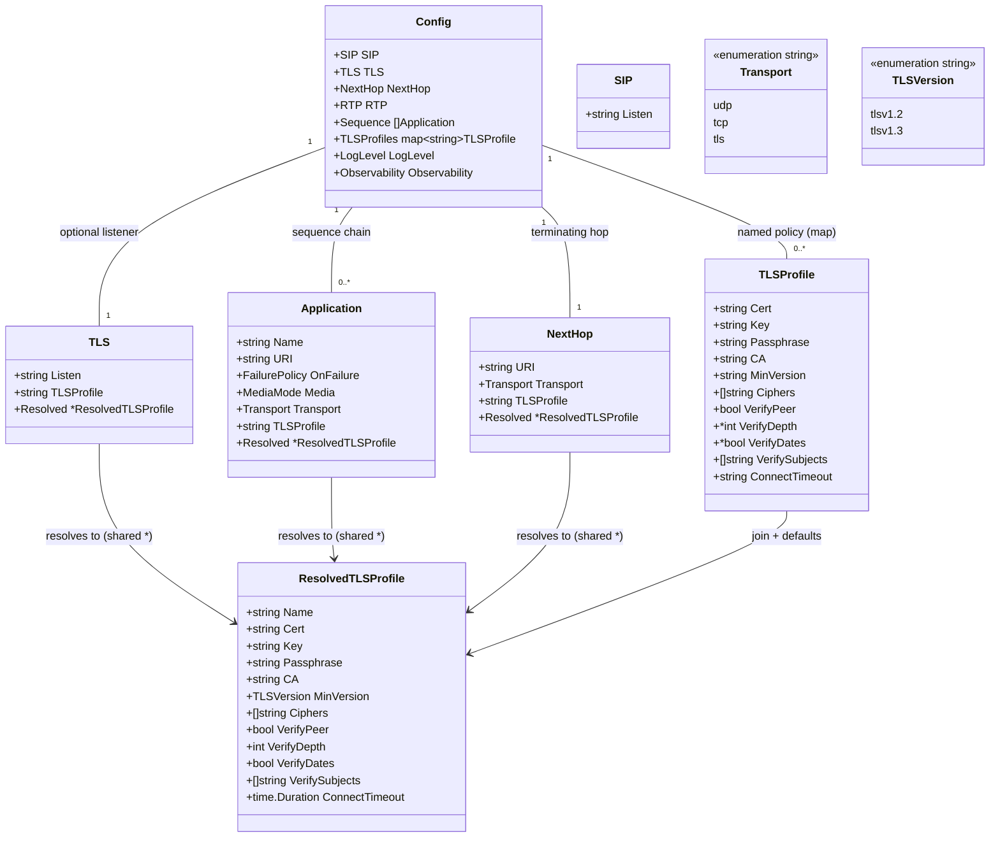

# TLS Configuration — `tls_profiles` Model & Parse-Time Validation (STORY-001-012)

## Requirements

Implement parse-time loading, resolution, and validation of optional TLS configuration in the
sequencer's central YAML, extending the existing `internal/config` loader. Introduce named,
reusable `tls_profiles` (certificate material + crypto/verification/timeout policy) that TLS
endpoints — the `tls.listen` listener, `sequence` items, and `next_hop` — reference by name.
Produce a flat, library-agnostic **resolved TLS profile** per TLS endpoint with all defaults
applied, and fail the config load with a clear, reference-naming error on any broken wiring.
TLS is opt-in: a config with no TLS keys yields plain SIP with no TLS listener and every
endpoint on plain transport. **Backward compatibility is NOT a requirement** — `next_hop` is
now an object (`uri` + optional `transport`/`tls_profile`); the previous string form
(`next_hop: host:port`) is dropped, and existing configs/fixtures migrate to the object form.
No certificate files are opened and no `crypto/tls` types are introduced at this layer — file
loading is downstream (STORY-001-013).

Boundary: parse and validate **reference wiring and field syntax** only. Certificate-content
loadability, TLS context construction, and handshakes are out of scope.

## Entities

Notes:
- `ResolvedTLSProfile` is the cross-story contract consumed by 013–016. It is library-agnostic
  (no `crypto/tls` types). Multiple endpoints naming the same profile point at the **same**
  `*ResolvedTLSProfile` instance (literal identity → AC2 dedup).
- `TLSProfile.VerifyDepth`/`VerifyDates` are pointers in the raw struct to distinguish "absent"
  (apply secure default) from an explicit value. `VerifyPeer` is a plain `bool` (zero value
  `false` is the default).

## Approach

1. **Loader extension (in place, reuse the pipeline):**
   - Keep the existing `Parse(data, source)` → `Load(path)` flow: strict `yaml.Decoder` with
     `dec.KnownFields(true)`, a `rawConfig` pointer-presence mirror, `applyDefaults`, then
     `validate`. Add an explicit `resolveTLS` step after `validate` confirms wiring.
   - Add optional top-level `tls` (listener) and `tls_profiles` (map) blocks; add `transport`
     + `tls_profile` to `Application`; change `next_hop` to a plain `NextHop` object struct
     (`uri` + optional `transport`/`tls_profile`) — no custom decoder, no scalar form. Every
     new key must exist in the structs (required by `KnownFields(true)`).

2. **Resolution & defaults:**
   - In `resolveTLS`, for each TLS endpoint (listener / app with `transport: tls` / next hop
     with `transport: tls`): join endpoint → `TLSProfiles[name]`, apply policy defaults, parse
     `connect_timeout`, and attach a shared `*ResolvedTLSProfile` (one instance per referenced
     profile name, built once and reused).
   - Defaults: `MinVersion=tlsv1.2`, `Ciphers=nil` (provider uses secure defaults), `VerifyPeer=false`,
     `VerifyDepth=2`, `VerifyDates=true`, `VerifySubjects=nil`, `ConnectTimeout=0`.

3. **Validation (fail-fast, reference-naming errors):**
   - `transport: tls` and a `tls.listen` block each require a non-empty `tls_profile`; a
     referenced profile must exist in `tls_profiles`; a non-TLS endpoint must NOT carry a
     `tls_profile` (R4). Enum values (`transport`, `min_version`) validated via the existing
     string-enum + `switch` idiom. `connect_timeout` must parse as a Go duration. `verify_subjects`
     entries must be non-empty. Cert/key must be present (non-empty) on every defined profile.
   - **Ciphers carried opaque** at this layer (validate only non-empty entries); cipher-name
     validity is enforced by the TLS provider in STORY-001-014, which owns `crypto/tls`. This
     keeps `internal/config` free of any TLS-library import (the swappable-boundary rule).

4. **Engine + fixture migration (breaking, allowed):**
   - `Config.NextHop` changes from `string` to the `NextHop` struct. Update the two existing
     read sites in `internal/b2bua` (`bridge.go` `dialPBX`: `sip.ParseUri(e.cfg.NextHop, …)`
     and `targetURI: e.cfg.NextHop`) to use `e.cfg.NextHop.URI`. The plain dial path is
     unchanged; transport/TLS consumption of the next hop is STORY-001-016.
   - Existing YAML test fixtures and any `testConfig(...)` helpers that emit `next_hop:` as a
     scalar must migrate to the object form (`next_hop:\n  uri: sip:...`). This is an accepted
     breaking change (backward compatibility not required).

5. **No GlobalExceptionHandler / no service-controller layering** — this is a pure config
   package. Errors are values, wrapped with context (`fmt.Errorf("...: %w")`), surfaced to
   `main.go` which already prints and exits non-zero.

## Structure

### Type/Interface Relationships
1. `Transport` and `TLSVersion` are `string`-based named types with exported consts and an
   exhaustive `switch` in `validate` — same pattern as `FailurePolicy`, `MediaMode`, `LogLevel`.
2. `NextHop` is a plain struct decoded by yaml tags (`uri`/`transport`/`tls_profile`) — no
   custom `UnmarshalYAML`, no scalar form.
3. `ResolvedTLSProfile` is a plain value type; no methods, no library types. Shared by pointer.
4. No new packages: all additions live in `internal/config`. No interface is introduced (YAGNI);
   the provider boundary arrives in STORY-001-013.

### Dependencies
1. `Parse` → `applyDefaults` → `validate` → `resolveTLS` (new), all within `internal/config`.
2. `internal/b2bua` (engine/bridge) depends on `config.Config`; only the `NextHop.URI` access
   changes.
3. `internal/config` imports: `bytes`, `fmt`, `net`, `os`, `time` (new, for duration), `gopkg.in/yaml.v3`.
   It MUST NOT import `crypto/tls`.

### Layering
1. Decode layer: `rawConfig` strict YAML decode (presence via pointers).
2. Default layer: `applyDefaults` (existing + profile/transport defaults).
3. Validation layer: `validate` (existing + TLS wiring/syntax checks, reference-naming errors).
4. Resolution layer: `resolveTLS` (join endpoint→profile, attach shared resolved profiles).

## Operations

### Update Struct/Types — `internal/config/config.go`
1. Responsibility: declare TLS config types and extend existing ones additively.
2. Add named types + consts:
   - `type Transport string` with `TransportUDP="udp"`, `TransportTCP="tcp"`, `TransportTLS="tls"`.
   - `type TLSVersion string` with `TLSv12="tlsv1.2"`, `TLSv13="tlsv1.3"`.
3. Add `type TLSProfile struct` (raw, yaml tags): `Cert`,`Key`,`Passphrase`,`CA` strings;
   `MinVersion string`; `Ciphers []string`; `VerifyPeer bool`; `VerifyDepth *int`;
   `VerifyDates *bool`; `VerifySubjects []string`; `ConnectTimeout string` (yaml `connect_timeout`).
4. Add `type TLS struct { Listen string; TLSProfile string \`yaml:"tls_profile"\`; Resolved *ResolvedTLSProfile \`yaml:"-"\` }`.
5. Add `type ResolvedTLSProfile struct` (no yaml tags; fields per Entities; `MinVersion TLSVersion`,
   `ConnectTimeout time.Duration`, `VerifyDepth int`, `VerifyDates bool`).
6. Extend `Application`: add `Transport Transport \`yaml:"transport"\``, `TLSProfile string \`yaml:"tls_profile"\``,
   `Resolved *ResolvedTLSProfile \`yaml:"-"\``.
7. Add `type NextHop struct { URI string \`yaml:"uri"\`; Transport Transport \`yaml:"transport"\`;
   TLSProfile string \`yaml:"tls_profile"\`; Resolved *ResolvedTLSProfile \`yaml:"-"\` }`. Plain
   struct — no custom decoder, no scalar form.
8. Extend `Config` and `rawConfig`: add `TLS TLS \`yaml:"tls"\``, `TLSProfiles map[string]TLSProfile \`yaml:"tls_profiles"\``;
   change `Config.NextHop` field type to `NextHop`. In `rawConfig`, make `NextHop *NextHop \`yaml:"next_hop"\``
   (pointer) so absence is detectable (the existing "missing required key next_hop" check becomes
   "next_hop absent or `uri` empty"); `Sequence` stays `*[]Application`; `TLSProfiles` map nil-ness
   signals absence.

### Update `Parse` — `internal/config/config.go`
1. After existing decode into `rawConfig`, copy new fields into `Config` (`TLS`, `TLSProfiles`,
   and `NextHop` from the `*NextHop` pointer when present).
2. Call `applyDefaults(&cfg)`, then `validate(cfg, sequencePresent, nextHopPresent)`, then
   `resolveTLS(&cfg)`. Wrap any error as today: `fmt.Errorf("parse config %q: %w", source, err)`.

### Update `applyDefaults` — `internal/config/config.go`
1. Existing log-level / per-app on_failure+media defaults unchanged.
2. For each `cfg.Sequence[i]`: if `Transport == ""` set `TransportUDP`.
3. For `cfg.NextHop`: if `Transport == ""` set `TransportUDP`.
4. (Profile policy defaults are applied during `resolveTLS`, not here, because they belong to
   the resolved value, not the raw map.)

### Update `validate` — `internal/config/config.go`
1. Signature gains `nextHopPresent bool`. Adapt the existing required-`next_hop` check: fail with
   `missing required key "next_hop"` when next_hop is absent, and `next_hop: missing required key "uri"`
   when present with an empty `uri`. All other existing checks unchanged. Add, in order, with
   reference-naming errors:
   - **Transport enum** per app and next hop: must be `udp|tcp|tls` else
     `fmt.Errorf("sequence[%d] %q: invalid transport %q", i, name, t)` / `"next_hop: invalid transport %q"`.
   - **Profile-required (R4 + AC3/AC4):**
     - `cfg.TLS.Listen != "" && cfg.TLS.TLSProfile == ""` → `errors.New("tls.listen requires a tls_profile")`.
     - app `Transport == tls && TLSProfile == ""` → `"sequence[%d] %q: transport tls requires a tls_profile"`.
     - next hop `Transport == tls && TLSProfile == ""` → `"next_hop: transport tls requires a tls_profile"`.
     - app/next-hop `Transport != tls && TLSProfile != ""` → `"... tls_profile set but transport is %q"` (R4 reject).
   - **Address syntax:** if `cfg.TLS.Listen != ""`, validate with `net.SplitHostPort` (mirror observability.listen).
   - **Profile existence (AC5):** for every referenced profile name (`tls.listen`, each app, next hop),
     require it exists in `cfg.TLSProfiles`, else `"<endpoint>: unknown tls_profile %q"` naming the endpoint and profile.
   - **Per defined profile syntax:** cert/key non-empty (`"tls_profiles[%q]: missing cert/key"`);
     `MinVersion` (if set) ∈ {`tlsv1.2`,`tlsv1.3`} else `"tls_profiles[%q]: unsupported min_version %q"`;
     each `Ciphers` entry non-empty; each `VerifySubjects` entry non-empty;
     `ConnectTimeout` (if set) parses via `time.ParseDuration` else `"tls_profiles[%q]: invalid connect_timeout %q"`;
     `VerifyDepth` (if set) `>= 0`.
2. Unused profiles are NOT an error (validate their syntax only).

### Implement `resolveTLS` — `internal/config/config.go`
1. Signature: `func resolveTLS(cfg *Config) error`.
2. Logic:
   - Build `resolved := map[string]*ResolvedTLSProfile{}`.
   - Helper `resolve(name string) (*ResolvedTLSProfile, error)`: return the cached pointer if present;
     else read `cfg.TLSProfiles[name]`, build a `ResolvedTLSProfile` applying defaults
     (MinVersion→`tlsv1.2` if empty; VerifyDepth→2 if nil; VerifyDates→true if nil; parse
     ConnectTimeout→`time.Duration`, `""`→0), set `Name=name`, cache, and return.
   - Attach: if `cfg.TLS.Listen != ""` → `cfg.TLS.Resolved = resolve(cfg.TLS.TLSProfile)`;
     for each app with `Transport==tls` → `cfg.Sequence[i].Resolved = resolve(app.TLSProfile)`;
     if next hop `Transport==tls` → `cfg.NextHop.Resolved = resolve(cfg.NextHop.TLSProfile)`.
   - Endpoints sharing a profile name receive the **same** pointer (AC2).
3. Constraints: `resolveTLS` runs only after `validate` guarantees every referenced profile exists,
   so `resolve` does not re-check existence; it may still surface a duration parse via the validated path.

### Update engine read sites — `internal/b2bua/bridge.go`
1. `dialPBX`: change `sip.ParseUri(e.cfg.NextHop, &pbxURI)` → `sip.ParseUri(e.cfg.NextHop.URI, &pbxURI)`.
2. `dialPBX`: change `targetURI: e.cfg.NextHop` → `targetURI: e.cfg.NextHop.URI`.
3. No behavior change; required so the package compiles after the `NextHop` type change.
   (Grep for any other `cfg.NextHop` string uses and update identically.)

### Add/Update tests — `internal/config/config_test.go`
1. BDD Given/When/Then, one behavior per test, table-driven where natural. Cover AC1–AC9
   (object-form `next_hop` throughout; migrate existing fixtures):
   - `TestNoTLSKeysParsesPlain` (AC1): config with object `next_hop` and no TLS keys → success, `Resolved` nils, transports default udp.
   - `TestProfileReusedSharesResolvedPointer` (AC2): app + next_hop both `tls_profile: outbound` → `cfg.Sequence[0].Resolved == cfg.NextHop.Resolved` (same pointer) and same Cert.
   - `TestTransportTLSWithoutProfileFails` (AC3) and `TestTLSListenWithoutProfileFails` (AC4): expect naming errors.
   - `TestUnknownProfileFails` (AC5).
   - `TestTLSAndPlainListenersCoexist` (AC6): `sip.listen` + `tls.listen` both set → both present.
   - `TestOmittedPolicyDefaults` (AC7): profile with only cert/key → resolved has tlsv1.2 / verifyPeer false / depth 2 / dates true / no subjects / connect_timeout 0.
   - `TestNextHopObjectFormResolvesTLS` (AC8): `next_hop` object with `transport: tls tls_profile: outbound` → resolved TLS next hop; plain object (`uri` only) → plain. (String form no longer supported.)
   - `TestNonTLSEndpointNeedsNoProfile` (AC9) and `TestTLSProfileOnPlainEndpointRejected` (R4).
   - `TestNextHopMissingURIFails`: object `next_hop` with empty `uri` → `missing required key "uri"`.
   - Plus: invalid `min_version`, invalid `connect_timeout`, empty `verify_subjects` entry → naming errors.
2. Use real YAML strings via `Parse([]byte(...), "test")`; no mocks (pure code, AGENTS.md).

## Norms

1. **Go style:** `gofmt`/`go vet` clean, idiomatic. Errors are values; wrap with
   `fmt.Errorf("...: %w", err)`; every config error names the offending key/index/endpoint/profile,
   matching the existing `fmt.Errorf("... %q ...")` convention.
2. **Closed-set enums:** new `Transport`/`TLSVersion` follow the named-string-const + exhaustive
   `switch` pattern already used by `FailurePolicy`/`MediaMode`/`LogLevel`. No `iota`, no maps for enums.
3. **Presence vs. default:** use pointer fields in the raw `TLSProfile` only where the secure
   default is non-zero (`VerifyDepth`, `VerifyDates`); apply defaults in `resolveTLS`, not by mutating the raw map.
4. **Boundary purity:** `internal/config` must not import `crypto/tls`/`crypto/x509`. `ResolvedTLSProfile`
   exposes only std/`time` types. Cipher-name and certificate-content validation belong to the provider (013/014).
5. **No new abstraction (YAGNI):** no interface, no provider, no separate package in this story.
6. **Tests (BDD, high-value only):** Given/When/Then names by behavior; one behavior per test; real
   YAML inputs; cover every AC and each new validation error. No tests that merely restate struct fields.
7. **Comments reveal intent:** document the shared-pointer resolution (why profile identity matters
   for downstream cert reuse) where non-obvious.

## Safeguards

1. **Functional (opt-in):** A config with none of `tls`/`tls_profiles`/`transport`/`tls_profile`
   parses to plain SIP — no TLS listener, every endpoint plain transport (AC1).
2. **No backward compatibility (by directive):** `next_hop` is object-only (`uri` + optional
   `transport`/`tls_profile`); the previous string form is removed. Existing configs, YAML
   fixtures, and `testConfig(...)` helpers MUST migrate to the object form; the engine plain dial
   path reads `NextHop.URI` (AC8).
3. **Fail-fast wiring:** every broken reference (missing profile-name on a TLS endpoint, unknown
   profile, `tls_profile` on a plain endpoint) fails `config.Load` with a clear, reference-naming
   error before any listener/dialer is constructed (AC3, AC4, AC5, R4).
4. **Secure defaults:** omitted policy resolves to TLS 1.2 floor, peer verification off, depth 2,
   dates checked, no subject restriction, unlimited connect timeout (AC7).
5. **Identity/dedup:** endpoints naming one profile share a single `*ResolvedTLSProfile`; no duplicate
   resolved values for the same profile (AC2).
6. **No disk I/O at parse time:** `resolveTLS`/`validate` never read cert/key/CA files; only string
   wiring and field syntax are checked. Loadability is STORY-001-013 (startup).
7. **Boundary:** no `crypto/tls` import in `internal/config`; `ResolvedTLSProfile` is library-agnostic
   (verifiable by `go list -deps`/import inspection).
8. **Data/format:** `min_version` ∈ {`tlsv1.2`,`tlsv1.3`}; `transport` ∈ {`udp`,`tcp`,`tls`};
   `connect_timeout` a valid Go duration; `verify_subjects` entries non-empty; profile `cert`/`key` present.
9. **Error hygiene:** error messages never include passphrase or file contents — only key names,
   indices, endpoint names, and profile names.
10. **Definition of done (AGENTS.md):** `go build ./...`, `go vet ./...`, `gofmt`, `go test -race ./...`
    all pass; behavior tests cover AC1–AC9 + new validation errors.
