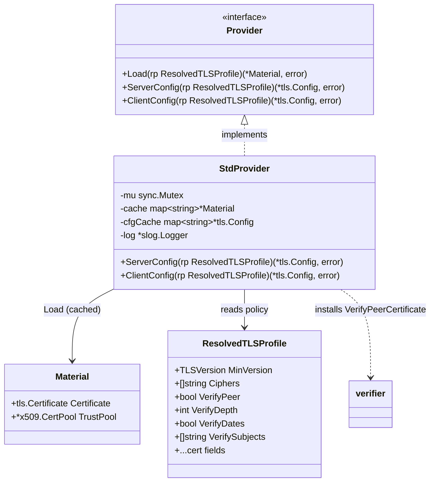

# TLS Context Construction & Certificate Verification Policy (STORY-001-014)

## Requirements

Extend the `internal/tlsprov` boundary to turn a resolved `tls_profile` plus its loaded
`Material` (cert + trust pool, from STORY-001-013) into a ready-to-use `*tls.Config` — one
server-side (inbound) and one client-side (outbound) — that enforces the configured crypto and
verification policy: minimum TLS version, TLS 1.2 cipher allowlist, mutual-TLS peer
verification, allowed-subject pinning, certificate-chain depth cap, and optional date-check
relaxation. Rules without a native `tls.Config` field (subjects, depth, date relaxation) are
enforced in a verification callback. Secure-by-default: omitted policy yields a safe context
(TLS 1.2 floor, Go default ciphers, dates checked); weak versions/ciphers are rejected.

Boundary: build TLS contexts only. Opening listeners (015) and dialing (016) consume the
produced `*tls.Config`; this story does not bind sockets or handshake on the wire (verification
logic is unit-tested via in-process handshakes).

## Entities

Notes:
- `Provider`, `StdProvider`, `Material` already exist (STORY-001-013). This story **adds two
  methods** to `Provider` and `StdProvider`, plus a `cfgCache` and pure mapping/verification
  helpers. No new types beyond unexported helpers. `config.ResolvedTLSProfile` is consumed as-is.
- `*tls.Config` is the boundary's artifact: the **server** config is passed to sipgo
  `ListenAndServeTLS` (015); the **client** config is installed on a per-profile UA via
  `WithUserAgenTLSConfig` (016). sipgo requires `*tls.Config`, so the interface deliberately
  exposes it — the swappable seam abstracts *loading + policy construction*, not the platform
  TLS type.

## Approach

1. **Two builder methods on the boundary:**
   - `ServerConfig(rp)` and `ClientConfig(rp)` each `Load` the profile's `Material` (cached) then
     assemble a `*tls.Config`, cached by `role+":"+rp.Name` so a profile builds once.

2. **Native fields (secure by default):**
   - `MinVersion = mapVersion(rp.MinVersion)` (`tlsv1.2`→`VersionTLS12`, `tlsv1.3`→`VersionTLS13`);
     `MaxVersion = VersionTLS13`.
   - `CipherSuites = mapCiphers(rp.Ciphers)` — names → ids restricted to **TLS 1.2** suites; `nil`
     when `rp.Ciphers` is empty (Go secure defaults). Unknown / non-1.2 name → error (this is
     where cipher-name validation lands; STORY-012 carried ciphers opaque).
   - `Certificates = []tls.Certificate{Material.Certificate}` (server cert; client cert for mTLS).

3. **Server verification (`ServerConfig`):**
   - `rp.VerifyPeer == false` → `ClientAuth = NoClientCert`; no callback (AC1: one-way handshake).
   - `rp.VerifyPeer == true` → `ClientAuth = RequireAndVerifyClientCert`, `ClientCAs = Material.TrustPool`,
     and `VerifyPeerCertificate = verifier(roots=TrustPool, depth=rp.VerifyDepth, subjects=rp.VerifySubjects,
     checkDates=rp.VerifyDates, keyUsage=ExtKeyUsageClientAuth)` (AC2, AC3, AC4, AC7).

4. **Client verification (`ClientConfig`):**
   - The client **always** validates the remote server cert against `RootCAs = Material.TrustPool`
     (nil → system roots) (AC8). `verify_peer` is a server-only concept and does not relax this.
   - Install `VerifyPeerCertificate = verifier(roots=RootCAs, depth, subjects, checkDates=rp.VerifyDates,
     keyUsage=ExtKeyUsageServerAuth)` to add depth/subject (and, when relaxed, date-free) checks.

5. **The `verifier` factory (the security-sensitive core):**
   - **Strict (`checkDates == true`, default):** leave `InsecureSkipVerify = false` so Go performs
     its standard chain + date + key-usage verification and passes `verifiedChains`. The callback
     only **adds** two checks on the accepted chain: depth cap and subject allowlist. Go's vetted
     verification is never bypassed.
   - **Relaxed (`checkDates == false`):** set `InsecureSkipVerify = true` (Go skips all checks, so
     the callback receives `verifiedChains == nil`) and **rebuild** the chain in the callback:
     parse `rawCerts` → leaf + intermediates, `x509.Verify(VerifyOptions{Roots, Intermediates,
     KeyUsages:[ku], CurrentTime: leaf.NotBefore})`. `CurrentTime = leaf.NotBefore` neutralizes the
     date window (always inside `[NotBefore, NotAfter]`) while keeping full chain validation; then
     apply depth + subject checks. This is the only path that skips dates, and it still validates
     the chain against the configured roots.

6. **Pure helpers** (`mapVersion`, `mapCiphers`, `checkDepth`, `checkSubject`) are pure functions,
   unit-tested directly (AGENTS.md). No GlobalExceptionHandler / no layering — errors are values.

## Structure

### Type/Interface Relationships
1. `Provider` gains `ServerConfig`/`ClientConfig`; `StdProvider` implements them. `Material`,
   `NewStdProvider` unchanged.
2. `verifier(...) func(rawCerts [][]byte, verifiedChains [][]*x509.Certificate) error` is an
   unexported factory returning a `tls.Config.VerifyPeerCertificate` callback.
3. `mapVersion`, `mapCiphers`, `checkDepth`, `checkSubject` are unexported pure helpers.
4. No new package; all in `internal/tlsprov`. Still the only importer of `crypto/tls`/`crypto/x509`.

### Dependencies
1. `StdProvider.ServerConfig`/`ClientConfig` → `Load` (cache) → build `*tls.Config` → `cfgCache`.
2. `verifier` callback → `x509.Verify` (relaxed) or reads `verifiedChains` (strict) → `checkDepth`,
   `checkSubject`.
3. `mapCiphers` reads `tls.CipherSuites()` to build the name→id allowlist for TLS 1.2.
4. Consumers (b2bua listener/dialer, 015/016) call these via the stored `tlsprov.Provider`.

### Layering
1. Boundary layer: `Provider` (Load + ServerConfig + ClientConfig).
2. Build layer: assemble `*tls.Config` from `Material` + policy; cache per role+profile.
3. Verification layer: `verifier` factory + pure `checkDepth`/`checkSubject`.
4. Mapping layer: pure `mapVersion`/`mapCiphers`.

## Operations

### Extend interface — `internal/tlsprov/provider.go`
1. Add to `Provider`: `ServerConfig(rp config.ResolvedTLSProfile) (*tls.Config, error)` and
   `ClientConfig(rp config.ResolvedTLSProfile) (*tls.Config, error)`.
2. Add `cfgCache map[string]*tls.Config` to `StdProvider`; initialize in `NewStdProvider`.

### Implement `mapVersion` / `mapCiphers` — `internal/tlsprov/policy.go`
1. `func mapVersion(v config.TLSVersion) (uint16, error)`: `TLSv12`→`tls.VersionTLS12`,
   `TLSv13`→`tls.VersionTLS13`; empty → `tls.VersionTLS12` (secure default); else error
   `"unsupported min_version %q"`.
2. `func mapCiphers(names []string) ([]uint16, error)`: if `len(names)==0` return `nil`. Build a
   `map[string]uint16` once from `tls.CipherSuites()` keeping only suites whose `SupportedVersions`
   includes `tls.VersionTLS12`. For each name: lookup; unknown / not-1.2 → error
   `"unknown or non-TLS1.2 cipher %q"`. Return the id slice (order preserved).

### Implement `checkDepth` / `checkSubject` — `internal/tlsprov/policy.go`
1. `func checkDepth(chain []*x509.Certificate, maxIntermediates int) error`: `intermediates :=
   len(chain) - 2` (chain = leaf … root); if `intermediates < 0 { intermediates = 0 }`; if
   `intermediates > maxIntermediates` → error `"certificate chain too long: %d intermediates exceeds verify_depth %d"`.
   (OpenSSL semantics: `verify_depth` = max intermediate CAs between leaf and trust anchor.)
2. `func checkSubject(leaf *x509.Certificate, allow []string) error`: if `len(allow)==0` return nil;
   if `leaf.Subject.String()` is in `allow` return nil; else error `"peer subject %q not in verify_subjects"`.
   Exact string match on the leaf subject (SAN matching is out of scope).

### Implement `verifier` factory — `internal/tlsprov/verify.go`
1. `func verifier(roots *x509.CertPool, maxIntermediates int, subjects []string, checkDates bool,
   ku x509.ExtKeyUsage) func([][]byte, [][]*x509.Certificate) error`.
2. Returned callback logic:
   - **Strict (`checkDates == true`):** for each chain in `verifiedChains`, if
     `checkDepth(chain, maxIntermediates)==nil && checkSubject(chain[0], subjects)==nil` → return nil.
     If none pass → return the first failing check's error. (Go already validated chain + dates.)
   - **Relaxed (`checkDates == false`):** parse `rawCerts` into `[]*x509.Certificate` (`x509.ParseCertificate`);
     leaf = certs[0]; intermediates pool = certs[1:]. `chains, err := leaf.Verify(x509.VerifyOptions{
     Roots: roots, Intermediates: interPool, KeyUsages: []x509.ExtKeyUsage{ku}, CurrentTime: leaf.NotBefore})`;
     on err → return wrapped chain error. Then for each returned chain apply `checkDepth` + `checkSubject`
     as above.
3. Constraints: never log certificate bytes; the callback returns errors only (handshake aborts).
   `roots == nil` in relaxed mode → use system roots via `x509.SystemCertPool()` (client) or fail
   for server mTLS (a server requiring peer verification with no trust pool is a config error —
   surface it when building `ServerConfig`).

### Implement `ServerConfig` — `internal/tlsprov/context.go`
1. `func (p *StdProvider) ServerConfig(rp config.ResolvedTLSProfile) (*tls.Config, error)`.
2. Logic:
   - `key := "server:" + rp.Name`; under `p.mu`, return cached `*tls.Config` if present.
   - `m, err := p.Load(rp)` (cached cert material).
   - `min, err := mapVersion(rp.MinVersion)`; `suites, err := mapCiphers(rp.Ciphers)`.
   - Base: `&tls.Config{Certificates: []tls.Certificate{m.Certificate}, MinVersion: min,
     MaxVersion: tls.VersionTLS13, CipherSuites: suites}`.
   - If `rp.VerifyPeer`: require `m.TrustPool != nil` else error
     `"tls_profiles[%q]: verify_peer requires a ca bundle"`; set `ClientCAs = m.TrustPool`,
     `ClientAuth = tls.RequireAndVerifyClientCert`; if `!rp.VerifyDates` also set
     `InsecureSkipVerify = true`; set `VerifyPeerCertificate = verifier(m.TrustPool, rp.VerifyDepth,
     rp.VerifySubjects, rp.VerifyDates, x509.ExtKeyUsageClientAuth)`.
   - Else: `ClientAuth = tls.NoClientCert` (no callback).
   - Cache and return.

### Implement `ClientConfig` — `internal/tlsprov/context.go`
1. `func (p *StdProvider) ClientConfig(rp config.ResolvedTLSProfile) (*tls.Config, error)`.
2. Logic:
   - `key := "client:" + rp.Name`; cache check under `p.mu`.
   - `m, err := p.Load(rp)`; `min`/`suites` as above.
   - Base: `&tls.Config{Certificates: []tls.Certificate{m.Certificate}, MinVersion: min,
     MaxVersion: tls.VersionTLS13, CipherSuites: suites, RootCAs: m.TrustPool}` (nil RootCAs → Go
     uses system roots).
   - If `!rp.VerifyDates` set `InsecureSkipVerify = true`. Always set `VerifyPeerCertificate =
     verifier(m.TrustPool, rp.VerifyDepth, rp.VerifySubjects, rp.VerifyDates, x509.ExtKeyUsageServerAuth)`
     so depth/subject (and date relaxation) are enforced on the remote chain.
   - Cache and return.

### Add tests — `internal/tlsprov/context_test.go`
1. BDD, real certs in `t.TempDir()`: a test CA mints a leaf (and an intermediate for chain-depth
   cases), an expired leaf, and a wrong-subject leaf — all via stdlib `x509.CreateCertificate`.
   Drive handshakes in-process (`tls.Server`/`tls.Client` over `net.Pipe`, or a localhost
   listener) — no mocks; external peer is the only boundary (AGENTS.md).
2. Cover AC1–AC8:
   - `TestDefaultServerOneWayHandshake` (AC1): default profile → client with no cert handshakes OK.
   - `TestVerifyPeerEnforcesMTLS` (AC2): `verify_peer:true` → no-cert client rejected; CA-signed
     client accepted.
   - `TestVerifySubjectsRestrictsPeers` (AC3): allowlist `[CN=phone.internal]` → `CN=other` rejected,
     `CN=phone.internal` accepted.
   - `TestVerifyDepthCapsChain` (AC4): `verify_depth:0` → chain with one intermediate rejected;
     `verify_depth:1` → accepted. (Pins the OpenSSL intermediate-count semantics.)
   - `TestMinVersionEnforced` (AC5): server `min_version:tlsv1.2` → TLS 1.1 client handshake fails.
   - `TestCiphersTLS12Only` (AC6): allowlist one 1.2 suite → 1.2 handshake only that suite; a 1.3
     handshake ignores the allowlist (Go fixed suites). Unknown cipher name → `ClientConfig`/`ServerConfig` error.
   - `TestVerifyDatesToggle` (AC7): expired remote rejected with `verify_dates:true`, accepted with
     `verify_dates:false`; assert chain still validated (untrusted-CA expired cert still rejected under false).
   - `TestClientValidatesAgainstCA` (AC8): remote signed by a CA not in the bundle rejected; in-bundle accepted.
   - Negatives: `TestVerifyPeerWithoutCABundleErrors`; `TestUnknownCipherErrors`; `TestUnsupportedMinVersionErrors`.

## Norms

1. **Go style:** `gofmt`/`go vet` clean. Errors are values, wrapped with `fmt.Errorf("...: %w")`,
   naming the profile (`rp.Name`); never log certificate/key bytes.
2. **Boundary:** only `internal/tlsprov` imports `crypto/tls`/`crypto/x509`. The `Provider`
   interface exposes `*tls.Config` deliberately (sipgo requires it); no other library leaks.
3. **Secure default is the untouched path:** when `verify_dates` is true, Go's native verification
   runs unmodified and the callback only *adds* checks. `InsecureSkipVerify` is set **only** when
   `verify_dates:false`, always paired with a custom chain-rebuilding verifier — never bare.
4. **Pure helpers:** `mapVersion`/`mapCiphers`/`checkDepth`/`checkSubject` are pure and table-tested.
5. **Build once:** contexts cached per `role+profile` (pairs with the cert cache); read-only after build.
6. **Tests (BDD, real fakes):** real generated certs; in-process handshakes; one behavior per test;
   `go test -race` clean.
7. **No new abstraction (YAGNI):** no opaque wrapper type around `*tls.Config`; no per-call rebuild;
   no SAN matching, no CRL/OCSP (not in scope).

## Safeguards

1. **Secure default:** a profile with all policy omitted yields TLS 1.2 floor, Go default ciphers,
   dates checked, no client-cert demand — security never depends on the operator setting fields (AC1, NFR).
2. **mTLS:** `verify_peer:true` requires and verifies the client certificate against the trust pool;
   a missing trust pool is a build-time error, not a silent accept (AC2).
3. **Subject pinning:** with a non-empty `verify_subjects`, only a leaf whose exact subject string is
   listed is accepted (AC3).
4. **Chain-depth cap:** chains with more intermediates than `verify_depth` are rejected; default 2 (AC4).
5. **Version floor:** handshakes below `min_version` are rejected; `MaxVersion` pinned to TLS 1.3 (AC5).
6. **Cipher control:** the `ciphers` allowlist applies to TLS 1.2 only and is ignored on TLS 1.3;
   unknown / non-1.2 names fail context construction with a naming error (AC6).
7. **Date relaxation is bounded:** `verify_dates:false` skips only the date window; chain validation
   against the configured roots, depth, and subjects still applies (AC7). Default path is Go-native.
8. **Client CA validation:** the client rejects a remote whose chain does not terminate in the
   configured CA bundle (or system roots when none configured) (AC8).
9. **No secret leakage:** no certificate/key material in errors or logs; verification failures abort
   the handshake and surface a sanitized reason.
10. **Boundary integrity / concurrency:** `internal/config` imports no TLS library; contexts built
    once and cached under the existing mutex; `go test -race` passes.
11. **Definition of done (AGENTS.md):** `go build ./...`, `go vet ./...`, `gofmt`, `go test -race ./...`
    pass; behavior tests cover AC1–AC8 incl. the relaxed-but-still-validated date path.
