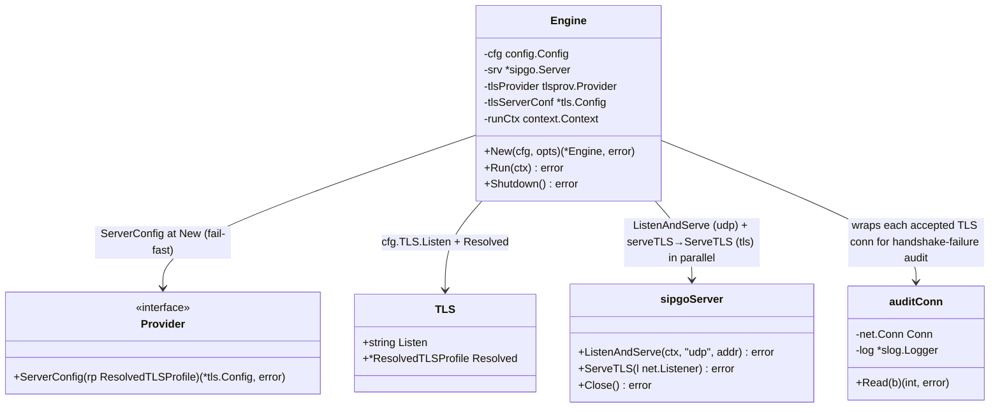

# Inbound TLS Listener — Parallel with Plain SIP (STORY-001-015)

## Requirements

Make the `tls.listen` listener real: bind its TCP port and serve SIP over TLS in parallel with
the existing plain `sip.listen` UDP listener, using the server `*tls.Config` from STORY-001-014
(certificate + min version + ciphers + optional mTLS). Both listeners share the one `sipgo.Server`
and its SIP handlers, so signaling is processed identically whether it arrives plain or encrypted.
mTLS rejection (untrusted/absent/disallowed client cert) is enforced by the server context; a TLS
handshake failure on one connection never affects the plain listener. Handshake/verification
failures are logged with peer address + reason and no certificate material. A config with no
`tls` block opens no TLS listener and leaves plain behavior byte-for-byte unchanged.

Boundary: bind and run the inbound TLS listener in parallel with the plain listener, fail-fast at
startup on a bad TLS context or bind. Building the TLS context (014) and outbound dialing (016)
are out of scope.

## Entities

Notes:
- Conservative: one field `tlsServerConf *tls.Config` on the existing `Engine`, plus a small
  unexported `serveTLS` helper and two thin wrapper types (`auditListener`, `auditConn`) used
  only for peer-addressed handshake-failure logging. Reuse the existing `tlsProvider` (STORY-013
  option), `cfg.TLS` (STORY-012), and the one `sipgo.Server`/handlers. The change is to `New`
  (build context) and `Run` (parallel listen).
- The inbound TLS listener is bound by the engine via stdlib `tls.Listen` and served with
  `srv.ServeTLS` (not sipgo's `ListenAndServeTLS`), so each accepted connection can be wrapped to
  log its own handshake failure with the peer address — sipgo's built-in accept-loop log omits it.
- `cfg.TLS.Resolved` is the resolved listener profile (STORY-012); its cert was eagerly loaded by
  `tlsprov.LoadAll` in `main.go` (STORY-013) before `New`.

## Approach

1. **Build the server context at construction (fail-fast):**
   - In `New`, after options are applied: if `cfg.TLS.Listen != ""`, require `e.tlsProvider != nil`
     (else error: TLS listener configured but no provider) and `cfg.TLS.Resolved != nil`, then
     `e.tlsServerConf, err = e.tlsProvider.ServerConfig(*cfg.TLS.Resolved)`. A build error aborts
     `New` → `main.go` exits non-zero **before** any socket binds. No `tls.listen` → leave
     `tlsServerConf` nil.

2. **Run both listeners in parallel (`errgroup`):**
   - Replace the single blocking `return e.srv.ListenAndServe(ctx, "udp", e.cfg.SIP.Listen)` with
     an `errgroup` tied to the run context: always `g.Go(udp listener)`; when `e.tlsServerConf != nil`
     also `g.Go(func() error { return e.serveTLS(gctx, e.cfg.TLS.Listen, e.tlsServerConf) })`.
     `return g.Wait()`. The shared `e.srv` means handlers registered once serve both transports.
   - `errgroup.WithContext` cancels the sibling listener when either returns an error, so a TLS
     bind failure tears down cleanly and `Run` returns that error (fail-startup, R1).
   - `serveTLS` binds the listener with stdlib `tls.Listen` (synchronous, so a bad bind fails Run
     fast) and serves it via `srv.ServeTLS`, wrapping the listener in `auditListener` so each
     accepted connection carries the handshake-failure audit hook. On clean `ctx` cancellation it
     returns `nil`, matching the plain listener's shutdown semantics. (Chosen over sipgo's
     `ListenAndServeTLS` because that path's accept-loop log omits the peer address required by AC4.)

3. **Failure isolation & mTLS:**
   - A TLS handshake failure is a per-connection event handled on sipgo's per-connection goroutine;
     the UDP listener is a separate socket and is unaffected (AC3, NFR). mTLS enforcement flows
     entirely through the server context's `ClientAuth` + `VerifyPeerCertificate` (STORY-014) — no
     engine logic needed.

4. **Audit logging (no secrets) via `auditConn`:**
   - Each accepted TLS connection is wrapped in `auditConn`. crypto/tls performs the server
     handshake lazily on the first `Read`; when it fails the connection's `HandshakeComplete` is
     still false and `Read` returns the handshake error, whose text carries no certificate or key
     bytes (e.g. `tls: client didn't provide a certificate`). `auditConn.Read` logs that once at
     WARN with the peer address and the reason. A bare `io.EOF` (TCP probe that closes before
     handshaking, e.g. a load-balancer health check) is **not** logged — it is not a handshake
     rejection. Net effect: a rejected handshake yields one log line with peer address + reason and
     no certificate material (AC4). This is the prompt's sanctioned fallback, promoted to the
     primary path because sipgo's built-in `"Read error"` log lacks the peer address.

5. **Shutdown:** `Shutdown` is unchanged (`e.srv.Close()` closes active connections). The TLS
   **accept listener** is closed by a goroutine inside `serveTLS` that waits on `ctx.Done()` and
   calls `ln.Close()` — covering both `ctx` cancellation and `Shutdown` (which cancels the run
   context). `srv.Close()` alone does not close a listener handed to `srv.ServeTLS`.

## Structure

### Type/Interface Relationships
1. `Engine` gains `tlsServerConf *tls.Config` and an unexported `serveTLS` method. Two thin
   unexported wrapper types are added in the same file: `auditListener` (wraps a `net.Listener`,
   wrapping each accepted conn) and `auditConn` (wraps `net.Conn`, logging its handshake failure).
   `Provider.ServerConfig` (STORY-014) is consumed at `New`.
2. `b2bua` now imports `crypto/tls` (hold the `*tls.Config`, bind via `tls.Listen`),
   `golang.org/x/sync/errgroup` (parallel listeners), and `errors`/`io` (suppress `io.EOF` in the
   audit hook). It uses sipgo `ServeTLS`, not `ListenAndServeTLS`.

### Dependencies
1. `New` → `tlsProvider.ServerConfig` (build once, fail-fast).
2. `Run` → `errgroup` → `srv.ListenAndServe` (udp) + `e.serveTLS` (tls), where `serveTLS` →
   `tls.Listen` + `srv.ServeTLS(auditListener)`, both bound to the run context.
3. `Shutdown` → `srv.Close()` (closes active conns) + `serveTLS`'s `ctx.Done()` goroutine
   (closes the TLS accept listener). `Shutdown` code unchanged.

### Layering
1. Construction layer (`New`): build + store the server TLS context, fail-fast.
2. Run layer (`Run`): parallel listener orchestration via errgroup; shared handlers.
3. Transport layer (sipgo + `serveTLS`): UDP accept loop via `ListenAndServe`; TLS bound by
   `tls.Listen` and served via `srv.ServeTLS`, each accepted conn wrapped by `auditConn` for
   per-connection handshake isolation + audit.
4. Teardown layer: `srv.Close()` (active conns) + `serveTLS`'s `ctx.Done()` goroutine (TLS listener).

## Operations

### Update Engine struct + `New` — `internal/b2bua/engine.go`
1. Add field `tlsServerConf *tls.Config` to `Engine`.
2. In `New`, after the `for _, opt := range opts { opt(e) }` loop, before `return e, nil`:
   - `if cfg.TLS.Listen != "" {`
     - `if e.tlsProvider == nil { return nil, fmt.Errorf("tls.listen %q configured but no TLS provider", cfg.TLS.Listen) }`
     - `if cfg.TLS.Resolved == nil { return nil, fmt.Errorf("tls.listen %q has no resolved profile", cfg.TLS.Listen) }`
     - `conf, err := e.tlsProvider.ServerConfig(*cfg.TLS.Resolved); if err != nil { return nil, fmt.Errorf("build tls server context: %w", err) }`
     - `e.tlsServerConf = conf`
   - `}`
3. Constraints: no socket bind here; only context construction. Plain-only configs leave
   `tlsServerConf` nil and reach `return e, nil` unchanged.

### Refactor `Run` — `internal/b2bua/engine.go`
1. Keep handler registration (`OnInvite`/`OnAck`/`OnBye`/`OnRefer`/`OnNoRoute`) and the
   `startObservability` block exactly as today.
2. Replace the final `return e.srv.ListenAndServe(ctx, "udp", e.cfg.SIP.Listen)` with:
   - `g, gctx := errgroup.WithContext(ctx)`
   - `g.Go(func() error { return e.srv.ListenAndServe(gctx, "udp", e.cfg.SIP.Listen) })`
   - `if e.tlsServerConf != nil { g.Go(func() error { return e.serveTLS(gctx, e.cfg.TLS.Listen, e.tlsServerConf) }) }`
   - `return g.Wait()`
3. Logic/edge cases:
   - On parent `ctx` cancel, the listeners return; `g.Wait()` returns the first non-nil error (or
     nil on clean shutdown), preserving today's return semantics for the UDP-only case.
   - A TLS bind error cancels `gctx`, stopping the UDP listener too, and surfaces from `g.Wait()`
     → `main.go` prints + exits (fail-startup, R1).
4. Constraints: race-clean (`go test -race`); goroutine ownership is the errgroup; no shared
   mutable state added.

### Add `serveTLS` + audit wrappers — `internal/b2bua/engine.go`
1. `func (e *Engine) serveTLS(ctx, addr string, conf *tls.Config) error`:
   - `ln, err := tls.Listen("tcp", addr, conf)`; on error `return fmt.Errorf("listen tls %q: %w", addr, err)`.
   - Spawn `go func() { <-ctx.Done(); _ = ln.Close() }()` so ctx cancellation / `Shutdown` closes the listener.
   - `err = e.srv.ServeTLS(&auditListener{Listener: ln, log: slog.Default()})`; `if ctx.Err() != nil { return nil }`; else `return err`.
2. `auditListener` embeds `net.Listener`; its `Accept` returns `&auditConn{Conn: c, log: l.log}`.
3. `auditConn` embeds `net.Conn` with `log *slog.Logger` and a `logged bool`. `Read` calls the
   underlying `Read`; if `err != nil && err != io.EOF && !errors.Is(err, io.EOF) && !logged` and the
   conn is a `*tls.Conn` with `!ConnectionState().HandshakeComplete`, it logs once at WARN:
   `c.log.Warn("tls handshake rejected", "peer", RemoteAddr().String(), "reason", err.Error())`.
   Never logs certificate/key bytes; never logs bare `io.EOF` probes.

### Verify `Shutdown` — `internal/b2bua/engine.go`
1. No `Shutdown` code change: `e.srv.Close()` closes active connections; the TLS accept listener is
   closed by the `ctx.Done()` goroutine inside `serveTLS`.
2. Add an assertion in tests that after `Shutdown` the TLS port no longer accepts connections.

### Add tests — `internal/b2bua/tls_listener_test.go`
1. Helpers (real fakes, AGENTS.md): mint a CA + a `127.0.0.1` server cert (stdlib
   `x509.CreateCertificate`) and write them to `t.TempDir()`; `serverProfile(t, verifyPeer)` returns
   a `config.ResolvedTLSProfile`; `tlsConfig(...)` augments `testConfig` with a `tls` block bound to
   that profile; `newFakeUACTLS(t, clientConf *tls.Config)` — a TLS-capable fake caller (UA built
   with `sipgo.WithUserAgenTLSConfig`, no inbound listener; in-dialog responses return on the TLS
   connection); `startEngineTLS(t, cfg)` wires `WithTLSProvider` and waits for the TLS port to bind;
   `dialTLSNoClientCert(addr)` raw-dials presenting no cert and **reads one byte after the handshake**
   (TLS 1.3 surfaces a server's client-cert rejection only on the first read, not from `Handshake`).
2. Behavior tests (one behavior each):
   - `TestTLSAndPlainListenersActive` (AC1/AC2): engine with `sip.listen` + `tls.listen`; a plain
     UDP caller completes a full INVITE/ACK (registry == 1), and a TLS caller is sequenced through
     the same handlers to a **200 OK** answer. The TLS caller asserts to the 200, not the ACK:
     in-dialog requests follow the engine `Contact` (still the plain host:port), whose per-transport
     rewriting is out of this story's scope.
   - `TestMTLSRejectsUntrustedClient` (AC3): TLS listener with an mTLS profile (`verify_peer:true`);
     `dialTLSNoClientCert` is rejected, the engine sees no INVITE (`app.noInvite`), and a concurrent
     plain UDP call still completes — rejection confined to the TLS connection.
   - `TestHandshakeFailureLoggedNoSecrets` (AC4): install a capturing `slog.Handler` before start;
     a rejected handshake logs `"tls handshake rejected"` with non-empty `peer` + `reason` and no
     `BEGIN CERTIFICATE` / `PRIVATE KEY` material.
   - `TestNoTLSListenNoTLSPort` (AC6): config with no `tls` block → `New` leaves `tlsServerConf` nil.
   - `TestShutdownClosesTLSListener`: after `Shutdown`, the TLS port refuses connections.
   - `TestNewFailsFastOnTLSMisconfig` (R1): `tls.listen` with no provider, or with a nil resolved
     profile, makes `New` return an error before any bind.
   - AC5 (enabling TLS leaves the plain path unchanged) is covered implicitly: the plain UDP call in
     `TestTLSAndPlainListenersActive` runs through an engine with `tls.listen` enabled, and the
     existing plain-only suite is unchanged.

## Norms

1. **Go style:** `gofmt`/`go vet` clean. Errors are values, wrapped with `fmt.Errorf("...: %w")`;
   never log certificate/key material.
2. **Concurrency:** parallel listeners via `golang.org/x/sync/errgroup` bound to the run context;
   goroutine ownership is the errgroup; no new shared mutable state; `go test -race` clean.
3. **Conservative change:** one new `Engine` field plus a small unexported `serveTLS` helper and
   `auditListener`/`auditConn` wrappers (peer-addressed audit only); edits to `New` and `Run`; no
   change to handlers, dialog caches, or `Shutdown` logic. Plain path untouched (AC5).
4. **Fail-fast:** TLS context built in `New` (before bind); bind failures surface from `Run` →
   `main.go` exits. No degraded "plain-only" fallback when TLS is requested (R1).
5. **Boundary:** the engine consumes `tlsprov.Provider.ServerConfig`; it does not build TLS policy
   itself. `internal/config` still imports no TLS library.
6. **Tests (BDD, real fakes):** real generated certs, a TLS-capable fake caller, in-process
   listeners; one behavior per test; external peer is the only fake.
7. **No idle timeout:** connection lifetime follows the SIP/dialog layer as today (the requirement
   has no inactivity timeout).

## Safeguards

1. **Parallel by construction:** plain UDP on `sip.listen` and TLS on `tls.listen` are independent
   sockets on the shared server, both active at once; neither replaces the other (AC1, AC6).
2. **Identical signaling:** once the TLS handshake completes, SIP is processed by the same handlers
   as the plain path — only the transport differs (AC2).
3. **mTLS enforcement & isolation:** an untrusted/absent/disallowed client cert is rejected at the
   TLS handshake (from the STORY-014 server context); rejection is confined to the TLS connection
   and never disturbs plain calls (AC3, NFR).
4. **No secret leakage:** handshake/verification failures are logged via the `auditConn` wrapper
   (the engine binds `tls.Listen` + `srv.ServeTLS` precisely so the peer address is available, which
   sipgo's built-in accept-loop log omits) with peer address + reason and no certificate/key bytes;
   bare `io.EOF` TCP probes are not logged (AC4).
5. **Backward compatible:** adding a `tls.listen` does not change plain-listener behavior; a config
   with no `tls` block binds no TLS port (AC5, AC6).
6. **Fail-fast startup:** a bad TLS context (build error) aborts `New`; a TLS bind failure aborts
   `Run`; the process exits non-zero rather than running degraded (R1).
7. **Clean teardown:** `ctx` cancellation and `Shutdown` both stop the TLS listener — `serveTLS`'s
   `ctx.Done()` goroutine closes the accept listener and `srv.Close()` drops active conns; no leaked
   goroutine or bound port.
8. **Non-blocking:** a slow/failed handshake on one connection does not block accepts on the other
   listener (separate sockets; per-connection handshake).
9. **Definition of done (AGENTS.md):** `go build ./...`, `go vet ./...`, `gofmt`, `go test -race ./...`
   pass; behavior tests cover AC1–AC6 + shutdown; `golang.org/x/sync` promoted to a direct dependency.
