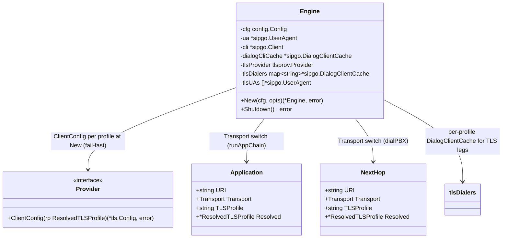

# Outbound TLS to Applications & Next Hop (STORY-001-016)

## Requirements

Let the sequencer originate SIP legs over TLS — to each `sequence` application and to the
`next_hop` — when that endpoint sets `transport: tls`. An outbound endpoint has exactly one
transport, so TLS is a switch (TLS or plain, never both). Because sipgo binds the outbound TLS
`*tls.Config` at the **UserAgent** level (no per-request config), build one `sipgo.UserAgent` +
`Client` + `DialogClientCache` per distinct outbound `tls_profile`, each carrying that profile's
client context (STORY-014, including the client certificate for mTLS and CA validation of the
remote). Honour `connect_timeout` so a dead TLS peer fails fast instead of hanging the call. A TLS
dial failure feeds the existing per-application failure policy (skip/abort) unchanged. One profile
reused by several endpoints reuses one certificate (loaded once). Plain legs are unchanged.

Boundary: outbound dialing only. Config/resolution (012), cert loading (013), context building
(014), and the inbound listener (015) are done; this story consumes the client context and wires
the dial path. No new TLS policy logic here.

## Entities

Notes:
- Conservative: **no new public types**. Add a per-profile dialer map (`tlsDialers`) and a slice of
  owned UAs (`tlsUAs`) to the existing `Engine`; reuse the existing `ua`/`cli`/`dialogCliCache` for
  plain/TCP legs untouched. `config.Application`/`NextHop` already carry `Transport`/`TLSProfile`/
  `Resolved` (STORY-012).
- One UA+Client+DialogClientCache per **distinct** outbound profile (keyed by profile name): the
  common case (a single `outbound` profile reused) is one extra dialer; AC5 cert reuse falls out
  (one profile → one client config → one loaded cert).

## Approach

1. **Per-profile TLS dialers (the sipgo constraint):**
   - sipgo's outbound TLS `*tls.Config` is set on the UserAgent (`WithUserAgenTLSConfig`), not per
     request. So in `New`, after the server context, collect the distinct outbound TLS profiles —
     every `cfg.Sequence[i]` with `Transport == tls` (using `Resolved`) and `cfg.NextHop` when
     `Transport == tls` — and for each profile name not yet built: `conf, err :=
     tlsProvider.ClientConfig(*resolved)`; `ua, err := sipgo.NewUA(sipgo.WithUserAgenTLSConfig(conf))`;
     `cli, err := sipgo.NewClient(ua, sipgo.WithClientHostname(host))`; `cache :=
     sipgo.NewDialogClientCache(cli, contactHDR)`. Store `tlsDialers[name] = cache` and append `ua`
     to `tlsUAs`. Any error aborts `New` (fail-fast, consistent with eager load).

2. **Transport switch — applications (`runAppChain`):**
   - Replace the unconditional `appURI = withTCP(appURI)` + `e.dialogCliCache.Invite` with a switch
     on `app.Transport`:
     - `tls` → `appURI = withTransport(appURI, "tls")`; `cache := e.tlsDialers[app.TLSProfile]`;
       dial with a connect-timeout-bounded context derived from `app.Resolved.ConnectTimeout`.
     - otherwise → `appURI = withTCP(appURI)`; `cache := e.dialogCliCache` (unchanged). Plain app
       legs **stay forced-TCP** (the existing MTU guard for tap SDP; `transport` only switches
       TLS-vs-plain, R2).
   - `appSess, err := cache.Invite(dialCtx, appURI, inviteBody, appHeaders...)`. The existing
     failure branch (metrics + `on_failure` skip/abort) is unchanged — a TLS dial failure flows
     through it (AC3).

3. **Transport switch — next hop (`dialPBX`):**
   - Switch on `cfg.NextHop.Transport`: `tls` → `withTransport(pbxURI, "tls")` + `e.tlsDialers[NextHop.TLSProfile]`
     + connect-timeout ctx; `tcp` → `withTCP`; `udp`/default → unchanged (today's plain path). Dial
     via the chosen cache. The existing PBX-failure handling is unchanged.

4. **Connect timeout (R3):**
   - `dialContext(parent, rp)`: when `rp != nil && rp.ConnectTimeout > 0` →
     `context.WithTimeout(parent, rp.ConnectTimeout)` (caller defers cancel); else return parent +
     a no-op cancel. Used to bound the `Invite` call, which is where sipgo performs the TCP+TLS
     connect — so a dead TLS peer fails after ~`connect_timeout` instead of hanging (AC4). `0` =
     unlimited (OS/sipgo default).

5. **Lifecycle:** `Shutdown` closes each per-profile UA (`ua.Close()` for `e.tlsUAs`) in addition to
   the existing teardown. No GlobalExceptionHandler / layering — Go errors as values.

## Structure

### Type/Interface Relationships
1. No new interface/type. `Engine` gains `tlsDialers map[string]*sipgo.DialogClientCache` and
   `tlsUAs []*sipgo.UserAgent`. `Provider.ClientConfig` (STORY-014) consumed at `New`.
2. `withTransport(u sip.Uri, transport string) sip.Uri` generalizes the existing `withTCP`
   (`withTCP` becomes `withTransport(u, "tcp")` or a thin wrapper).
3. `dialContext(ctx, rp) (context.Context, context.CancelFunc)` is an unexported helper.

### Dependencies
1. `New` → `tlsProvider.ClientConfig` (per distinct profile) → `sipgo.NewUA`/`NewClient`/
   `NewDialogClientCache`. Fail-fast.
2. `runAppChain`/`dialPBX` → `withTransport` + `dialContext` + the chosen `DialogClientCache.Invite`.
3. `Shutdown` → close `tlsUAs` + existing teardown.

### Layering
1. Construction layer (`New`): build per-profile TLS dialers, fail-fast.
2. Origination layer (`runAppChain`/`dialPBX`): per-endpoint transport switch → plain or TLS dialer.
3. Failure layer: existing `on_failure` skip/abort policy consumes TLS dial failures unchanged.
4. Teardown layer (`Shutdown`): close owned UAs.

## Operations

### Update Engine struct + `New` — `internal/b2bua/engine.go`
1. Add fields `tlsDialers map[string]*sipgo.DialogClientCache` and `tlsUAs []*sipgo.UserAgent`;
   initialize `tlsDialers` to an empty map in `New`.
2. After the server-context block, build outbound dialers:
   - Gather distinct outbound TLS profiles into a `map[string]*config.ResolvedTLSProfile`: for each
     `cfg.Sequence[i]` where `Transport == config.TransportTLS` add `Resolved`; if
     `cfg.NextHop.Transport == config.TransportTLS` add `cfg.NextHop.Resolved`. Skip nils.
   - Require `e.tlsProvider != nil` if the set is non-empty (else error naming the first endpoint).
   - Dedup keyed by `Resolved.Name`; track the first contributing endpoint in a
     `firstEndpoint` string so the no-provider error names it
     (`"%s uses transport tls but no TLS provider"`).
   - For each `(name, rp)`: `conf, err := e.tlsProvider.ClientConfig(*rp)` (wrap error with the
     profile name); `ua, err := sipgo.NewUA(sipgo.WithUserAgenTLSConfig(conf))`; `cli, err :=
     sipgo.NewClient(ua, sipgo.WithClientHostname(host))`; `cache := sipgo.NewDialogClientCache(cli, contactHDR)`;
     `e.tlsDialers[name] = cache`; `e.tlsUAs = append(e.tlsUAs, ua)`.
3. Constraints: build once per distinct profile name (dedup); no socket connects here (UA/client
   construction only); fail-fast aborts `New`.

### Add helpers — `internal/b2bua/bridge.go`
1. `func withTransport(u sip.Uri, transport string) sip.Uri`: clone `u.UriParams`, set
   `transport` param, return. Reimplement `withTCP` as `withTransport(u, "tcp")`.
2. `func dialContext(parent context.Context, rp *config.ResolvedTLSProfile) (context.Context, context.CancelFunc)`:
   if `rp != nil && rp.ConnectTimeout > 0` → `context.WithTimeout(parent, rp.ConnectTimeout)`; else
   `return parent, func(){}`.

### Update `runAppChain` — `internal/b2bua/bridge.go`
1. Remove the early unconditional `appURI = withTCP(appURI)`. Place the transport switch
   **immediately before** the `Invite` (after tap acquisition), so the timeout context never
   leaks on the tap-failure `continue` paths that precede it:
   - `cache := e.dialogCliCache; dialCtx, dialCancel := ctx, context.CancelFunc(func(){})` (defaults).
   - `if app.Transport == config.TransportTLS { appURI = withTransport(appURI, "tls"); cache = e.tlsDialers[app.TLSProfile]; dialCtx, dialCancel = dialContext(ctx, app.Resolved) } else { appURI = withTCP(appURI) }`
   - `appSess, err := cache.Invite(dialCtx, appURI, inviteBody, appHeaders...)` then `dialCancel()`
     **right after `Invite` returns**, before `WaitAnswer`, so the connect timeout does not bound
     answer waiting — answer is bounded by the existing `legTimeout`.
2. Constraints: the existing media/tap, failure-policy, and `WaitAnswer(legCtx, ...)` logic is
   unchanged — only URI transport, the dialer, and the dial context change. Plain app legs behave
   exactly as today (forced TCP).

### Update `dialPBX` — `internal/b2bua/bridge.go`
1. After parsing `pbxURI` from `e.cfg.NextHop.URI`, apply the next-hop transport switch:
   - `tls` → `pbxURI = withTransport(pbxURI, "tls")`; `cache := e.tlsDialers[e.cfg.NextHop.TLSProfile]`;
     `dialCtx, cancel := dialContext(ctx, e.cfg.NextHop.Resolved)`.
   - `tcp` → `pbxURI = withTransport(pbxURI, "tcp")`; `cache := e.dialogCliCache`.
   - `udp`/default → unchanged (today's plain path); `cache := e.dialogCliCache`.
   - Defaults before the switch: `cache := e.dialogCliCache; dialCtx, dialCancel := ctx, context.CancelFunc(func(){})`.
   - `pbxSess, err := cache.Invite(dialCtx, pbxURI, pbxOffer, pbxHeaders...)` then `dialCancel()`
     right after `Invite` returns (before `WaitAnswer`).
2. Constraints: the existing PBX failure handling (`TerminatingHopFailure`, 503) and answer/anchor
   logic are unchanged.

### Update `Shutdown` — `internal/b2bua/engine.go`
1. Before/after the existing teardown, `for _, ua := range e.tlsUAs { _ = ua.Close() }`.
2. Constraint: idempotent and safe even when `tlsUAs` is empty (plain configs).

### Add tests — `internal/b2bua/outbound_tls_test.go`
1. Helpers (real fakes), reusing the cert helpers from `tls_listener_test.go`
   (`mintCert`/`writePEM`/`certPEM`/`keyPEM`):
   - `newFakeUASTLS(t, srvConf)` — `newFakeUASTCP` over a `tls.Listen` listener (`srv.ServeTLS`);
     a request reaches it only after a completed TLS handshake.
   - `outboundFixture(t, requireClientCert)` — mints a CA signing both a 127.0.0.1 server cert and
     the sequencer's client cert; writes client cert+key+CA via `writeClientProfile`; returns the
     resolved outbound profile and a server `*tls.Config` (`serverTLSConf`, mTLS when
     `requireClientCert`).
   - `outboundTLSConfig(...)` wires `cfg.Sequence[0]` to `transport: tls` + `Resolved` (rather than
     extending `testConfig`).
   - `blackHoleAddr(t)` — a TCP listener that accepts and holds connections without ever speaking
     TLS, so a dial hangs until its context expires.
   - `countingProvider` — wraps a `tlsprov.Provider`, counting `ClientConfig` calls.
2. Cover AC1–AC6:
   - `TestAppLegSwitchesTLSvsPlain` (AC1): app `transport: tls` → leg established over TLS against a
     TLS-only fake (a plain dial would never handshake), call connects end-to-end. (The `tcp` half of
     AC1 is covered by the existing `TestAppInviteUsesTCP`.)
   - `TestOutboundMutualTLSPresentsClientCert` (AC2): TLS app whose remote requires client auth →
     sequencer presents the client cert; connection accepted.
   - `TestUntrustedRemoteRefusedThenSkip` (AC3): remote cert signed by a CA the profile does not
     trust, app `on_failure: skip` → dial refused (never reaches the fake), call driven manually
     (only the pbx leg answers, since the app is skipped) → caller gets 200.
   - `TestConnectTimeoutFailsFast` (AC4): `connect_timeout: 200ms` to `blackHoleAddr`, `on_failure:
     abort` → caller gets a non-200 final response well within the leg timeout, not hanging.
   - `TestProfileReusedReusesCert` (AC5): an app and the next hop both `tls_profile: outbound` → assert
     `len(e.tlsDialers) == 1` and the `countingProvider` recorded exactly one `ClientConfig` call
     (one client context → one loaded cert).
   - `TestPlainNextHopDialsPlain` (AC6 / backward path): plain config → `len(e.tlsDialers) == 0` and
     the call dials plain as today.
   - `TestShutdownClosesTLSUAs`: a TLS-app config builds one owned UA; `Shutdown` closes it and is
     idempotent (a second `Shutdown` returns nil).

## Norms

1. **Go style:** `gofmt`/`go vet` clean. Errors are values, wrapped with `fmt.Errorf("...: %w")`,
   naming the profile/endpoint; never log certificate/key material.
2. **Conservative change:** reuse the existing plain dialer for non-TLS legs; add per-profile dialers
   only for TLS. The media/tap, failure-policy, and answer-wait logic are untouched.
3. **sipgo constraint honoured:** one UA+Client+DialogClientCache per distinct outbound profile
   (UA-level TLS config); no attempt at a per-request `*tls.Config`.
4. **Connect vs answer timeout:** `connect_timeout` bounds only the `Invite` (connect); the existing
   `legTimeout` continues to bound `WaitAnswer`. The dial context is cancelled before answer waiting.
5. **Boundary:** the engine consumes `tlsprov.Provider.ClientConfig`; it builds no TLS policy.
6. **Tests (BDD, real fakes):** a TLS-listening fake UAS, real generated certs; one behavior per
   test; failure policy tested for real; `go test -race` clean.
7. **No new abstraction (YAGNI):** no connection pooling, no SRV/NAPTR resolution (not in scope).

## Safeguards

1. **Single-switch transport:** each app / next hop is TLS or plain by its one `transport` value —
   never both; the value alone selects the dialer (AC1).
2. **Mutual TLS:** a TLS leg presents the profile's client certificate and validates the remote
   against the profile CA (from `ClientConfig`, STORY-014) (AC2, AC8-equivalent).
3. **Failure isolation:** a refused/failed TLS dial (untrusted remote, unreachable peer) is confined
   to that endpoint and resolved through the existing `on_failure` skip/abort policy — it never
   crashes or stalls the whole call (AC3, NFR).
4. **Fail-fast connect:** `connect_timeout > 0` abandons a non-responding TLS dial after the timeout
   with a clear error; `0` = unlimited (AC4).
5. **Cert reuse:** several endpoints naming one profile share one dialer and one loaded certificate;
   no duplicate key material (AC5).
6. **Plain unchanged:** non-TLS app legs stay forced-TCP (MTU guard); a plain next hop dials exactly
   as today; plain configs build no TLS dialers and carry no TLS overhead (AC6).
7. **No secret leakage:** no certificate/key/passphrase bytes appear in any outbound log, success or
   failure.
8. **Lifecycle:** per-profile UAs are closed on `Shutdown`; no leaked client/UA.
9. **Definition of done (AGENTS.md):** `go build ./...`, `go vet ./...`, `gofmt`, `go test -race ./...`
   pass; behavior tests cover AC1–AC6 + shutdown; existing plain-leg tests stay green.
