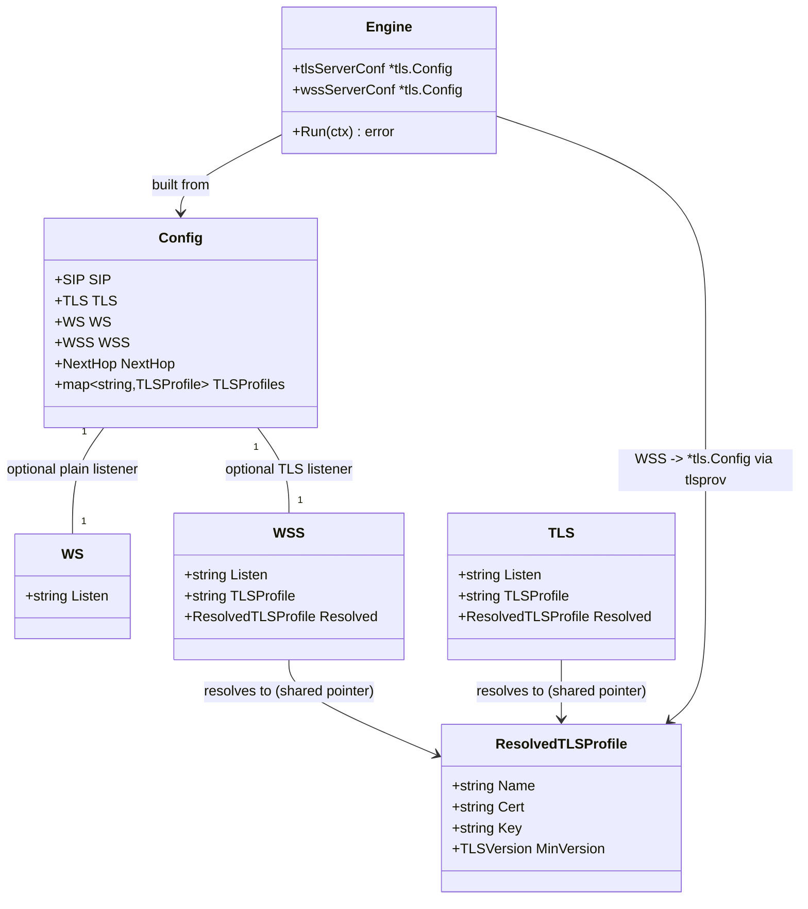

# WebSocket SIP signaling transport (STORY-001-017)

> Go B2BUA (sipgo). Follows the established inbound-TLS-listener pattern
> (`STORY-001-014/015`). Stack idioms apply: errors are values
> (`fmt.Errorf("...: %w")`), `log/slog` for logs, functional core / side effects at
> the edges, small consumer-side interfaces, no Spring-style scaffolding. Decision:
> use sipgo's `ws`/`wss` transport **as-is** (no fork, no wrapper).

## Requirements
- Add WebSocket as an inbound SIP transport, peer to UDP/TCP/TLS, so jssip / sip.js
  webphones (RFC 7118) reach the sequencer with no client change.
- Offer two optional, opt-in listeners: **WS** (plain, dev) and **WSS** (TLS, prod),
  each on its own address, running in parallel with the existing listeners.
- Keep WebSocket a pure transport: SIP parsed and routed by the unchanged B2BUA
  code path; the `sip` subprotocol is negotiated by the transport.
- Stay fully backward compatible: a config with no `ws`/`wss` keys behaves exactly
  as today and binds no WebSocket port.
- Fail fast: a WSS listener naming an unloadable/invalid certificate aborts startup
  before any socket binds.

## Entities

**Conservative-design note:** `WSS` is structurally identical to the existing `TLS`
listener struct and reuses the `TLSProfile` / `ResolvedTLSProfile` model verbatim —
no new TLS concept. `WS` mirrors `SIP` (a single `Listen` scalar). No existing type
is restructured; all additions are new optional fields. Both new keys are absent →
zero behavior change.

## Approach
1. Configuration (parse + validate + resolve):
   - Add optional `ws` (`{listen}`) and `wss` (`{listen, tls_profile}`) blocks,
     mirroring `sip.listen` and the `tls` listener block. Empty `Listen` = disabled.
   - Validate `wss` exactly like `tls.listen`: a non-empty `wss.listen` requires a
     `tls_profile`, must be a valid `host:port`, and the named profile must exist in
     `tls_profiles`. Validate `ws.listen` is a valid `host:port` when set.
   - Resolve the `wss` profile in `resolveTLS` (shared-pointer dedup with any other
     endpoint naming the same profile).
2. Certificate loading (fail-fast at startup):
   - Extend `tlsprov.LoadAll` to include `cfg.WSS.Resolved`, so a bad WSS cert
     aborts before binding — same guarantee the TLS listener already has.
3. Engine wiring (listener lifecycle):
   - In `Engine.New`, build `wssServerConf *tls.Config` from `cfg.WSS.Resolved` via
     `tlsProvider.ServerConfig`, fail-fast — a direct copy of the existing
     `tlsServerConf` block (guarded by `cfg.WSS.Listen != ""`).
   - In `Engine.Run`, add `errgroup` siblings: `srv.ListenAndServe(gctx,"ws",addr)`
     for WS and `srv.ListenAndServeTLS(gctx,"wss",addr,wssServerConf)` for WSS,
     alongside the existing UDP and TLS goroutines. sipgo owns ws/wss framing, the
     `sip` subprotocol, and the upgrade.
4. Routing (no change):
   - The shared `srv` already has `OnInvite`/`OnAck`/`OnBye`/`OnRefer`/`OnNoRoute`
     bound; a ws-accepted request flows through them identically — no
     transport-conditional code anywhere.
5. Error / shutdown strategy (Go idioms, not exception handlers):
   - Listener errors are returned values; the `errgroup` ties all listeners to one
     context so any bind failure cancels siblings and `Run` returns it (fail-fast).
   - A clean `ctx` cancel returns `nil`, matching UDP/TLS shutdown semantics. Run
     `go test -race`.

## Structure

### Inheritance Relationships
- No inheritance (Go). `WS` and `WSS` are plain config structs; `WSS` reuses
  `ResolvedTLSProfile` like `TLS`.
- `Engine` continues to depend on the consumer-side `tlsprov.Provider` interface
  (`ServerConfig(ResolvedTLSProfile) (*tls.Config, error)`) — unchanged.

### Dependencies
- `cmd/sip-sequencer/main.go` → `config.Load` → `tlsprov.LoadAll(cfg, provider)` →
  `b2bua.New(cfg, WithTLSProvider(provider))` → `eng.Run(ctx)`.
- `Engine.New` calls `tlsProvider.ServerConfig` for both `TLS` and `WSS` listeners.
- `Engine.Run` calls `srv.ListenAndServe` (ws) and `srv.ListenAndServeTLS` (wss) on
  the sipgo `Server`.
- `config.resolveTLS` / `validateTLSWiring` gain WSS handling; `tlsprov.LoadAll`
  gains the WSS profile.
- `github.com/gobwas/ws` (already a transitive dep of sipgo) becomes a **direct**
  module dependency: `ws_listener_test.go` imports `ws.Dialer` to assert the
  negotiated `sip` subprotocol. `go mod tidy` promotes it from `// indirect`.

### Layered Architecture
1. Config layer (`internal/config`): parse, validate, resolve WS/WSS; pure, no I/O
   beyond file read in `Load`.
2. Certificate layer (`internal/tlsprov`): eager load of every referenced profile
   incl. WSS; build server `*tls.Config`.
3. Engine layer (`internal/b2bua`): build per-listener TLS context (fail-fast at
   `New`); own listener lifecycle in `Run` via `errgroup`.
4. Transport layer (sipgo, external dep): ws/wss upgrade, `sip` subprotocol, frame
   ↔ SIP message — used as-is.
5. Routing layer (`internal/b2bua` handlers): unchanged, transport-agnostic.

## Operations

### Update Config types — `internal/config/config.go`
1. Responsibility: declare the optional WS/WSS listener config and expose it on
   `Config` and `rawConfig`.
2. Add types:
   - `type WS struct { Listen string \`yaml:"listen"\` }`
   - `type WSS struct { Listen string \`yaml:"listen"\`; TLSProfile string \`yaml:"tls_profile"\`; Resolved *ResolvedTLSProfile \`yaml:"-"\` }`
3. Add fields to both `Config` and `rawConfig`: `WS WS \`yaml:"ws"\`` and
   `WSS WSS \`yaml:"wss"\``. Copy them in `Parse` (`cfg.WS = raw.WS`,
   `cfg.WSS = raw.WSS`) alongside the existing scalar fields.
4. Constraints: both blocks optional; absent → zero-value (disabled). No defaults
   needed (no `applyDefaults` change).

### Update validation — `internal/config/config.go` `validateTLSWiring`
1. Responsibility: enforce WS/WSS wiring rules, mirroring the `tls.listen` rules.
2. Logic (append to `validateTLSWiring`, after the existing `tls.listen` block):
   - If `c.WS.Listen != ""`: require valid `host:port`
     (`net.SplitHostPort`) → error `invalid ws.listen %q: %w`.
   - If `c.WSS.Listen != ""`:
     - require `c.WSS.TLSProfile != ""` → error `wss.listen requires a tls_profile`.
     - require valid `host:port` → error `invalid wss.listen %q: %w`.
     - require the profile exists: `if _, ok := c.TLSProfiles[c.WSS.TLSProfile]; !ok` →
       error `wss.listen: unknown tls_profile %q`.
3. Constraints: WS carries no `tls_profile` (none in struct). Messages name the
   offending key so an operator fixes the file without reading source.

### Update resolution — `internal/config/config.go` `resolveTLS`
1. Responsibility: attach the shared `*ResolvedTLSProfile` to the WSS listener.
2. Logic: after the `cfg.TLS.Listen` resolve block, add:
   `if cfg.WSS.Listen != "" { r, err := resolve(cfg.WSS.TLSProfile); if err != nil { return err }; cfg.WSS.Resolved = r }`.
3. Constraints: a WSS profile shared with `tls.listen` / a sequence app / next_hop
   resolves to the same pointer (literal identity preserved by the `resolve` cache).

### Update eager cert load — `internal/tlsprov/load_all.go` `LoadAll`
1. Responsibility: ensure the WSS certificate loads at startup (fail-fast).
2. Logic: add `profiles = append(profiles, cfg.WSS.Resolved)` to the profile list
   (next to `cfg.TLS.Resolved`). The existing `nil` guard and provider-cache dedup
   handle the disabled and shared cases.
3. Constraints: no duplicate load when the same profile backs `tls.listen` and
   `wss` (provider cache dedups).

### Update Engine construction — `internal/b2bua/engine.go` `Engine` + `New`
1. Responsibility: build the WSS server TLS context once, fail-fast, before any bind.
2. Add field: `wssServerConf *tls.Config` on `Engine`.
3. Logic (after the existing `cfg.TLS.Listen` server-context block in `New`):
   - `if cfg.WSS.Listen != "" {`
     - `if e.tlsProvider == nil { return nil, fmt.Errorf("wss.listen %q configured but no TLS provider", cfg.WSS.Listen) }`
     - `if cfg.WSS.Resolved == nil { return nil, fmt.Errorf("wss.listen %q has no resolved profile", cfg.WSS.Listen) }`
     - `conf, err := e.tlsProvider.ServerConfig(*cfg.WSS.Resolved); if err != nil { return nil, fmt.Errorf("build wss server context: %w", err) }`
     - `e.wssServerConf = conf`
   - `}`
4. Constraints: byte-for-byte mirror of the `tlsServerConf` block; same error style.

### Update listener lifecycle — `internal/b2bua/engine.go` `Run`
1. Responsibility: start WS/WSS listeners in parallel with UDP/TLS under the shared
   `errgroup`, fail-fast, clean-cancel-returns-nil.
2. Logic (inside `Run`, after the existing `if e.tlsServerConf != nil` goroutine):
   - `if e.cfg.WS.Listen != "" { g.Go(func() error { return e.srv.ListenAndServe(gctx, "ws", e.cfg.WS.Listen) }) }`
   - `if e.wssServerConf != nil { g.Go(func() error { return e.srv.ListenAndServeTLS(gctx, "wss", e.cfg.WSS.Listen, e.wssServerConf) }) }`
3. Notes:
   - sipgo's `ListenAndServe`/`ListenAndServeTLS` already close their listener on
     `gctx` cancel and return; treat their post-cancel return like the plain
     listener (the `errgroup` context cancellation is the shutdown signal).
   - sipgo advertises/negotiates the `sip` subprotocol natively; no extra wiring.
4. Constraints: do not touch the UDP or TLS goroutines; WS/WSS are additive siblings.

### Create tests — `internal/b2bua/ws_listener_test.go`
1. Responsibility: prove the ACs behaviorally with a **real** WebSocket SIP client
   (sipgo ws client / `gobwas/ws`) — no mocks of internal code (AGENTS.md). Reuse
   the cert helpers from `tls_listener_test.go` for WSS.
2. Tests (Given/When/Then, one behavior each):
   - `TestWebSocketListenerRoutesInvite`: WS listener up + a real ws SIP client →
     sends INVITE → bridged by the B2BUA like UDP (AC1, AC3).
   - `TestWebSocketSecureListenerRoutesInvite`: WSS listener with a minted cert + a
     `wss://` client → connects over TLS and signaling proceeds (AC2).
   - `TestWebSocketNegotiatesSipSubprotocol`: the upgrade response selects `sip`
     (AC4, rescoped).
   - `TestWebSocketAndUDPListenersServeConcurrently`: UDP + WS both serve in the
     same run (AC5).
   - `TestNoWebSocketConfigBindsNoWebSocketPort`: config without `ws`/`wss` → no
     WebSocket port bound, plain behavior intact (AC6).
   - `TestNewFailsFastOnWSSMisconfig`: a `wss.listen` with no provider, or with no
     resolved profile, aborts `New` rather than starting degraded (R1 fail-fast;
     mirrors `TestNewFailsFastOnTLSMisconfig`).
   - Non-functional: a ws-originated call must not perturb the UDP listener (covered
     by the concurrent test); run all under `-race`.
3. Test harness (`startEngineWS`): the starter must wait for **one ready signal per
   sipgo listener** (UDP + WS + WSS) before returning — sipgo's `ListenAndServe`/
   `ListenAndServeTLS` write their per-listener closer and only then fire the ready
   callback. Gating on the first signal alone lets `t.Cleanup`'s cancel race a sibling
   still writing its closer inside sipgo (a `-race` panic on the UDP closer). Counting
   one signal per listener establishes happens-before for every closer. The WS caller
   reuses `newFakeUAC` dialing `;transport=ws`; the WSS caller reuses `newFakeUACTLS`
   dialing `;transport=wss`; the subprotocol test uses a raw `gobwas/ws` `ws.Dialer{
   Protocols: ["sip"]}` and asserts the negotiated `Handshake.Protocol == "sip"`.

### Update config tests — `internal/config/config_test.go`
1. Add cases: valid `ws`/`wss` blocks parse and resolve; `wss.listen` without
   `tls_profile` fails; `wss.listen` with an unknown profile fails; bad `ws.listen`
   / `wss.listen` `host:port` fails; absent blocks leave WS/WSS zero-valued and the
   config valid (backward compatibility).

## Norms
1. Errors: return values, wrapped with `fmt.Errorf("...: %w", err)`; messages name
   the offending config key (e.g. `wss.listen: unknown tls_profile %q`). No panics
   in config/engine paths.
2. Logging: `log/slog` only; never log certificate or key bytes (reuse existing
   discipline). WS/WSS listener start may log at info like the TLS listener.
3. Config pattern: optional blocks are zero-value-disabled and gated by
   `Listen != ""`; KnownFields(true) stays on, so unknown YAML keys still error.
4. Concurrency: each listener is one `g.Go` goroutine on the shared `errgroup`;
   clear ownership; no shared mutable state added; verified with `go test -race`.
5. Reuse over rebuild: WSS reuses `TLS`/`ResolvedTLSProfile`/`tlsprov` verbatim;
   mirror the existing `tls.listen` code blocks rather than introduce new helpers.
6. Tests: Given/When/Then names by behavior (`TestWebSocket...`); real ws client as
   a real fake; only external peers are faked, never internal engine code.
7. `gofmt` + `go vet` clean; idiomatic Go; small consumer-side interfaces only.

## Safeguards
1. Functional: a webphone over WS/WSS places a call bridged identically to UDP/TCP/
   TLS; the negotiated subprotocol is `sip`; absent `ws`/`wss` → no port bound and
   today's behavior byte-for-byte.
2. Backward compatibility: no change to `SIP`, `TLS`, `sequence`, `next_hop`
   semantics; all WebSocket config is additive and optional; existing tests pass
   unchanged.
3. Fail-fast: a `wss.listen` profile that fails to load or build aborts startup
   (`LoadAll` + `New`) before any listener binds — no degraded run.
4. Parallel non-interference: enabling WS/WSS must not alter UDP/TCP/TLS behavior; a
   slow/failed WS upgrade must not block accepts on other listeners (sipgo accepts
   per-connection; verified by the concurrent test).
5. Integration: uses sipgo v1.4.0 ws/wss transport **as-is** — no fork, no wrapper.
6. Accepted limitations (per Decision Log, not defects): the transport advertises/
   negotiates `sip` but does not actively reject a client that omits it; WebSocket
   ping/pong is not handled (idle keep-alive deferred to TCP keep-alive + RFC 5626
   CRLF keep-alive in STORY-001-018); only text frames carry SIP (binary out of
   scope).
7. Security: WSS reuses the audited TLS context (versions, ciphers, verification)
   from the profile; never log certificate/key material.
8. Data/validation: `ws.listen` and `wss.listen` must be valid `host:port`; `wss`
   requires an existing `tls_profile`; WS carries no `tls_profile`.
9. Concurrency safety: all listeners share one `errgroup`/context; bind failure
   cancels siblings, clean cancel returns `nil`; `go test -race` is part of done.
10. Out of scope: SIP Outbound/Path/CRLF keep-alive (STORY-018), all media-plane
    work (STORY-019..021), WSS handshake-failure audit logging, certificate reload.
