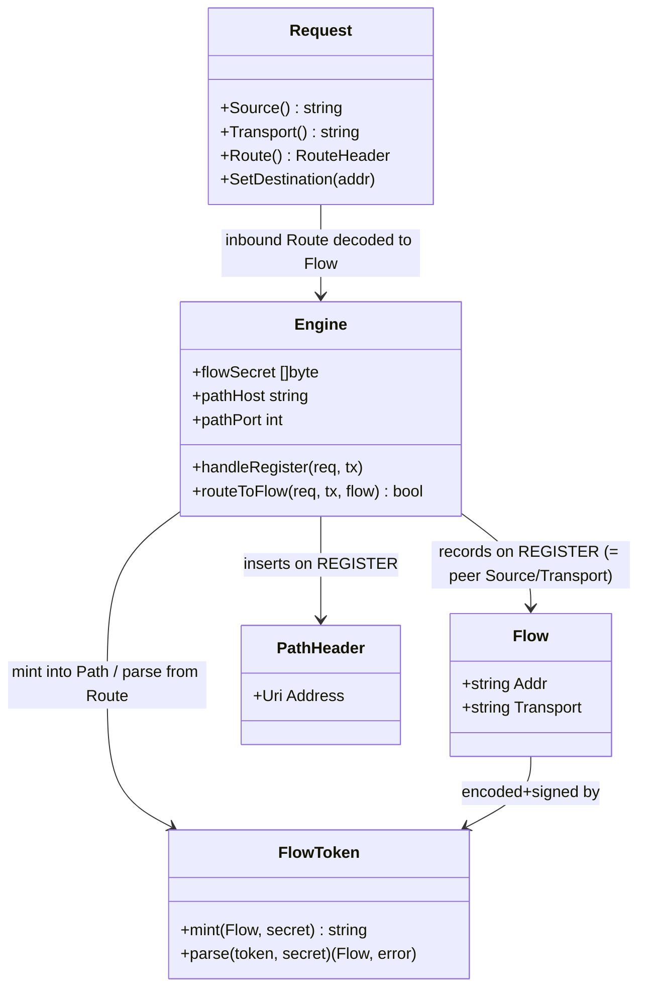

# SIP Outbound (RFC 5626) + Path (RFC 3327) over WebSocket (STORY-001-018)

> Go B2BUA (sipgo). Builds on STORY-001-017 (ws/wss transport). Stack idioms: errors
> are values (`fmt.Errorf("...: %w")`), `log/slog`, functional core / side effects at
> the edges, small consumer-side interfaces, no Spring-style scaffolding. Standing
> decision: use sipgo **as-is** (no fork). Decided assumptions: `next_hop` honors RFC
> 3327 Path; the flow token is HMAC-signed; inbound-to-webphone is signaling-only here
> (media deferred to STORY-019..021); AC4 = flow held by the persistent connection (no
> server-answered keep-alive).

## Requirements
- Make a browser webphone reachable for inbound calls over the single long-lived
  WebSocket flow it opened, since a browser accepts no inbound connections.
- Act as a registration **edge proxy** (not the authoritative registrar): on
  `REGISTER`, insert a Path (RFC 3327) whose token identifies the arriving flow, then
  forward to the upstream registrar via `next_hop` and relay its response.
- Route an inbound request whose top Route is this sequencer's Path back over the
  webphone's existing flow, by addressing its stored source address — letting sipgo's
  connection reuse return the cached ws connection.
- Reuse one flow for registration, calls, and in-dialog requests; never dial the
  webphone.
- Preserve standard SIP semantics so unmodified jssip / sip.js (which use Outbound +
  Path by default) work with no client change.

## Entities

**Conservative-design note:** No persistent/registry state is introduced. A Flow is
not stored server-side — it is encoded (HMAC-signed) into the Path token and
recovered from the inbound Route, so the registrar's binding is the only durable
record (it owns registration state). `Flow` is a tiny value type (addr + transport).
The REGISTER forward and the inbound-flow forward reuse the existing
`proxyUnmanaged` clone/forward/relay shape via one extracted helper — no new proxy
subsystem.

## Approach
1. Flow token (pure, signed):
   - Encode `Flow{Addr, Transport}` into a compact, URL-safe token and HMAC-sign it
     with a per-process secret; `parse` verifies the MAC and rejects any tampered or
     foreign token. No network, no state — a pure function pair, unit-testable
     without sockets.
2. Registration edge (`OnRegister`):
   - Intercept `REGISTER` via sipgo `Server.OnRegister` (do not let it fall to
     `OnNoRoute`). Record `Flow = {req.Source(), req.Transport()}`, mint a token,
     insert a Path header `sip:<token>@<pathHost:pathPort>;lr` before forwarding to
     `next_hop`, and relay the registrar's response verbatim (auth challenges pass
     through end to end). The Path transport is **not** the flow's transport: it must
     describe how the upstream registrar reaches the sequencer (its default UDP
     signaling at `pathHost:pathPort`), so it is omitted and defaults to udp. The
     flow's own transport (ws/wss) lives inside the signed token and is recovered from
     the inbound Route — putting it on the Path would misdirect the upstream toward the
     webphone-facing transport. Outbound markers (`;ob`, `reg-id`, `+sip.instance`) are
     carried unchanged in the forwarded REGISTER — the registrar consumes them; the
     sequencer only needs the flow for the Path.
3. Inbound flow routing:
   - When an inbound request (initial INVITE, or any method) carries a top Route that
     is this sequencer's Path with a valid flow token, recognize self, pop that Route,
     `parse` the token → `Flow`, `SetDestination(Flow.Addr)`, and forward. sipgo
     `connectionReuse` (default on, keyed by source addr) returns the cached ws
     connection, so the webphone receives it over its existing flow.
   - Distinguish from a normal caller INVITE in `handleInvite`: a self-Route+valid
     token means "route to flow"; otherwise the existing B2BUA bridge path runs
     unchanged.
4. Connection reuse (AC3) — no new code:
   - The webphone holds one ws connection; sipgo reuses it by address. Subsequent
     requests ride the same flow automatically. Covered by a confirming test.
5. Error / shutdown strategy (Go idioms):
   - Reuse `proxyUnmanaged`'s response-relay loop (extracted helper). A dropped flow
     → `GetConnection` returns no reusable conn → forward fails → respond
     `480 Temporarily Unavailable` (do not dial a new connection, do not hang). A
     forged/invalid token → treat as not-a-flow-route (fall through / `404`), never
     forward to an unverified address.

## Structure

### Inheritance Relationships
- No inheritance (Go). `Flow` is a small value struct; the flow-token codec is a pair
  of pure functions. `PathHeader` is built from sipgo's generic header/URI types
  (sipgo has no first-class Path type).

### Dependencies
- `Engine.Run` registers `e.srv.OnRegister(e.handleRegister)` alongside the existing
  `OnInvite`/`OnBye`/`OnRefer`/`OnNoRoute`.
- `handleRegister` and `routeToFlow` reuse an extracted `forwardAndRelay(req, tx,
  destination)` helper carved out of `proxyUnmanaged` (DRY — same clone, Max-Forwards
  decrement, `SetDestination`, `TransactionRequest`, response relay).
- `handleInvite` (`bridge.go`) gains a front guard: `if e.routeToFlow(req, tx) {
  return }` before the normal bridge.
- `Engine.New` initializes `flowSecret` (random, `crypto/rand`) and `pathHost`/
  `pathPort` from the engine's signaling address (`cfg.SIP.Listen` host/port).
- Flow token codec depends only on `crypto/hmac`, `crypto/sha256`, `encoding`.

### Layered Architecture
1. Token layer (`internal/b2bua/flowtoken.go`): pure mint/parse + HMAC; no I/O.
2. Edge layer (`internal/b2bua/register.go`): REGISTER interception, Path insertion,
   forward + relay.
3. Routing layer (`internal/b2bua/proxy.go` / `bridge.go`): self-Route recognition,
   pop, forward-to-flow; shared `forwardAndRelay` helper.
4. Transport layer (sipgo, as-is): connection reuse returns the cached ws connection
   by source address.
5. Registrar (external, upstream): stores the binding and honors Path — out of this
   process.

## Operations

### Create flow-token codec — `internal/b2bua/flowtoken.go`
1. Responsibility: encode/sign and verify/decode a `Flow` to/from an opaque,
   URL-safe token suitable for a SIP URI user-part.
2. Types: `type Flow struct { Addr string; Transport string }`.
3. Methods:
   - `mintFlowToken(f Flow, secret []byte) string`
     - Logic: serialize `Transport` + `Addr` into a compact payload (e.g. base64url
       of `"<transport>|<addr>"`), append a base64url HMAC-SHA256 over the payload
       using `secret`; join `payload "." mac`.
   - `parseFlowToken(token string, secret []byte) (Flow, error)`
     - Logic: split payload/mac; recompute HMAC; constant-time compare
       (`hmac.Equal`); on mismatch return an error (`invalid flow token`); else decode
       payload into `Flow`. Never returns a `Flow` for an unverified token.
4. Constraints: pure (no globals, no clock); token must be URI-safe; reject malformed
   input without panic.

### Create REGISTER handler — `internal/b2bua/register.go`
1. Responsibility: the registration edge — record flow, insert Path, forward to
   registrar, relay response.
2. Method: `handleRegister(req *sip.Request, tx sip.ServerTransaction)`
   - Logic:
     - `flow := Flow{Addr: req.Source(), Transport: req.Transport()}`.
     - `token := mintFlowToken(flow, e.flowSecret)`.
     - Build Path URI `sip:<token>@<e.pathHost>:<e.pathPort>;lr` (no `transport`
       param — see Approach §2: the flow transport is in the token, the Path addresses
       the sequencer over its default UDP signaling) and insert as a `Path` header
       (generic header; pushed as the top Path) on the clone to forward.
     - Forward to `cfg.NextHop` via `forwardAndRelay(req, tx, nextHopAddr)`; the
       registrar's response (including 401/407 challenges and the 200 with its
       reflected Path) is relayed verbatim to the webphone.
3. Constraints: do not answer REGISTER locally (no local binding store); carry `;ob`/
   `reg-id`/`+sip.instance` unchanged; never log credentials.

### Extract forward helper + flow routing — `internal/b2bua/proxy.go`
1. Responsibility: DRY the forward/relay loop and add flow routing.
2. Refactor: extract `forwardAndRelay(req, tx, destination, transport string,
   onSendErr, onNoFinal proxyFault, prepare ...func(*sip.Request))` from
   `proxyUnmanaged` (clone, Max-Forwards, run `prepare` hooks on the clone,
   `SetDestination`, `TransactionRequest(ClientRequestAddVia)`, strip added Via on
   responses, relay). `proxyUnmanaged` now calls it with the next-hop address and
   transport. The `transport` arg forces the outbound transport (`SetTransport` +
   Recipient `transport` param) independent of the transport the request arrived on —
   otherwise a ws-inbound REGISTER/INVITE leaks `transport=ws` onto a UDP/TCP next-hop
   and mis-dials (sipgo picks transport from the clone's inherited transport field, not
   the Recipient param). `onSendErr`/`onNoFinal` parameterize the failure status so a
   dead flow yields `480` while an unreachable next-hop yields `502`/`503`. The
   `prepare` hooks insert the Path (REGISTER) or pop the self-Route (flow), keeping the
   inbound request unmutated.
3. Method: `routeToFlow(req *sip.Request, tx sip.ServerTransaction) bool`
   - Logic:
     - Read the top `Route`; if absent or its host/port is not `e.pathHost:e.pathPort`,
       return `false` (not ours).
     - `parseFlowToken(<route user-part>, e.flowSecret)`; on error return `false`
       (forged/foreign — let normal handling/`404` apply; never forward).
     - Pop that top Route (RFC 3261 §16.6 self-route removal).
     - `forwardAndRelay(req, tx, flow.Addr, flow.Transport, ...)`; the flow transport
       forces the ws/wss leg so sipgo connection reuse delivers it over the cached ws
       connection. If the connection is gone, the forward yields no transport → respond
       `480 Temporarily Unavailable`.
     - return `true`.
3. Constraints: only ever forward to an address recovered from a MAC-verified token;
   minimal self-Route handling, not a general loose-route proxy (YAGNI).

### Wire inbound INVITE guard — `internal/b2bua/bridge.go` `handleInvite`
1. Responsibility: send a flow-bound inbound INVITE to the webphone instead of the
   normal caller bridge.
2. Logic: at the top of `handleInvite`, `if e.routeToFlow(req, tx) { return }`, before
   the in-dialog / initial-INVITE bridge logic. A normal caller INVITE (no self-Route)
   is unaffected.
3. Constraints: signaling only — no RTP anchoring / media bridge for the inbound
   webphone leg in this story (deferred to STORY-019..021).

### Update Engine — `internal/b2bua/engine.go` `Engine` + `New` + `Run`
1. Add fields: `flowSecret []byte`, `pathHost string`, `pathPort int`.
2. `New`: set `flowSecret` from `crypto/rand` (process-lifetime); set `pathHost`/
   `pathPort` from the parsed `cfg.SIP.Listen` host/port already computed in `New`.
3. `Run`: add `e.srv.OnRegister(e.handleRegister)` next to the other handler
   registrations.
4. Constraints: secret never logged; a process restart invalidates outstanding tokens
   (acceptable — webphones re-register and obtain a fresh Path).

### Create tests — `internal/b2bua/outbound_path_test.go`
1. Responsibility: prove ACs behaviorally with a **real** ws SIP client and a **real
   fake upstream registrar** (a small in-process SIP UA acting as `next_hop`). No
   mocks of internal code (AGENTS.md).
2. Tests (Given/When/Then):
   - `TestRegisterInsertsPathAndForwards` (AC1): a ws client registers with `;ob`/
     `reg-id`/`+sip.instance`; the fake registrar receives a REGISTER carrying a Path
     whose host is the sequencer and whose token decodes to the client's flow.
   - `TestInboundInviteRoutedBackOverFlow` (AC2/NFE): the fake registrar sends an
     INVITE with Route = the recorded Path; assert it arrives on the original ws
     connection (the client rings) with no new connection dialed.
   - `TestSubsequentRequestsReuseFlow` (AC3): a second request from the same client
     uses the same ws connection (one connection observed).
   - `TestReRegisterUpdatesFlow` (AC5): after the client reconnects (new ws flow) and
     re-registers, an inbound INVITE via the new Path reaches the new flow; the stale
     Path no longer routes (graceful failure).
   - `TestForgedRouteNotForwarded` (security): an INVITE with a self-host Route whose
     token fails the MAC is not forwarded anywhere (no SSRF); a clear final response
     is returned.
   - Run under `-race`.
3. Notes: AC4 (flow open while connection persists) and AC6 (no client change) are
   covered implicitly by the persistent-connection tests above; no server keep-alive
   responder is asserted (sipgo as-is).

### Flow-token unit tests — `internal/b2bua/flowtoken_test.go`
1. Round-trip `mint`→`parse` returns the original `Flow`; a tampered payload or mac
   fails `parse`; a token signed with a different secret fails. Pure, no sockets.

## Norms
1. Errors: return values, wrapped (`fmt.Errorf("...: %w", err)`); a failed/forged
   route never forwards; a dead flow → `480`. No panics on malformed SIP/token input.
2. Logging: `log/slog`; never log credentials, `flowSecret`, or full tokens (log a
   short prefix at most). Log register-forward and flow-route at info with method +
   Call-ID, mirroring `proxyUnmanaged`.
3. Security: the flow token is HMAC-SHA256 signed; `parseFlowToken` uses constant-time
   comparison; the sequencer forwards only to addresses recovered from a verified
   token.
4. State: no new persistent/registry state; `Flow` is a value; the secret is the only
   added field and is immutable after `New`. No data races (`go test -race`).
5. Reuse over rebuild: one `forwardAndRelay` helper backs `proxyUnmanaged`,
   `handleRegister`, and `routeToFlow`; reuse the existing header-ownership discipline
   for relayed headers.
6. SIP conformance: Path per RFC 3327 (`;lr`), self-Route removal per RFC 3261 §16.6,
   Outbound markers per RFC 5626 carried unchanged; Max-Forwards decremented on
   forward.
7. Tests: Given/When/Then by behavior; real ws client + real fake registrar; only
   external peers faked, never internal code. `gofmt` + `go vet` clean.

## Safeguards
1. Functional: a registered webphone receives an inbound INVITE over its existing ws
   flow (rings) without dialing a new connection; REGISTER is forwarded to the
   registrar with a Path; auth challenges round-trip unchanged.
2. Backward compatibility: non-WebSocket REGISTER and normal caller INVITEs are
   unaffected; `proxyUnmanaged` behavior for other unmanaged methods is unchanged
   after the helper extraction; existing tests pass.
3. Security: flow token MUST be MAC-verified before any forward (no SSRF / arbitrary
   internal routing); constant-time MAC compare; secret from `crypto/rand`, never
   logged; never forward to an address not recovered from a valid token.
4. Reachability (NFE): the route back depends only on the flow token in Path and the
   persistent connection — never on a routable Contact — so a NAT'd webphone stays
   reachable.
5. Integration: depends on `next_hop`/registrar honoring RFC 3327 Path (decided
   assumption); relies on sipgo `connectionReuse` (default true) keying the cached ws
   connection by source address.
6. Lifecycle / failure: a dropped flow yields `480` (no dial, no hang); a re-register
   replaces the binding via a fresh Path; stale tokens stop routing once the
   connection is gone; a process restart invalidates tokens (clients re-register).
7. Accepted limitations (sipgo as-is): the sequencer answers no RFC 5626 CRLF / ws
   keep-alive; the flow is held open by the persistent connection. AC4 is scoped to
   that.
8. Scope: signaling only — inbound-to-webphone media (RTP anchor / DTLS-SRTP bridge)
   is deferred to STORY-001-019..021. The sequencer remains a proxy/B2BUA, not the
   authoritative registrar (no local binding store).
9. Concurrency: the forward/relay path is per-transaction; the only shared field is
   the immutable secret; verified with `go test -race`.
