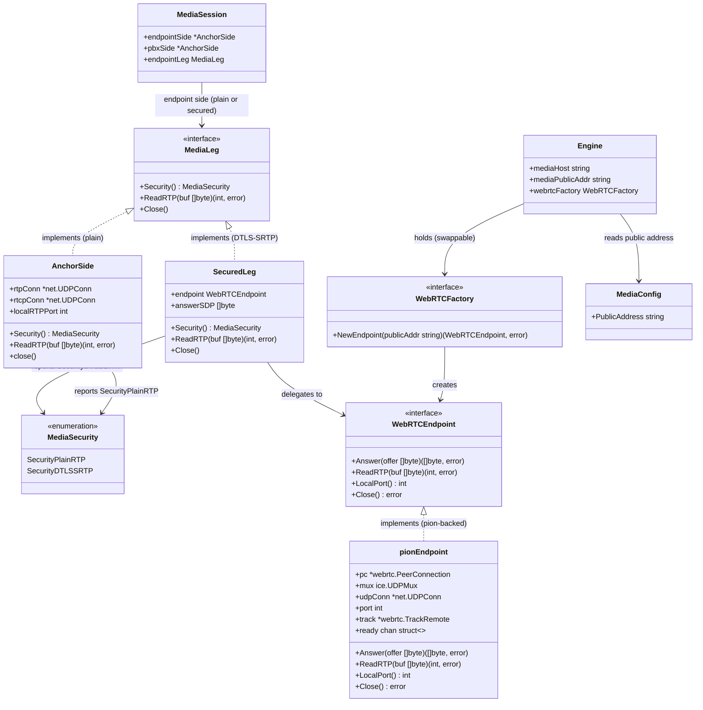

# WebRTC Media Leg — DTLS-SRTP Termination + ICE-lite (STORY-001-019)

## Requirements

Terminate a webphone's WebRTC media on the sequencer so browser audio can enter the
system at all. On a call whose inbound offer is WebRTC (DTLS-SRTP + ICE + rtcp-mux,
as jssip/sip.js produce), bring the endpoint-facing media leg **up** as a real WebRTC
endpoint: answer **ICE-lite** (host candidate only, on a configured public address),
**validate** the browser's STUN connectivity checks without any external STUN server,
**terminate the DTLS-SRTP handshake** against the offered fingerprint and derive the
SRTP keys, and **honor rtcp-mux** (RTP+RTCP on one port). Make a leg's media security
a **per-leg property** (plain RTP vs DTLS-SRTP), never a hardcoded "webphone = SRTP"
rule, so an SRTP↔SRTP proxy can be enabled later by setting the opposite leg's
property — no rework. Hide the WebRTC library behind an internal boundary so the leg
is defined by ICE-lite + DTLS-SRTP, not by the library's API.

**Boundary (in):** secured endpoint leg up — ICE validated, DTLS-SRTP keys derived,
rtcp-mux honored, public host candidate advertised, per-leg security property,
plaintext-RTP read seam exposed.
**Boundary (out):** forwarding/bridging packets to the plain-RTP PBX leg
(STORY-001-021); trickle ICE (STORY-001-020); full ICE / srflx / TURN; SRTP on the
opposite leg; codec conversion (codecs echoed end-to-end, never transcoded);
webphone-as-callee (offering WebRTC outbound) — this story scopes to a WebRTC offer
arriving on the inbound/endpoint leg.

## Entities

**Conservative notes:** `AnchorSide`, `MediaSession`, `PortAllocator`, and all plain
SDP helpers stay as-is. `AnchorSide` only *adopts* the `MediaLeg` interface (add two
trivial methods, `Security()` → `SecurityPlainRTP` and `ReadRTP` wrapping
`rtpConn.Read`) with zero behavior change. The secured leg is a **sibling**, not a
rewrite. No change to `Tap`, relay goroutines, or the plain PBX path.

## Approach

1. **Per-leg media-security abstraction (AC5 / NFE):**
   - Introduce a `MediaLeg` interface (consumer-defined in `b2bua`) carrying a
     `Security()` property and a library-agnostic plaintext `ReadRTP` seam.
   - `AnchorSide` implements it as the plain-RTP leg (`SecurityPlainRTP`); a new
     `SecuredLeg` implements it as the DTLS-SRTP leg (`SecurityDTLSSRTP`).
   - A leg's security is **computed per call from its own offer** and stored as its
     property — nothing globally asserts "webphone = SRTP". The opposite (PBX) leg is
     independently plain today and can become secured later by setting *its* property,
     with no change to this leg (the SRTP↔SRTP future is a property flip).

2. **WebRTC termination behind a swappable boundary (NFE / library isolation):**
   - Define a `WebRTCEndpoint` interface (`Answer(offer) → answerSDP`, `ReadRTP`,
     `LocalPort`, `Close`) and a `WebRTCFactory` that builds one. pion lives **only**
     in the `pionEndpoint` implementation; no pion type crosses the boundary.
   - `pionEndpoint` configures pion for ICE-lite: `SettingEngine.SetLite(true)`,
     `SetNAT1To1IPs([publicAddr], ICECandidateTypeHost)` (host-only candidate on the
     configured public address — AC1/AC6), single-port UDP mux via `SetICEUDPMux`
     (rtcp-mux shape — AC3), `NewAPI(WithSettingEngine)` → `NewPeerConnection`.
   - Termination is driven by pion: `SetRemoteDescription(offer)` →
     `CreateAnswer` → `SetLocalDescription` → wait `GatheringComplete` →
     `LocalDescription().SDP` is the ICE-lite/DTLS-SRTP answer with codecs echoed
     unchanged (no hand-built WebRTC SDP, no transcoding). pion validates the
     browser's STUN checks itself (AC4) and terminates DTLS-SRTP against the offered
     fingerprint, deriving SRTP keys (AC2). `OnTrack` hands back a `*TrackRemote`
     whose `ReadRTP` yields **plaintext** RTP — the seam STORY-021 will relay.

3. **Engine integration at the endpoint seam (offer-type branch):**
   - A pure `offerIsWebRTC(sdp)` predicate detects a WebRTC offer (`m=audio` proto
     contains `SAVPF` and/or an `a=fingerprint` attribute is present).
   - In `anchorMedia` (`bridge.go`), branch: WebRTC offer → build a `SecuredLeg` via
     the factory and use it as the endpoint side; plain offer → today's `AnchorSide`
     path, untouched.
   - When the endpoint leg is secured, `bridge` answers the webphone directly with the
     pion-produced `answerSDP` and holds the leg **up** until teardown. It does **not**
     dial the PBX or start a cross-leg relay — dialing the PBX, deriving a plain PBX
     offer from the WebRTC codecs, and bridging the two legs is STORY-021. (A plain
     offer takes the unchanged `dialPBX` path.)
   - The secured endpoint's lifecycle (pion goroutines, UDP mux) hooks into the
     existing `MediaSession.Close` / `call.releaseMedia` teardown so a failure or BYE
     unwinds it race-free, exactly like a plain side.

4. **Config (AC6):**
   - Add an optional `media.public_address` key. When set, it is the ICE-lite host
     candidate. When unset, fall back to `mediaHost` (dev/local). Validate it is a
     bare host/IP if present. No other endpoint is affected.

## Structure

### Interface / implementation relationships
1. `MediaLeg` interface (defined in `internal/b2bua`) defines `Security()`,
   `ReadRTP([]byte) (int, error)`, `Close()`.
2. `AnchorSide` implements `MediaLeg` → returns `SecurityPlainRTP`; `ReadRTP` wraps
   `rtpConn.Read`.
3. `SecuredLeg` implements `MediaLeg` → returns `SecurityDTLSSRTP`; delegates
   `ReadRTP` to its `WebRTCEndpoint`.
4. `WebRTCEndpoint` interface defines `Answer([]byte) ([]byte, error)`,
   `ReadRTP([]byte) (int, error)`, `LocalPort() int`, `Close() error`.
5. `pionEndpoint` implements `WebRTCEndpoint` — the only file importing
   `github.com/pion/webrtc/v4`.
6. `WebRTCFactory` interface defines `NewEndpoint(publicAddr string)
   (WebRTCEndpoint, error)`; a `pionFactory` implements it. The Engine holds a
   `WebRTCFactory` (swappable; tests can inject a fake).

### Dependencies
1. `Engine` holds `webrtcFactory WebRTCFactory` and `mediaPublicAddr string`.
2. `anchorMedia` (bridge) calls `offerIsWebRTC`; on true, calls
   `webrtcFactory.NewEndpoint(publicAddr)` then `endpoint.Answer(offer)` to build a
   `SecuredLeg`; on false, calls today's `newAnchorSide`.
3. `bridge` branches on `anchor.securedLeg`: a secured endpoint is answered by
   `answerSecuredEndpoint` with `securedLeg.AnswerSDP()` and held up (no PBX dial); a
   plain endpoint takes the unchanged `dialPBX` → `relay` path. `dialPBX` is untouched.
4. `SecuredLeg` depends only on `WebRTCEndpoint`; `pionEndpoint` depends on pion.
5. `call.releaseMedia` / `MediaSession.Close` invoke `endpointLeg.Close()`.

### Layering
1. **Config layer** (`internal/config`): parse/validate `media.public_address`.
2. **Engine/bridge layer** (`internal/b2bua/engine.go`, `bridge.go`): offer-type
   branch, factory wiring, public-address resolution, teardown integration.
3. **Media-leg layer** (`internal/b2bua/media.go` + new `mediasec.go`): `MediaLeg`,
   `MediaSecurity`, `SecuredLeg`, `AnchorSide` adoption.
4. **WebRTC boundary layer** (new `internal/b2bua/webrtc.go`): `WebRTCEndpoint`,
   `WebRTCFactory`, `pionEndpoint`, `pionFactory` — pion isolated here.
5. **SDP layer** (`internal/b2bua/sdp.go`): add pure `offerIsWebRTC` predicate; all
   plain helpers unchanged.

## Operations

### Add config — `media.public_address` (`internal/config/config.go`)
1. Responsibility: optional operator-set public address advertised as the ICE-lite
   host candidate.
2. New struct `type Media struct { PublicAddress string `yaml:"public_address"` }`.
   Add `Media Media `yaml:"media"`` to both `Config` and `rawConfig`; copy it in
   `Parse` like the other top-level sections.
3. Validation (in `validate`): if `c.Media.PublicAddress != ""` and
   `net.SplitHostPort(c.Media.PublicAddress)` succeeds (the value carries a port),
   reject with error `media.public_address %q: want a bare host or IP`. A bare host/IP
   makes `SplitHostPort` error, so it passes. Empty is valid (fallback applies).
4. No defaulting in config — the `mediaHost` fallback lives in the engine so config
   stays a pure value.
5. Constraints: additive, backward-compatible; absent key keeps every existing test
   green.

### Add predicate — `offerIsWebRTC` (`internal/b2bua/sdp.go`)
1. Signature: `func offerIsWebRTC(sdp []byte) bool`
2. Logic:
   - Scan lines. Track the first `m=audio` line; if its transport proto field
     contains `SAVPF` or `SAVP`, return true.
   - Else if any `a=fingerprint:` line is present, return true.
   - Else false.
   - Pure, no I/O; CRLF-tolerant (mirror `extractAudioCodecs` line handling).
3. Constraints: must return false for every existing plain `RTP/AVP` offer (covered
   by existing SDP fixtures) so the plain path is untouched.

### Add media-security types + leg adoption (`internal/b2bua/mediasec.go`, new)
1. `type MediaSecurity int` with `const ( SecurityPlainRTP MediaSecurity = iota;
   SecurityDTLSSRTP )` and a `String()` for logs.
2. `type MediaLeg interface { Security() MediaSecurity; ReadRTP(buf []byte) (int,
   error); Close() }`.
3. Adopt on `AnchorSide` (in `media.go`, no behavior change):
   - `func (s *AnchorSide) Security() MediaSecurity { return SecurityPlainRTP }`
   - `func (s *AnchorSide) ReadRTP(buf []byte) (int, error) { return
     s.rtpConn.Read(buf) }`
   - (`Close` already exists as `close`; expose `Close()` calling `close()` or rename
     consistently so it satisfies the interface.)
4. Constraints: `AnchorSide` keeps its concrete uses in the relay; the interface is an
   *addition*, not a replacement, so plain relay/tap code and tests are unchanged.

### Define WebRTC boundary (`internal/b2bua/webrtc.go`, new)
1. `type WebRTCEndpoint interface { Answer(offer []byte) (answer []byte, err error);
   ReadRTP(buf []byte) (int, error); LocalPort() int; Close() error }`
2. `type WebRTCFactory interface { NewEndpoint(publicAddr string) (WebRTCEndpoint,
   error) }`
3. `SecuredLeg`:
   - Fields: `endpoint WebRTCEndpoint`, `answerSDP []byte`.
   - `func newSecuredLeg(f WebRTCFactory, publicAddr string, offer []byte)
     (*SecuredLeg, error)`: `ep, err := f.NewEndpoint(publicAddr)`; `ans, err :=
     ep.Answer(offer)` (on error: `ep.Close()`, wrap, return); return
     `&SecuredLeg{endpoint: ep, answerSDP: ans}`.
   - `Security() MediaSecurity { return SecurityDTLSSRTP }`
   - `ReadRTP(buf) → endpoint.ReadRTP(buf)`; `AnswerSDP() []byte`;
     `Close() { _ = endpoint.Close() }`.

### Implement pion endpoint — `pionEndpoint` / `pionFactory` (`internal/b2bua/webrtc.go`)
1. `pionFactory{}` implements `WebRTCFactory`:
   - `NewEndpoint(publicAddr string)`: build `webrtc.SettingEngine`; call
     `SetLite(true)`; `SetNAT1To1IPs([]string{publicAddr},
     webrtc.ICECandidateTypeHost)`; create a single UDP mux on an OS-chosen port
     (`net.ListenUDP("udp4", :0)` → `webrtc.NewICEUDPMux` / `ice.NewUDPMuxDefault`),
     `SetICEUDPMux(mux)` (one port for RTP+RTCP → rtcp-mux). Register a media engine
     with the default audio codecs (echo, no transcode). `api :=
     webrtc.NewAPI(WithSettingEngine, WithMediaEngine)`; `pc, err :=
     api.NewPeerConnection(webrtc.Configuration{})`. Return a `pionEndpoint{pc, mux,
     ready: make(chan struct{})}`.
2. `pionEndpoint.Answer(offer []byte) ([]byte, error)`:
   - `pc.OnTrack(func(tr *webrtc.TrackRemote, _ *webrtc.RTPReceiver){ e.track = tr;
     close(e.ready) })` — captures the plaintext RTP track once media flows.
   - `pc.SetRemoteDescription({Type: Offer, SDP: string(offer)})`.
   - `answer, _ := pc.CreateAnswer(nil)`; `gather :=
     webrtc.GatheringCompletePromise(pc)`; `pc.SetLocalDescription(answer)`;
     `<-gather` (ICE-lite gathers host-only instantly).
   - Return `[]byte(pc.LocalDescription().SDP)` — ICE-lite + fingerprint + rtcp-mux +
     echoed codecs. Wrap any pion error with `%w`.
3. `pionEndpoint.ReadRTP(buf []byte) (int, error)`:
   - Block on `<-e.ready` (or return a not-ready error if called before the track
     arrives — relay in 021 will gate on connection state). Then `pkt, _, err :=
     e.track.ReadRTP()`; marshal into `buf`; return `n, err`. (Seam only — STORY-021
     consumes it.)
4. `pionEndpoint.LocalPort() int`: the UDP mux port.
5. `pionEndpoint.Close() error`: `pc.Close()` then close the mux; idempotent; unblocks
   any `ReadRTP`.
6. Constraints: the **only** file importing pion. No pion type appears in any
   signature outside it.

### Wire the engine (`internal/b2bua/engine.go`)
1. Add fields `webrtcFactory WebRTCFactory` and `mediaPublicAddr string` to `Engine`.
2. In `New`: set `e.mediaPublicAddr = cfg.Media.PublicAddress`; if empty, fall back to
   `host` (the `mediaHost`). Default `e.webrtcFactory = pionFactory{}`. Add
   `WithWebRTCFactory(f WebRTCFactory) Option` so tests inject a fake.
3. Constraints: no behavior change when no WebRTC offer ever arrives.

### Branch the endpoint seam (`internal/b2bua/bridge.go`)
1. In `anchorMedia`, before the plain path: if
   `offerIsWebRTC(call.inbound.offerSDP)`, dispatch to `anchorWebRTC`; else run
   today's plain `AnchorSide` path, unchanged.
2. `anchorWebRTC(call)` builds `leg, err := newSecuredLeg(e.webrtcFactory,
   e.mediaPublicAddr, call.inbound.offerSDP)`. On error → `e.fail(call, 488, "Not
   Acceptable Here", ...)`, return false. It acquires **no** RTP port pair (pion owns
   its own port) and binds **no** PBX side (no PBX dial in this story). It stores the
   secured leg as `MediaSession{endpointLeg: leg}` and registers `call.releaseMedia`
   to `mediaSess.Close()` (which closes the leg) plus any tap-pair releases. It returns
   a `mediaAnchor` carrying `securedLeg`.
3. In `bridge`, after `anchorMedia` succeeds: if `anchor.securedLeg != nil`, call
   `answerSecuredEndpoint` (answer the webphone with `securedLeg.AnswerSDP()` via
   `call.inbound.session.Respond(200, "OK", answerSDP)`, mark established, register
   pending taps) then block on `<-ctx.Done()`. Do **not** call `dialPBX` or start the
   relay. Else take today's `dialPBX` + `relay` path unchanged.
4. Add an `endpointLeg MediaLeg` field to `MediaSession` and a `securedLeg
   *SecuredLeg` field to `mediaAnchor`; nil-guard `MediaSession.Close` for the absent
   `endpointSide`/`pbxSide` on a secured call.
5. Constraints: every existing plain-call test path must be byte-for-byte unchanged;
   the branch only triggers on a WebRTC offer.

### Add dependency (`go.mod`)
1. `go get github.com/pion/webrtc/v4@<pinned-release>` (+ `pion/ice/v4`,
   `pion/rtp` transitively). Pure Go, no cgo. Pin the release in `go.mod`; run
   `go mod tidy`.

## Norms

1. **Functional core / edges (AGENTS.md):** `offerIsWebRTC`, security typing, and SDP
   handling are pure; all sockets/goroutines (pion, UDP mux) live behind the
   `WebRTCEndpoint` boundary at the edge. No package-level mutable state; the factory
   is passed in.
2. **Consumer-defined interfaces:** `MediaLeg`, `WebRTCEndpoint`, `WebRTCFactory` are
   declared in `b2bua` (the consumer), small and behavior-named — not at a producer.
3. **Library isolation (NFE):** `github.com/pion/webrtc/v4` is imported in exactly one
   file (`webrtc.go`). No pion type crosses an exported or cross-file signature; the
   leg is defined by ICE-lite + DTLS-SRTP behavior, not pion.
4. **Errors as values:** return and wrap with `fmt.Errorf("...: %w", err)`; never
   panic across goroutines; pion errors are wrapped at the boundary. Handshake/ICE
   failures map to a SIP `488 Not Acceptable Here` for the endpoint.
5. **Lifecycle:** every pion endpoint is owned by exactly one `Call`; its `Close` is
   idempotent and wired into the existing teardown; `context`/channel ownership is
   explicit and race-free (`go test -race`).
6. **No transcoding:** the pion media engine registers the offered codecs and echoes
   them; the leg only encrypts/decrypts.
7. **Logging:** log ICE/DTLS lifecycle and failures with the call/leg id; **never**
   log SRTP keys, the DTLS private key, or `SetDTLSKeyLogWriter` output. Naming reveals
   intent (`SecuredLeg`, `offerIsWebRTC`, `mediaPublicAddr`).
8. **Conservative change:** extend, don't rebuild — `AnchorSide` adopts an interface
   with zero behavior change; the plain relay/tap path and its tests are untouched.

## Safeguards

1. **Functional:** a WebRTC offer on the endpoint leg yields an ICE-lite answer
   advertising exactly one **host** candidate on the configured public address and no
   `relay`/`srflx`/TURN candidate (AC1/AC6); a plain offer takes the unchanged plain
   path.
2. **DTLS-SRTP:** the handshake completes against the offer's `a=fingerprint` and SRTP
   keys are derived before the leg is considered up (AC2). A fingerprint mismatch or
   handshake timeout fails the leg cleanly.
3. **rtcp-mux:** RTP and RTCP share one port on the secured leg (single UDP mux);
   verify the answer carries `a=rtcp-mux` (AC3). An offer lacking `a=rtcp-mux` is
   handled deliberately (reject with `488`), not crashed.
4. **ICE-lite self-validation:** the anchor validates the browser's STUN binding
   requests via pion's lite agent with **no** externally deployed STUN server (AC4);
   it never initiates connectivity checks.
5. **Per-leg security (AC5/NFE):** the leg reports `SecurityDTLSSRTP` while the PBX
   leg independently reports `SecurityPlainRTP`; no code path asserts a fixed
   "webphone = SRTP, other = RTP" mapping. Enabling SRTP on the opposite leg later is
   a property change, not a rework of this leg.
6. **Library swappability:** removing/replacing pion requires editing only
   `webrtc.go`; no other file imports pion (compile-checked by the single import
   site).
7. **Lifecycle/concurrency:** call teardown or BYE mid-handshake unwinds the pion
   endpoint (goroutines stopped, mux/port released) without affecting signaling or
   other calls; `go test -race` clean.
8. **Resource bounds:** each secured leg consumes one UDP port + pion goroutines;
   exhaustion or bind failure fails that call (`503`/`500`) without leaking, mirroring
   `PortAllocator` discipline.
9. **Config:** `media.public_address`, when set, must be a bare host/IP (no port);
   when unset, the engine falls back to `mediaHost`. A misconfigured private address is
   surfaced in logs, not silently black-holed.
10. **Scope fence:** no packet is relayed between the secured leg and the PBX leg in
    this story (that is STORY-001-021); the deliverable is the leg **up** with a
    plaintext `ReadRTP` seam exposed.
11. **Build/test (AGENTS.md DoD):** `go build ./...`, `go vet ./...`, `gofmt`, and
    `go test -race ./...` pass; behavior is driven by a **real pion-based webphone
    client** fake (no mocks of internal code) asserting ICE-lite answer shape, host
    candidate = public address, handshake completion + key derivation, and rtcp-mux.
    A deterministic fake `WebRTCFactory` additionally covers the engine wiring
    (answer-from-leg, public-address passthrough, no PBX dial) without a real
    handshake; `internal/config` tests cover `media.public_address` accept/reject and
    backward compatibility.
