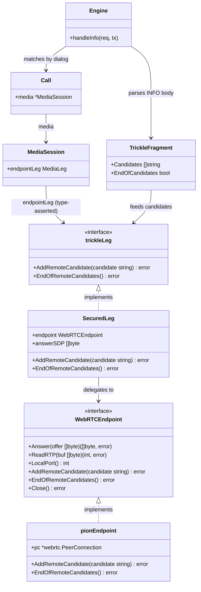

# Trickle ICE (RFC 8838/8840) — Remote-Candidate Ingestion for the WebRTC Leg (STORY-001-020)

## Requirements

Accept the webphone's **trickled** ICE candidates — those delivered after the initial
SDP offer — and feed them into the secured (ICE-lite) media leg from STORY-001-019 so
media establishes promptly for browser clients that do not pack every candidate into
the offer. Recognize the SIP carrier for trickle (an in-dialog `INFO` with
`application/trickle-ice-sdpfrag`, RFC 8840), route it to the matching call's secured
leg, add each `a=candidate:` to the leg's connectivity checks, and honor
`a=end-of-candidates`. Support both trickle and non-trickle webphones with no client
reconfiguration, keep every other `INFO` (DTMF, etc.) flowing through the existing
proxy unchanged, and keep one call's candidates isolated from any other call.

**Boundary (in):** intercept trickle `INFO` on a matched secured webphone dialog;
parse candidates + end-of-candidates; add them to that leg's WebRTC endpoint; answer
`200 OK`. The remote-candidate seam lives on the WebRTC boundary (library hidden).
**Boundary (out):** the ICE-lite leg / DTLS-SRTP termination (STORY-001-019, done); the
RTP bridge (STORY-001-021); the anchor gathering/trickling its own candidates beyond
its single host candidate (ICE-lite, host-only); fixing the pre-existing
`handleReInvite` nil-deref on a secured call (tracked, deferred to 021).

## Entities

**Conservative notes:** `MediaLeg`, `AnchorSide`, `MediaSession`, the relay, and the
plain path are untouched. `MediaLeg` is NOT extended — trickle methods live only on the
secured leg / `WebRTCEndpoint`; the handler reaches them via a `trickleLeg` type
assertion. `Answer`'s offer/gather flow is unchanged: the PeerConnection already
accepts remote candidates after `SetRemoteDescription`. `TrickleFragment` is a tiny
value returned by the pure parser; no new persistent state.

## Approach

1. **INFO interception at the signaling edge (consume only trickle):**
   - Register an `OnInfo` handler. It consumes an `INFO` only when **both** hold: the
     `Content-Type` is `application/trickle-ice-sdpfrag`, AND the request matches a
     known `Call` whose endpoint leg is a secured (trickle-capable) leg. Otherwise it
     delegates to the existing `proxyUnmanaged`, so DTMF and every other INFO — and a
     trickle on a plain/proxied dialog — flow to `cfg.NextHop` exactly as today.
   - Dialog→Call matching reuses the established pattern
     (`dialogSrvCache.MatchDialogRequest(req)` → `calls.getByDialog(dss.ID)`).

2. **Remote-candidate seam on the WebRTC boundary (library hidden):**
   - Extend `WebRTCEndpoint` (and `SecuredLeg`) with `AddRemoteCandidate(candidate
     string) error` and `EndOfRemoteCandidates() error`. `pionEndpoint` maps them to
     `pc.AddICECandidate(ICECandidateInit{Candidate: …})` and the empty-candidate
     end-of-candidates convention. No pion type crosses the boundary; pion stays
     confined to `webrtc.go`.
   - The handler reaches the leg through a small consumer interface `trickleLeg`
     (type-asserted from `MediaSession.endpointLeg MediaLeg`); a plain leg fails the
     assertion and is not trickled.

3. **Pure trickle-fragment parsing:**
   - A pure `parseTrickleFragment(body []byte) TrickleFragment` (mirroring
     `offerIsWebRTC`) extracts every `a=candidate:` value (as the `candidate:…`
     attribute value, no `a=` prefix) and detects `a=end-of-candidates`. No I/O,
     CRLF-tolerant.

4. **Best-effort, non-disruptive ingestion (AC3):**
   - The handler answers `200 OK` once it has accepted the fragment. A malformed or
     empty fragment is logged and still answered `200 OK` (never disrupt a leg that is
     coming up). A per-candidate `AddICECandidate` error is logged and skipped, not
     fatal. End-of-candidates is applied after the candidates in the same fragment.

5. **No change to 019's establishment path (AC4):**
   - Candidates packed into the initial offer are still consumed at
     `SetRemoteDescription` (019). Trickled candidates arrive via the new path. Both
     reach the same ICE agent; neither needs client reconfiguration.

## Structure

### Interface / implementation relationships
1. `WebRTCEndpoint` (in `webrtc.go`) gains `AddRemoteCandidate(string) error` and
   `EndOfRemoteCandidates() error`.
2. `pionEndpoint` implements them via `pc.AddICECandidate` — the only pion import site.
3. `SecuredLeg` delegates both to its `WebRTCEndpoint`.
4. `trickleLeg` is a consumer interface (in the handler file) with the two
   candidate methods; `SecuredLeg` satisfies it. `MediaLeg` is unchanged.

### Dependencies
1. `Engine.Run` registers `e.srv.OnInfo(e.handleInfo)`.
2. `handleInfo` calls `isTrickleContentType` (a pure check), `dialogSrvCache.
   MatchDialogRequest` + `calls.getByDialog`, `parseTrickleFragment`, and the
   `trickleLeg` methods; on any non-trickle path it calls `proxyUnmanaged`.
3. `handleInfo` reads `call.media.endpointLeg` under `call.mu` and type-asserts it to
   `trickleLeg`.
4. `pionEndpoint` depends on pion; `SecuredLeg`/handler depend only on the interfaces.

### Layering
1. **Signaling-edge layer** (`engine.go` `Run`, new `trickle.go`): `OnInfo`
   registration and `handleInfo` (match, gate, parse, feed, respond).
2. **SDP layer** (`sdp.go`): pure `parseTrickleFragment` + `isTrickleContentType`.
3. **Media-leg layer** (`webrtc.go`): `SecuredLeg` candidate delegation + `trickleLeg`
   consumer interface.
4. **WebRTC boundary layer** (`webrtc.go`): `WebRTCEndpoint` extension + `pionEndpoint`
   `AddICECandidate` mapping — pion isolated here.

## Operations

### Extend the WebRTC boundary — candidate input (`internal/b2bua/webrtc.go`)
1. Add to `WebRTCEndpoint` interface:
   - `AddRemoteCandidate(candidate string) error`
   - `EndOfRemoteCandidates() error`
2. Implement on `pionEndpoint`:
   - `AddRemoteCandidate(candidate string) error`: `idx := uint16(0); return
     e.pc.AddICECandidate(webrtc.ICECandidateInit{Candidate: candidate,
     SDPMLineIndex: &idx})`. Wrap a pion error with `%w`.
   - `EndOfRemoteCandidates() error`: `return
     e.pc.AddICECandidate(webrtc.ICECandidateInit{Candidate: ""})` (pion's
     end-of-candidates convention). Wrap with `%w`.
3. Implement on `SecuredLeg` (delegation):
   - `AddRemoteCandidate(c string) error { return l.endpoint.AddRemoteCandidate(c) }`
   - `EndOfRemoteCandidates() error { return l.endpoint.EndOfRemoteCandidates() }`
4. Constraints: no pion type in any signature outside `webrtc.go`; `Answer`/`ReadRTP`/
   `Close`/`LocalPort` unchanged.

### Add trickle parsing + content-type check (`internal/b2bua/sdp.go`)
1. `const trickleICEContentType = "application/trickle-ice-sdpfrag"`.
2. `func isTrickleContentType(ct string) bool`: case-insensitive; true when the value
   (ignoring any `;`-params and surrounding spaces) equals `trickleICEContentType`.
3. `type TrickleFragment struct { Candidates []string; EndOfCandidates bool }`.
4. `func parseTrickleFragment(body []byte) TrickleFragment`:
   - Scan lines (CRLF-tolerant). For each `a=candidate:` line, append the value with
     the `a=` prefix stripped (i.e. `candidate:<foundation> …`) to `Candidates`. If a
     line equals `a=end-of-candidates`, set `EndOfCandidates = true`.
   - Pure, no I/O. Empty/garbage body → zero-value fragment (no candidates, no end).

### Add the INFO handler (`internal/b2bua/trickle.go`, new)
1. `type trickleLeg interface { AddRemoteCandidate(candidate string) error;
   EndOfRemoteCandidates() error }` (consumer interface; `SecuredLeg` satisfies it).
2. `func (e *Engine) handleInfo(req *sip.Request, tx sip.ServerTransaction)`:
   - **Content-type gate:** read `Content-Type`; if `!isTrickleContentType(ct)` →
     `e.proxyUnmanaged(req, tx)`; return.
   - **Dialog match:** `dss, err := e.dialogSrvCache.MatchDialogRequest(req)`; if
     `err != nil` → `e.proxyUnmanaged(req, tx)`; return (not our in-dialog request).
   - **Call lookup:** `call, ok := e.calls.getByDialog(dss.ID)`; if `!ok` →
     `_ = tx.Respond(sip.NewResponseFromRequest(req, 481, "Call/Transaction Does Not
     Exist", nil))`; return.
   - **Leg capability:** under `call.mu`, read `media := call.media`; outside the lock
     get `leg, ok := media.endpointLeg.(trickleLeg)` (nil-safe: if `media` or
     `endpointLeg` is nil, `ok` is false). If `!ok` → `e.proxyUnmanaged(req, tx)`;
     return (plain leg / not secured — not ours to consume).
   - **Ingest:** `frag := parseTrickleFragment(req.Body())`. For each candidate, call
     `leg.AddRemoteCandidate(c)`; on error, `slog.Warn` (callID + err) and continue
     (best-effort, never fatal). If `frag.EndOfCandidates`, call
     `leg.EndOfRemoteCandidates()` and log a warn on error.
   - **Respond:** `_ = tx.Respond(sip.NewResponseFromRequest(req, 200, "OK", nil))`. A
     malformed/empty fragment still gets `200 OK` (logged), to not disrupt the leg.
3. Constraints: must not consume any INFO that is not trickle-on-a-secured-dialog;
   nil-safe against missing media/leg; no panic.

### Register the handler (`internal/b2bua/engine.go`)
1. In `Run`, alongside the other `On*` registrations, add
   `e.srv.OnInfo(e.handleInfo)` (before `OnNoRoute`).
2. Constraints: no behavior change for non-trickle INFO (still proxied) or any other
   method.

## Norms

1. **Functional core / edges (AGENTS.md):** `parseTrickleFragment` and
   `isTrickleContentType` are pure; all socket/goroutine/ICE work stays behind the
   `WebRTCEndpoint` boundary. The handler is the thin edge wiring them together.
2. **Consumer-defined interfaces:** `trickleLeg` is declared at the consumer (the
   handler), small and behavior-named. `MediaLeg` stays minimal — trickle is only on
   the secured leg.
3. **Library isolation (NFE):** `github.com/pion/webrtc/v4` remains imported only in
   `webrtc.go`; `AddICECandidate` and the empty-candidate end-of-candidates convention
   are hidden behind `AddRemoteCandidate`/`EndOfRemoteCandidates`.
4. **Errors as values:** wrap pion errors with `fmt.Errorf("...: %w", err)`; the
   handler logs and continues on per-candidate errors (best-effort), never panics.
5. **Non-regression of passthrough:** every code path that is not
   "trickle content-type AND matched secured dialog" delegates to `proxyUnmanaged`
   (or 481 for an unknown dialog) — DTMF and other INFO behavior is unchanged.
6. **Concurrency:** candidates arrive on the SIP handler goroutine; `AddICECandidate`
   is pion-concurrency-safe; per-call isolation is inherent (one endpoint per call);
   `go test -race` clean. Read `call.media` under `call.mu`.
7. **Logging:** log trickle ingest and errors with the call/dialog id; never log SRTP
   keys or DTLS material. Naming reveals intent (`handleInfo`, `parseTrickleFragment`,
   `trickleLeg`, `AddRemoteCandidate`).
8. **Conservative change:** extend, don't rebuild — `MediaLeg`/`AnchorSide`/relay/plain
   path and their tests untouched; `Answer` offer/gather flow unchanged.

## Safeguards

1. **AC1 — trickled candidate establishes media:** a candidate delivered in a trickle
   `INFO` after a candidate-less offer is added to the leg's connectivity checks via
   `AddRemoteCandidate`, and media reaches Connected over the resulting pair.
2. **AC2 — end-of-candidates honored:** `a=end-of-candidates` maps to
   `EndOfRemoteCandidates` (pion empty-candidate signal); the leg treats the remote
   list as complete.
3. **AC3 — candidate during handshake:** ingestion is best-effort and non-blocking;
   the handler answers `200 OK` and never disrupts the coming-up leg; a malformed or
   late/extra candidate is logged, not fatal.
4. **AC4 — trickle and non-trickle both work:** offer-packed candidates flow through
   019's `SetRemoteDescription`; trickled candidates flow through the new path; no
   webphone reconfiguration.
5. **NFE — per-call isolation:** dialog-matched routing reaches exactly one call's
   endpoint; one endpoint per call; a trickle never affects another call's ICE.
6. **Passthrough preserved:** an INFO that is not `application/trickle-ice-sdpfrag`, or
   is on a dialog with no matching secured leg, is proxied to `cfg.NextHop` by
   `proxyUnmanaged` exactly as before; an unknown dialog gets `481`.
7. **Library swappability:** the candidate-input methods are defined by ICE behavior;
   pion remains confined to `webrtc.go` (compile-checked by the single import site).
8. **Robustness:** the handler is nil-safe against missing `call.media`/`endpointLeg`,
   parses defensively, and never panics on a malformed fragment.
9. **Out of scope (tracked):** the pre-existing `handleReInvite` nil-deref on a secured
   call (`call.media.endpointSide` is nil) is NOT addressed here; it is deferred to
   STORY-001-021's bridge work. This story adds no webphone re-INVITE path.
10. **Build/test (AGENTS.md DoD):** `go build ./...`, `go vet ./...`, `gofmt`, and
    `go test -race ./...` pass; behavior is driven by a **real pion webphone** (no
    internal mocks): a trickle client that offers without candidates then delivers a
    candidate + end-of-candidates via INFO and reaches Connected (AC1/AC2); a
    non-trickle client that still connects (AC4); and a non-trickle INFO that is still
    proxied to the next hop (passthrough). Pure unit tests cover `parseTrickleFragment`
    and `isTrickleContentType`.
