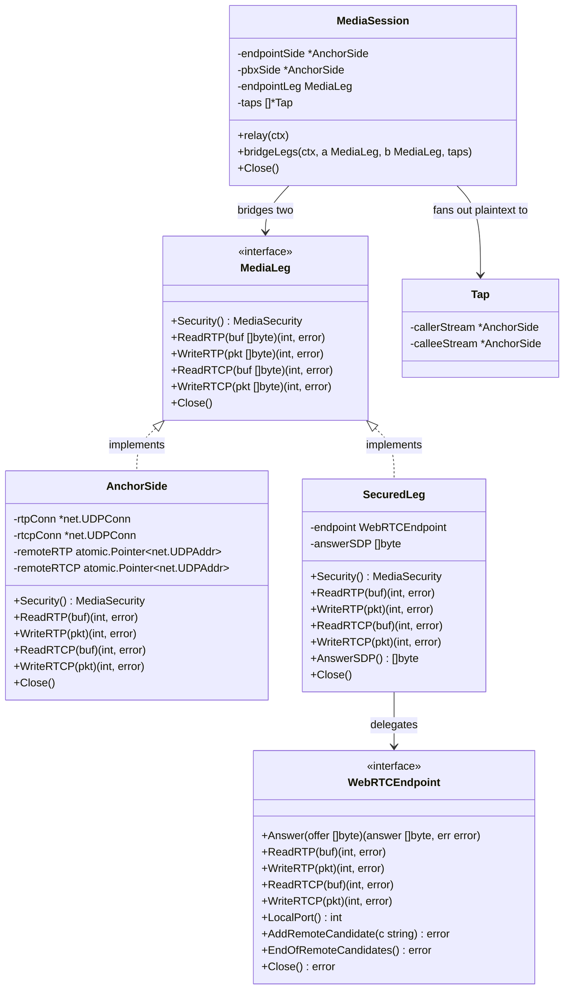

# DTLS-SRTP ↔ plain RTP media bridge (no transcoding)

## Requirements

Bridge media between a secured webphone leg (DTLS-SRTP, WebRTC) and a plain-RTP party
through the sequencer's anchor, so two-way audio actually flows end to end. The anchor
is the cryptographic boundary: decrypt SRTP arriving from the webphone and forward it
as plain RTP to the opposite leg; encrypt plain RTP from the opposite leg into SRTP
toward the webphone. RTCP is bridged the same way across the rtcp-mux'd webphone side.
Never transcode — RTP payload bytes pass through unchanged; codec selection is an
end-to-end signaling outcome. Encrypt/decrypt is a property of each *leg*, not of the
relay, so making the opposite leg SRTP later (SRTP↔SRTP) needs only a leg-security
change and no rework of the forwarding path. Media-plane failures are best-effort and
confined to the affected call.

## Entities

## Approach

1. Leg abstraction (the security boundary):
   - Encrypt/decrypt is a property of each `MediaLeg`, not of the relay. `ReadRTP`
     already yields *decrypted* plaintext; add `WriteRTP` accepting plaintext and
     applying the leg's *outbound* security. Add `ReadRTCP`/`WriteRTCP` mirrors for the
     RTCP plane.
   - Plain `AnchorSide`: `WriteRTP`/`WriteRTCP` are direct UDP writes to the
     atomically-loaded remote (nil remote drops the packet, matching `copyUDP`).
     `ReadRTCP` reads the RTCP socket.
   - Secured `SecuredLeg`: delegate all four to the `WebRTCEndpoint`. `WriteRTP` feeds
     plaintext to a pion local track so pion encrypts to SRTP; RTCP rides the muxed
     port.
   - This is what makes SRTP↔SRTP a future leg-property change with no forwarding-path
     rework (non-functional requirement).

2. pion endpoint outbound seam:
   - Add a local sendable `TrackLocalStaticRTP` (Opus) on the PeerConnection in `Answer`
     (after `SetRemoteDescription`) so the answer is sendrecv and outbound plaintext RTP
     is encrypted into SRTP toward the webphone. Opus is the browser webphone's codec;
     the bridge's byte-for-byte forwarding is codec-agnostic and proven independently of
     this concrete track.
   - `WriteRTP` writes to the local track (pion encrypts). `ReadRTCP` reads from the
     inbound `RTPReceiver` captured in `OnTrack` (rtcp-mux'd port). `WriteRTCP` parses the
     bytes and hands them to `PeerConnection.WriteRTCP`. Keep every pion specific behind
     the `WebRTCEndpoint` interface so the library stays swappable and tests use a fake.

3. Security-agnostic relay:
   - Add a leg-oriented relay path that moves plaintext between two `MediaLeg`s in both
     directions for RTP and RTCP, fanning RTP out to taps (plaintext). It reads from
     one leg and writes to the other via the seams; it never references SRTP or
     `MediaSecurity` directly. The existing plain↔plain `relay()` over raw `*net.UDPConn`
     stays; the secured-endpoint case uses the new leg-oriented path. (A later refactor
     may converge both onto `MediaLeg`; out of scope here.)
   - Reuse `rtpBufSize` (1500) and the per-packet copy-loop shape, and the
     log-and-stop error handling of `copyUDP`/`copyUDPFanout` so failures stay
     call-isolated.

4. Orchestration — complete the deferred secured path:
   - In `bridge()`, the secured-leg branch currently answers the webphone then waits on
     `ctx.Done()`. Replace that with: dial the PBX (plain-RTP opposite leg), anchor the
     PBX side, answer the webphone with the secured SDP, then run the leg-oriented relay
     bridging `endpointLeg` ↔ `pbxSide`.
   - The PBX offer is generated from the negotiated codecs (plain RTP, no rtcp-mux/ICE);
     payload types stay aligned end to end so raw payload forwarding is correct.

5. Failure isolation:
   - Any read/write/decrypt error logs at debug and stops the affected direction; the
     call's media is torn down via existing `Close`/`releaseMedia`. No other call and no
     signaling is affected (best-effort media plane).

## Structure

### Interface Relationships
1. `MediaLeg` interface gains `WriteRTP`, `ReadRTCP`, `WriteRTCP` alongside the existing
   `Security`, `ReadRTP`, `Close`.
2. `AnchorSide` (in `media.go`) implements the expanded `MediaLeg`.
3. `SecuredLeg` (in `webrtc.go`) implements the expanded `MediaLeg` by delegating to
   `WebRTCEndpoint`.
4. `WebRTCEndpoint` interface (in `webrtc.go`) gains `WriteRTP`, `ReadRTCP`, `WriteRTCP`;
   `pionEndpoint` implements them; the test fake implements them too.
5. `trickleLeg` (in `trickle.go`) is unchanged — `SecuredLeg` still satisfies it.

### Dependencies
1. `MediaSession.bridgeLegs` depends only on the `MediaLeg` interface (no pion, no
   socket types) plus the tap fan-out.
2. `SecuredLeg` depends on `WebRTCEndpoint`; only `pionEndpoint` imports pion.
3. `Engine.bridge` (secured branch) depends on `dialPBX`/`anchorMedia` building blocks
   and `MediaSession.bridgeLegs`.
4. Production `pionFactory.NewEndpoint` wires the local track + RTCP plumbing into
   `pionEndpoint`.

### Layered Architecture (Go package `internal/b2bua`)
1. Orchestration layer (`bridge.go`): call setup, PBX dial, answer, start relay.
2. Media-session layer (`media.go`): owns sides/legs, runs relay goroutines, tap fan-out.
3. Leg layer (`mediasec.go` interface; `media.go` `AnchorSide`; `webrtc.go` `SecuredLeg`):
   per-leg security transform (plaintext ↔ wire).
4. Library-boundary layer (`webrtc.go` `pionEndpoint`): the only pion-touching code.
5. Error handling: per-direction goroutine log-and-stop; ownership unwinds via `Close`.

## Operations

### Update Interface - MediaLeg (`internal/b2bua/mediasec.go`)
1. Responsibility: uniform plaintext read/write seam over a leg's security profile, for
   both RTP and RTCP.
2. Methods (add to the existing interface):
   - `WriteRTP(pkt []byte) (int, error)`
     - Logic: accept a plaintext RTP packet; the implementation applies the leg's
       outbound security (plain = raw UDP write; secured = encrypt via endpoint).
   - `ReadRTCP(buf []byte) (int, error)`
     - Logic: yield one decrypted/plaintext RTCP packet from the leg.
   - `WriteRTCP(pkt []byte) (int, error)`
     - Logic: accept a plaintext RTCP packet; apply outbound security.
3. Constraints: methods describe behavior, not wire format. No method exposes SRTP keys
   or ciphertext. Keep `ReadRTP`/`Security`/`Close` unchanged.

### Update Type - AnchorSide (`internal/b2bua/media.go`)
1. Responsibility: plain RTP/RTCP leg — plaintext == wire bytes.
2. Methods:
   - `WriteRTP(pkt []byte) (int, error)`
     - Logic: load `remoteRTP` atomically; nil → drop (return len(pkt), nil); else
       `rtpConn.WriteTo(pkt, dst)`.
   - `ReadRTCP(buf []byte) (int, error)`
     - Logic: `rtcpConn.Read(buf)`.
   - `WriteRTCP(pkt []byte) (int, error)`
     - Logic: load `remoteRTCP` atomically; nil → drop; else `rtcpConn.WriteTo(pkt, dst)`.
3. Constraints: no new locks; reuse the existing `atomic.Pointer` remotes; behavior
   matches `copyUDP` semantics (nil destination drops silently).

### Update Interface + Type - WebRTCEndpoint / pionEndpoint (`internal/b2bua/webrtc.go`)
1. Responsibility: terminate one webphone's WebRTC media; expose encrypted-outbound and
   RTCP seams behind the interface.
2. Interface methods to add: `WriteRTP(pkt []byte) (int, error)`,
   `ReadRTCP(buf []byte) (int, error)`, `WriteRTCP(pkt []byte) (int, error)`.
3. `pionEndpoint` implementation (fields added: `receiver *webrtc.RTPReceiver`,
   `localTrack *webrtc.TrackLocalStaticRTP`, both guarded by the existing `mu`):
   - In `Answer`, after `SetRemoteDescription`: create a local `TrackLocalStaticRTP`
     (Opus capability) and `AddTrack` it so the answer is sendrecv and pion encrypts
     outbound. `OnTrack` captures both the inbound `TrackRemote` (for `ReadRTP`) and its
     `RTPReceiver` (for `ReadRTCP`). The returned `RTPSender` is not retained.
   - `WriteRTP`: load `localTrack` under `mu`; a nil track (leg not yet answered) drops
     the packet (`return len(pkt), nil`) — it does not block on `ready`, and pion itself
     drops writes before a peer binds. Otherwise unmarshal `rtp.Packet` and
     `localTrack.WriteRTP(&p)`.
   - `ReadRTCP`: block on `ready`, then read from the captured inbound `RTPReceiver`
     (`recv.Read(buf)`); a Close before the receiver arrives returns an error.
   - `WriteRTCP`: `rtcp.Unmarshal(pkt)` then `e.pc.WriteRTCP(pkts)`; an unparseable
     packet returns an error (dropped best-effort by the relay).
4. Constraints: pion remains the only imported WebRTC library (`pion/rtp`, `pion/rtcp`
   become direct deps); all new behavior sits behind `WebRTCEndpoint`. pion rewrites the
   outbound SSRC/payload type to the negotiated values via the local track. Idempotent
   `Close` still unblocks pending reads/writes.

### Update Type - SecuredLeg (`internal/b2bua/webrtc.go`)
1. Responsibility: satisfy the expanded `MediaLeg` by delegating to `WebRTCEndpoint`.
2. Methods: `WriteRTP`, `ReadRTCP`, `WriteRTCP` each delegate to the endpoint.
3. Constraints: thin delegation only; no pion types leak.

### Create relay path - MediaSession.bridgeLegs (`internal/b2bua/media.go`)
1. Responsibility: security-agnostic plaintext relay between two `MediaLeg`s, RTP + RTCP,
   with RTP tap fan-out — used for the secured-endpoint case.
2. Method: `bridgeLegs(ctx context.Context, a, b MediaLeg, callerTaps, calleeTaps []*AnchorSide)`
   - Logic:
     - Start four goroutines: RTP a→b (fan out to callerTaps), RTP b→a (fan out to
       calleeTaps), RTCP a→b, RTCP b→a.
     - Each RTP goroutine: `buf := make([]byte, rtpBufSize)`; loop `n,err := src.ReadRTP(buf)`;
       on err select-on-ctx then return (log-and-stop); `dst.WriteRTP(buf[:n])`; then fan
       out plaintext to taps (reuse the tap-write loop shape from `copyUDPFanout`).
     - Each RTCP goroutine: same loop with `ReadRTCP`/`WriteRTCP`, no fan-out.
     - `<-ctx.Done()`; `m.Close()`; `wg.Wait()`.
   - Error handling: identical log-at-debug-and-return as `copyUDP`/`copyUDPFanout`;
     a read/write error stops only that direction; teardown closes the rest.
3. Constraints: references only the `MediaLeg` interface — never `MediaSecurity`, pion,
   or socket types. Tap writes must not block the primary direction (best-effort, logged).

### Create plain-offer builder - buildPlainOfferFromWebRTC (`internal/b2bua/sdp.go`)
1. Responsibility: derive a plain RTP/AVP offer from a WebRTC offer, carrying the same
   negotiated audio codecs but stripped of all WebRTC-specific attributes (SAVPF
   profile, ICE, DTLS fingerprint, rtcp-mux). The opposite leg is plain RTP and codecs
   pass through end to end unchanged (no transcoding). Rationale: the existing `dialPBX`
   derives its offer via `rewriteToAnchor(call.inbound.offerSDP, …)`, which only rewrites
   c=/port — for a WebRTC inbound offer that would forward `UDP/TLS/RTP/SAVPF`+ICE to a
   plain PBX, which is wrong. A downgrade is required.
2. Method: `buildPlainOfferFromWebRTC(webrtcOffer []byte, host string, rtpPort int) ([]byte, error)`
   - Logic: reuse `extractAudioCodecs` to pull formats + a=rtpmap/a=fmtp; emit
     `v=0 / o= / s= / t=`, `m=audio <rtpPort> RTP/AVP <formats>`, `c=IN IP4 <host>`, the
     rtpmaps, the fmtps, then `a=sendrecv`. Pure, CRLF output, mirrors `buildTapOffer`.
3. Constraints: pure function; no ICE/DTLS/rtcp-mux/SAVPF lines emitted; codec list copied
   verbatim so payload types stay aligned end to end.

### Refactor PBX dial - extract Engine.originatePBX (`internal/b2bua/bridge.go`)
1. Responsibility: the offer-agnostic core of dialing the terminating PBX leg, reused by
   both the plain path and the secured-bridge path.
2. Method: `originatePBX(ctx context.Context, call *Call, pbxOffer []byte) (pbxResp *sip.Response, pbxAnswerRaw []byte, ok bool)`
   - Logic: parse next-hop URI + transport switch; INVITE with `pbxOffer`, relaying
     provisional responses to the inbound caller; `WaitAnswer`; `Ack`; record
     `call.pbxLeg` + its `OnState` teardown hook; return the raw PBX answer. Returns
     `ok=false` on failure (final response sent, call torn down) — moves the existing
     `dialPBX` dial/wait body (offer-build and endpoint-answer excluded).
3. `dialPBX` (plain path) becomes: build offer via `rewriteToAnchor`, call
   `originatePBX`, then anchor `pbxSide` and answer the inbound caller with the
   PBX-anchored SDP (unchanged tail). Plain path behavior is identical.

### Create orchestration - Engine.bridgeSecuredToPBX (`internal/b2bua/bridge.go`)
1. Responsibility: complete the deferred secured path — bind the plain PBX side, dial the
   PBX with a plain offer, answer the webphone, and relay.
2. Logic (replaces the `<-ctx.Done()`-only block at the `anchor.securedLeg != nil` branch
   in `bridge()`):
   - Acquire a PBX port pair and bind a plain `pbxSide` (`newAnchorSide`); pion owns the
     webphone side's port, so only the PBX side is bound here. On exhaustion → 503; on
     bind failure → 500 (release the pair).
   - Register `pbxSide` on the existing `MediaSession` and update `call.releaseMedia` to
     also release the PBX pair.
   - Build the plain PBX offer via `buildPlainOfferFromWebRTC(call.inbound.offerSDP,
     mediaHost, pbxPair.RTP)`.
   - `originatePBX`; on failure return false (already torn down).
   - Parse the PBX answer media and `setRemote` on `pbxSide`.
   - Answer the webphone via `answerSecuredEndpoint` (existing). That function is
     reordered to mark the call established and register taps *before* sending 200 OK, so
     an immediate in-dialog re-INVITE/REFER is not 481'd by a state-establishment race.
   - Snapshot taps and `go anchor.session.bridgeLegs(ctx, anchor.securedLeg, pbxSide,
     callerTaps, calleeTaps)`.
3. Constraints: reuse `originatePBX`/`answerSecuredEndpoint`/`bridgeLegs`/`newAnchorSide`;
   do not duplicate dial logic. Keep the plain-plain path unchanged. The existing
   `TestWebRTCOfferAnsweredFromSecuredLegNoPBX` test encodes the now-superseded
   STORY-019 boundary ("no PBX for a webphone") and is rewritten as `TestWebRTCBridgedToPBX`;
   other pre-existing secured-leg tests (the real-handshake and trickle tests) now answer
   the PBX, since the webphone leg dials it.

### Guard mid-call paths against nil endpointSide (`internal/b2bua/midcall.go`, `refer.go`)
1. Responsibility: prevent a nil-pointer panic on a webphone call where `endpointSide`
   is nil (`endpointLeg` set instead).
2. Logic: in `handleReInvite` and `handleRefer`, before reading
   `call.media.endpointSide.localRTPPort`, guard `call.media == nil ||
   call.media.endpointSide == nil` and respond `488 Not Acceptable Here`, then return —
   the request is rejected, the established media keeps flowing. Full secured mid-call
   support (re-anchor/REFER on the secured leg) is out of scope.
3. Constraints: narrowest possible guard; cover with tests (re-INVITE and REFER on a
   webphone call return 488 and the call survives); no regression to the plain path.

## Norms

1. Go style: `gofmt`/`go vet` clean, idiomatic Go; errors are values, wrapped with
   `fmt.Errorf("...: %w", err)` for context.
2. Interfaces at the consumer: `MediaLeg` and `WebRTCEndpoint` are consumer-defined and
   small; add only the methods the bridge needs.
3. Functional core / side-effects at edges: the relay is pure data movement over
   interfaces; sockets and pion live behind the leg/endpoint types.
4. Concurrency: each goroutine owns one direction of one plane; no shared mutable state
   on the hot path beyond the existing `atomic.Pointer` remotes; `go test -race` clean.
   Long-lived loops take `context.Context` and exit on cancel.
5. Error/log: media-plane errors log via `slog.Debug` and stop the affected direction;
   never propagate to signaling. Reuse the existing select-on-`ctx.Done()` pattern.
6. Naming reveals intent: `WriteRTP`/`ReadRTCP`/`WriteRTCP`, `bridgeLegs`. No comment
   that restates a well-named function.
7. Tests are BDD Given/When/Then, named by behavior. Bridge-core (fake WebRTC peer, real
   AnchorSide sockets): `TestBridgeForwardsDecryptedRTPToPlainLeg`,
   `TestBridgeEncryptsPlainRTPToSecuredLeg`, `TestBridgeRTCPBothDirections`,
   `TestBridgeForwardsBetweenTwoPlainLegs`, `TestBridgeMediaFailureStaysIsolated`.
   Orchestration: `TestWebRTCBridgedToPBX`, `TestReInviteOnWebphoneCallRejected`,
   `TestReferOnWebphoneCallRejected`.
8. Mocking: only the external WebRTC peer is faked, via the existing `WebRTCEndpoint`
   fake (`webrtc_test.go`) extended to record `WriteRTP`/RTCP and yield canned decrypted
   RTP. No mocking of internal types; `AnchorSide` tested against real UDP sockets.

## Safeguards

1. Functional: two-way audio flows webphone ↔ plain-RTP (AC1); RTP payload forwarded
   byte-identical in both directions (AC1/AC2/AC5); decrypt on inbound, encrypt on
   outbound, boundary exactly at the anchor (AC3); RTCP bridged both directions (AC4).
2. No transcoding: the per-packet path performs only security transform + forward; no
   codec decode/encode anywhere; PT/SSRC/clock-rate of outbound match the negotiated
   codec (AC5, non-functional cost rule).
3. Per-leg security independence: `bridgeLegs` references only `MediaLeg`; enabling
   SRTP on the opposite leg later requires only that leg's `Security()` + a secured
   `AnchorSide` variant, with zero change to `bridgeLegs` (non-functional requirement).
4. Failure isolation: any read/write/decrypt/auth error is best-effort — logged, stops
   that direction, tears down only this call's media; other calls and the signaling
   plane are unaffected (AC6).
5. Concurrency: `go test -race` clean; no goroutine leak — every relay goroutine exits on
   `ctx.Done()` or socket/endpoint close; `Close` is idempotent and unblocks pending
   reads/writes.
6. Robustness: a leg live before the other (DTLS/ICE not yet up while PBX answers) must
   not spin or drop the call; writes before connection-up are dropped, not panicking;
   endpoint closed before track ready returns an error treated as normal teardown.
7. Backward compatibility: the plain↔plain `relay()` path and existing `AnchorSide`
   behavior are unchanged; new `MediaLeg` methods are additive; mid-call paths guarded
   against nil `endpointSide` without regressing the plain path.
8. Library boundary: only `pionEndpoint` imports a WebRTC library; everything else
   depends on `WebRTCEndpoint`/`MediaLeg`, keeping pion swappable and tests pion-free.
9. Build gate (definition of done): `go build ./...`, `go vet ./...`, `gofmt`, and
   `go test -race ./...` all pass; behavior tests for AC1–AC6 exist and pass; only the
   external WebRTC peer is faked.
