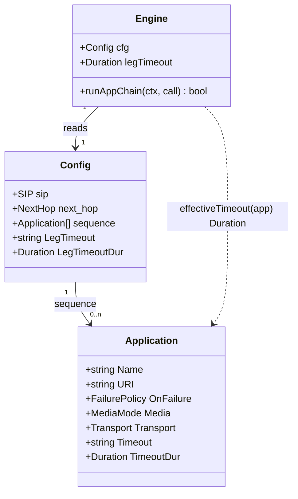

# Per-application leg timeout + configurable global leg timeout

> REASONS-Canvas structured prompt for `[STORY-001-021]`. Stack: **Go** + `emiago/sipgo`.
> Builds on the implemented `internal/config` loader and the `internal/b2bua` app chain
> (stories 001/003/004). Functional core / imperative shell per `AGENTS.md`. Go-native —
> errors as values, durations parsed at config load, no exception-handler classes.
>
> **Localized change.** A new optional per-app `timeout` and a new global `leg_timeout` in
> config (both `time.Duration` strings), parsed/validated at load like `connect_timeout`;
> the engine reads the global default instead of the hardcoded `32s`; the initial app-chain
> loop bounds the dial AND answer-wait by the app's effective timeout. The PBX leg, mid-call,
> and REFER paths keep the global default (no per-app override there in this story).
>
> Accepted decisions:
> - **One per-app knob `timeout`** bounds the WHOLE initial-leg setup span (dial + answer
>   wait) as a single `context.WithTimeout(ctx, effective)` — simple operator mental model
>   ("this app must complete setup within T or its `on_failure` applies").
> - **The dial bound is the real fast-fail lever** for an unreachable/laggy plain-TCP app
>   (today that dial is unbounded — `dialerFor` returns `func(){}`). The answer-wait bound
>   only fast-fails an app that already sent a provisional (RFC 3261 §9.1 CANCEL rule — see
>   Safeguards §10); a fully silent peer is still floored by SIP Timer B inside sipgo, so the
>   dial deadline is what protects the silent-network case.
> - **Global default becomes `leg_timeout`** (config, default `32s` when omitted), replacing
>   the hardcoded `engine.New` value; it governs apps with no `timeout`, plus the PBX leg,
>   mid-call re-INVITE, and REFER (unchanged scope).
> - **Compose with `on_failure`** — a timeout returns a leg error into the existing
>   skip/abort branches; no new failure semantics, no new protocol.
> - **Durations resolved at config load** (parsed once, like `ConnectTimeout`); the bridge
>   reads a `time.Duration`, never re-parses.

## Requirements

Bound the call-setup latency a single SIP application can add, so a slow or unreachable
application fails fast under its existing `on_failure` policy instead of inflating post-dial
delay (PDD) and degrading call setup. Give the operator a per-application `timeout` for the
initial leg and make the previously-hardcoded global leg timeout (`32s`) configurable as a
default. A per-app timeout bounds that app's whole originate→answer span; on expiry the leg
is treated as a failure and the chain honors `skip` (advance) or `abort` (fail the call) —
purely via context deadlines at the network/transaction edge, with no new SIP messages
beyond the standard CANCEL sipgo already emits.

Boundaries: initial app chain only (PBX leg, mid-call re-INVITE, and REFER keep the global
default — no per-app override there); single attempt (no retry/backoff); the timeout does not
touch established-call RTP (media is anchored independently); no new protocol/headers.

## Entities

Conservative-design notes:
- **Reuse existing structs.** `Application` and `Config` are extended with two optional
  fields each — a raw `string` (yaml) and a resolved `time.Duration` (`yaml:"-"`), mirroring
  the established `ConnectTimeout`/`Resolved` pattern. No new wrapper types, no DTOs.
- **`Duration` fields are `yaml:"-"`** (load-time resolved, never serialized) — distinguishable
  from the raw string, same idiom as `ResolvedTLSProfile`.
- **No change to `Call`/`OutboundLeg`.** The bridge reads `effectiveTimeout(app)` and builds a
  context; nothing about the leg's shape changes.
- **`effectiveTimeout` is a one-line pure helper** on the engine (or a free function taking
  the app + global default), not a new abstraction layer.

## Approach

1. **Config schema (parse + validate + resolve, `internal/config`):**
   - Add `Timeout string yaml:"timeout"` to `Application` and a resolved
     `TimeoutDur time.Duration yaml:"-"`.
   - Add `LegTimeout string yaml:"leg_timeout"` to `Config`/`rawConfig` and a resolved
     `LegTimeoutDur time.Duration yaml:"-"`.
   - In `validate`: when `Timeout`/`leg_timeout` is non-empty it must `time.ParseDuration`
     cleanly and be `> 0` (reuse the exact error shape used for `connect_timeout`).
   - In `applyDefaults`/resolution: parse `leg_timeout` to `LegTimeoutDur`, defaulting to
     `32 * time.Second` when omitted; parse each app's `Timeout` to `TimeoutDur` (zero when
     omitted — meaning "use the global default").

2. **Engine wiring (`internal/b2bua/engine.go`):**
   - Replace the hardcoded `legTimeout: 32 * time.Second` with `legTimeout: cfg.LegTimeoutDur`
     (config already guarantees a non-zero default). The global now governs the PBX leg,
     mid-call, and REFER exactly as before — just operator-tunable.

3. **Per-app effective timeout (pure helper):**
   - `effectiveTimeout(app config.Application) time.Duration`: return `app.TimeoutDur` when
     `> 0`, else `e.legTimeout`. Pure, table-tested.

4. **Bound the initial leg (`internal/b2bua/bridge.go` `runAppChain`):**
   - Compute `to := e.effectiveTimeout(app)` once per app, derive
     `appCtx, appCancel := context.WithTimeout(ctx, to)` for the whole originate→answer span.
   - Pass `appCtx` into `dialerFor` so the **plain-TCP dial is now bounded** by `to` (today it
     is unbounded; TLS legs further clamp to `connect_timeout`, i.e. the min of the two via
     context chaining — already handled by `dialContext`).
   - Use `appCtx` (not a fresh `context.WithTimeout(ctx, e.legTimeout)`) for `WaitAnswer`, so a
     single deadline covers dial + answer. `defer appCancel()` per iteration (or cancel before
     `continue`/`return`) — no context leak across the loop.
   - On expiry the existing originate/answer failure branches fire unchanged: emit
     `AppFailure`, log with `stage`, then `skip` (`continue`) or `abort`
     (`respondInboundFromLegError`).

5. **Error handling:** Go-idiomatic — context deadline surfaces as a leg error (originate err
   or `WaitAnswer` err) mapped by the existing `failureAction`/`mapFailureStatus`; on abort a
   timeout maps to `503 Service Unavailable` (already the timeout mapping). No panic, no new
   error type.

6. **Docs:** add `leg_timeout` and per-app `timeout` to `packaging/config.example.yaml` with a
   one-line note that `timeout` bounds the app's setup span and composes with `on_failure`.

## Structure

### Type / function relationships
1. `config.Application.Timeout string` + `config.Application.TimeoutDur time.Duration` — new
   optional fields (raw + resolved).
2. `config.Config.LegTimeout string` + `config.Config.LegTimeoutDur time.Duration` — new
   global default (raw + resolved); `rawConfig` carries the raw string.
3. `Engine.effectiveTimeout(config.Application) time.Duration` — new pure helper.
4. `Engine.legTimeout` — now sourced from `cfg.LegTimeoutDur` (no literal in `New`).
5. `Engine.runAppChain` — one `context.WithTimeout` per app drives both the dial and the
   answer wait.

### Dependencies
1. `internal/config` → `time` (already imported for `ConnectTimeout`); no new deps.
2. `bridge.go` → `internal/config` (Application), `engine.effectiveTimeout`, `context`, sipgo
   — same set; `dialerFor`/`dialContext` unchanged in signature (they already take a ctx).
3. `engine.go` → reads `cfg.LegTimeoutDur`; no new deps.
4. `call.go`, `registry.go`, `state.go`, `refer.go`, `midcall.go` unchanged (they keep using
   `e.legTimeout`, which now carries the configured default).

### Layered architecture (functional core / imperative shell)
1. Edge/shell (`main.go`) — unchanged; loads config as today.
2. Config core (`internal/config`) — pure parse/validate/resolve of the new duration fields;
   unit-tested directly (no network).
3. SIP boundary (`Engine.runAppChain`) — builds the bounded context (impure edge).
4. Pure core (`effectiveTimeout`) — trivial, table-tested.

> No Controller/Service/GlobalExceptionHandler — a timeout is a Go context deadline surfaced
> as an error value into the existing `on_failure` branch; the only "policy" is the pure
> `effectiveTimeout` selector plus the established `failureAction` mapping.

## Operations

### Update config schema - Application & Config (internal/config/config.go)
1. Responsibility: accept and resolve an optional per-app `timeout` and a global
   `leg_timeout`.
2. `Application`: add `Timeout string yaml:"timeout"` and `TimeoutDur time.Duration yaml:"-"`.
3. `Config` + `rawConfig`: add `LegTimeout string yaml:"leg_timeout"` and
   `LegTimeoutDur time.Duration yaml:"-"` (raw string decoded in `rawConfig`, copied into
   `cfg` in `Parse`).
4. `validate`: for each app with non-empty `Timeout`, and for non-empty `LegTimeout`, require
   `time.ParseDuration` success and value `> 0`; error shapes mirror
   `tls_profiles[...]: invalid connect_timeout` and
   `sequence[i] %q: ...` conventions.
5. Resolution (in `applyDefaults` or a small `resolveTimeouts(&cfg)` called from `Parse`):
   - `cfg.LegTimeoutDur = 32 * time.Second` when `LegTimeout == ""`, else the parsed value.
   - `cfg.Sequence[i].TimeoutDur =` parsed value when set, else `0` (sentinel: use global).
6. Constraints: omitted keys preserve today's behavior (global `32s`, unbounded-by-config
   per-app → falls back to global); unknown-key rejection (`KnownFields(true)`) still holds.

### Create pure helper - effectiveTimeout (internal/b2bua/engine.go or state.go)
1. Responsibility: pick the deadline for an app's initial leg.
2. `func (e *Engine) effectiveTimeout(app config.Application) time.Duration { if app.TimeoutDur > 0 { return app.TimeoutDur }; return e.legTimeout }`.
3. Constraints: pure; no I/O; table-tested (`set>0 → app value`, `unset → global`).

### Update Engine construction - legTimeout from config (internal/b2bua/engine.go)
1. Replace `legTimeout: 32 * time.Second` with `legTimeout: cfg.LegTimeoutDur`.
2. Constraints: `cfg.LegTimeoutDur` is always `> 0` (config defaults it); mid-call/REFER
   unchanged — they keep reading `e.legTimeout`.

### Update orchestrator - runAppChain bounded leg (internal/b2bua/bridge.go)
1. Responsibility: bound each app's dial + answer wait by its effective timeout.
2. Logic (inside `for i := range e.cfg.Sequence`):
   - `to := e.effectiveTimeout(app)`.
   - `appCtx, appCancel := context.WithTimeout(ctx, to)`; ensure `appCancel()` runs on every
     exit of the iteration (after answer, on `continue`, on abort `return`).
   - Pass `appCtx` to `e.dialerFor(appCtx, ...)` so the plain-TCP dial is bounded (TLS legs
     still clamp to `connect_timeout` via `dialContext(appCtx, resolved)`).
   - Replace `legCtx, legCancel := context.WithTimeout(ctx, e.legTimeout)` +
     `appSess.WaitAnswer(legCtx, ...)` with `appSess.WaitAnswer(appCtx, ...)` (drop the inner
     timeout; `appCtx` already carries the deadline). Remove `legCancel` (folded into
     `appCancel`).
   - Keep the existing originate-failure and answer-failure branches verbatim (metrics, log
     with `stage`, `failureAction` → skip/abort). A deadline surfaces through them naturally.
3. Constraints: a single deadline spans dial+answer (not 2×T); no context leak across loop
   iterations; success path and tap/SDP handling unchanged.

### Update example config (packaging/config.example.yaml)
1. Add top-level `leg_timeout: 32s` with a comment: global default answer timeout for any leg.
2. Add `timeout: 5s` under the `transcription` app with a comment: per-app setup deadline
   (dial + answer); on expiry the app's `on_failure` applies.
3. Constraints: values are illustrative; keep comments one line, consistent with the file.

### Update tests - timeout behavior (internal/config/config_test.go, internal/b2bua/*_test.go, test/e2e)
1. Config (table/unit, Given/When/Then):
   - `TestLegTimeoutDefaultsTo32sWhenOmitted` (omitted → `LegTimeoutDur == 32s`).
   - `TestLegTimeoutParsesConfiguredValue` (`leg_timeout: 10s` → `10s`).
   - `TestAppTimeoutParsesConfiguredValue` (`timeout: 5s` → `TimeoutDur == 5s`).
   - `TestAppTimeoutOmittedIsZeroSentinel` (omitted → `TimeoutDur == 0`).
   - `TestInvalidLegTimeoutRejected` / `TestInvalidAppTimeoutRejected` (`"nope"`, `"0s"`,
     `"-1s"` → load error).
2. Pure helper: `TestEffectiveTimeoutPrefersAppOverGlobal` and `...FallsBackToGlobal`.
3. Behavior (e2e, real in-memory sipgo fakes — `test/e2e/fakes.go`):
   - `TestUnreachableAppFailsFastWithinTimeout` — fake app that **never accepts/answers**;
     with `timeout: 1s`, `on_failure: skip`, assert the call completes via `next_hop` and the
     leg failed in ≈`timeout` (well under the global `32s`) — proves the dial bound.
   - `TestSlowAppAnswerTimeoutSkips` — fake app sends `100 Trying` then stalls; assert
     timeout → CANCEL → skip, call still completes.
   - `TestAppTimeoutAbortFailsCall` — same slow app with `on_failure: abort`; assert the
     caller gets a failure and no further hop is invited.
4. Completion: pass under `go test -race ./...`; existing chain/PRD tests stay green.

## Norms

1. **Style:** durations parsed/validated once at config load (mirror `ConnectTimeout`); the
   bridge reads a `time.Duration` and builds a context — never re-parses. `effectiveTimeout`
   is pure; the deadline is applied at the SIP edge.
2. **Errors as values:** wrap `%w`; config errors mirror the `connect_timeout` messages; a
   timeout surfaces through the existing `slog.Warn("application failed", ... "stage", ...)`
   and `failureAction`. No panic; no new error type.
3. **Context discipline:** exactly one `context.WithTimeout` per app iteration covering dial +
   answer; `cancel()` always runs (defer or explicit before `continue`/`return`); no leak,
   `go test -race` clean.
4. **Backward compatibility:** omitted `leg_timeout` ⇒ `32s` (today's value); omitted per-app
   `timeout` ⇒ global default; configs without these keys behave identically to before.
5. **Scope discipline:** only the initial app chain gains the per-app override; PBX leg,
   mid-call, and REFER keep `e.legTimeout` (now the configured global) — no behavior change
   beyond the tunable default.
6. **Tests (BDD, named by behavior):** real in-memory sipgo fakes (no internal mocks); a slow
   fake is a real fake of an *external* SIP app, allowed. Cover the dial-bound fast-fail
   explicitly (the behavior the global `32s` could not give).
7. **Toolchain gate:** `gofmt`, `go vet ./...`, `go build ./...`, `go test -race ./...` clean.
8. **Minimal churn:** touch `internal/config/config.go`, `engine.go`, `bridge.go`,
   `packaging/config.example.yaml`, and tests. Do not change `call.go`, `registry.go`,
   `state.go` logic, `refer.go`, `midcall.go`.

## Safeguards

1. **Functional constraint — per-app bound:** when `timeout` is set, the app's initial leg
   (dial + answer wait) must complete within that duration; on expiry the leg is a failure and
   `on_failure` applies (`skip` advances, `abort` fails the call with `503`/pass-through).
2. **Functional constraint — global default:** `leg_timeout` (default `32s`) governs any app
   without `timeout`, plus the PBX leg, mid-call re-INVITE, and REFER.
3. **PDD constraint (the goal):** a single slow/unreachable app cannot delay call setup beyond
   `effectiveTimeout(app)` (subject to §10); with `on_failure: skip` the call still reaches the
   next hop.
4. **Media constraint:** the timeout affects signaling/setup only; anchored RTP for an
   established call is untouched — no audio path is shut by this feature.
5. **Backward-compat constraint:** configs omitting both keys are byte-for-byte equivalent in
   behavior to the current hardcoded `32s`; unknown keys still rejected at load.
6. **Validation constraint:** `timeout`/`leg_timeout`, when present, must parse as a Go
   duration and be `> 0`; otherwise config load fails with a clear, prefixed error. `0`/empty
   per-app `timeout` is the documented "use global" sentinel (never an unbounded leg).
7. **Context-safety constraint:** one deadline per app iteration; cancel always invoked; no
   goroutine/context leak; `go test -race` clean.
8. **Scope constraint (do NOT implement here):** retry/backoff/reorder; per-app override for
   PBX/mid-call/REFER; separate dial-vs-answer knobs; dynamic/runtime reconfiguration;
   provisional-resets-deadline behavior. Single overall deadline only.
9. **Compose-not-replace constraint:** reuse `failureAction`/`mapFailureStatus`/`AppFailure`;
   add no new failure path, status mapping, or SIP header.
10. **Known-limitation constraint (must be documented + tested):** the *answer-wait* portion
    of the deadline can only fast-fail an app that has already sent a provisional — RFC 3261
    §9.1 permits CANCEL only after a provisional, and sipgo's `inviteCancel` then waits for the
    transaction's Timer B (~`64·T1`) against a fully silent peer. Therefore the **dial bound**
    (now applied to plain-TCP legs) is the guarantee for the unreachable/silent case; the
    `TestUnreachableAppFailsFastWithinTimeout` test asserts exactly this.
