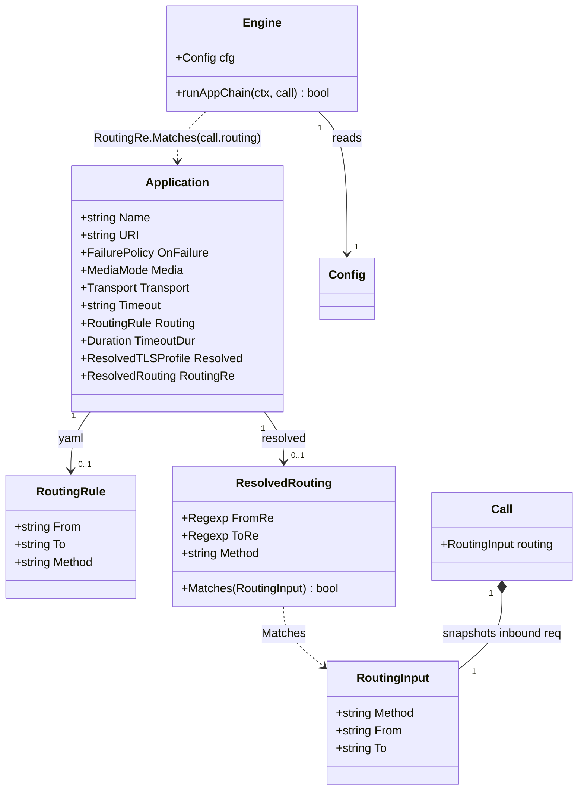

# Per-application routing rules (regex over From/To + method)

> REASONS-Canvas structured prompt for the routing-rules enhancement. Stack:
> **Go** + `emiago/sipgo`. Builds on the implemented `internal/config` loader and the
> `internal/b2bua` app chain (stories 001/003/004). Functional core / imperative shell
> per `AGENTS.md`. Go-native — errors as values, regexes compiled at config load, no
> exception-handler classes.
>
> **Localized change.** A new optional per-app `routing` block in YAML filters which
> inbound requests that application receives: `from` and `to` are regular expressions
> matched against the INVITE's From/To URI strings, and `method` is matched
> case-insensitively against the SIP method token. Regexes are compiled once at
> config load (fail-fast on invalid patterns); the bridge skips an app whose rule does
> not match the inbound request and proceeds to the next hop — routing is a filter,
> never a call failure. A missing `routing` block matches every request (backward
> compatible).
>
> Accepted decisions:
> - **One optional `routing` block per `sequence` app**, three AND-ed fields (`from`,
>   `to`, `method`); an absent field is a wildcard. Matches the operator mental model
>   "route this app to calls that look like X" with no new control flow.
> - **From/To are regexes over the SIP URI string** (e.g. `"^sip:alice@"`) — anchors give
>   precise prefix/domain/user matching without a URI-query DSL; the full URI form is
>   the match target so display names and params are out of scope.
> - **Method is matched verbatim, case-insensitively** (tolerant of `invite` vs `INVITE`
>   operator typos; SIP methods are case-sensitive on the wire but YAML is not the wire).
> - **Compile at load, match at runtime.** A `ResolvedRouting` (compiled `*regexp.Regexp`
>   + normalized method) lives on the resolved `Application`; the YAML-facing `RoutingRule`
>   stays a plain data value. The pure `Matches` is the unit-tested core.
> - **Routing is a skip, not a failure.** A non-matching app is logged and advanced past;
>   `on_failure` is not consulted and no metric is emitted — the app was never invited.
>   The call always continues to the next app / PBX.
> - **Pure matcher lives in `internal/config`** (no sipgo dependency): the bridge
>   converts an inbound `*sip.Request` into a `config.RoutingInput` of strings at the
>   edge, keeping the core testable without a SIP stack.

## Requirements

Let the operator route a SIP application only to calls that match a rule, so a chain can
contain apps that apply selectively (e.g. a transcription app for inbound calls only, a
recording app for a specific tenant's From domain). The rule is a conjunction of
optional regular expressions over the inbound INVITE's From and To URI strings and an
optional SIP request method token. The rule is configurable per application via YAML;
an app with no `routing` block receives every call (today's behavior). A non-matching
app is skipped silently (logged at info) — the call proceeds to the next app and the
PBX unaffected. Routing never fails, rejects, or tears down a call.

Boundaries: initial app chain only (filtering happens before each app's leg is
originated); From/To matched as full URI strings (no parsed-URI query, no header params
beyond what the URI string carries); method matched case-insensitively verbatim (no
method taxonomy, no INVITE-vs-MESSAGE grouping); no routing on the PBX/next-hop leg
(it always receives the call); no runtime reconfiguration; no negation/boolean
composition beyond field-wise AND.

## Entities

Conservative-design notes:
- **Reuse the existing `Application` struct.** Two new fields: `Routing *RoutingRule`
  (raw, yaml) and `RoutingRe *ResolvedRouting` (resolved, `yaml:"-"`), mirroring the
  established `Timeout`/`TimeoutDur` and `TLSProfile`/`Resolved` pairs. No new wrapper.
- **`RoutingRule` and `ResolvedRouting` are siblings, not the same struct.** The YAML
  value stays a plain `string`-fielded data object (no compiled state, no behavior); the
  resolved form carries `*regexp.Regexp` and the `Matches` method. This keeps the
  compiled regex out of every equality check and log dump of the config value.
- **`RoutingInput` is a string-only struct** so the pure matcher has zero SIP-library
  dependency; the bridge performs the `*sip.Request → RoutingInput` conversion at the
  edge (pure shell → pure core boundary).
- **`Call.routing` is set once at `handleInvite`** from the inbound request and read
  by the chain loop; no mutation, no locking beyond the existing call lifecycle.

## Approach

1. **Config schema (parse + resolve, `internal/config`):**
   - Add `Routing *RoutingRule yaml:"routing"` and `RoutingRe *ResolvedRouting yaml:"-"`
     to `Application`.
   - `RoutingRule{ From, To, Method string }` — three optional regex/method strings.
   - In `Parse`, after `resolveTLS`, call `resolveRouting(&cfg)`: for each app,
     `resolveRoutingRule(app.Routing)` compiles `From`/`To` with `regexp.Compile` (error
     wrapped `routing.from %q: %w` / `routing.to %q: %w` with app context
     `sequence[i] %q: %w`); `Method` is carried verbatim (case-insensitive compare at
     match time). A nil rule yields a nil `ResolvedRouting` (matches everything).
   - No new `validate` step — `regexp.Compile` is the validator; an invalid pattern
     aborts load with field+pattern context (same fail-fast posture as `connect_timeout`).

2. **Pure matcher (`internal/config/routing.go`):**
   - `ResolvedRouting.Matches(req RoutingInput) bool`: nil receiver matches all; each
     present field (`Method != ""`, `FromRe != nil`, `ToRe != nil`) is an independent
     AND condition; absent fields are wildcards.
   - `equalMethod(a, b string) bool`: ASCII case-insensitive compare of the method
     token (no `strings.ToLower` allocation on the hot path; one byte loop).

3. **Bridge wiring (`internal/b2bua/bridge.go`):**
   - `routingInput(req *sip.Request) config.RoutingInput`: reads `req.Method`,
     `req.From().Address.String()`, `req.To().Address.String()` (empty string when a
     header is absent — a present regex field can match or not as written). Pure edge
     conversion; no SIP types leak into the matcher.
   - In `handleInvite`, set `call.routing = routingInput(req)` when building the `Call`.
   - In `runAppChain`, at the top of the loop: `if !app.RoutingRe.Matches(call.routing)
     { slog.Info("application skipped by routing rule", ...); continue }`. No metric,
     no `on_failure`, no tap release — the app was never invited. The `continue` lands
     on the next app; an all-skipped chain routes straight to the PBX (the existing
     empty-sequence path).

4. **Error handling:** Go-idiomatic — `regexp.Compile` errors wrapped `%w` with field
   and pattern at load; at runtime a non-match is a `continue`, not an error. No
   panic, no new error type, no SIP response emitted for routing.

5. **Docs:** add a `routing:` block to one app in `packaging/config.example.yaml` with
   a one-line note that it filters which calls the app receives (AND of fields; absent
   block = all calls).

## Structure

### Type / function relationships
1. `config.RoutingRule{From, To, Method string}` — new YAML-facing value type.
2. `config.ResolvedRouting{FromRe, ToRe *regexp.Regexp; Method string}` — new resolved
   form with the `Matches` method (pure core).
3. `config.RoutingInput{Method, From, To string}` — new input struct for `Matches`.
4. `config.Application.Routing *RoutingRule` + `config.Application.RoutingRe *ResolvedRouting`
   — new optional fields (raw + resolved).
5. `config.resolveRouting(*Config) error` + `config.resolveRoutingRule(*RoutingRule)
   (*ResolvedRouting, error)` — load-time compilation (one public-ish driver + one pure
   helper).
6. `b2bua.routingInput(*sip.Request) config.RoutingInput` — edge conversion helper.
7. `b2bua.Call.routing config.RoutingInput` — new field, set once at `handleInvite`.
8. `b2bua.Engine.runAppChain` — one `Matches` guard at the top of the loop.

### Dependencies
1. `internal/config` → `regexp`, `fmt` (already imported); no new external deps.
2. `internal/b2bua/bridge.go` → `internal/config` (already imported for `Application`);
   `sip.From()`/`sip.To()` already used in identity tests. No new deps.
3. `internal/b2bua/call.go` → `internal/config` (new import, for `RoutingInput` field).
4. `engine.go`, `registry.go`, `state.go`, `refer.go`, `midcall.go`, `proxy.go` —
   unchanged.

### Layered architecture (functional core / imperative shell)
1. Edge/shell (`main.go`) — unchanged; loads config as today.
2. Config core (`internal/config/routing.go`) — pure `Matches` + `resolveRoutingRule`;
   unit-tested directly (no network, no SIP stack).
3. SIP boundary (`internal/b2bua/bridge.go`) — `routingInput` converts the request;
   `runAppChain` applies the guard (impure edge).
4. Pure core (`ResolvedRouting.Matches`, `equalMethod`) — deterministic, table-tested.

> No Controller/Service/GlobalExceptionHandler — a routing decision is a pure boolean
> over a `RoutingInput`; the only "policy" is AND-ed field matching and skip-vs-invite
> in the bridge loop.

## Operations

### Create config core - routing.go (internal/config/routing.go)
1. Responsibility: define the YAML value, the resolved form, the match input, the pure
   matcher, and the load-time compiler.
2. `RoutingRule{From, To, Method string}` with `yaml:"from"`/`"to"`/`"method"` tags.
3. `RoutingInput{Method, From, To string}` — no yaml tags (never serialized).
4. `ResolvedRouting{FromRe, ToRe *regexp.Regexp; Method string}` with `Matches`.
5. `Matches(req)`: nil → true; `Method != ""` → `equalMethod(Method, req.Method)`;
   `FromRe != nil` → `FromRe.MatchString(req.From)`; `ToRe != nil` →
   `ToRe.MatchString(req.To)`; all must hold (AND).
6. `resolveRoutingRule(r *RoutingRule) (*ResolvedRouting, error)`: nil → `(nil, nil)`;
   compile `From`/`To` when non-empty, wrapping errors `routing.from %q: %w` /
   `routing.to %q: %w`; carry `Method` verbatim.
7. `equalMethod(a, b)`: length check then ASCII case-fold compare in one loop.
8. Constraints: pure (no I/O, no SIP types); a nil rule matches everything; an empty
   (present-but-no-fields) rule matches everything (all fields wildcards).

### Update config schema - Application + resolve (internal/config/config.go)
1. `Application`: add `Routing *RoutingRule yaml:"routing"` and
   `RoutingRe *ResolvedRouting yaml:"-"`.
2. In `Parse`, after `resolveTLS(&cfg)`, call `resolveRouting(&cfg)` and wrap its error
   `parse config %q: %w`.
3. `resolveRouting(cfg)`: for each `cfg.Sequence[i]`, call `resolveRoutingRule` and
   wrap a per-app error `sequence[%d] %q: %w`; assign `app.RoutingRe`.
4. Constraints: omitted `routing` ⇒ `Routing` nil ⇒ `RoutingRe` nil (matches all);
   invalid regex aborts load with field+pattern+app context; `KnownFields(true)` still
   rejects unknown keys (the new `routing` key is now known).

### Update bridge - routingInput + guard (internal/b2bua/bridge.go)
1. `routingInput(req)`: build `config.RoutingInput{Method: string(req.Method)}`; if
   `req.From() != nil` set `From = req.From().Address.String()`; likewise `To`. Empty
   string when a header is absent.
2. In `handleInvite`, add `routing: routingInput(req)` to the `Call` literal.
3. In `runAppChain`, at the top of the `for i := range e.cfg.Sequence` loop:
   `if !app.RoutingRe.Matches(call.routing) { slog.Info("application skipped by routing
   rule", "name", app.Name, "method", call.routing.Method, "from", call.routing.From,
   "to", call.routing.To); continue }`.
4. Constraints: no tap acquired, no metric emitted, no `on_failure` consulted for a
   skipped app; the `continue` reuses the existing advance path; an all-skipped chain
   reaches the PBX via the existing post-loop block.

### Update call struct - routing field (internal/b2bua/call.go)
1. Add `routing config.RoutingInput` to `Call`; import `internal/config`.
2. Set once in `handleInvite`; read-only thereafter (no locking beyond call lifecycle).
3. Constraints: zero value (`config.RoutingInput{}`) matches an empty/nil rule
   identically — safe for tests that build a `Call` literal without routing.

### Update example config (packaging/config.example.yaml)
1. Add a `routing:` block under one `sequence` app with `from: "^sip:alice@"` (or
   similar) and a one-line comment: filters which calls this app receives (AND of
   from/to regexes + method; omit to receive all calls).
2. Constraints: illustrative value; keep comments one line, consistent with the file.

### Update tests - routing behavior (internal/config/routing_test.go, internal/b2bua/routing_test.go)
1. Pure matcher (`internal/config/routing_test.go`, Given/When/Then):
   - `TestNilRuleMatchesEverything` — nil `*ResolvedRouting` matches any input.
   - `TestMethodRuleMatchesOnlyThatMethod` / `TestMethodRuleIsCaseInsensitive` —
     method field AND case tolerance.
   - `TestFromRegexMatchesURI` / `TestFromAndToAreANDed` / `TestAllFieldsANDed` —
     regex semantics and AND composition.
   - `TestEmptyResolvedRuleMatchesAll` — zero-value rule (no fields set) matches all.
2. Config parsing (`internal/config/routing_test.go`):
   - `TestParseCompilesRoutingFromRegex` / `TestParseCompilesRoutingAllFields` —
     compile + resolve onto `RoutingRe`.
   - `TestParseOmittedRoutingYieldsNilResolved` — backward compat (nil ⇒ matches all).
   - `TestParseFailsOnInvalidFromRegex` / `TestParseFailsOnInvalidToRegex` — fail-fast
     with field+pattern in the error.
   - `TestParseEmptyRoutingBlockMatchesAll` — present-but-empty block is a wildcard.
3. Bridge integration (`internal/b2bua/routing_test.go`, real in-memory sipgo fakes):
   - `TestRoutingSkipsAppWhoseRuleDoesNotMatch` — two apps, first's `from` rule rejects
     the caller; assert first receives no INVITE, second (no rule) does, PBX does, call
     completes.
   - `TestRoutingAdmitsAppWhoseRuleMatches` — app with a matching `from` rule receives
     the INVITE.
   - `TestRoutingSkipsAppOnMethodMismatch` — app requiring `method: OPTIONS` is skipped
     for an INVITE; PBX still reached.
   - `TestRoutingSkipsSecondAppWhenOnlyFirstMatches` — two `from`-guarded apps, only
     the first matches the caller; only app1 + PBX receive INVITEs.
4. Completion: pass under `go test -race ./...`; existing chain/identity/PRD tests stay
   green.

## Norms

1. **Style:** regexes compiled once at config load (mirror `ConnectTimeout`/`Resolved`);
   the bridge reads a `*ResolvedRouting` and calls `Matches` — never recompiles.
   `Matches`/`equalMethod` are pure; the SIP→string conversion is at the edge.
2. **Errors as values:** wrap `%w`; config errors name `routing.from`/`routing.to` and
   the bad pattern (mirror `connect_timeout` messages); a non-match is a `continue`,
   not an error. No panic; no new error type.
3. **Functional core / imperative shell:** `internal/config/routing.go` has no SIP
   dependency; `internal/b2bua/bridge.go` owns the `*sip.Request → RoutingInput`
   conversion. The core is table-testable without a network.
4. **Backward compatibility:** omitted `routing` ⇒ matches every request (today's
   behavior); configs without the key are byte-for-byte equivalent. Unknown keys still
   rejected at load (`KnownFields(true)`).
5. **Scope discipline:** only the initial app chain is filtered; the PBX/next-hop leg
   always receives the call; no routing on mid-call re-INVITE/REFER (they are in-dialog
   on an already-routed call). No runtime reconfiguration.
6. **Tests (BDD, named by behavior):** real in-memory sipgo fakes (no internal mocks);
   routing is asserted by which fake receives an INVITE. Pure matcher is table-tested
   in the config package.
7. **Toolchain gate:** `gofmt`, `go vet ./...`, `go build ./...`, `go test -race ./...`
   clean.
8. **Minimal churn:** touch `internal/config/routing.go`, `internal/config/config.go`,
   `internal/b2bua/bridge.go`, `internal/b2bua/call.go`, `packaging/config.example.yaml`,
   and tests. Do not change `engine.go`, `registry.go`, `state.go`, `refer.go`,
   `midcall.go`, `proxy.go` logic.

## Safeguards

1. **Functional constraint — AND of fields:** every specified field (`from`, `to`,
   `method`) must match for the rule to match; absent fields are wildcards. An empty
   (present-but-no-fields) rule matches every request.
2. **Functional constraint — skip not fail:** a non-matching app is skipped (logged at
   info), never failed; `on_failure` is not consulted, no `AppFailure` metric is
   emitted, no SIP response is sent. The call always continues to the next app / PBX.
3. **Backward-compat constraint:** configs omitting `routing` behave identically to
   before — every app receives every call; the PBX leg is unaffected; unknown keys
   still rejected at load.
4. **Validation constraint:** `from`/`to`, when present, must compile as Go regexes
   (`regexp.Compile`); otherwise config load fails with `routing.from %q: %w` /
   `routing.to %q: %w` naming the field and the bad pattern. `method` is any non-empty
   string (matched case-insensitively at runtime — no method taxonomy at load time).
5. **Match-target constraint:** From/To are matched against the full SIP URI string
   (`sip.Uri.String()`, e.g. `sip:alice@caller.example.com`), not a parsed-URI query;
   display names, header params, and tag params are not separately queryable. A missing
   From/To header yields an empty string the regex can match (or not) as written.
6. **Scope constraint (do NOT implement here):** routing on the PBX/next-hop leg;
   parsed-URI query DSL; method grouping/aliases; boolean composition beyond field-wise
   AND; negation rules; runtime/dynamic reconfiguration; routing on mid-call
   re-INVITE/REFER. The PBX always receives the call; mid-call is in-dialog on an
   already-routed call.
7. **Concurrency constraint:** `Call.routing` is set once before the chain loop and
   read-only thereafter; `ResolvedRouting` is immutable after load; no locking beyond
   the existing call lifecycle; `go test -race` clean.
8. **Compose-not-replace constraint:** reuse the existing `runAppChain` loop,
   `testConfig`/`multiAppConfig` test helpers, and `fakeUAS`/`fakeUAC` harness; add no
   new failure path, SIP message, or metric. The only new control flow is `continue`
   on a non-match.
9. **Known-limitation constraint (documented):** method comparison is case-insensitive
   by design (operator-tolerant), even though SIP methods are case-sensitive on the
   wire — a request with method `INVITE` matches a YAML `method: invite`. This never
   affects what is sent on the wire (the inbound method is untouched); it only affects
   whether the app is invited.